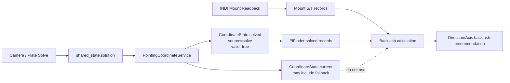
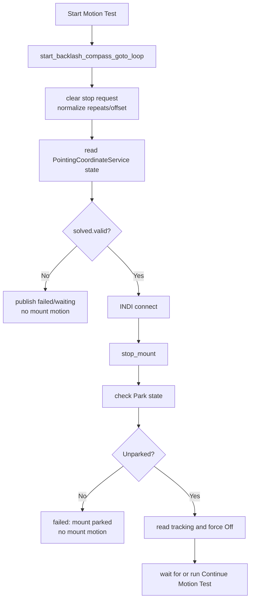
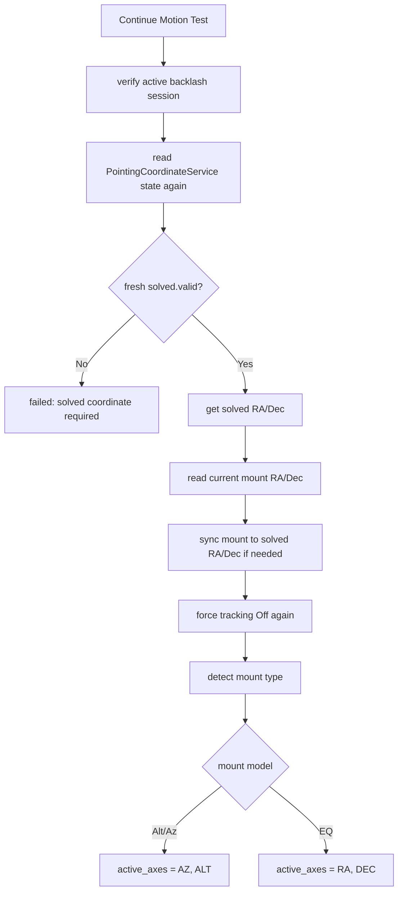
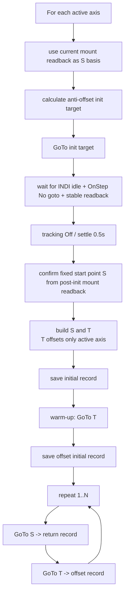
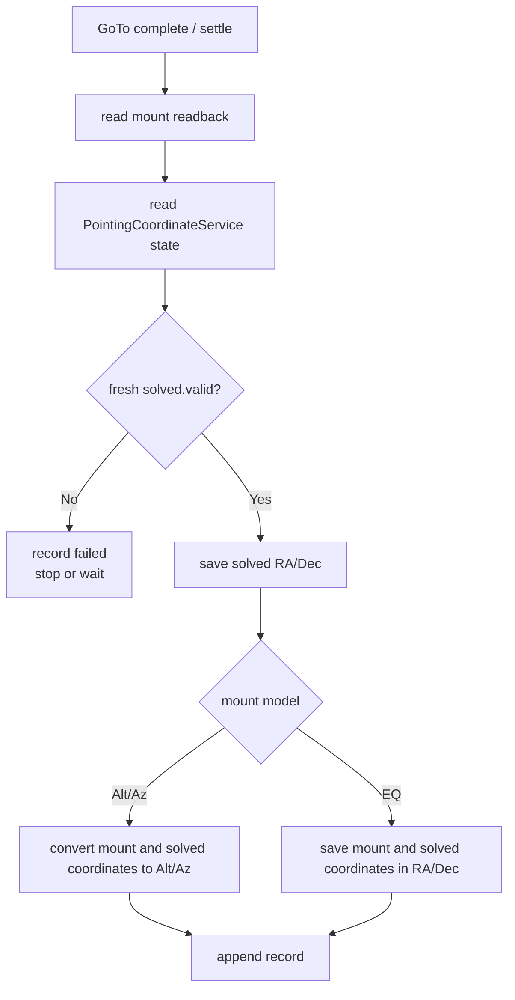
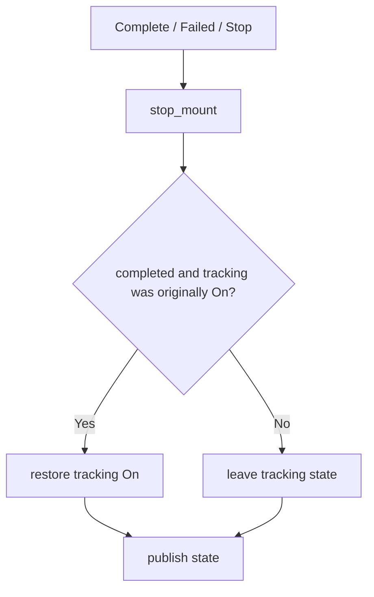

# MF PiFinder Backlash Measurement Flow

This document describes the automatic measurement flow used by INDI > Settings >
Backlash. The internal mode name remains `compass_goto_loop` for compatibility
with the earlier implementation, but the coordinate reference for backlash
calculation is now solved pointing, not compass/IMU pointing.

The mode now uses INDI GoTo movement again. The OnStepX driver `GUIDE_RATE`
support remains available in the driver, but Auto Backlash no longer changes
`GUIDE_RATE` and no longer sends `TELESCOPE_TIMED_GUIDE_*` commands.

The PiFinder reference coordinates used for backlash calculation come from
`PointingCoordinateService`. Fallback coordinates are not used: automatic
measurement may start and continue only when the plate-solved
`CoordinateState.solved` sample is valid. If no solved coordinate is available,
or if the solved coordinate is stale, the test must fail or wait without
sending mount motion commands.

## Core Rules

- The test moves one active axis at a time.
- Alt/Az mounts test `AZ` first, then `ALT`.
- EQ mounts test `RA` first, then `DEC`.
- Each axis uses a fixed start point `S` and an active-axis offset point `T`.
- Only the active-axis coordinate differs between `S` and `T`.
- PiFinder records mount coordinates and
  `PointingCoordinateService.solved` coordinates after every settled GoTo leg.
- `PointingCoordinateService.current` is not used for backlash calculation
  because it may contain IMU fallback, mount/IMU fusion, or mount readback.
- A record is valid only when `CoordinateState.solved.valid == True` and the
  solved RA/Dec values are valid.
- Each leg record must use a fresh solved sample captured after that movement.
- Mount travel is calculated from the previous settled mount readback to the
  current settled mount readback.
- PiFinder travel is calculated from the previous solved coordinate to the
  current solved coordinate.
- Signed motion error is `mount travel - PiFinder solved travel`.
- Backlash candidates are the absolute signed motion error in arc-seconds.
- Legs where the mount-vs-PiFinder-solved travel difference is at least 1
  degree are excluded from statistics as solve or record-timing outliers.
- The remaining candidates are sorted; the lowest 30% and highest 30% are
  discarded; the middle 40% mean is used as the recommendation.

Because OnStep/INDI can enable tracking after GoTo, PiFinder disables tracking
before the test and again after every GoTo leg.

GoTo completion is guarded against OnStepX's near-destination refinement. A leg
is not considered complete on the first idle sample. PiFinder waits for INDI to
report idle and for coordinate readback to remain stable for a stable window and,
when the OnStep status text is available, waits for `:GU#` to return `N` (`No
goto`). This avoids recording solved/mount data too early during the firmware's
near-destination settle wait before the final fine approach.

## Defaults

```text
offset = 2.0 degrees
default repeat count = 10, adjustable from 1 to 50 in the web UI
stable idle/position window before GoTo completion = 4.0 seconds
settle wait after GoTo completion = 0.5 seconds
fresh solved coordinate wait before each record = managed by implementation timeout
pause before each return leg = 1.0 second
GoTo timeout = 180 seconds
```

## Coordinate Data Flow



The calculation compares only these two coordinate streams:

- `MountRecord`: actual mount coordinates read from the INDI driver.
- `PiFinderRecord`: solved RA/Dec from `PointingCoordinateService.solved`.

`PointingCoordinateService.current` is useful for SkySafari responses and UI
display, but it can contain fallback data and must not be used for backlash
calculation.

## Source Ownership

The backlash calibration code is organized as follows:

```text
python/PiFinder/indi_backlash_calibration.py
  BacklashCalibrationMixin
    - manual Backlash value validation/save
    - automatic Backlash state machine
    - stop request handling
    - PointingCoordinateService solved-coordinate checks
    - per-axis GoTo measurement sequence
    - coordinate record capture
    - mount delta / PiFinder solved delta calculation
    - directional filtering and recommendation generation

python/PiFinder/mountcontrol_indi.py
  MountControlIndi(BacklashCalibrationMixin)
    - INDI connection and driver state
    - mount GoTo/Sync/Stop/Tracking commands
    - current position readback
    - common status file publishing
    - web/LCD/queue command dispatch
```

When changing the backlash procedure, start with
`python/PiFinder/indi_backlash_calibration.py`. Use `mountcontrol_indi.py` only
when the hardware-facing INDI command or common mount-control behavior needs to
change.

## Axis Targets

### Alt/Az Mounts

For a start point of `Alt 10, Az 20` and an offset of 2 degrees:

```text
AZ-axis test:
  S_az = Alt 10, Az 20
  T_az = Alt 10, Az 22

ALT-axis test:
  S_alt = Alt 10, Az 20
  T_alt = Alt 12, Az 20
```

PiFinder converts these Alt/Az targets to RA/Dec before sending INDI GoTo.

### EQ Mounts

For a start point of `RA 100, DEC 20` and an offset of 2 degrees:

```text
RA-axis test:
  S_ra = RA 100, DEC 20
  T_ra = RA 102, DEC 20

DEC-axis test:
  S_dec = RA 100, DEC 20
  T_dec = RA 100, DEC 22
```

## Detailed Flow

### 1. Start Preconditions



If `PointingCoordinateService.solved` is not valid, the test must not start.
IMU fallback and mount-only coordinates are not substitutes.

### 2. Coordinate Synchronization



The synchronization reference is `PointingCoordinateService.solved`. When a
mount Sync is required, it uses solved RA/Dec, not IMU coordinates.

### 3. Per-Axis Measurement Motion



Each record must pass this sub-flow:



### 4. Calculation And Filtering

```mermaid
flowchart TD
    A[records] --> B[create legs from adjacent records]
    B --> C[exclude warm-up legs]
    C --> D[exclude missing/stale solved legs]
    D --> E[calculate active-axis deltas]
    E --> F[mount_delta = mount_end - mount_start]
    E --> G[pifinder_delta = solved_end - solved_start]
    F --> H[motion_error = mount_delta - pifinder_delta]
    G --> H
    H --> I{abs(error) >= 1 degree?}
    I -->|Yes| J[exclude as solve/record timing outlier]
    I -->|No| K[abs(error)*3600 = candidate]
    K --> L[group by axis and direction]
    L --> M[discard lowest 30% / highest 30%]
    M --> N[calculate middle-40% mean / median / p75]
    N --> O[display recommendation]
```

Calculated values are display-only. Input fields and actual mount backlash are
not changed automatically; the user must press `Save Backlash`.

### 5. Shutdown



## Recorded Values

Each leg keeps enough data to debug the estimate:

- `mount_start_*`: previous settled mount readback.
- `mount_end_*`: mount readback after the current GoTo settles.
- `command_start_*`: nominal command start point for the leg.
- `target_*`: GoTo target for the leg.
- `pifinder_solved_start_*`: previous record's
  `PointingCoordinateService.solved` coordinate.
- `pifinder_solved_end_*`: current record's
  `PointingCoordinateService.solved` coordinate.
- `pifinder_solved_source`: must always be `solve`.
- `pifinder_solved_valid`: must always be `true`; false legs are excluded.
- `pifinder_solved_timestamp`: timestamp used to validate freshness.
- `mount_delta_*`: `mount_end - mount_start`.
- `pifinder_solved_delta_*`: `pifinder_solved_end - pifinder_solved_start`.
- `motion_difference_*`: `mount_delta - pifinder_solved_delta`.
- `motion_backlash_*_arcsec`: absolute per-axis candidate.

The web UI shows a short summary. Detailed records remain available in the
mount-control status and logs for debugging.
