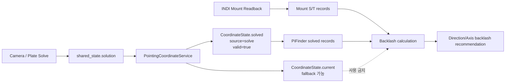
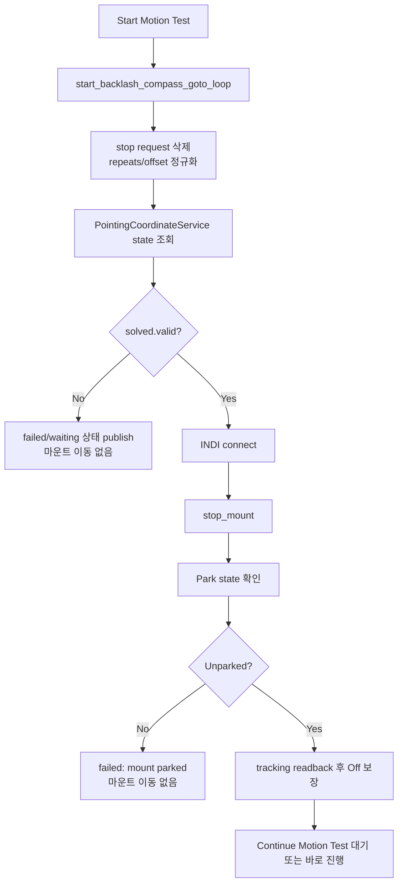
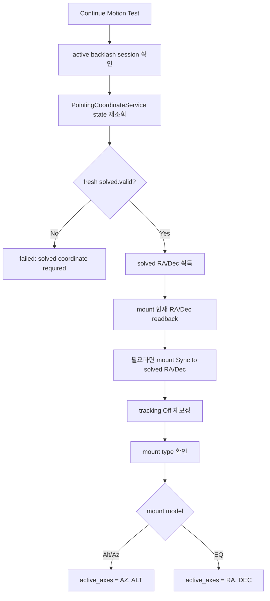
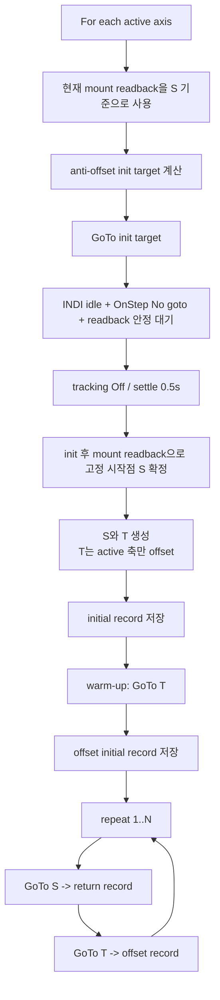
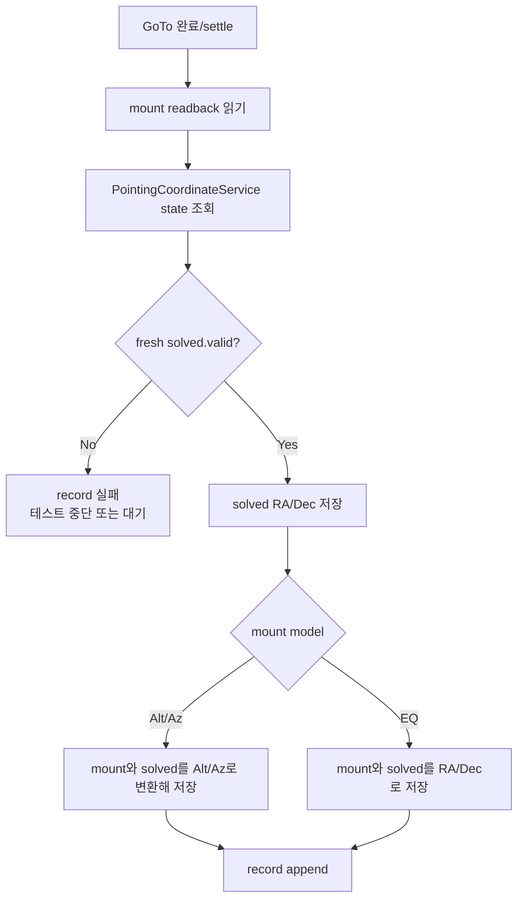
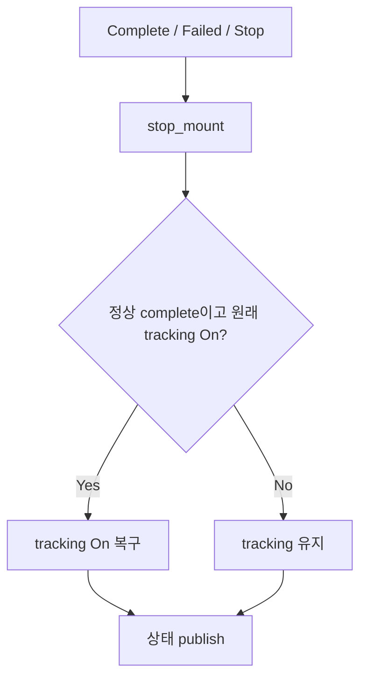

# MF PiFinder Backlash Measurement Flow

이 문서는 INDI > Settings > Backlash의 자동 측정 흐름을 정리한다. 현재
내부 mode 이름은 과거 구현과의 호환을 위해 `compass_goto_loop`로 남아 있지만,
백레시 계산 기준 좌표는 compass/IMU가 아니라 solved 좌표이다.

현재 이 모드는 다시 INDI GoTo 이동을 사용한다. OnStepX 드라이버의
`GUIDE_RATE` 지원은 드라이버 기능으로 유지하지만, Auto Backlash는 더 이상
`GUIDE_RATE`를 변경하지 않고 `TELESCOPE_TIMED_GUIDE_*` 명령도 보내지 않는다.

백레시 계산에 사용하는 PiFinder 기준 좌표는
`PointingCoordinateService`에서 가져온다. 단, fallback 좌표는 사용하지 않고
plate solve가 성공한 `CoordinateState.solved` 좌표가 유효할 때만 자동 측정을
시작하고 진행한다. solved 좌표가 없거나 stale이면 테스트는 이동 명령을 보내지
않고 실패/대기 상태로 빠져야 한다.

## 핵심 원칙

- 한 번에 한 축만 active 축으로 테스트한다.
- Alt/Az 마운트는 `AZ`를 먼저 테스트하고 그 다음 `ALT`를 테스트한다.
- EQ 마운트는 `RA`를 먼저 테스트하고 그 다음 `DEC`를 테스트한다.
- 각 축은 고정 시작점 `S`와 active 축만 offset된 목표점 `T`를 사용한다.
- `S`와 `T` 사이에서 inactive 축 좌표는 바꾸지 않는다.
- PiFinder는 각 GoTo가 완료되고 안정화된 뒤 마운트 좌표와
  `PointingCoordinateService.solved` 좌표를 기록한다.
- `PointingCoordinateService.current`는 IMU fallback, mount/IMU fusion, mount
  readback이 섞일 수 있으므로 백레시 계산에는 사용하지 않는다.
- `CoordinateState.solved.valid == True`이고 RA/Dec가 유효한 경우만 기록한다.
- 각 leg 기록은 해당 이동 이후의 fresh solved sample을 사용해야 한다.
- 마운트 이동량은 직전 안정화 마운트 readback에서 현재 안정화 마운트 readback까지의 차이다.
- PiFinder 이동량은 직전 solved 좌표에서 현재 solved 좌표까지의 차이다.
- signed motion error는 `마운트 이동량 - PiFinder solved 이동량`이다.
- 백래시 후보값은 signed motion error의 절대값을 arc-second로 변환한 값이다.
- 마운트와 PiFinder solved 이동량 차이가 1도 이상인 leg는 solve/저장 시점
  문제로 보고 통계에서 제외한다.
- 남은 후보값을 정렬한 뒤 하위 30%와 상위 30%를 버리고 가운데 40% 평균을 추천값으로 사용한다.

OnStep/INDI는 GoTo 후 tracking을 자동으로 켤 수 있으므로 PiFinder는 테스트
시작 전 tracking을 끄고, 각 GoTo leg가 끝난 뒤에도 다시 tracking을 끈다.

GoTo 완료 판정은 OnStepX 펌웨어의 near-destination refinement를 고려한다.
PiFinder는 첫 idle 샘플만으로 leg를 완료 처리하지 않고, INDI idle 상태와
좌표 readback이 안정 시간 동안 유지되는지 확인한다. 또한 OnStep status
text를 읽을 수 있으면 `:GU#` 응답에 `N`(`No goto`)이 다시 나타날 때까지
기다린다. 이 처리는 펌웨어가 근처 목표점에서 잠깐 settle wait를 한 뒤 최종
미세 접근을 다시 수행하는 동안 solved/mount 좌표를 너무 이르게 기록하는 문제를
막기 위한 것이다.

## 기본값

```text
offset = 2.0도
기본 반복 횟수 = 10회, 웹 UI에서 1~50회로 변경 가능
GoTo 완료 전 stable idle/position 확인 = 4.0초
GoTo 완료 후 안정화 대기 = 0.5초
각 record 전 fresh solved 좌표 대기 = 구현 시 timeout 상수로 관리
각 return leg 전 대기 = 1.0초
GoTo timeout = 180초
```

## 좌표 데이터 흐름



백레시 계산은 위 도식처럼 두 좌표만 비교한다.

- `MountRecord`: INDI driver에서 읽은 실제 마운트 좌표.
- `PiFinderRecord`: `PointingCoordinateService.solved`에서 읽은 solved RA/Dec.

`PointingCoordinateService.current`는 SkySafari 응답이나 UI 표시에는 유용하지만,
fallback이 섞일 수 있으므로 백레시 계산에는 넣지 않는다.

## 소스 관리 위치

백레시 캘리브레이션 로직은 다음처럼 분리되어 있다.

```text
python/PiFinder/indi_backlash_calibration.py
  BacklashCalibrationMixin
    - 수동 Backlash 값 검증/저장
    - 자동 Backlash 상태 machine
    - stop request 처리
    - PointingCoordinateService solved 좌표 검사
    - 축별 GoTo 측정 시퀀스
    - 좌표 record 생성
    - mount delta / PiFinder solved delta 계산
    - 방향별 필터링과 추천값 계산

python/PiFinder/mountcontrol_indi.py
  MountControlIndi(BacklashCalibrationMixin)
    - INDI 연결/드라이버 상태
    - mount GoTo/Sync/Stop/Tracking 명령
    - 현재 위치 readback
    - 공통 status file publish
    - 웹/LCD/queue command dispatch
```

즉 백레시 절차를 수정할 때는 우선
`python/PiFinder/indi_backlash_calibration.py`를 기준으로 보고,
INDI 명령 자체나 공통 mount-control 동작이 필요할 때만
`mountcontrol_indi.py`를 확인한다.

## 축별 목표점

### Alt/Az 마운트

시작점이 `Alt 10, Az 20`이고 offset이 2도이면 다음처럼 테스트한다.

```text
AZ 축 테스트:
  S_az = Alt 10, Az 20
  T_az = Alt 10, Az 22

ALT 축 테스트:
  S_alt = Alt 10, Az 20
  T_alt = Alt 12, Az 20
```

PiFinder는 이 Alt/Az 목표점을 RA/Dec로 변환한 뒤 INDI GoTo를 보낸다.

### EQ 마운트

시작점이 `RA 100, DEC 20`이고 offset이 2도이면 다음처럼 테스트한다.

```text
RA 축 테스트:
  S_ra = RA 100, DEC 20
  T_ra = RA 102, DEC 20

DEC 축 테스트:
  S_dec = RA 100, DEC 20
  T_dec = RA 100, DEC 22
```

## 상세 순서도

### 1. 시작 조건



시작 단계에서 `PointingCoordinateService.solved`가 유효하지 않으면 테스트를
시작하지 않는다. 이때 IMU fallback이나 mount-only 좌표를 대신 쓰지 않는다.

### 2. 좌표계 동기화



동기화의 기준 좌표는 `PointingCoordinateService.solved`이다. Sync가 필요한
경우에도 IMU 좌표가 아니라 solved RA/Dec로 mount 좌표계를 맞춘다.

### 3. 축별 측정 이동



각 record 저장은 다음 하위 절차를 반드시 통과해야 한다.



### 4. 계산과 필터링

```mermaid
flowchart TD
    A[records] --> B[인접 record 쌍으로 leg 생성]
    B --> C[warm-up leg 제외]
    C --> D[solved가 없는/stale leg 제외]
    D --> E[active 축별 delta 계산]
    E --> F[mount_delta = mount_end - mount_start]
    E --> G[pifinder_delta = solved_end - solved_start]
    F --> H[motion_error = mount_delta - pifinder_delta]
    G --> H
    H --> I{abs(error) >= 1도?}
    I -->|Yes| J[solve/record timing outlier로 제외]
    I -->|No| K[abs(error)*3600 = 후보값]
    K --> L[축/방향별 그룹화]
    L --> M[하위 30% / 상위 30% 제거]
    M --> N[가운데 40% 평균/median/p75 계산]
    N --> O[추천값 표시]
```

계산 결과는 표시만 한다. 입력칸과 실제 mount backlash 값은 자동 변경하지 않고,
사용자가 `Save Backlash`를 눌러야 적용된다.

### 5. 종료 처리



## 기록되는 값

각 leg는 디버깅을 위해 다음 값을 남긴다.

- `mount_start_*`: 직전 안정화 마운트 readback.
- `mount_end_*`: 현재 GoTo 완료 후 마운트 readback.
- `command_start_*`: leg의 명목상 명령 시작점.
- `target_*`: leg의 GoTo 목표점.
- `pifinder_solved_start_*`: 직전 record의
  `PointingCoordinateService.solved` 좌표.
- `pifinder_solved_end_*`: 현재 record의
  `PointingCoordinateService.solved` 좌표.
- `pifinder_solved_source`: 항상 `solve`여야 한다.
- `pifinder_solved_valid`: 항상 `true`여야 하며, false인 leg는 계산에서 제외한다.
- `pifinder_solved_timestamp`: fresh solved 여부를 확인하기 위한 시각.
- `mount_delta_*`: `mount_end - mount_start`.
- `pifinder_solved_delta_*`: `pifinder_solved_end - pifinder_solved_start`.
- `motion_difference_*`: `mount_delta - pifinder_solved_delta`.
- `motion_backlash_*_arcsec`: 축별 절대 백래시 후보값.

웹 UI에는 짧은 요약만 표시한다. 상세 레코드는 mount-control status와 로그에서
디버깅용으로 확인할 수 있다.
