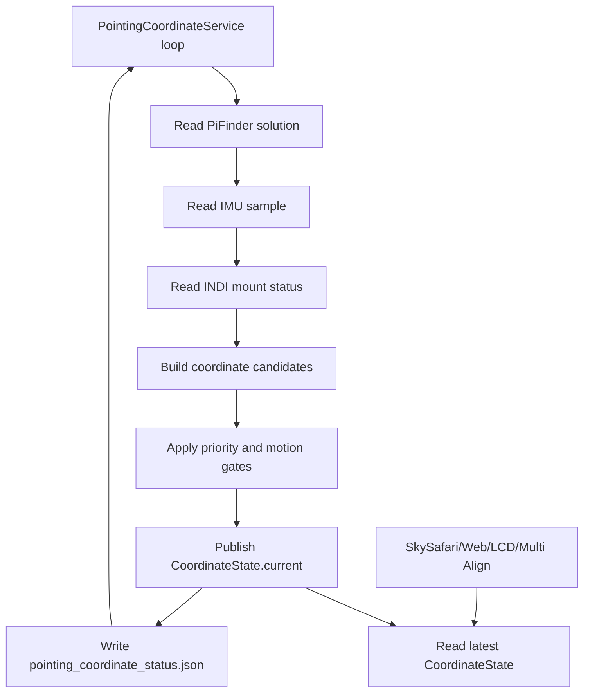

# MF PiFinder Pointing Coordinate Service

Last updated: 2026-07-13

This document describes the current `mf_pifinder` implementation of the
always-running pointing coordinate service shared by SkySafari, Web UI, LCD UI,
and INDI Multi Align.

Core rules:

- Target RA/Dec received from SkySafari/LX200 are used exactly as requested.
- The requested target coordinates are not reinterpreted as J2000/JNow or
  converted between epochs.
- `pointing.aligned.estimate` is used as PiFinder's current computed coordinate.
- Alt/Az conversion is only used where needed for IMU correction, display, or
  mount-type interpretation.
- Consumers read the latest published `CoordinateState` instead of recalculating
  solved/IMU/mount coordinates independently.

## Implementation Files

```text
python/PiFinder/pointing_coordinate_service.py
python/PiFinder/pos_server.py
python/PiFinder/mountcontrol_indi.py
python/PiFinder/imu_pi.py
```

Related tests:

```text
python/tests/test_pointing_coordinate_service.py
python/tests/test_pos_server.py
python/tests/test_mountcontrol_indi.py
```

Debug status files:

```text
/home/pifinder/PiFinder_data/pointing_coordinate_status.json
/home/pifinder/PiFinder_data/mount_control_status.json
```

## Overall Flow

`pos_server.py` does not recalculate coordinates for each SkySafari `:GR#` or
`:GD#` request. A background loop updates `PointingCoordinateService`, and the
POS server reads `CoordinateState.current`.

```text
PiFinder processes
  IMU process
    -> shared_state.imu()
  Solver/Integrator
    -> shared_state.solution().pointing.aligned.estimate
  INDI Mount process
    -> mount_control_status.json
  POS Server
    -> PointingCoordinateService background loop
    -> SkySafari :GR#/:GD# response
```

Service loop:



## Coordinate Candidates

### 1. Solved Coordinate

Input:

```text
shared_state.solution().pointing.aligned.estimate.RA
shared_state.solution().pointing.aligned.estimate.Dec
```

Valid when:

- `solution.has_pointing()` is true
- `solve_source == CAM`
- or `solve_source == IMU` with a plate-solve anchor

Behavior:

- Use RA/Dec directly.
- Do not perform J2000/JNow conversion.
- An unanchored `solve_source == IMU` sample is treated as boot-time IMU
  estimation, not as primary solved pointing.

### 2. IMU Fallback Coordinate

Input:

```text
shared_state.imu()
screen_direction
location/time
optional IMU alignment correction
```

Flow:

```text
IMU quaternion
  -> camera boresight
  -> raw Alt/Az
  -> optional align correction
  -> smoothing
  -> RA/Dec using location/time
```

IMU smoothing:

- Small raw Alt/Az jitter is damped.
- Moderate movement is followed gradually.
- Large movement is treated as real telescope motion and followed quickly.
- Both raw and smoothed values are written to the status JSON.

Relevant metadata:

```text
imu.metadata.raw_alt
imu.metadata.raw_az
imu.metadata.smoothed_alt
imu.metadata.smoothed_az
imu.metadata.filter_state
imu.metadata.filter_delta_degrees
imu.metadata.quat_norm
imu.metadata.calibration_status
imu.metadata.fusion_mode
imu.metadata.uses_magnetometer
```

### 3. Mount Readback Coordinate

Input:

```text
/home/pifinder/PiFinder_data/mount_control_status.json
```

Important fields:

```text
state
ra / dec
park_state
driver_mount_status
raw_mount_status
coordinate_sync
multipoint_align
mount_motion_active
mount_motion_type
mount_readback_priority
goto_motion_active
goto_refine_pending
manual_motion_direction
target_ra / target_dec
target_error_deg
goto_wait_seconds
```

Mount candidates are excluded when the mount is disconnected/disconnecting,
errored/faulted/failed, server/driver offline, parked, or has no RA/Dec
readback.

Before PiFinder and the mount have been synchronized/aligned, mount readback is
diagnostic only. It is not mixed into the current coordinate.

## Selection Priority

Current priority:

```text
1. SOLVED_PRIMARY
   Plate solve or plate-solve-anchored PiFinder estimate

2. MOUNT_REFERENCE_PRIMARY
   Usable and synced/aligned mount plus valid IMU, only while the mount is
   stationary

3. MOUNT_ONLY_SYNCED
   Usable and synced/aligned mount with invalid IMU, or while mount motion is
   active

4. IMU_PRIMARY_UNSOLVED
   No solve, mount not synced or unusable, valid IMU

5. UNAVAILABLE
   No usable coordinate
```

Before synchronization, mount and IMU absolute coordinates may be very different.
They are not averaged.

## Mount + IMU Delta

After PiFinder and the mount are synced/aligned, the service uses:

```text
anchor_imu    = IMU fallback RA/Dec at sync time (delta reference)

applied_delta = IMU delta accumulated through the rate gate (see below)
current       = live mount readback + applied_delta
                (applied in the mount's NATIVE AXIS FRAME — alt/az mount in
                alt/az space, EQ mount in RA/Dec space; see "Delta application
                frame" below)
```

(Changed 2026-07-16: the base moved from the anchor-time mount snapshot to the
**live mount readback**. Pulses/slews move the fused coordinate directly through
the base, no re-anchor is needed, and the disturbance offset can no longer be
silently erased by a re-anchor.)

Intent:

- The mount is the long-term reference.
- The IMU contributes fast local delta only after sync.
- Absolute mount and IMU coordinates are not blended.

The anchor (and with it the applied disturbance offset) is reset only when no
anchor exists or the sync key changes — i.e. a sync re-established the mount
frame. Mount readback movement alone no longer resets it.

### Delta application frame — mount-type dependent (fixed 2026-07-19)

**Hardware reproduction (indoor, no plate solve, hand-only az swing):** with a
standing IMU-vs-mount separation of ~52 deg, an az-only hand swing (alt stayed
7–17 deg the whole time) drove the fused coordinate to RA 301 / Dec −46 — a
position that never rises above the horizon at the observing site. In SkySafari
the telescope marker dove below the ground while the physical scope pointed
well above the horizon. The rate gate was NOT the culprit (the delta was
accumulating correctly in `fast_follow`); the defect was in how the applied
delta was converted into the fused RA/Dec.

**Old (broken) application** — a component-wise RA/Dec transplant:

```text
east_delta = applied_ra × cos(dec_imu)          # on-sky angle at the IMU's dec (~60°)
fused_dec  = mount_dec + applied_dec            # added at the mount's dec (~20°)
fused_ra   = mount_ra + east_delta / cos(fused_dec)
```

This is a first-order tangent-plane approximation: it measures a spherical
displacement at the IMU's pointing (declination ~60 in the repro) and re-plants
it at the mount's pointing (declination ~20). It is fine for the deltas it was
designed for (arcminute guide pulses, small bumps) but diverges wildly when the
delta reaches tens of degrees across a large IMU↔mount separation — an az-only
physical rotation then produces a huge false Dec component and the fused
coordinate leaves the physically reachable sky.

**New application — the delta is tracked and applied in the MOUNT'S NATIVE
AXIS FRAME**, selected from the `mount_type` config (`"alt" and "az" in
mount_type` → alt/az frame, anything else → equatorial frame):

Calculation order, alt/az mount (`fusion_frame = "altaz"`):

```text
1. Context: current_state() stores (dt, observer location, mount_type) as the
   fusion context. Missing dt/location → fall back to the equatorial branch.
2. Tracker coords: raw (unsmoothed) IMU alt/az from imu.metadata
   raw_az/raw_alt, ordered (az, alt) — longitude-like axis first, mirroring
   (ra, dec).
3. Rate gate (unchanged logic, shared code):
     step_az  = wrap180(az_t − az_(t−1))
     step_alt = alt_t − alt_(t−1)
     rate     = great_circle_sep(prev, now) / dt      # same spherical formula
   fast_follow episodes accumulate (applied_az, applied_alt); hold keeps the
   offset; a frame change resets the tracker (an offset accumulated in one
   frame is meaningless in the other).
4. Mount readback → alt/az:
     (mount_alt, mount_az) = radec_to_altaz(mount_ra, mount_dec, dt, atmos=False)
5. Apply the delta in alt/az:
     fused_az  = (mount_az + applied_az) mod 360
     fused_alt = mount_alt + applied_alt
   Pole folding: if fused_alt > 90 → fused_alt = 180 − fused_alt, az += 180;
   if fused_alt < −90 → fused_alt = −180 − fused_alt, az += 180.
6. Back to RA/Dec **differentially** (bias cancellation):
     (base_ra,  base_dec)  = altaz_to_radec(mount_alt, mount_az, dt)
     (moved_ra, moved_dec) = altaz_to_radec(fused_alt, fused_az, dt)
     fused_ra  = (mount_ra + wrap180(moved_ra − base_ra)) mod 360
     fused_dec = clamp(mount_dec + (moved_dec − base_dec), ±89.9)
   Why differential: radec_to_altaz (erfa atco13, ICRS in) and altaz_to_radec
   (skyfield from_altaz, epoch-of-date out) are NOT exact inverses — the
   absolute round trip carries a ~0.3 deg epoch/precession bias. The
   differential form cancels it, and guarantees fused ≡ mount readback when
   the applied delta is zero.
7. Any conversion failure → equatorial fallback
   (`fusion_frame = "equatorial_fallback"` in metadata) rather than dropping
   the fused source.
```

Result: an az-only hand swing produces an az-only fused change, and the fused
coordinate can never dive below the horizon-equivalent of where the scope
physically points.

Calculation order, EQ mount (`fusion_frame = "equatorial"`):

```text
fused_ra  = (mount_ra + applied_ra) mod 360     # NO cos(dec) rescale
fused_dec = clamp(mount_dec + applied_dec, ±89.9)
```

A hand rotation about the polar axis changes the pointing's RA by the rotation
angle at ANY declination, and a rotation about the dec axis changes dec alone —
so on an EQ mount the component-wise addition IS the exact per-axis formula,
and the old `cos(dec_imu)/cos(dec_mount)` rescaling was wrong there too (it is
removed).

Metadata: `fusion_frame` (`altaz` / `equatorial` / `equatorial_fallback`),
`imu_delta_applied_az/alt` + `mount_alt/az` + `fused_alt/az` (alt/az frame),
`imu_delta_applied_ra/dec` (equatorial frame, keys unchanged).

**Hardware verification (2026-07-19, indoor, hand-only az swings after a
pointing reset):** 8 swings up to −144 deg az with zero mount motion. The fused
alt/az tracked the IMU alt/az with median error 0.11/0.13 deg (max 0.66/1.83);
fused altitude stayed exactly in the IMU's 6.2–14.1 deg range with **zero
below-horizon samples**. Regression tests:
`test_altaz_mount_hand_swing_applies_delta_in_altaz_space`,
`test_eq_mount_delta_stays_component_additive_without_cos_rescale`.

### IMU-delta rate gate (added 2026-07-12)

Found on hardware while tracking: with the mount tracking sidereal, the readback
RA/Dec stays fixed on the target, but the IMU smoothing filter treats the slow
tracking motion (~15"/s) as small jitter and effectively freezes it. The
IMU-derived RA then drifts at near-sidereal rate, the raw delta accumulates
without bound, and the fused coordinate flows off target (~20'/min). This false
drift falsely triggered the tracking-guide GoTo recovery, physically moving the
mount *off* target.

Fix: `_mount_with_imu_delta` applies a **rate-gated delta** (`_gated_imu_delta`)
instead of the raw delta.

```text
IMU_DELTA_ENTER_RATE_DEG_PER_SEC = 0.03   (episode entry)
IMU_DELTA_EXIT_RATE_DEG_PER_SEC  = 0.015  (episode sustain/exit)
```

**Hysteresis gate (changed 2026-07-16)**: a single threshold (formerly 0.05)
chopped weak stall-slip events (measured head/tail rates 0.02–0.06 deg/s) into
fragments, capturing only ~1/3 of the displacement (hardware capture: in a
0.033→0.06→0.02 event only the 3 ticks above 0.05 accumulated). An
accumulation episode now starts above the enter rate (0.03 — ~7x the artifact
floor of 0.004–0.005 measured indoors with no wind, enough margin that outdoor
wind rumble cannot start an episode) and, once underway, keeps accumulating
until the rate drops below the exit rate (0.015, ~4x), capturing the slow
head/tail of a real event. Slips creeping entirely below 0.03 remain invisible
(rate is the only discriminator; at night the plate solve is the arbiter).

- Bump / manual push / stall slip -> `fast_follow`: the offset enters the fused
  coordinate, so disturbance detection and recovery act on the true error.
- Tracking artifact / sensor drift (slow) -> `hold`: increments are discarded
  but the already-applied offset is KEPT. A stopped scope must stay at its
  disturbed coordinate, not creep back to the mount readback.
- Mount moving itself (GoTo/manual/pulse) -> `suspended_mount_motion`: the
  readback is shown, and only the IMU reference advances (no accumulation) so
  the mount's own motion is never counted as a disturbance. The offset
  survives the motion.
- Right after mount motion ends -> `post_motion_settle`: accumulation stays
  suspended until the IMU rate holds below the exit threshold for 1.5 s
  continuously, absorbing the BNO055's post-slew re-convergence slide
  (added 2026-07-17, see "Mount-motion isolation hardening" below).
- Only a sync (sync-key change) resets the tracker and the applied delta.
- Diagnostics in metadata: `imu_delta_gate`, `imu_delta_rate_deg_per_sec`, and
  frame-specific applied keys (`imu_delta_applied_az/alt` on an alt/az mount,
  `imu_delta_applied_ra/dec` on an EQ mount — see "Delta application frame").
- Limitation: a real external force slower than the enter gate (0.03 deg/s)
  is invisible without a solve. At night SOLVED_PRIMARY takes precedence
  anyway.
- End-to-end hardware validation (2026-07-12, user physically pushed the tube):
  push detected (0.99 deg/s, err 1488') -> disturbed -> sync+GoTo recovery ->
  settling 2.9' -> enabled 0.0', re-acquiring the pre-push position.
- Note: during GoTo phases mount readback has priority, so a push mid-GoTo is
  not immediately visible in the displayed coordinate; the corrective pass /
  tracking guide handles it after the GoTo ends.

### Disturbance offset retention (fixed 2026-07-16)

Found during hardware disturbance-recovery testing: after pushing the tube and
stopping, the fused coordinate did not stay put — it (1) crawled back to the
previous GoTo coordinate, and (2) sometimes jumped back at once.

Two causes:

1. The applied delta decayed with tau 120 s in slow intervals (`slow_decay`).
   A 3-degree offset crawls back to the readback (= the old target) at ~1.5'/s.
   The decay's original purpose (killing tracking-artifact drift) is already
   achieved by the rate gate never letting slow increments in, so the decay
   only ate legitimate disturbance offsets.
2. Any meaningful readback move (even 18" of jitter) or a motion/priority flag
   deleted the anchor outright and returned the raw readback, instantly losing
   the offset (= the jump).

Fixes (all in `pointing_coordinate_service.py`): `slow_decay` became `hold`;
the fused base became the live mount readback (no re-anchor needed); mount
motion now only suspends accumulation instead of deleting the anchor; the
offset clears only on a sync. Since GoTo recovery starts with a sync, a
completed recovery still resets the offset naturally.

### Mount-motion isolation hardening (fixed 2026-07-17)

Found during hardware GoTo testing: the mount's own slews accumulated into the
disturbance offset (observed 15.7 deg), so the PiFinder GoTo correction loop
measured phantom errors that never improved, aborted, and never armed the
tracking target — recovery then had nothing to return to. Four causes/fixes:

1. **Readback supply cadence (`mountcontrol_indi.py`)**: current PyIndi
   (INDI 2.x) never calls the legacy `newNumber` callback, so the driver's
   1 s coordinate pushes were all dropped and the position only advanced on
   the 5 s status heartbeat. Motion detection fired one tick per 5 s and the
   1.5 s hold expired in between, booking the rest of the slew as a
   disturbance. Implemented the INDI 2.x `updateProperty` callback; readback
   now flows at the driver `POLLING_PERIOD` (~1 Hz).
2. **Leak rollback**: the applied offset is snapshotted at every stationary
   readback sample; when a sample shows movement, the offset rolls back to
   the last stationary snapshot, discarding only the leak from the detection
   gap (≤ ~1 s) while preserving genuine hand-push offsets
   (`_snapshot_imu_delta_applied` / `_rollback_imu_delta_to_snapshot`).
3. **Raw-IMU delta tracking**: the smoothing filter's convergence tail after
   a large move read as sustained motion and kept accumulating for tens of
   seconds after the slew. The tracker now differences raw (unsmoothed) IMU
   RA/Dec (`imu.metadata.raw_ra/raw_dec`); smoothing remains display-only.
4. **Post-motion settle gate**: the BNO055 re-converges its internal fusion
   after a fast rotation — the orientation slides with no physical motion
   (measured ~1.8 deg over 15 s, above the gate rates). After mount motion,
   accumulation stays suspended until the IMU rate holds below the exit
   threshold for `IMU_DELTA_POST_MOTION_QUIET_SECONDS` (1.5 s) continuously
   (gate `post_motion_settle`); with the 1.5 s hold this makes ~3 s of total
   quiet after a slew before disturbance detection re-arms.

Hardware verification (15–30 deg commanded slews, 0.2 s fusion traces): the
fused coordinate tracks the readback at 1 Hz during the slew with the applied
delta pinned at 0.0, and stays at 0.0 after the settle gate clears. A
deliberate physical drift invisible to the readback (ALT stepping +0.37 deg
every ~8.5 s) still accumulates via `fast_follow`, growing the tracking-guide
error as designed.

## GoTo Handling

OnStepX can perform a large GoTo movement, appear briefly idle, then perform a
final precision movement. During this interval, IMU delta must not be applied to
the target coordinate.

`MountControlIndi` publishes mount readback during GoTo and manual motion.
The coordinate service primarily consumes these common telemetry fields:

```text
mount_motion_active
  True when the mount is actually or command-wise moving.

mount_motion_type
  Diagnostic category such as manual / goto / goto_refine_settle /
  guide_correction / align_goto / backlash_auto.

mount_readback_priority
  True when mount readback should be preferred over IMU delta for the current
  coordinate. This includes settle/refine windows where the mount may not be
  continuously moving but readback still needs to be authoritative.
```

Legacy detail fields (`goto_motion_active`, `manual_motion_direction`,
`goto_refine_pending`, `state`) remain for debugging and backwards-compatible
status parsing.

```text
MountControlIndi._check_goto_motion()
  -> _read_goto_progress_position()
  -> _write_goto_progress_status()
  -> state = slewing
  -> writes ra / dec / target_ra / target_dec / target_error_deg

MountControlIndi.manual_move()
  -> _arm_manual_motion_deadline()
  -> _publish_manual_motion_progress(force=True)

MountControlIndi.run()
  -> _publish_manual_motion_progress()
  -> state = manual_motion
  -> writes ra / dec / manual_motion_direction
```

The coordinate service holds IMU delta and uses mount readback while:

```text
mount_readback_priority == true
mount readback is still changing between ticks
```

### Hardware validation (2026-07-12)

This source-selection logic itself works. During a direct hold-to-move (keypad),
mount-control reports `state = manual_motion`, `mount_motion_active = true`, and
`current.source = mount`, smoothly tracking the driver `EQUATORIAL_EOD_COORD`.

Note: this path only engages while the mount is **actually moving** so that
mount-control keeps `state = manual_motion`. The PiFinder GoTo
(`indi_goto_method = pifinder`) "moves then stops" problem was **not** this
coordinate logic — the manual approach's motion lease was shorter than the service
tick, so motion expired and stopped, dropping `state` to `connected` and falling
back to the stopped-only `mount_imu_delta` fusion. See "Hardware test finding:
manual-approach motion dies between ticks" in `mf_indi_goto_guide_plan`.

If `mount_readback_priority` is absent in an older status file, the service
falls back to interpreting `goto_motion_active`, `goto_refine_pending`,
`manual_motion_direction`, `state`, `multipoint_align`, and `backlash_auto`.

Even after status changes back to `connected`, changing mount readback extends a
short hold window. The current hold time is 1.5 seconds; readback arrives at
~1 Hz (the 2026-07-17 `updateProperty` fix), so the hold no longer lapses
mid-slew. After the hold expires, the post-motion settle gate (1.5 s of
sustained quiet) must also clear before disturbance accumulation resumes.

Expected behavior:

- SkySafari follows mount readback during GoTo.
- IMU movement during the final precision step does not introduce target error.
- IMU delta is re-enabled only after the mount is clearly stationary.

## SkySafari Target / Sync / Align

SkySafari target input:

```text
:SrHH:MM:SS#
:Sd+DD*MM:SS#
:MS#
```

Rules:

- `:Sr/:Sd` are parsed and kept as-is (`sr_result`/`sd_result`).
- `:MS#` stores the same target as `last_target_coordinates` and uses it for
  the PiFinder push target and optional INDI GoTo.
- In Multi Align, GoTo is routed to `multipoint_align_goto_target`.
- `:CM#` Sync/Align uses the currently parsed `:Sr/:Sd` coordinates, falling
  back to the last GoTo target (`last_target_coordinates`).
- In Multi Align, `:CM#` is routed to `multipoint_align_confirm`.
- SkySafari guide input (`:Mn#`, `:Ms#`, `:Me#`, `:Mw#`) is not target
  coordinate input. `pos_server.py` owns the guide keepalive timer and queues
  `manual_movement` / `manual_movement_keepalive` to mount-control.
- SkySafari release/stop input (`:Q#`, `:Qn#`, `:Qs#`, `:Qe#`, `:Qw#`) queues
  `stop_movement`. A TCP command connection closing is not treated as stop.

The align coordinate is the requested target coordinate, not the IMU coordinate
at confirm time.

## Reset Pointing (added 2026-07-12)

An operator-triggered reinitialize for when the fused coordinate has drifted
away from the sky — bad or absent plate solves, or IMU drift accumulating on
the fused source during indoor testing. Reset discards the fusion anchor and
IMU-delta tracker so the coordinate re-baselines on the next tick from the best
available source: a valid plate solve, otherwise the aligned mount, otherwise
the IMU fallback (i.e. "when unsolved, re-derive from the IMU").

Mechanism (the service is a singleton inside the `pos_server` process and shares
no queue with the web/UI processes, so this mirrors the backlash stop-request
file pattern):

1. Web `POST /indi/reset_pointing` (server.py) or the LCD menu callback
   `callbacks.reset_pointing` writes an atomic request file
   `PiFinder_data/pointing_reset_request.json` (`{requested_at, source}`).
2. `_coordinate_service_loop` polls it each tick (`_handle_pointing_reset_request`
   in pos_server.py): consumes/deletes the file, discards the SkySafari IMU
   alignment correction (`_imu_alignment_correction`) first, aligns the mount
   to the raw IMU when unsolved (see below), calls
   `PointingCoordinateService.clear_state()`, invalidates the pointing cache,
   and records `_pointing_reset_last_at`.
3. `clear_state()` nulls `_state`, `_mount_imu_anchor`, `_imu_delta_tracker`,
   `_imu_filter_altaz`, `_mount_motion_hold_until`, `_last_mount_motion_radec`,
   `_last_mount_sample_ts`, and `_imu_delta_applied_snapshot`.
   The SkySafari IMU alignment correction is cleared by the reset handler in
   step 2 above, not by `clear_state()` (changed 2026-07-13, `dd045dc`).
   Previously reset preserved the correction ("it is the IMU→sky reference"),
   but in a no-solve environment (indoors) reset was the only way to undo an
   alignment made against the wrong target — yet the correction survived it,
   and the mount→IMU alignment synced the mount to the correction-applied IMU
   coordinate, re-baking the wrong alignment into the mount's coordinate
   system. Reset means "return to the raw IMU", so the correction is discarded
   too; re-align via SkySafari sync if one is wanted.

**No-solve mount→IMU alignment** (`_align_mount_to_imu_on_reset`): `clear_state()`
alone is not enough when there is no solve — the mount is still "aligned"
(previously synced), so the selection priority keeps returning the mount
coordinate and the display stays on the (diverged) mount value instead of the
IMU. So, before clearing state, when the solve is invalid and mount control is
on, reset computes a fresh raw IMU RA/Dec
(`_imu_fallback_pointing(..., apply_alignment=False)` — the cached `state.imu`
sample is not used because it already has the alignment correction applied) and
queues a `{"type": "sync", ...}` to mount control at that coordinate. Sync only redefines
the mount's coordinate system (it does not slew), so the mount readback — and
therefore the fused coordinate — then follows the IMU. With a valid solve, no
IMU alignment is done; the solve drives the coordinate.

Consume latency is at most ~0.2 s (the service tick interval,
`_POINTING_UPDATE_SECONDS`).

UI surfaces:

- Web INDI page: a "Pointing Coordinate Service" card after "Location and Time"
  showing selected source, mode, quality, RA/Dec (deg), mount separation,
  IMU–mount separation, warnings, and last-reset time, plus a "Reset Pointing"
  button. These fields refresh at ~1 Hz via a dedicated lightweight endpoint
  `GET /indi/pointing_status` that reads only status JSON files (no INDI
  property shell-out, unlike the 5 s `/indi/current_values` poll). The same
  fast endpoint also carries `mount_control_status` and `goto_guide_status`, so
  the live raw mount status and the goto/tracking-guide state update at ~1 Hz
  too. (Separately, the "OnStep UTC Time" is ticked client-side because the
  OnStepX driver only refreshes its `TIME_UTC` property occasionally; the tick
  re-seeds whenever the driver reports a new value.) Status flattened by
  `server.py::_pointing_coordinate_status()`; the service adds `last_reset_at`
  to `pointing_coordinate_status.json`.
- LCD UI: INDI > INIT > "Reset Pointing" (after "Set Location"), a simple action
  item that writes the request file and flashes a confirmation.

## Debugging

Useful commands:

```bash
jq . /home/pifinder/PiFinder_data/pointing_coordinate_status.json
jq . /home/pifinder/PiFinder_data/mount_control_status.json
```

Check:

```text
1. mode and current.source
2. raw vs smoothed IMU Alt/Az
3. imu.metadata.filter_state
4. mount.aligned and sync metadata
5. GoTo state, readback RA/Dec, and target_error_deg
6. health.warnings
```

Common modes:

```text
IMU_PRIMARY_UNSOLVED:
  no solve, mount not synced, IMU fallback is current

MOUNT_REFERENCE_PRIMARY:
  mount synced, mount stationary, mount anchor + IMU delta

MOUNT_ONLY_SYNCED:
  mount synced, IMU invalid or mount motion/settle active

SOLVED_PRIMARY:
  plate solve coordinate has priority
```

## Tests

```bash
python -m pytest \
  python/tests/test_pos_server.py \
  python/tests/test_mountcontrol_indi.py \
  python/tests/test_pointing_coordinate_service.py
```

2026-07-08 result:

```text
110 passed
```

Test coverage includes:

- Solved coordinates override mount/IMU.
- Unsynced mount readback is diagnostic only.
- Synced stationary mount can use IMU delta.
- GoTo/refine/readback movement uses mount readback.
- GoTo progress readback is published.
- IMU smoothing is applied to small jitter.
- SkySafari target/sync coordinates are used as requested.
- SkySafari guide movement persists while keepalive is active and stops on stop
  commands.
- Alt/az mount: an az-only hand swing applies the delta in alt/az space (fused
  az follows, alt unchanged, never below horizon)
  (`test_altaz_mount_hand_swing_applies_delta_in_altaz_space`, added
  2026-07-19).
- EQ mount: the delta stays component-additive with no cos(dec) rescale
  (`test_eq_mount_delta_stays_component_additive_without_cos_rescale`, added
  2026-07-19).
