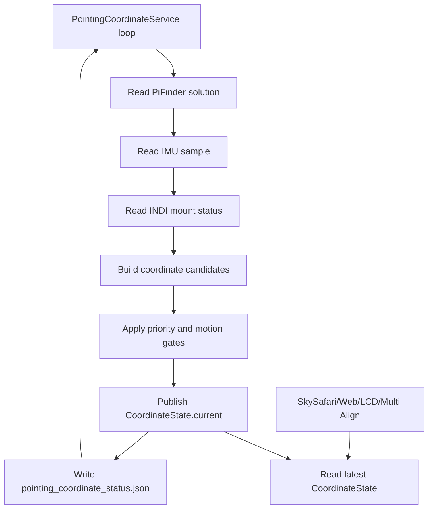

# MF PiFinder Pointing Coordinate Service

Last updated: 2026-07-08

This document describes the current `mf_pifinder` implementation of the
always-running pointing coordinate service shared by SkySafari, Web UI, LCD UI,
and INDI Multi Align.

Core rules:

- Target RA/Dec received from SkySafari/LX200 are used exactly as requested.
- The requested target coordinates are not reinterpreted as J2000/JNow or
  converted between epochs.
- `pointing.aligned.estimate` is used as PiFinder's current computed coordinate.
- Alt/Az conversion is only used where needed for IMU correction, display, or
  mount-type interpretation.
- Consumers read the latest published `CoordinateState` instead of recalculating
  solved/IMU/mount coordinates independently.

## Implementation Files

```text
python/PiFinder/pointing_coordinate_service.py
python/PiFinder/pos_server.py
python/PiFinder/mountcontrol_indi.py
python/PiFinder/imu_pi.py
```

Related tests:

```text
python/tests/test_pointing_coordinate_service.py
python/tests/test_pos_server.py
python/tests/test_mountcontrol_indi.py
```

Debug status files:

```text
/home/pifinder/PiFinder_data/pointing_coordinate_status.json
/home/pifinder/PiFinder_data/mount_control_status.json
```

## Overall Flow

`pos_server.py` does not recalculate coordinates for each SkySafari `:GR#` or
`:GD#` request. A background loop updates `PointingCoordinateService`, and the
POS server reads `CoordinateState.current`.

```text
PiFinder processes
  IMU process
    -> shared_state.imu()
  Solver/Integrator
    -> shared_state.solution().pointing.aligned.estimate
  INDI Mount process
    -> mount_control_status.json
  POS Server
    -> PointingCoordinateService background loop
    -> SkySafari :GR#/:GD# response
```

Service loop:



## Coordinate Candidates

### 1. Solved Coordinate

Input:

```text
shared_state.solution().pointing.aligned.estimate.RA
shared_state.solution().pointing.aligned.estimate.Dec
```

Valid when:

- `solution.has_pointing()` is true
- `solve_source == CAM`
- or `solve_source == IMU` with a plate-solve anchor

Behavior:

- Use RA/Dec directly.
- Do not perform J2000/JNow conversion.
- An unanchored `solve_source == IMU` sample is treated as boot-time IMU
  estimation, not as primary solved pointing.

### 2. IMU Fallback Coordinate

Input:

```text
shared_state.imu()
screen_direction
location/time
optional IMU alignment correction
```

Flow:

```text
IMU quaternion
  -> camera boresight
  -> raw Alt/Az
  -> optional align correction
  -> smoothing
  -> RA/Dec using location/time
```

IMU smoothing:

- Small raw Alt/Az jitter is damped.
- Moderate movement is followed gradually.
- Large movement is treated as real telescope motion and followed quickly.
- Both raw and smoothed values are written to the status JSON.

Relevant metadata:

```text
imu.metadata.raw_alt
imu.metadata.raw_az
imu.metadata.smoothed_alt
imu.metadata.smoothed_az
imu.metadata.filter_state
imu.metadata.filter_delta_degrees
imu.metadata.quat_norm
imu.metadata.calibration_status
imu.metadata.fusion_mode
imu.metadata.uses_magnetometer
```

### 3. Mount Readback Coordinate

Input:

```text
/home/pifinder/PiFinder_data/mount_control_status.json
```

Important fields:

```text
state
ra / dec
park_state
driver_mount_status
raw_mount_status
coordinate_sync
multipoint_align
mount_motion_active
mount_motion_type
mount_readback_priority
goto_motion_active
goto_refine_pending
manual_motion_direction
target_ra / target_dec
target_error_deg
goto_wait_seconds
```

Mount candidates are excluded when the mount is disconnected, faulted, parked,
or has no RA/Dec readback.

Before PiFinder and the mount have been synchronized/aligned, mount readback is
diagnostic only. It is not mixed into the current coordinate.

## Selection Priority

Current priority:

```text
1. SOLVED_PRIMARY
   Plate solve or plate-solve-anchored PiFinder estimate

2. MOUNT_REFERENCE_PRIMARY
   Usable and synced/aligned mount plus valid IMU, only while the mount is
   stationary

3. MOUNT_ONLY_SYNCED
   Usable and synced/aligned mount with invalid IMU, or while mount motion is
   active

4. IMU_PRIMARY_UNSOLVED
   No solve, mount not synced or unusable, valid IMU

5. UNAVAILABLE
   No usable coordinate
```

Before synchronization, mount and IMU absolute coordinates may be very different.
They are not averaged.

## Mount + IMU Delta

After PiFinder and the mount are synced/aligned, the service uses:

```text
anchor_mount = mount RA/Dec at sync time
anchor_imu   = IMU fallback RA/Dec at the same time

current_imu_delta = current_imu - anchor_imu
current = anchor_mount + current_imu_delta
```

Intent:

- The mount is the long-term reference.
- The IMU contributes fast local delta only after sync.
- Absolute mount and IMU coordinates are not blended.

The anchor is reset when no anchor exists, the sync key changes, or mount
readback moves meaningfully away from the anchor.

### IMU-delta rate gate (added 2026-07-12)

Found on hardware while tracking: with the mount tracking sidereal, the readback
RA/Dec stays fixed on the target, but the IMU smoothing filter treats the slow
tracking motion (~15"/s) as small jitter and effectively freezes it. The
IMU-derived RA then drifts at near-sidereal rate, the raw delta accumulates
without bound, and the fused coordinate flows off target (~20'/min). This false
drift falsely triggered the tracking-guide GoTo recovery, physically moving the
mount *off* target.

Fix: `_mount_with_imu_delta` applies a **rate-gated delta** (`_gated_imu_delta`)
instead of the raw delta.

```text
IMU_DELTA_FAST_RATE_DEG_PER_SEC = 0.05
  Delta increments are applied only when the per-tick IMU motion rate is at
  least this fast (a real push/bump). 10x margin above the tracking artifact
  (~0.005 deg/s).

IMU_DELTA_DECAY_TAU_SECONDS = 120.0
  In slow intervals the applied delta decays toward zero with this time
  constant; after a bump the offset stays visible much longer than the
  disturbance-recovery window.
```

- Bump / manual push (fast) -> `fast_follow`: the offset enters the fused
  coordinate, so disturbance detection and recovery act on the true error.
- Tracking artifact / sensor drift (slow) -> `slow_decay`: increments are
  discarded and the applied delta decays, keeping the fused coordinate anchored
  to the mount readback (= the target).
- An anchor reset (mount move / sync) also resets the tracker and applied delta.
- Diagnostics in metadata: `imu_delta_applied_ra/dec`, `imu_delta_gate`,
  `imu_delta_rate_deg_per_sec`.
- Limitation: a real external force slower than the gate (0.05 deg/s) is
  invisible without a solve. At night SOLVED_PRIMARY takes precedence anyway.
- End-to-end hardware validation (2026-07-12, user physically pushed the tube):
  push detected (0.99 deg/s, err 1488') -> disturbed -> sync+GoTo recovery ->
  settling 2.9' -> enabled 0.0', re-acquiring the pre-push position. During
  stable tracking the false drift is gone (slow_decay).
- Note: during GoTo phases mount readback has priority, so a push mid-GoTo is
  not immediately visible in the displayed coordinate; the corrective pass /
  tracking guide handles it after the GoTo ends.

## GoTo Handling

OnStepX can perform a large GoTo movement, appear briefly idle, then perform a
final precision movement. During this interval, IMU delta must not be applied to
the target coordinate.

`MountControlIndi` publishes mount readback during GoTo and manual motion.
The coordinate service primarily consumes these common telemetry fields:

```text
mount_motion_active
  True when the mount is actually or command-wise moving.

mount_motion_type
  Diagnostic category such as manual / goto / goto_refine_settle /
  guide_correction / align_goto / backlash_auto.

mount_readback_priority
  True when mount readback should be preferred over IMU delta for the current
  coordinate. This includes settle/refine windows where the mount may not be
  continuously moving but readback still needs to be authoritative.
```

Legacy detail fields (`goto_motion_active`, `manual_motion_direction`,
`goto_refine_pending`, `state`) remain for debugging and backwards-compatible
status parsing.

```text
MountControlIndi._check_goto_motion()
  -> _read_goto_progress_position()
  -> _write_goto_progress_status()
  -> state = slewing
  -> writes ra / dec / target_ra / target_dec / target_error_deg

MountControlIndi.manual_move()
  -> _arm_manual_motion_deadline()
  -> _publish_manual_motion_progress(force=True)

MountControlIndi.run()
  -> _publish_manual_motion_progress()
  -> state = manual_motion
  -> writes ra / dec / manual_motion_direction
```

The coordinate service holds IMU delta and uses mount readback while:

```text
mount_readback_priority == true
mount readback is still changing between ticks
```

### Hardware validation (2026-07-12)

This source-selection logic itself works. During a direct hold-to-move (keypad),
mount-control reports `state = manual_motion`, `mount_motion_active = true`, and
`current.source = mount`, smoothly tracking the driver `EQUATORIAL_EOD_COORD`.

Note: this path only engages while the mount is **actually moving** so that
mount-control keeps `state = manual_motion`. The PiFinder GoTo
(`indi_goto_method = pifinder`) "moves then stops" problem was **not** this
coordinate logic — the manual approach's motion lease was shorter than the service
tick, so motion expired and stopped, dropping `state` to `connected` and falling
back to the stopped-only `mount_imu_delta` fusion. See "Hardware test finding:
manual-approach motion dies between ticks" in `mf_indi_goto_guide_plan`.

If `mount_readback_priority` is absent in an older status file, the service
falls back to interpreting `goto_motion_active`, `goto_refine_pending`,
`manual_motion_direction`, `state`, `multipoint_align`, and `backlash_auto`.

Even after status changes back to `connected`, changing mount readback extends a
short hold window. The current hold time is 1.5 seconds.

Expected behavior:

- SkySafari follows mount readback during GoTo.
- IMU movement during the final precision step does not introduce target error.
- IMU delta is re-enabled only after the mount is clearly stationary.

## SkySafari Target / Sync / Align

SkySafari target input:

```text
:SrHH:MM:SS#
:Sd+DD*MM:SS#
:MS#
```

Rules:

- `:Sr/:Sd` are stored directly as `last_target_coordinates`.
- `:MS#` uses the same target for PiFinder push target and optional INDI GoTo.
- In Multi Align, GoTo is routed to `multipoint_align_goto_target`.
- `:CM#` Sync/Align uses the latest requested target coordinates.
- In Multi Align, `:CM#` is routed to `multipoint_align_confirm`.
- SkySafari guide input (`:Mn#`, `:Ms#`, `:Me#`, `:Mw#`) is not target
  coordinate input. `pos_server.py` owns the guide keepalive timer and queues
  `manual_movement` / `manual_movement_keepalive` to mount-control.
- SkySafari release/stop input (`:Q#`, `:Qn#`, `:Qs#`, `:Qe#`, `:Qw#`) queues
  `stop_movement`. A TCP command connection closing is not treated as stop.

The align coordinate is the requested target coordinate, not the IMU coordinate
at confirm time.

## Debugging

Useful commands:

```bash
jq . /home/pifinder/PiFinder_data/pointing_coordinate_status.json
jq . /home/pifinder/PiFinder_data/mount_control_status.json
```

Check:

```text
1. mode and current.source
2. raw vs smoothed IMU Alt/Az
3. imu.metadata.filter_state
4. mount.aligned and sync metadata
5. GoTo state, readback RA/Dec, and target_error_deg
6. health.warnings
```

Common modes:

```text
IMU_PRIMARY_UNSOLVED:
  no solve, mount not synced, IMU fallback is current

MOUNT_REFERENCE_PRIMARY:
  mount synced, mount stationary, mount anchor + IMU delta

MOUNT_ONLY_SYNCED:
  mount synced, IMU invalid or mount motion/settle active

SOLVED_PRIMARY:
  plate solve coordinate has priority
```

## Tests

```bash
python -m pytest \
  python/tests/test_pos_server.py \
  python/tests/test_mountcontrol_indi.py \
  python/tests/test_pointing_coordinate_service.py
```

2026-07-08 result:

```text
110 passed
```

Test coverage includes:

- Solved coordinates override mount/IMU.
- Unsynced mount readback is diagnostic only.
- Synced stationary mount can use IMU delta.
- GoTo/refine/readback movement uses mount readback.
- GoTo progress readback is published.
- IMU smoothing is applied to small jitter.
- SkySafari target/sync coordinates are used as requested.
- SkySafari guide movement persists while keepalive is active and stops on stop
  commands.
