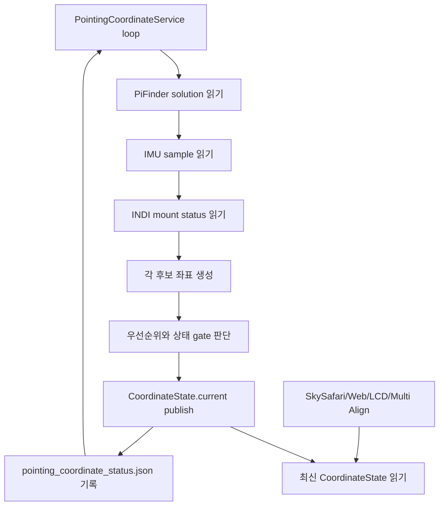

# MF PiFinder Pointing Coordinate Service

최종 업데이트: 2026-07-08

이 문서는 현재 `mf_pifinder` 브랜치의 상시 좌표 서비스 구현을 기준으로
SkySafari, Web UI, LCD UI, INDI Multi Align이 공통으로 사용할 좌표 흐름을
정리한다.

중요 원칙:

- SkySafari 또는 LX200 입력으로 들어온 target RA/Dec는 요청 좌표 그대로 사용한다.
- 요청 좌표를 J2000/JNow 같은 epoch 이름으로 재해석하거나 변환하지 않는다.
- `pointing.aligned.estimate`는 PiFinder가 계산한 현재 기준 좌표로 그대로 사용한다.
- Alt/Az 변환은 IMU 보정, 표시, 마운트 타입별 해석이 필요한 지점에서만 수행한다.
- 소비자는 좌표를 직접 다시 계산하지 않고 `PointingCoordinateService`가 publish한
  최신 `CoordinateState`를 읽는다.

## 구현 파일

```text
python/PiFinder/pointing_coordinate_service.py
python/PiFinder/pos_server.py
python/PiFinder/mountcontrol_indi.py
python/PiFinder/imu_pi.py
```

관련 테스트:

```text
python/tests/test_pointing_coordinate_service.py
python/tests/test_pos_server.py
python/tests/test_mountcontrol_indi.py
```

디버깅 상태 파일:

```text
/home/pifinder/PiFinder_data/pointing_coordinate_status.json
/home/pifinder/PiFinder_data/mount_control_status.json
```

## 전체 구조

`pos_server.py`는 SkySafari LX200 요청(`:GR#`, `:GD#`)을 받을 때
좌표를 새로 계산하지 않는다. 백그라운드 루프가 갱신해 둔
`PointingCoordinateService.get_state()`의 `current` 좌표를 읽어 LX200 형식으로
응답한다.

```text
PiFinder processes
  IMU process
    -> shared_state.imu()
  Solver/Integrator
    -> shared_state.solution().pointing.aligned.estimate
  INDI Mount process
    -> mount_control_status.json
  POS Server
    -> PointingCoordinateService background loop
    -> SkySafari :GR#/:GD# response
```

좌표 서비스 루프:



## 후보 좌표

### 1. Solved 좌표

입력:

```text
shared_state.solution().pointing.aligned.estimate.RA
shared_state.solution().pointing.aligned.estimate.Dec
```

유효 조건:

- `solution.has_pointing()`이 true
- `solve_source == CAM`
- 또는 `solve_source == IMU`이지만 plate-solve anchor가 존재함

처리:

- RA/Dec 값을 그대로 사용한다.
- J2000/JNow 변환을 하지 않는다.
- `solve_source == IMU`인데 plate-solve anchor가 없으면 부팅 직후 IMU 추정값으로
  보고 primary solved 좌표로 쓰지 않는다.

### 2. IMU fallback 좌표

입력:

```text
shared_state.imu()
screen_direction
location/time
optional IMU alignment correction
```

처리:

```text
IMU quaternion
  -> camera boresight
  -> raw Alt/Az
  -> optional align correction
  -> smoothing
  -> location/time 기준 RA/Dec
```

IMU smoothing:

- raw Alt/Az 변화량을 기준으로 작은 흔들림을 평균화한다.
- 매우 작은 변화는 강하게 damping한다.
- 중간 변화는 완만하게 따라간다.
- 큰 변화는 사용자가 실제로 망원경을 움직인 것으로 보고 빠르게 반영한다.
- smoothing 전후 값은 모두 status JSON에 기록한다.

관련 status metadata:

```text
imu.metadata.raw_alt
imu.metadata.raw_az
imu.metadata.smoothed_alt
imu.metadata.smoothed_az
imu.metadata.filter_state
imu.metadata.filter_delta_degrees
imu.metadata.quat_norm
imu.metadata.calibration_status
imu.metadata.fusion_mode
imu.metadata.uses_magnetometer
```

### 3. Mount readback 좌표

입력:

```text
/home/pifinder/PiFinder_data/mount_control_status.json
```

주요 필드:

```text
state
ra / dec
park_state
driver_mount_status
raw_mount_status
coordinate_sync
multipoint_align
mount_motion_active
mount_motion_type
mount_readback_priority
goto_motion_active
goto_refine_pending
manual_motion_direction
target_ra / target_dec
target_error_deg
goto_wait_seconds
```

mount 후보 제외 조건:

- disconnected/error/fault/server_offline/driver_offline 상태
- Parked 상태
- RA/Dec readback 없음

정렬 전 mount readback:

- `mount.valid = true`일 수 있다.
- 하지만 PiFinder와 mount가 아직 sync/alignment 되지 않았으면 `mount.aligned = false`.
- 이 경우 current 좌표에 섞지 않고 diagnostic으로만 기록한다.

## 좌표 선택 우선순위

현재 구현의 우선순위:

```text
1. SOLVED_PRIMARY
   plate solve 또는 plate-solve anchor가 있는 PiFinder estimate

2. MOUNT_REFERENCE_PRIMARY
   mount가 usable + synced/aligned이고 IMU도 valid인 경우
   단, mount가 확실히 정지한 상태일 때만 mount anchor + IMU delta 사용

3. MOUNT_ONLY_SYNCED
   mount가 usable + synced/aligned이지만 IMU가 invalid인 경우

4. IMU_PRIMARY_UNSOLVED
   solve 없음, mount sync 전 또는 mount unusable, IMU valid

5. UNAVAILABLE
   사용할 좌표 없음
```

정렬 전에는 mount와 IMU 절대 좌표가 크게 다를 수 있으므로 평균내지 않는다.
mount readback은 PiFinder와 sync된 뒤에만 current 좌표 후보가 된다.

## Mount + IMU Delta

mount가 PiFinder와 sync/alignment 된 뒤에는 다음 방식으로 보정한다.

```text
anchor_mount = sync 시점 mount RA/Dec
anchor_imu   = 같은 시점 IMU fallback RA/Dec

current_imu_delta = current_imu - anchor_imu
current = anchor_mount + current_imu_delta
```

의도:

- mount 절대 좌표와 IMU 절대 좌표를 평균내지 않는다.
- mount는 장기 기준점으로 사용한다.
- IMU는 mount 정지 상태에서 사람이 강제로 움직였거나 충격을 준 경우처럼 빠른 변화량을
  감지하는 보조 입력으로 사용한다.

anchor reset 조건:

- anchor 없음
- `coordinate_sync` 또는 `multipoint_align` sync key 변경
- mount readback이 anchor 기준으로 의미 있게 이동

## GoTo 중 좌표 처리

OnStepX는 GoTo 중에 큰 이동 후 잠시 멈춘 것처럼 보이다가 마지막 정밀 이동을 수행할 수
있다. 이 구간에서 IMU 움직임을 `mount + IMU delta`에 반영하면 target 오차가 생길 수
있으므로 GoTo 중에는 mount readback을 우선한다.

mount-control은 GoTo와 수동 이동 진행 중에도 현재 mount readback을 status에 publish한다.
좌표 서비스가 우선 사용하는 공통 telemetry는 다음이다.

```text
mount_motion_active
  실제 또는 명령상 mount가 움직이는 중이면 true.

mount_motion_type
  manual / goto / goto_refine_settle / guide_correction /
  align_goto / backlash_auto 등의 진단용 분류.

mount_readback_priority
  현재 좌표 계산에서 IMU delta보다 mount readback을 우선해야 하면 true.
  GoTo 마지막 정밀 이동 대기처럼 실제 motion은 아닐 수 있지만 readback을
  우선해야 하는 구간도 여기에 포함한다.
```

기존 세부 필드(`goto_motion_active`, `manual_motion_direction`,
`goto_refine_pending`, `state`)는 디버깅 및 과거 status 호환용으로 유지한다.

```text
MountControlIndi._check_goto_motion()
  -> _read_goto_progress_position()
  -> _write_goto_progress_status()
  -> state = slewing
  -> ra / dec / target_ra / target_dec / target_error_deg 기록

MountControlIndi.manual_move()
  -> _arm_manual_motion_deadline()
  -> _publish_manual_motion_progress(force=True)

MountControlIndi.run()
  -> _publish_manual_motion_progress()
  -> state = manual_motion
  -> ra / dec / manual_motion_direction 기록
```

좌표 서비스는 다음 조건에서 IMU delta를 보류하고 mount readback만 사용한다.

```text
mount_readback_priority == true
mount readback이 최근 tick 대비 계속 변하는 중
```

### 실장비 검증 (2026-07-12)

이 소스 선택 로직 자체는 정상 동작함을 확인했다. 직접 홀드 이동(키패드) 중에는
mount-control이 `state = manual_motion`, `mount_motion_active = true`를 보고하고,
`current.source = mount`로 드라이버 `EQUATORIAL_EOD_COORD`를 부드럽게 추종한다.

주의: 이 로직은 **마운트가 실제로 계속 움직여 mount-control state가 `manual_motion`으로
유지될 때만** 활성화된다. PiFinder GoTo(`indi_goto_method = pifinder`)의 수동 접근에서
마운트가 멈추던 문제는 이 좌표 로직이 아니라, 수동 접근의 모션 lease가 서비스 tick
간격보다 짧아 모션이 만료→정지되어 state가 `connected`로 떨어지고 `mount_imu_delta`
(정지 전용)로 폴백된 것이 원인이다. 자세한 내용은 `mf_indi_goto_guide_plan`의
"실장비 테스트 발견: 수동 접근 모션이 tick 사이에 끊김" 참고.

`mount_readback_priority`가 없는 오래된 status를 읽는 경우에만 fallback으로
`goto_motion_active`, `goto_refine_pending`, `manual_motion_direction`, `state`,
`multipoint_align`, `backlash_auto`를 해석한다.

GoTo 상태가 `connected`로 바뀐 직후에도 readback이 계속 변하면 일정 시간 동안
IMU delta를 계속 보류한다. 현재 hold 시간은 1.5초이다.

이 구조의 기대 동작:

- SkySafari 위치 표시는 GoTo 중 mount readback을 따라간다.
- GoTo 마지막 정밀 이동 중 IMU 움직임이 target 오차로 들어가지 않는다.
- mount가 확실히 정지한 뒤에만 IMU delta를 다시 반영한다.

## SkySafari Target / Sync / Align

SkySafari target 입력:

```text
:SrHH:MM:SS#
:Sd+DD*MM:SS#
:MS#
```

처리 원칙:

- `:Sr/:Sd`로 들어온 좌표를 `last_target_coordinates`에 그대로 저장한다.
- `:MS#`는 같은 좌표를 PiFinder push target 및 선택적으로 INDI GoTo로 전달한다.
- Multi Align active 중이면 일반 PushTo 화면으로 넘기지 않고
  `multipoint_align_goto_target`으로 라우팅한다.
- `:CM#` Sync/Align은 가장 최근 target 좌표 또는 현재 `:Sr/:Sd` 좌표를 그대로 사용한다.
- Multi Align active 중 `:CM#`은 `multipoint_align_confirm`으로 라우팅된다.
- SkySafari guide 입력(`:Mn#`, `:Ms#`, `:Me#`, `:Mw#`)은 target 좌표가 아니라
  수동 이동 명령이다. `pos_server.py`가 keepalive timer를 관리해
  `manual_movement`/`manual_movement_keepalive`를 mount-control에 보내고,
  좌표 서비스는 mount-control이 발행하는 `mount_readback_priority`와
  최신 mount readback을 보고 현재 좌표를 선택한다.
- SkySafari release/stop 입력(`:Q#`, `:Qn#`, `:Qs#`, `:Qe#`, `:Qw#`)은
  `stop_movement`로 라우팅된다. TCP 연결이 닫힌 것만으로는 stop으로 보지 않는다.

정렬 요청 좌표는 confirm 시점의 IMU 좌표가 아니다. 사용자가 마지막으로 선택하거나
SkySafari가 지정한 target을 아이피스 중앙에 맞췄다는 의미이므로, 그 target 좌표를
정렬 좌표로 사용한다.

## 디버깅 포인트

좌표가 흔들릴 때 먼저 확인할 파일:

```bash
jq . /home/pifinder/PiFinder_data/pointing_coordinate_status.json
jq . /home/pifinder/PiFinder_data/mount_control_status.json
```

확인 순서:

```text
1. pointing_coordinate_status.json의 mode/current.source 확인
2. IMU raw_alt/raw_az와 smoothed_alt/smoothed_az 차이 확인
3. imu.metadata.filter_state 확인
4. mount.aligned와 coordinate_sync/multipoint_align 확인
5. GoTo 중 mount_control_status.json의 state, ra, dec, target_error_deg 확인
6. health.warnings 확인
```

대표 상태:

```text
IMU_PRIMARY_UNSOLVED:
  solve 없음, mount sync 전, IMU fallback이 현재 좌표

MOUNT_REFERENCE_PRIMARY:
  mount sync 이후, mount 정지 상태, mount anchor + IMU delta 사용

MOUNT_ONLY_SYNCED:
  mount sync 이후, IMU invalid 또는 mount motion/settle active

SOLVED_PRIMARY:
  plate solve 좌표가 최우선
```

## 테스트

현재 관련 테스트:

```bash
python -m pytest \
  python/tests/test_pos_server.py \
  python/tests/test_mountcontrol_indi.py \
  python/tests/test_pointing_coordinate_service.py
```

2026-07-08 기준 확인 결과:

```text
110 passed
```

테스트가 검증하는 주요 항목:

- solved 좌표가 mount/IMU보다 우선됨
- sync 전 mount readback은 current 좌표에 섞이지 않음
- sync 후 mount 정지 상태에서만 IMU delta 반영
- GoTo/refine/readback 이동 중에는 mount readback 우선
- GoTo 중 mount readback progress가 status로 publish됨
- IMU 작은 흔들림 smoothing 적용
- SkySafari target/sync 좌표는 요청 좌표 그대로 사용
- SkySafari guide move는 keepalive 중에는 지속되고 stop command에서 정지
