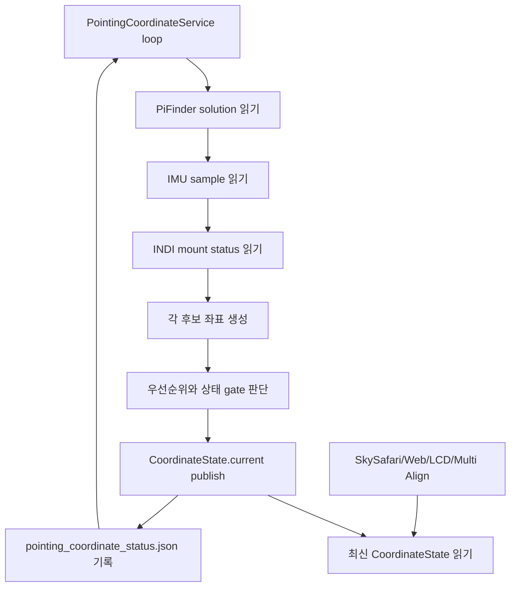

# MF PiFinder Pointing Coordinate Service

최종 업데이트: 2026-07-13

이 문서는 현재 `mf_pifinder` 브랜치의 상시 좌표 서비스 구현을 기준으로
SkySafari, Web UI, LCD UI, INDI Multi Align이 공통으로 사용할 좌표 흐름을
정리한다.

중요 원칙:

- SkySafari 또는 LX200 입력으로 들어온 target RA/Dec는 요청 좌표 그대로 사용한다.
- 요청 좌표를 J2000/JNow 같은 epoch 이름으로 재해석하거나 변환하지 않는다.
- `pointing.aligned.estimate`는 PiFinder가 계산한 현재 기준 좌표로 그대로 사용한다.
- Alt/Az 변환은 IMU 보정, 표시, 마운트 타입별 해석이 필요한 지점에서만 수행한다.
- 소비자는 좌표를 직접 다시 계산하지 않고 `PointingCoordinateService`가 publish한
  최신 `CoordinateState`를 읽는다.

## 구현 파일

```text
python/PiFinder/pointing_coordinate_service.py
python/PiFinder/pos_server.py
python/PiFinder/mountcontrol_indi.py
python/PiFinder/imu_pi.py
```

관련 테스트:

```text
python/tests/test_pointing_coordinate_service.py
python/tests/test_pos_server.py
python/tests/test_mountcontrol_indi.py
```

디버깅 상태 파일:

```text
/home/pifinder/PiFinder_data/pointing_coordinate_status.json
/home/pifinder/PiFinder_data/mount_control_status.json
```

## 전체 구조

`pos_server.py`는 SkySafari LX200 요청(`:GR#`, `:GD#`)을 받을 때
좌표를 새로 계산하지 않는다. 백그라운드 루프가 갱신해 둔
`PointingCoordinateService.get_state()`의 `current` 좌표를 읽어 LX200 형식으로
응답한다.

```text
PiFinder processes
  IMU process
    -> shared_state.imu()
  Solver/Integrator
    -> shared_state.solution().pointing.aligned.estimate
  INDI Mount process
    -> mount_control_status.json
  POS Server
    -> PointingCoordinateService background loop
    -> SkySafari :GR#/:GD# response
```

좌표 서비스 루프:



## 후보 좌표

### 1. Solved 좌표

입력:

```text
shared_state.solution().pointing.aligned.estimate.RA
shared_state.solution().pointing.aligned.estimate.Dec
```

유효 조건:

- `solution.has_pointing()`이 true
- `solve_source == CAM`
- 또는 `solve_source == IMU`이지만 plate-solve anchor가 존재함

처리:

- RA/Dec 값을 그대로 사용한다.
- J2000/JNow 변환을 하지 않는다.
- `solve_source == IMU`인데 plate-solve anchor가 없으면 부팅 직후 IMU 추정값으로
  보고 primary solved 좌표로 쓰지 않는다.

### 2. IMU fallback 좌표

입력:

```text
shared_state.imu()
screen_direction
location/time
optional IMU alignment correction
```

처리:

```text
IMU quaternion
  -> camera boresight
  -> raw Alt/Az
  -> optional align correction
  -> smoothing
  -> location/time 기준 RA/Dec
```

IMU smoothing:

- raw Alt/Az 변화량을 기준으로 작은 흔들림을 평균화한다.
- 매우 작은 변화는 강하게 damping한다.
- 중간 변화는 완만하게 따라간다.
- 큰 변화는 사용자가 실제로 망원경을 움직인 것으로 보고 빠르게 반영한다.
- smoothing 전후 값은 모두 status JSON에 기록한다.

관련 status metadata:

```text
imu.metadata.raw_alt
imu.metadata.raw_az
imu.metadata.smoothed_alt
imu.metadata.smoothed_az
imu.metadata.filter_state
imu.metadata.filter_delta_degrees
imu.metadata.quat_norm
imu.metadata.calibration_status
imu.metadata.fusion_mode
imu.metadata.uses_magnetometer
```

### 3. Mount readback 좌표

입력:

```text
/home/pifinder/PiFinder_data/mount_control_status.json
```

주요 필드:

```text
state
ra / dec
park_state
driver_mount_status
raw_mount_status
coordinate_sync
multipoint_align
mount_motion_active
mount_motion_type
mount_readback_priority
goto_motion_active
goto_refine_pending
manual_motion_direction
target_ra / target_dec
target_error_deg
goto_wait_seconds
```

mount 후보 제외 조건:

- disconnected/disconnecting/error/fault/failed/server_offline/driver_offline 상태
- Parked 상태
- RA/Dec readback 없음

정렬 전 mount readback:

- `mount.valid = true`일 수 있다.
- 하지만 PiFinder와 mount가 아직 sync/alignment 되지 않았으면 `mount.aligned = false`.
- 이 경우 current 좌표에 섞지 않고 diagnostic으로만 기록한다.

## 좌표 선택 우선순위

현재 구현의 우선순위:

```text
1. SOLVED_PRIMARY
   plate solve 또는 plate-solve anchor가 있는 PiFinder estimate

2. MOUNT_REFERENCE_PRIMARY
   mount가 usable + synced/aligned이고 IMU도 valid인 경우
   단, mount가 확실히 정지한 상태일 때만 mount anchor + IMU delta 사용

3. MOUNT_ONLY_SYNCED
   mount가 usable + synced/aligned이지만 IMU가 invalid인 경우

4. IMU_PRIMARY_UNSOLVED
   solve 없음, mount sync 전 또는 mount unusable, IMU valid

5. UNAVAILABLE
   사용할 좌표 없음
```

정렬 전에는 mount와 IMU 절대 좌표가 크게 다를 수 있으므로 평균내지 않는다.
mount readback은 PiFinder와 sync된 뒤에만 current 좌표 후보가 된다.

## Mount + IMU Delta

mount가 PiFinder와 sync/alignment 된 뒤에는 다음 방식으로 보정한다.

```text
anchor_imu   = sync 시점 IMU fallback RA/Dec (delta 기준점)

applied_delta = 속도 게이트를 통과해 누적된 IMU delta (아래 참조)
current = 실시간 mount readback + applied_delta
          (마운트의 네이티브 축 프레임에서 적용 — alt/az 마운트는 alt/az 공간,
          EQ 마운트는 RA/Dec 공간; 아래 "delta 적용 프레임" 참조)
```

(2026-07-16 수정: base가 anchor 시점의 mount 좌표 스냅숏에서 **실시간 mount
readback**으로 바뀌었다. 펄스/슬루로 readback이 움직이면 fused가 즉시 따라가고,
re-anchor가 필요 없어져 re-anchor로 인한 외란 오프셋 소실이 사라졌다.)

의도:

- mount 절대 좌표와 IMU 절대 좌표를 평균내지 않는다.
- mount는 장기 기준점으로 사용한다.
- IMU는 mount 정지 상태에서 사람이 강제로 움직였거나 충격을 준 경우처럼 빠른 변화량을
  감지하는 보조 입력으로 사용한다.

anchor reset 조건 (reset 시 applied 외란 오프셋도 함께 초기화):

- anchor 없음
- `coordinate_sync` 또는 `multipoint_align` sync key 변경 (= sync로 마운트
  좌표계가 재정립된 경우)

mount readback 이동은 더 이상 reset 사유가 아니다. fused의 base가 실시간
readback이므로(아래 2026-07-16 수정) 펄스/슬루는 base를 통해 바로 반영되고,
readback 이동으로 reset하면 실제 물리 외란 오프셋이 소리 없이 지워진다.

### delta 적용 프레임 — 마운트 타입별 (2026-07-19 수정)

**실장비 재현 (실내, plate solve 없음, 손으로만 az 스윙):** IMU↔mount 괴리가
~52° 누적된 상태에서 az만 손으로 돌리자(스코프 alt는 내내 7~17° 유지), fused
좌표가 RA 301 / Dec −46 — 관측지에서 **절대 지평선 위로 뜰 수 없는 좌표** —
까지 갔다. 스카이사파리에선 스코프가 지평선 위를 가리키는데 마커가 땅속으로
들어갔다. 속도 게이트는 무죄였다(`fast_follow`로 delta는 정상 누적) — 결함은
누적된 delta를 fused RA/Dec로 **변환하는 수식**에 있었다.

**구(결함) 적용식** — RA/Dec 성분별 이식:

```text
east_delta = applied_ra × cos(dec_imu)          # IMU가 있는 dec(~60°)에서 각도 환산
fused_dec  = mount_dec + applied_dec            # mount의 dec(~20°)에 그대로 덧셈
fused_ra   = mount_ra + east_delta / cos(fused_dec)
```

이건 1차 접평면 근사다: IMU의 지향점(재현에서 dec ~60)에서 잰 구면 변위를
mount의 지향점(dec ~20)에 옮겨 심는다. 설계 의도였던 분각 수준 delta(가이드
펄스, 작은 범프)에는 문제없지만, 큰 IMU↔mount 괴리 위에서 delta가 수십 도가
되면 구면 왜곡이 폭발한다 — az만 도는 물리 회전이 거대한 가짜 Dec 성분을 만들어
fused가 물리적으로 도달 불가능한 하늘 밖으로 나간다.

**신 적용식 — delta를 마운트의 네이티브 축 프레임에서 추적·적용한다.**
프레임은 `mount_type` config로 선택(`mount_type`에 "alt"와 "az"가 있으면
alt/az 프레임, 아니면 equatorial 프레임):

계산 순서, Alt/Az 마운트 (`fusion_frame = "altaz"`):

```text
1. 컨텍스트: current_state()가 (dt, 관측지 location, mount_type)을 융합
   컨텍스트로 저장. dt/location 없으면 equatorial 분기로 폴백.
2. tracker 좌표: imu.metadata의 raw(비스무딩) alt/az를 (az, alt) 순서로 사용
   — 경도형 축 먼저, (ra, dec) 순서와 대응.
3. 속도 게이트(로직 동일, 코드 공유):
     step_az  = wrap180(az_t − az_(t−1))
     step_alt = alt_t − alt_(t−1)
     rate     = 대원거리(prev, now) / dt          # 같은 구면 공식
   fast_follow 에피소드가 (applied_az, applied_alt)를 누적; hold는 오프셋
   유지; 프레임이 바뀌면 tracker 리셋(다른 프레임에서 누적한 오프셋은 무의미).
4. mount readback → alt/az 변환:
     (mount_alt, mount_az) = radec_to_altaz(mount_ra, mount_dec, dt, atmos=False)
5. alt/az 공간에서 delta 적용:
     fused_az  = (mount_az + applied_az) mod 360
     fused_alt = mount_alt + applied_alt
   천정/천저 폴딩: fused_alt > 90 → fused_alt = 180 − fused_alt, az += 180;
   fused_alt < −90 → fused_alt = −180 − fused_alt, az += 180.
6. RA/Dec 복귀는 **차분식** (편향 상쇄):
     (base_ra,  base_dec)  = altaz_to_radec(mount_alt, mount_az, dt)
     (moved_ra, moved_dec) = altaz_to_radec(fused_alt, fused_az, dt)
     fused_ra  = (mount_ra + wrap180(moved_ra − base_ra)) mod 360
     fused_dec = clamp(mount_dec + (moved_dec − base_dec), ±89.9)
   차분을 쓰는 이유: radec_to_altaz(erfa atco13, ICRS 입력)와
   altaz_to_radec(skyfield from_altaz, epoch-of-date 출력)는 정확한 역함수가
   아니어서 절대 왕복에 ~0.3°의 세차/epoch 편향이 실린다. 차분식은 이를
   상쇄하고, applied delta = 0이면 fused ≡ mount readback을 보장한다.
7. 변환 예외 발생 시 equatorial 폴백(metadata
   `fusion_frame = "equatorial_fallback"`) — fused 소스를 버리지 않는다.
```

결과: az-only 손 스윙은 az-only fused 변화가 되고, fused 좌표는 스코프의
물리적 지향 고도 아래로 절대 내려갈 수 없다.

계산 순서, EQ 마운트 — **폴백 전용** (`fusion_frame = "equatorial"`, 아래 EQ
점검 참조):

```text
fused_ra  = (mount_ra + applied_ra) mod 360     # cos(dec) 재스케일 없음
fused_dec = clamp(mount_dec + applied_dec, ±89.9)
```

극축 주위 손 회전은 **어느 dec에서든** 회전각만큼 지향 RA를 바꾸고, dec축
회전은 dec만 바꾼다 — EQ 마운트에서는 성분별 가산이 곧 축별 정확식이며, 구
공식의 `cos(dec_imu)/cos(dec_mount)` 재스케일은 여기서도 틀린 것이라 제거했다.
**단**, 이 식이 소비하는 delta는 IMU az 프레임에 yaw 오프셋이 없을 때만
올바르다(아래 EQ 점검 참조). 그래서 융합 컨텍스트가 있으면 EQ 마운트도 회전
tracker를 우선 사용하고, 이 스칼라 식은 컨텍스트 없는 폴백으로만 남는다.

metadata: `fusion_frame`(`altaz` / `equatorial` / `equatorial_fallback`),
alt/az 프레임은 `imu_delta_applied_az/alt` + `mount_alt/az` + `fused_alt/az`,
equatorial 프레임은 `imu_delta_applied_ra/dec`(기존 키 유지).

**실장비 검증 (2026-07-19, 실내, pointing reset 후 손 az 스윙만):** 마운트
모션 0건으로 최대 −144° az 스윙 8회. fused alt/az가 IMU alt/az를 median
0.11/0.13°(max 0.66/1.83°) 오차로 추종했고, fused 고도는 IMU 고도 범위
6.2~14.1°와 정확히 일치 — **지평선 아래 샘플 0건**. 회귀 테스트:
`test_altaz_mount_hand_swing_applies_delta_in_altaz_space`,
`test_eq_mount_delta_stays_component_additive_without_cos_rescale`.

#### 회전(쿼터니언) tracker 업그레이드 (2026-07-19, 같은 날 후속)

성분 (az, alt) tracker에는 특이점이 남는다: az는 천정에서 수평 성분이 0으로
수렴하는 atan2라 alt 90° 근처에서 측정 az가 noise이고, 천정을 넘는 스윙은 az가
정당하게 ~180° 뒤집힌다 — 성분 누적은 이를 쓰레기로 기록한다. 그래서 alt/az
프레임 tracker를 스칼라 성분에서 **회전(쿼터니언) tracker**로 업그레이드했다
(`_tick_altaz_rotation_tracker`, 우선 경로; 성분 경로는 폴백으로 유지):

```text
1. raw IMU boresight를 각도 차분 없이 **단위벡터** v로 유지한다.
2. psi0 — IMU의 임의 yaw 오프셋(imuplus, 자기센서 미사용)과 마운트 az 프레임의
   차이 — 는 tracker 초기화 시점(applied = 0, 정의상 fused == mount readback)에
   한 번 측정한다:
     psi0 = mount_az − imu_raw_az
   (실측: psi0 = −53.4°가 측정됐고, 이는 누적돼 있던 ~52° IMU↔mount 괴리와
   일치 — 즉 그 괴리의 정체가 yaw 오프셋이었다.)
3. 게이트를 통과한 각 스텝은 작은 회전이 되며, 스텝마다 방식을 선택한다:
   - |alt| ≤ 80 (ALTAZ_ROTATION_ZENITH_GUARD_ALT_DEG): 정확한 마운트 축 분해
       q_step = R_az(Δaz) ∘ R_altaxis(az_prev + psi0, Δalt)
     R_az(Δaz)(−z축 회전: az는 북→동 시계방향)는 **IMU↔mount 괴리 크기와
     무관하게** az축에 대해 정확하다 — 여기서 단일 min-arc 회전을 쓰면
     ~Δaz·sin(alt)·sin(괴리)의 전송 오차가 생긴다.
   - |alt| > 80: boresight 벡터 간 최소회전(min-arc)을 psi0로 마운트 프레임에
     켤레변환 — Δaz가 무의미한 천정 통과 구간에서도 조건이 좋다.
4. 스텝은 오프셋 쿼터니언으로 합성된다: q_off ← q_step ∘ q_off
   (fast_follow에서만; hold는 q_off 유지; suspended는 기준만 전진).
5. 적용: v_fused = q_off · v_mount(라이브 readback) → alt/az → RA/Dec는 성분
   경로와 같은 차분 변환.
```

metadata: `fusion_method` = `rotation`(폴백 경로는 `component`), `psi0_deg`.
snapshot/rollback은 q_off 참조를 저장한다(교체만 하고 제자리 변경 없음).
프레임 전환(성분 ↔ 회전, 또는 새 anchor)은 tracker를 리셋한다.

실장비 검증 (2026-07-19): 손 스윙·GoTo·외란 복구까지 회전 경로에서 전 구간
정상 확인; 지평선 아래 fused 샘플 0건; alt 12~78° 범위에서 fused-vs-IMU 추종
median 0.38/0.94°(alt/az). 천정 케이스 회귀 테스트:
`test_altaz_rotation_tracker_survives_zenith_crossing`(자오선을 따라 천정을
넘는 20° 스윙이 반대편에 착지해야 한다).

#### EQ 마운트 점검 — EQ도 회전 tracker가 우선 (2026-07-19)

Alt/Az 작업 후 EQ 스칼라 경로를 점검하니 같은 부류의 프레임 결함이 두 가지
남아 있었다:

1. **IMU yaw 오프셋이 측정 RA/Dec delta를 오염시킨다.** EQ 스칼라 tracker는
   `raw_ra/raw_dec`를 차분하는데, 이는 **IMU 자체 az**를
   `altaz_to_radec(raw_alt, raw_az, dt)`로 변환한 값이다. imuplus yaw
   오프셋 때문에 이는 엉뚱한 지향점의 변환이 되고, alt/az→RA/Dec 사상은
   비선형이라 차분에서 오프셋이 소거되지 않는다. 실측 오프셋(−53°) 기준:
   순수 극축 +15° 손 회전이 **+11.45 RA / +9.91 Dec**로 기록된다 — 가짜 Dec
   성분 ~10°, 지평선 다이빙의 EQ 판이다. (Alt/Az **성분** 경로엔 이 문제가
   없었다: Δaz/Δalt는 상수 az 오프셋에 불변이다. 적도 성분은 그렇지 않다 —
   프레임 오프셋이 RA 회전이 아니라 az 회전이기 때문.)
2. **천구 극 특이점.** RA는 dec ±90에서 수렴하는 성분의 atan2다 — 천정의 az와
   구조적으로 동일 — 극 근처 스윙은 ΔRA 쓰레기를 기록한다.

수정: 회전 tracker는 마운트 타입에 무관하다 — 스코프의 물리 회전을(psi0
사상으로) 추적해 mount 지향벡터에 적용하며, 출력에서 마운트 축 분해를 쓰지
않는다 — 그래서 이제 **모든** 마운트 타입의 우선 경로다. EQ 스칼라 성분식은
컨텍스트 없는 폴백으로만 남는다. metadata `fusion_frame`은 여전히 마운트
네이티브 프레임(EQ 마운트면 `equatorial`)을 보고하고
`fusion_method = rotation`이 함께 실린다. 회귀 테스트:
`test_eq_mount_uses_rotation_tracker_and_survives_imu_yaw_offset`(−53° yaw
오프셋 하의 극축 +15° 회전이 (mount_ra + 15, mount_dec)의 1° 이내에 착지해야
한다).

### 추적 따라잡기 예산 — 사이드리얼 추적 중 BNO055 스냅 기각 (2026-07-23)

**실장비 재현 (2026-07-22, 실내, M5 정렬 후 방치, 10분 시계열 0.3s 샘플):**
마운트가 타겟 추적 중이면 readback RA/Dec는 고정되지만 물리 축은 계속 돈다
(실측 alt −11.1″/s, az +11.4″/s). BNO055(imuplus)는 이 느린 회전을 분해하지
못한다 — 10분간 물리 alt 이동 −6668″ 중 IMU는 **−2524″(38%)만, 스냅 2~3회로**
보고했고 az는 +6869″ 중 **+240″(3.5%)**만 보였다(yaw는 자기센서 없이 절대
기준이 없음). 출력은 평소 **완전히 얼어 있다가**(rate 중앙값 정확히 0.0)
가속도계가 중력 방향 변화를 감지하면 **~0.3°를 0.25~0.41°/s로 한 번에 스냅**
한다. 이 스냅이 외란 게이트(진입 0.03°/s)를 넘어 `fast_follow`로 q_off에
적재됐고, fused가 스냅마다 ~0.3°씩 이탈 → 추적 가이드 복구 임계 초과 →
sync+GoTo 재정렬 → 반복 — 스카이사파리에서 보이던 **주기적 톱니파 드리프트**의
정체다. 추적 모션은 readback을 바꾸지 않으므로 `mount_motion_active` 기반
억제에는 안 보인다는 것이 핵심 맹점이었다.

**수정 — 회전 tracker에 추적 따라잡기 예산(budget) 도입:**

```text
1. 매 tick, readback(고정 RA/Dec)의 alt/az 궤적에서 기대 물리 이동을 계산:
     expected = mount_altaz(dt_now) − mount_altaz(dt_prev)
   (tracker가 매 tick radec_to_altaz를 수행하고 결과를 저장;
   _fuse_altaz_rotation은 이 값을 재사용해 변환 중복을 없앰)
2. hold: budget += expected − step  (얼어 있으면 추적 속도로 누적,
   연속 추종하는 좋은 IMU면 ≈0 유지)
3. fast_follow(정상 고도 분기): 스텝을 예산과 같은 부호·예산 크기 한도로
   상쇄(_tracking_budget_cancel), 잔차만 외란으로 q_off에 적재.
   추적 반대 방향 밀기는 전혀 상쇄되지 않고, 같은 방향 밀기는 예산 초과분이
   적재된다.
4. suspended/post_motion_settle: readback이 움직여 궤적 예측이 무효 —
   budget 폐기.
5. 천정 분기(min-arc): az 성분이 원래 신뢰 불가라 상쇄 없음.
6. 축별 상한 IMU_TRACKING_CATCHUP_BUDGET_CAP_DEG(3.0°) — imuplus yaw는 절대
   기준이 없어 az 예산이 무한 성장할 수 있으므로 상한으로 오상쇄 노출을 제한.
```

- alt/az 성분 비교가 프레임을 넘어 성립하는 근거: az delta는 상수 psi0 yaw
  오프셋에 불변이고 alt는 양쪽 다 중력 기준이다.
- 진단 metadata: `imu_track_budget_alt/az`(대기 중 예산),
  `imu_track_cancelled_alt/az`(tracker 생성 후 상쇄 누계).
- 알려진 한계: 추적과 **같은 방향** 실제 밀기는 대기 예산만큼(전형적으로 스냅
  사이 ≤ ~0.5°) 흡수될 수 있다. 상한 3°가 최악 노출을 제한하고, 야간에는
  solve가 절대 기준이라 영향 없다. 스칼라 성분 폴백 경로(컨텍스트 없음)는
  궤적을 계산할 수 없어 예산 없이 기존 동작 유지.
- 회귀 테스트: `test_tracking_catchup_snap_is_cancelled_not_booked_as_disturbance`
  (180초 동결 후 전량 따라잡기 스냅 → fused가 readback의 0.03° 이내 유지),
  `test_real_push_during_tracking_still_registers`(예산 누적 상태에서 반대
  방향 +2° 밀기 → 전량 적재).

**1차 실기기 검증(2026-07-23, 13분)과 wobble 정류 보강:** 재정렬 사이클은
사라졌고(이전 10분에 2회 → 0회) 스냅 6회 총 −1.99°가 전량 상쇄됐다. 그러나
tick 단위 상쇄에 정류(rectification) 결함이 남아 있었다 — 0.07°/s의 대칭
**진동(wobble)** 에피소드에서 추적 방향 반주기는 예산에 상쇄(예산 소모)되고
복귀 반주기는 외란으로 적재되어, 순변위 ≈0이 ~430″ 오프셋으로 정류됐다(1회
에피소드 실측). 보강: 에피소드 중에는 tick 상쇄를 **잠정**으로 취급하고
순변위·잠정상쇄를 누적(`ep_net_*`/`ep_cancel_*`), 에피소드 종료 시
`_rebalance_tracking_episode`가 **순변위 기준 이상적 상쇄**를 다시 계산해
차액만큼 q_off를 보정하고 잘못 소모된 예산을 반환한다. 깨끗한 스냅·깨끗한
밀기는 이상치와 잠정치가 일치해 보정 0. 천정 에피소드는 성분 장부로 표현
불가라 재정산 제외. suspended 전이 시 에피소드는 재정산 없이 폐기(마운트
자체 모션 누출은 기존 스냅숏 롤백이 처리). 회귀 테스트:
`test_imu_wobble_episode_nets_to_zero_after_rebalance`(±0.05° 대칭 진동 후
fused가 readback 0.02° 이내 + 예산 복원).

### IMU delta 속도 게이트 (2026-07-12 추가)

추적 중 실장비에서 발견: mount가 사이드리얼 추적을 하면 readback RA/Dec는 target에
고정되지만, IMU 스무딩 필터가 느린 추적 모션(~15"/s)을 "작은 지터"로 취급해 사실상
얼려버린다. 그 결과 IMU 환산 RA가 사이드리얼 속도로 드리프트하고, raw delta가 무한
누적되어 fused 좌표가 target에서 계속 흘러갔다(분당 ~20'). 이 가짜 드리프트가
추적 가이드의 GoTo 복구를 오발시켜 물리적으로는 오히려 target을 벗어나게 했다.

수정: `_mount_with_imu_delta`가 raw delta 대신 **속도 게이트를 통과한 applied
delta**를 사용한다 (`_gated_imu_delta`).

```text
IMU_DELTA_ENTER_RATE_DEG_PER_SEC = 0.03   (진입)
IMU_DELTA_EXIT_RATE_DEG_PER_SEC  = 0.015  (유지/탈출)
```

**히스테리시스 게이트 (2026-07-16 수정)**: 단일 임계값(구 0.05)은 미약한 탈조
슬립(실측 head/tail 속도 0.02~0.06 deg/s)을 조각내서 변위의 ~1/3만 계측했다
(실장비 캡처: 0.033→0.06→0.02 이벤트에서 0.05 초과 3틱만 누적). 누적 에피소드는
진입 속도(0.03, 실내 무진동에서 실측한 아티팩트 바닥 0.004~0.005의 ~7배 —
야외 바람 잔진동도 에피소드를 시작시키지 못하는 마진) 이상에서 시작하고, 일단
시작되면 탈출 속도(0.015, ~4배) 아래로 떨어질 때까지 계속 누적해 슬립의 느린
head/tail까지 포착한다. 0.03 미만으로만 기어가는 극미세 슬립은 여전히 보이지
않는다(rate가 유일한 판별자; 야간에는 solve가 절대 기준).

- 충격/수동 이동/탈조 슬립 -> `fast_follow`: 오프셋이 fused 좌표에 그대로
  반영되어 외란 감지와 복구가 정확한 오차로 동작한다.
- 추적 아티팩트/센서 드리프트(느림) -> `hold`: 증분은 버려지지만 이미 적용된
  오프셋은 그대로 **유지**된다. 정지한 경통의 좌표는 흐트러진 자리에 머물러야
  하며, mount readback으로 기어 돌아가면 안 된다.
- 마운트 자체 이동(GoTo/manual/펄스) 중 -> `suspended_mount_motion`: readback이
  우선 표시되고 IMU 기준점만 전진시켜(누적 없음) 마운트 스스로의 이동이 외란으로
  잘못 집계되지 않게 한다. 오프셋은 이동이 끝난 뒤에도 살아남는다.
- 마운트 이동 종료 직후 -> `post_motion_settle`: BNO055 재수렴 슬라이드를
  흡수하기 위해 rate가 탈출 속도 미만으로 1.5초 연속 유지될 때까지 누적을
  보류한다 (2026-07-17 추가, 아래 "마운트 이동 격리 보강" 참고).
- sync(sync key 변경) 시에만 tracker와 applied가 초기화된다.
- 진단 metadata: `imu_delta_gate`, `imu_delta_rate_deg_per_sec`, 그리고
  프레임별 applied 키(alt/az 마운트는 `imu_delta_applied_az/alt`, EQ 마운트는
  `imu_delta_applied_ra/dec` — "delta 적용 프레임" 참조).
- 한계: 진입 게이트(0.03 deg/s)보다 느린 실제 외력은 solve 없이는 보이지
  않는다. 야간에는 solve(SOLVED_PRIMARY)가 우선되므로 영향 없다.
- 실장비 end-to-end 검증(2026-07-12, 사용자가 경통을 실제로 밀어 테스트): 밀기
  감지(0.99 deg/s, err 1488') -> disturbed -> sync+GoTo 복구 -> settling 2.9' ->
  enabled 0.0'으로 밀기 전 위치 재획득.
- 참고: GoTo 단계 중에는 mount readback이 우선이므로 GoTo 도중의 밀림은 표시
  좌표에 즉시 반영되지 않고, GoTo 종료 후 corrective/트래킹 가이드가 처리한다.

### 외란 오프셋 유지 (2026-07-16 수정)

실장비 외란 복구 테스트에서 발견: 경통을 밀고 멈추면 fused 좌표가 그 자리에
머물지 않고 (1) **이전 GoTo 좌표로 천천히 되돌아가거나** (2) **한번에 점프**했다.

원인 두 가지:

1. applied delta가 느린 구간에서 tau 120 s로 지수 감쇠(`slow_decay`)했다.
   3도 오프셋이면 초당 ~1.5' 속도로 readback(=이전 target)으로 기어 돌아간다.
   감쇠의 원래 목적(추적 아티팩트 드리프트 소멸)은 속도 게이트가 증분을 아예
   applied에 넣지 않는 것으로 이미 달성되므로, 감쇠는 정상 외란 오프셋만
   갉아먹는 부작용이었다.
2. mount readback이 조금만 움직이거나(18" 지터로도) motion/priority 플래그가
   서면 anchor를 통째로 삭제하고 raw readback을 반환해, 오프셋이 즉시
   소실(=점프)됐다.

수정 (모두 `pointing_coordinate_service.py`):

- `slow_decay` -> `hold`: 느린 구간에서 applied를 유지한다. 오프셋은 sync
  (sync key 변경)로만 지워진다. 복구 경로가 sync + GoTo로 시작하므로 복구가
  일어나면 자연히 초기화된다.
- fused base를 anchor 스냅숏 -> 실시간 mount readback으로 변경. re-anchor가
  불필요해져 readback 이동으로 인한 오프셋 소실이 사라졌다.
- 마운트 자체 이동 중에는 anchor를 지우지 않고 IMU 기준점만 전진
  (`suspended_mount_motion`). 이동 종료 후 fused = 새 readback + 보존된 오프셋.
- 검증: 밀기 후 5분 정지에도 오프셋 유지, 마운트 슬루 통과 후 오프셋 생존,
  미세 readback 이동 시 base 즉시 추종, sync 후 오프셋 초기화 (단위 테스트
  4건 추가).

### 마운트 이동 격리 보강 (2026-07-17 수정)

실장비 GoTo 테스트에서 발견: 마운트 자체 슬루가 외란 오프셋에 누적되어
(관측치 15.7도) PiFinder GoTo 보정 루프가 가짜 오차를 측정, "오차 개선 없음"으로
중단되고 추적 타겟이 장착되지 않아 복구도 불가능했다. 원인 네 가지와 수정:

1. **readback 공급 주기 (mountcontrol_indi.py)**: 설치된 PyIndi(INDI 2.x)는
   구버전 `newNumber` 콜백을 호출하지 않아 드라이버의 1초 주기 좌표 push가
   전부 유실되고, 위치가 5초 heartbeat로만 갱신됐다. 슬루 중 이동 감지가
   5초에 한 틱만 발동하고 hold(1.5초)가 그 사이에 만료되어 나머지 구간의
   IMU 이동이 전부 외란으로 누적됐다. INDI 2.x `updateProperty` 콜백을
   구현해 readback이 드라이버 `POLLING_PERIOD`(~1Hz) 그대로 흐른다.
2. **감지 전 누출 롤백**: 정지 상태의 readback 샘플마다 applied 오프셋
   스냅숏을 저장하고, 새 샘플이 이동을 보이면 직전 정지 스냅숏으로 되돌린다.
   슬루 시작~첫 감지 사이(최대 ~1초)의 누출만 정확히 폐기하고, 손밀기
   오프셋은 보존된다 (`_snapshot_imu_delta_applied` /
   `_rollback_imu_delta_to_snapshot`).
3. **delta tracker 입력을 raw로**: 스무딩 필터의 큰 이동 후 수렴 꼬리가
   지속 모션으로 읽혀 슬루 종료 후에도 수십 초간 누적됐다. tracker는
   스무딩 전 raw IMU RA/Dec(`imu.metadata.raw_ra/raw_dec`)를 차분하고,
   스무딩은 표시용으로만 유지한다.
4. **post-motion settle 게이트**: BNO055가 큰 회전 후 내부 융합을 재수렴하며
   물리 이동 없이 자세가 미끄러진다(실측 15초간 ~1.8도, 게이트 임계 초과
   속도). 마운트 이동 종료 후 IMU rate가 탈출 속도 미만으로
   `IMU_DELTA_POST_MOTION_QUIET_SECONDS`(1.5초) 연속 유지될 때까지 누적
   재개를 보류한다 (gate `post_motion_settle`). hold 1.5초와 합쳐 슬루 후
   IMU 외란 감지 재개까지 총 ~3초.

검증 (실장비, 15~30도 슬루 + 0.2초 융합 트레이스): 슬루 중 fused =
readback 1Hz 추종 / applied 0.0 유지, 종료 후 settle 게이트 해제 뒤에도
applied 0.0. readback에 보이지 않는 의도적 물리 드리프트(~8.5초마다 ALT
+0.37도 스텝)는 여전히 fast_follow로 누적되어 추적 가이드 오차가 설계대로
커진다.

## GoTo 중 좌표 처리

OnStepX는 GoTo 중에 큰 이동 후 잠시 멈춘 것처럼 보이다가 마지막 정밀 이동을 수행할 수
있다. 이 구간에서 IMU 움직임을 `mount + IMU delta`에 반영하면 target 오차가 생길 수
있으므로 GoTo 중에는 mount readback을 우선한다.

mount-control은 GoTo와 수동 이동 진행 중에도 현재 mount readback을 status에 publish한다.
좌표 서비스가 우선 사용하는 공통 telemetry는 다음이다.

```text
mount_motion_active
  실제 또는 명령상 mount가 움직이는 중이면 true.

mount_motion_type
  manual / goto / goto_refine_settle / guide_correction /
  align_goto / backlash_auto 등의 진단용 분류.

mount_readback_priority
  현재 좌표 계산에서 IMU delta보다 mount readback을 우선해야 하면 true.
  GoTo 마지막 정밀 이동 대기처럼 실제 motion은 아닐 수 있지만 readback을
  우선해야 하는 구간도 여기에 포함한다.
```

기존 세부 필드(`goto_motion_active`, `manual_motion_direction`,
`goto_refine_pending`, `state`)는 디버깅 및 과거 status 호환용으로 유지한다.

```text
MountControlIndi._check_goto_motion()
  -> _read_goto_progress_position()
  -> _write_goto_progress_status()
  -> state = slewing
  -> ra / dec / target_ra / target_dec / target_error_deg 기록

MountControlIndi.manual_move()
  -> _arm_manual_motion_deadline()
  -> _publish_manual_motion_progress(force=True)

MountControlIndi.run()
  -> _publish_manual_motion_progress()
  -> state = manual_motion
  -> ra / dec / manual_motion_direction 기록
```

좌표 서비스는 다음 조건에서 IMU delta를 보류하고 mount readback만 사용한다.

```text
mount_readback_priority == true
mount readback이 최근 tick 대비 계속 변하는 중
```

### 실장비 검증 (2026-07-12)

이 소스 선택 로직 자체는 정상 동작함을 확인했다. 직접 홀드 이동(키패드) 중에는
mount-control이 `state = manual_motion`, `mount_motion_active = true`를 보고하고,
`current.source = mount`로 드라이버 `EQUATORIAL_EOD_COORD`를 부드럽게 추종한다.

주의: 이 로직은 **마운트가 실제로 계속 움직여 mount-control state가 `manual_motion`으로
유지될 때만** 활성화된다. PiFinder GoTo(`indi_goto_method = pifinder`)의 수동 접근에서
마운트가 멈추던 문제는 이 좌표 로직이 아니라, 수동 접근의 모션 lease가 서비스 tick
간격보다 짧아 모션이 만료→정지되어 state가 `connected`로 떨어지고 `mount_imu_delta`
(정지 전용)로 폴백된 것이 원인이다. 자세한 내용은 `mf_indi_goto_guide_plan`의
"실장비 테스트 발견: 수동 접근 모션이 tick 사이에 끊김" 참고.

`mount_readback_priority`가 없는 오래된 status를 읽는 경우에만 fallback으로
`goto_motion_active`, `goto_refine_pending`, `manual_motion_direction`, `state`,
`multipoint_align`, `backlash_auto`를 해석한다.

GoTo 상태가 `connected`로 바뀐 직후에도 readback이 계속 변하면 일정 시간 동안
IMU delta를 계속 보류한다. 현재 hold 시간은 1.5초이고, readback이 ~1Hz로
공급되므로(2026-07-17 `updateProperty` 수정) 슬루 중 hold가 끊기지 않는다.
hold 만료 후에도 post-motion settle 게이트(1.5초 연속 정숙)가 통과해야
외란 누적이 재개된다.

이 구조의 기대 동작:

- SkySafari 위치 표시는 GoTo 중 mount readback을 따라간다.
- GoTo 마지막 정밀 이동 중 IMU 움직임이 target 오차로 들어가지 않는다.
- mount가 확실히 정지한 뒤에만 IMU delta를 다시 반영한다.

## SkySafari Target / Sync / Align

SkySafari target 입력:

```text
:SrHH:MM:SS#
:Sd+DD*MM:SS#
:MS#
```

처리 원칙:

- `:Sr/:Sd`로 들어온 좌표를 파싱해 그대로 보관한다(`sr_result`/`sd_result`).
- `:MS#`는 같은 좌표를 `last_target_coordinates`로 저장하고 PiFinder push target 및
  선택적으로 INDI GoTo로 전달한다.
- Multi Align active 중이면 일반 PushTo 화면으로 넘기지 않고
  `multipoint_align_goto_target`으로 라우팅한다.
- `:CM#` Sync/Align은 현재 파싱된 `:Sr/:Sd` 좌표를 우선 사용하고, 없으면 가장 최근
  GoTo target(`last_target_coordinates`)을 그대로 사용한다.
- Multi Align active 중 `:CM#`은 `multipoint_align_confirm`으로 라우팅된다.
- SkySafari guide 입력(`:Mn#`, `:Ms#`, `:Me#`, `:Mw#`)은 target 좌표가 아니라
  수동 이동 명령이다. `pos_server.py`가 keepalive timer를 관리해
  `manual_movement`/`manual_movement_keepalive`를 mount-control에 보내고,
  좌표 서비스는 mount-control이 발행하는 `mount_readback_priority`와
  최신 mount readback을 보고 현재 좌표를 선택한다.
- SkySafari release/stop 입력(`:Q#`, `:Qn#`, `:Qs#`, `:Qe#`, `:Qw#`)은
  `stop_movement`로 라우팅된다. TCP 연결이 닫힌 것만으로는 stop으로 보지 않는다.

정렬 요청 좌표는 confirm 시점의 IMU 좌표가 아니다. 사용자가 마지막으로 선택하거나
SkySafari가 지정한 target을 아이피스 중앙에 맞췄다는 의미이므로, 그 target 좌표를
정렬 좌표로 사용한다.

## Reset Pointing / 좌표 초기화 (2026-07-12 추가)

fused 좌표가 실제 하늘에서 크게 벗어났을 때 운영자가 직접 초기화하는 기능이다 —
플레이트 솔빙이 안 되거나 잘못됐을 때, 또는 실내 테스트에서 IMU 드리프트가 fused
소스에 누적됐을 때. 초기화하면 fusion anchor와 IMU-delta tracker를 버려서 다음
tick에 최적 소스로 다시 기준을 잡는다: 유효한 solve > 정렬된 mount > IMU fallback
(즉 "솔빙이 없으면 IMU를 기준으로 재정리").

메커니즘 (서비스는 `pos_server` 프로세스 내 싱글톤이라 web/UI 프로세스와 큐를
공유하지 않으므로, 백래시 정지-요청 파일 패턴을 그대로 따른다):

1. Web `POST /indi/reset_pointing` (server.py) 또는 LCD 메뉴 콜백
   `callbacks.reset_pointing`가 원자적 요청 파일
   `PiFinder_data/pointing_reset_request.json`(`{requested_at, source}`)을 쓴다.
2. `_coordinate_service_loop`가 매 tick 폴링(pos_server.py의
   `_handle_pointing_reset_request`): 파일을 소비/삭제하고, SkySafari IMU
   정렬 보정(`_imu_alignment_correction`)을 먼저 폐기한 뒤, 솔빙이 없으면
   마운트를 raw IMU에 정렬(아래), `PointingCoordinateService.clear_state()`
   호출, pointing 캐시 무효화, `_pointing_reset_last_at` 기록.
3. `clear_state()`는 `_state`, `_mount_imu_anchor`, `_imu_delta_tracker`,
   `_imu_filter_altaz`, `_mount_motion_hold_until`, `_last_mount_motion_radec`,
   `_last_mount_sample_ts`, `_imu_delta_applied_snapshot`을 비운다. SkySafari IMU 정렬 보정은 `clear_state()`가 아니라 reset 핸들러가
   위 2번에서 지운다(2026-07-13 수정, `dd045dc`). 이전에는 reset이 보정을
   유지했는데("IMU→하늘 기준이므로 보존" 정책), 솔빙이 없는 환경(실내)에서는
   잘못된 target으로 정렬한 보정을 해제할 수단이 reset뿐인데도 보정이 살아남고,
   마운트→IMU 정렬이 보정이 적용된 IMU 좌표로 sync해 잘못된 정렬이 마운트
   좌표계에 다시 구워졌다. Reset의 의도는 "raw IMU로 원복"이므로 보정도 함께
   폐기한다. 보정이 필요하면 SkySafari sync로 다시 정렬하면 된다.

**솔빙 없음 시 마운트→IMU 정렬**(`_align_mount_to_imu_on_reset`): 솔빙이 없을 때는
`clear_state()`만으로 부족하다 — 마운트가 여전히 "aligned"(이전에 sync됨) 상태라
선택 우선순위가 계속 마운트 좌표를 반환해, 화면이 IMU가 아니라 (벗어난) 마운트
값에 머문다. 그래서 state를 비우기 전에, 솔빙이 무효이고 마운트 컨트롤이 켜져
있으면, 보정 미적용 raw IMU RA/Dec를 새로 계산해
(`_imu_fallback_pointing(..., apply_alignment=False)` — 캐시된 `state.imu`
샘플은 정렬 보정이 이미 적용돼 있어 쓰지 않는다) 그 좌표로 마운트에
`{"type": "sync", ...}`를 큐잉한다. sync는 마운트의 좌표계를 재정의할 뿐 스코프를
움직이지 않으므로, 마운트 readback(따라서 fused 좌표)이 IMU를 따라가게 된다.
솔빙이 유효하면 IMU 정렬은 하지 않고 솔빙이 좌표를 주도한다.

요청 소비 지연은 최대 ~0.2초(서비스 tick 주기 `_POINTING_UPDATE_SECONDS`).

UI:

- Web INDI 페이지: "Location and Time" 다음에 "Pointing Coordinate Service"
  카드 — selected source, mode, quality, RA/Dec(deg), mount separation,
  IMU–mount separation, warnings, 마지막 초기화 시각 표시 + "Reset Pointing" 버튼.
  이 값들은 상태 JSON 파일만 읽는 전용 경량 엔드포인트 `GET /indi/pointing_status`로
  ~1Hz 갱신된다(INDI 속성 셸 조회가 없어 5초짜리 `/indi/current_values`보다 가볍다).
  같은 빠른 엔드포인트가 `mount_control_status`·`goto_guide_status`도 함께 실어,
  라이브 raw 마운트 상태와 goto/추적 가이드 상태도 ~1Hz로 갱신된다. (별도로
  "OnStep UTC Time"은 OnStepX 드라이버가 `TIME_UTC` 속성을 드물게만 갱신하므로
  클라이언트에서 틱시키며, 드라이버가 새 값을 보고할 때만 재시드한다.)
  상태는 `server.py::_pointing_coordinate_status()`가
  평탄화하고, 서비스가 `pointing_coordinate_status.json`에 `last_reset_at`를 추가.
- LCD UI: INDI > INIT > "Reset Pointing" ("Set Location" 다음). 요청 파일을 쓰고
  확인 메시지를 띄우는 단순 액션 항목.

## 위치 변경 시 마운트 site/time 자동 재동기화 (2026-07-22 추가)

배경: INDI 마운트는 **connect 시점에만** site 위치/시간을 받는다
(`mountcontrol_indi.py`의 `sync_location_time`, `sync_on_connect`). 부팅 시
마운트가 GPS 락 이전에 자동 연결되면 `location.lock=False`라 sync가 "No locked
location/time"으로 실패하고([mountcontrol_indi.py:1535]), 이후 GPS가 락되거나
사용자가 위치를 선택해도 마운트에 알리는 자동 트리거가 없어 site/clock이
스테일하게 남는다. Alt/Az 마운트는 site·시계로 alt/az↔RA/Dec를 환산하므로 이
오차가 그대로 readback·GoTo 오차가 된다. (수동 재sync는 LCD 메뉴/웹 INDI
페이지에만 있었다.)

구현: 좌표 서비스 루프(`pos_server._coordinate_service_loop`)가 매 tick
`_sync_mount_location_on_change`를 호출한다.

- 트리거는 `shared_state.location()`의 **잠긴 좌표 변화**다. GPS 락과 수동 위치
  선택 모두 동일한 `gps_queue` "fix" 경로로 `location.lock=True`를 세팅하므로
  감지기 하나가 둘 다 커버한다.
- **첫 잠긴 위치**는 즉시 `mountcontrol_queue.put({"type":
  "sync_location_time"})`. 부팅 시 마운트가 이미 연결된 상태에서 첫 GPS 락이
  오는(바로 그) 시나리오를 잡는다. 시간도 함께 실려 GPS로 보정된 시각이
  OnStep에 전달된다.
- **이후**에는 `_LOCATION_RESYNC_RECHECK_SECONDS`(60s) 주기로만 재확인하고,
  직전 동기화 위치에서 `_LOCATION_RESYNC_MOVE_THRESHOLD_M`(500m)를 넘은
  경우에만 재전송 → GPS 지터로 매 tick 재sync(및 앵커 리셋)하는 것을 방지한다.
- 가드: `mountcontrol_queue is None` 또는 `mount_control` config off이면 무동작.
  `_get_config_option`을 직접 조용히 조회한다(비활성 시 매 tick INFO 로그를
  남기는 `_mount_control_enabled()`는 쓰지 않는다).
- **정렬 안전성은 의도적으로 트리거 제한에서 제외**한다: 위치가 바뀌면 사용자가
  관측지를 옮긴 것이므로 어차피 재정렬이 필요하다 — 그래서 이미 정렬된
  상태에서도 재sync를 억제하지 않는다. site 재전송
  (GEOGRAPHIC_COORD/TIME_UTC 또는 LX200 `:St/:Sg/...`)은 OnStep 네이티브
  정렬을 지우지 않는다(정렬 리셋은 별도 `:SX09,0#`). 문제 시 재검토.

융합 앵커 리셋: site가 바뀌면 마운트 readback RA/Dec가 (물리 이동 없이) 새 site
기준으로 점프하고, 옛 site에서 누적된 IMU-delta 앵커/tracker(회전 tracker의
`psi0`, alt/az↔RA/Dec 변환)는 무효가 된다. `PointingCoordinateService.
current_state()`가 매 tick 관측지 위치를 `_reset_fusion_on_location_change`로
비교해, `FUSION_LOCATION_RESET_THRESHOLD_M`(500m)를 넘으면 `_mount_imu_anchor`·
`_imu_delta_tracker`·applied 스냅숏을 버린다(sync key 변경과 동일한 취급). 두
tracker 경로 모두 anchor 정체성이 바뀌면 새 site 기준으로 재초기화된다.
`clear_state()`도 `_fusion_location`을 초기화한다.

IMU fallback 자체는 매 tick `sf_utils.set_location` 후 재계산하므로 위치 변경을
자동 추종한다(수정 불필요).

테스트(단위):

- `test_pos_server.py`: 첫 락 즉시 sync / 지터 무시 / 실이동 재sync / recheck 창
  내 rate-limit / unlocked skip / mount_control off skip.
- `test_pointing_coordinate_service.py::
  test_fusion_anchor_resets_when_observer_location_moves`: 지터는 앵커 유지,
  ~1.5km 이동은 앵커·tracker 폐기.

미검증: 실기기 end-to-end(부팅 후 첫 GPS 락 → OnStep site/clock 반영, 관측지
이동 후 readback 정합) 확인은 아직. 실장비에서 재확인 필요.

## 디버깅 포인트

좌표가 흔들릴 때 먼저 확인할 파일:

```bash
jq . /home/pifinder/PiFinder_data/pointing_coordinate_status.json
jq . /home/pifinder/PiFinder_data/mount_control_status.json
```

확인 순서:

```text
1. pointing_coordinate_status.json의 mode/current.source 확인
2. IMU raw_alt/raw_az와 smoothed_alt/smoothed_az 차이 확인
3. imu.metadata.filter_state 확인
4. mount.aligned와 coordinate_sync/multipoint_align 확인
5. GoTo 중 mount_control_status.json의 state, ra, dec, target_error_deg 확인
6. health.warnings 확인
```

대표 상태:

```text
IMU_PRIMARY_UNSOLVED:
  solve 없음, mount sync 전, IMU fallback이 현재 좌표

MOUNT_REFERENCE_PRIMARY:
  mount sync 이후, mount 정지 상태, mount anchor + IMU delta 사용

MOUNT_ONLY_SYNCED:
  mount sync 이후, IMU invalid 또는 mount motion/settle active

SOLVED_PRIMARY:
  plate solve 좌표가 최우선
```

## 테스트

현재 관련 테스트:

```bash
python -m pytest \
  python/tests/test_pos_server.py \
  python/tests/test_mountcontrol_indi.py \
  python/tests/test_pointing_coordinate_service.py
```

2026-07-08 기준 확인 결과:

```text
110 passed
```

테스트가 검증하는 주요 항목:

- solved 좌표가 mount/IMU보다 우선됨
- sync 전 mount readback은 current 좌표에 섞이지 않음
- sync 후 mount 정지 상태에서만 IMU delta 반영
- GoTo/refine/readback 이동 중에는 mount readback 우선
- GoTo 중 mount readback progress가 status로 publish됨
- IMU 작은 흔들림 smoothing 적용
- SkySafari target/sync 좌표는 요청 좌표 그대로 사용
- SkySafari guide move는 keepalive 중에는 지속되고 stop command에서 정지
- Alt/Az 마운트: az-only 손 스윙이 alt/az 공간에서 적용됨(fused az 추종, alt
  불변, 지평선 아래 불가)
  (`test_altaz_mount_hand_swing_applies_delta_in_altaz_space`, 2026-07-19 추가)
- EQ 마운트: delta가 cos(dec) 재스케일 없는 성분별 가산 유지
  (`test_eq_mount_delta_stays_component_additive_without_cos_rescale`,
  2026-07-19 추가)
- Alt/Az 마운트: 천정을 넘는 손 스윙을 회전 tracker가 추종
  (`test_altaz_rotation_tracker_survives_zenith_crossing`, 2026-07-19 추가)
- EQ 마운트: IMU yaw 오프셋 하의 극축 회전을 회전 tracker가 복원
  (`test_eq_mount_uses_rotation_tracker_and_survives_imu_yaw_offset`,
  2026-07-19 추가)
