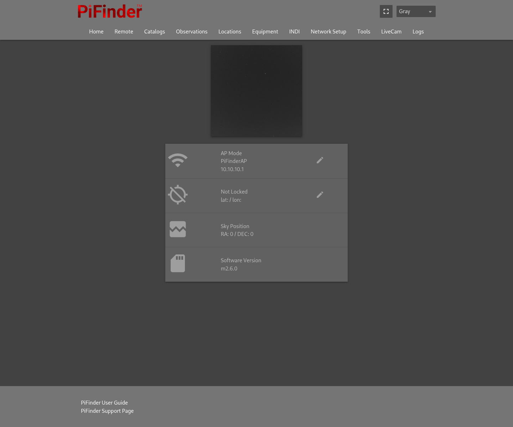

# MF PiFinder Additional Features

[English](mf_additional_features_en.md) | [한국어](mf_additional_features_ko.md)

This page is the user-facing index for features that MF PiFinder adds or
substantially extends beyond the original PiFinder project. Refer to each
linked document for design details, limitations, and validation status.

## Before using an extension

- Test mount control, alignment, and camera-calibration features indoors
  before connecting them to an observing setup.
- INDI mount control is optional and disabled by default.
- Treat experimental features separately from stable observing workflows and
  read their constraints before field use.

## Installation and platform

| Feature | Description | Documentation |
| --- | --- | --- |
| Bookworm 64-bit setup | Pi 4, Pi 5, and CM5 installation, services, and boot configuration | [Korean Bookworm guide](mf_bookworm_install_ko.md) |
| Board compatibility | Pi 4/Pi 5/CM5 SPI, UART, and camera differences | [Korean platform guide](mf_pifinder_rpi4_pi5_compatibility_ko.md) |
| AP+STA networking | Use an access point alongside an existing Wi-Fi connection | [Korean AP+STA guide](mf_wifi_apsta_ko.md) |
| Time synchronization | chronyd and GPS-based time management | [Korean time-sync guide](mf_time_sync_ko.md) |

## Web and catalogs

| Feature | Description | Documentation |
| --- | --- | --- |
| Red Night/PWA web UI | Mobile status, remote control, and tools | [Web catalog/UI design (Korean)](mf_web_catalogs_dev_ko.md) |
| Web catalogs | Catalog browsing, name search, object details, and sending an object to PiFinder | [Web catalog/UI design (Korean)](mf_web_catalogs_dev_ko.md) |
| Location catalog | Country, region, and city-assisted observing-location selection | [Location catalog (Korean)](mf_location_catalog_ko.md) |
| Offline cache | Pre-download star/catalog runtime data and POSS/SDSS images | [Cache guide](mf_cache_download_en.md) \| [한국어](mf_cache_download_ko.md) |
| Large-catalog loading | Faster initialization and searching for catalogs such as WDS | [Large catalog loading (Korean)](mf_large_catalog_lazy_load_ko.md) |

## Mount control and input

| Feature | Description | Documentation |
| --- | --- | --- |
| INDI/OnStepX | INDI connection, Sync, GoTo, manual movement, and backlash support | [INDI setup](mf_indi_mount_install_en.md) \| [한국어](mf_indi_mount_install_ko.md) |
| Mount operating modes | PiFinder, INDI, and SkySafari integration modes and constraints | [Mount-mode compatibility (Korean)](mf_mount_mode_compatibility_ko.md) |
| Multi-point alignment | Multi-point alignment workflow | [Alignment flow (Korean)](mf_multipoint_align_flow_ko.md) |
| Keypad and keyboard | LCD controls plus USB/Bluetooth HID input | [Input controls](mf_input_controls_en.md) \| [한국어](mf_input_controls_ko.md) |

## Imaging, solving, and observing aids

| Feature | Description | Documentation |
| --- | --- | --- |
| Cedar+SEP hybrid solving | Solver paths for light-pollution and star-detection conditions | [Hybrid solving (Korean)](mf_cedar_sep_hybrid_design_ko.md) |
| Cedar full-frame path | Full-frame detection as the primary solving path | [Full-frame implementation (Korean)](mf_sep_fullframe_impl_ko.md) |
| Automatic exposure | Star-count-based exposure control | [Automatic exposure (Korean)](mf_auto_exposure_methods_ko.md) |
| SQM and color correction | Sky-brightness measurements and sensor color correction | [SQM stack (Korean)](mf_sqm_stack_port_plan_ko.md) |
| LiveCam/live stacking | Web RAW preview and live stacking | [Live Stack research (Korean)](mf_live_stack_stabilization_research_ko.md) |
| IMU compass calibration | IMU orientation and compass calibration | [IMU calibration (Korean)](mf_imu_compass_calibration_ko.md) |

## Change and development references

- Current feature review and test priorities: [feature review checklist](mf_feature_review_checklist_en.md) \| [한국어](mf_feature_review_checklist_ko.md)
- Change history: [Korean change history](mf_change_history_ko.md)
- Upstream synchronization and patch reference: [Korean upstream reference](mf_upstream_patch_reference_ko.md)

When reporting an issue with an extension, include the board, PiFinder version,
mount/camera model, and steps that reproduce the result.
