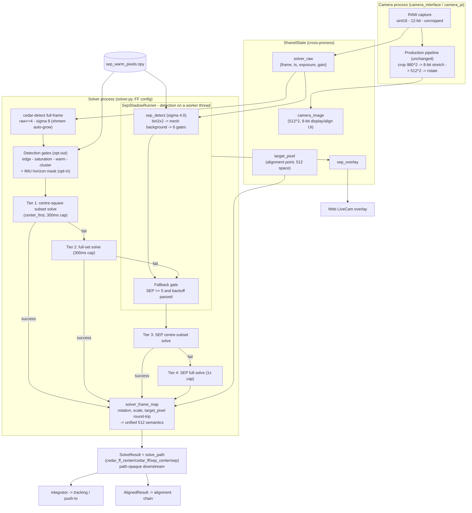

# cedar + SEP Hybrid Solving — Design Document

> Status: **living (design authority)** — update this document together with
> the code. Code baseline: 2026-08-04 (`solver.py` / `sep_detect.py` /
> `sep_shadow.py` / `solver_frame_map.py` / `sep_warm_map.py` /
> `horizon_mask.py`).
> 한국어판(정본): [mf_cedar_sep_hybrid_design_ko.md](mf_cedar_sep_hybrid_design_ko.md)
> — when the two diverge, the Korean version is authoritative.
>
> **Document topology** — four documents share this topic:
> - **This document**: the canonical description of the current design (what
>   it does and how). The single design authority.
> - [ADR m0023](../adr/m0023-cedar-sep-hybrid-solving.md): the architecture
>   decision and its rationale (why this structure). A decision record — not
>   updated.
> - [mf_sep_fullframe_impl_ko.md](mf_sep_fullframe_impl_ko.md): implementation
>   and tuning **history** (raw field measurements, tuning verdicts, §6).
>   Consult it when you need the source of a number.
> - [mf_cedar_sep_hybrid_solve_20260728_en.md](../mf_report/mf_cedar_sep_hybrid_solve_20260728_en.md)
>   (community post) / [mf_solver_3path_bench_20260801_en.md](../mf_report/mf_solver_3path_bench_20260801_en.md)
>   (bright-sky bench): summary and one-time measurements.
> - [mf_cedar_fullframe_primary_plan_ko.md](mf_cedar_fullframe_primary_plan_ko.md)
>   (switch plan, consumer inventory, decisions) /
>   [mf_solver_fullframe_field_test_20260803_ko.md](../mf_report/mf_solver_fullframe_field_test_20260803_ko.md)
>   (field-test report): the cedar full-frame primary track (adopted
>   2026-08-03; Korean only).
>
> The canonical owner of the auto-exposure architecture is
> [ax/camera.md](../ax/camera.md); the pointing chain is
> [ax/positioning.md](../ax/positioning.md). This document owns only the
> "detection → solve path selection" slice between them.

## 1. Goals and constraints

**Target condition** (maintainer decision 2026-07-28): a finder that solves
accurately under a sky where light pollution leaves only a handful of stars
visible. Under that condition the stock path (cedar-512) detected 0–1 stars
and scored 0% direct solves, while the SEP full-frame path carried the
entire solve load (measured: ADR m0023 table, 3-path bench).

**Design constraints** (invariants that apply everywhere):

| Constraint | How it is enforced |
| --- | --- |
| Production 512 path unchanged | The cedar path runs first on every attempt, byte-identical to stock. Upstream parity preserved |
| Downstream chain (tracking, alignment, push-to, SQM) unchanged | The SEP solution is converted into the existing coordinate semantics and delivered in the same message — downstream never knows which path solved |
| Experimental code cannot kill production | Every `sep_shadow` entry point logs and swallows exceptions (returns None) |
| No SD writes (outside explicit debugging) | Shadow CSV, dumps and logs all live on tmpfs (§12) |
| `sep` is an optional dependency | When missing, no import failure — the whole path degrades to None |

## 2. Architecture overview

A fallback hybrid: cedar has priority; when it fails, SEP takes over on
the *same attempt*, from the 12-bit uncropped original of the same
exposure. With `solver_cedar_fullframe`=on (this fork's operating
configuration, adopted 2026-08-03) the cedar primary also detects on the
uncropped original (raw>>4) and solves at native FOV; with
`solver_center_first`=on this becomes a coordinate-level four-tier
cascade (cedar centre-square -> cedar full -> SEP centre -> SEP full)
with the SEP detection running concurrently on a worker thread. With
both flags off the behaviour is byte-identical to the original two-tier
(cedar-512 -> SEP).

**Block diagram** — components and data channels:



`target_pixel` enters the production solve as-is and the SEP solve through
the `solver_frame_map` mapping; alignment updates flow through
`AlignedResult` only, on both paths (§8).

**Per-attempt data flow**:

```
Camera process (camera_interface / camera_pi)
  RAW capture (uint16, 12-bit, uncropped)
    ├─ set_solver_raw({frame, ts, exposure_us, gain})   ← SEP path input
    │    (published only when solver_shadow_detect ∨ solver_sep_fallback; rot90 only)
    └─ crop(980²) → 8-bit stretch → 512² → rotate → camera_image  ← production unchanged

Solver process (solver.py, per attempt — FF + center_first configuration)
  [detect] cedar-detect(solver_raw>>4, σ8, max_size 10, binned, hot)
        → gates: edge / saturation sample / warm map / cluster (solver_cedar_ff_gates)
        → IMU horizon mask: drop detections below 5° altitude (solver_horizon_mask, opt-in)
        ∥ concurrently on a worker thread: sep_shadow.detect(solver_raw)
        (no fresh solver_raw or cedar connection failure → that attempt uses the 512/tetra3 path)
  [tier 1] centre-square (min(h,w)²) subset solve — skipped when <4 stars or identical to full set
  [tier 2] on failure: full-set solve (both tiers native FOV, 300ms cap)
  [tiers 3-4] on failure ∧ SEP ≥ 5 ∧ backoff passed → join thread,
        SEP centre subset → SEP full set (sep_shadow.solve, 1s cap)
  [publish] SolveResult (+ solve_path) → integrator; overlay published once; one CSV row
        Centroids = post-gate in-crop count (preserves the AE's 512 semantics)
```

**How the full-frame cedar primary was adopted** (changing ADR m0023's
"deferred", user-approved 2026-08-03): the deferral was based on running it
*alone* (18% in bright sky); replacing only the primary while keeping the
SEP fallback captures the dark-sky gains (3x matches, 95% purity) with no
regression. Confirmed by the LP ascent-curve field test — cedar-FF solves
95-99% directly at background <= 62% of full scale, and the solve cliff
(>= 65-70%) is a physical limit independent of the path (see the field-test
report). The centre-first cascade is a user design (2026-08-04): the centre
subset improved RMSE 24 -> 13 arcsec on the dark-sky corpus (offline A/B).
Default-on plus the ADR revision wait for the formal dark-night A/B.

## 3. Frame spaces and coordinate mapping (`solver_frame_map.py`)

The heart of tracking integrity. Three coordinate spaces are distinguished:

| Space | Definition | Consumers |
| --- | --- | --- |
| **Rotated 512** (canonical) | crop → 512 resize → stage-5 rotation | Production solve, persisted `target_pixel`, alignment chain, SQM photometry |
| **Rotated full frame** | Same stage-5 rotation applied to the uncropped original | The space the SEP solve runs in |
| **Full frame (unrotated)** | `solver_raw` as published (rot90 only) | SEP detection, warm-pixel map, LiveCam overlay |

Design principle: **run the SEP solve in a frame with the same rotation as
production applied**, which makes RA/Dec/Roll and the alignment semantics
identical. Because the crop is centred and the resize isotropic, the
`target_pixel` transform between the two rotated spaces reduces to a
**"scale about the centre by crop_width/512"** — the rotations cancel
(proof in the module docstring).

- `stage5_rotation_deg(screen_direction, camera_rotation)`: with
  `camera_rotation` set, `(-rot) % 360`; otherwise screen_direction
  right/straight/flat3/as_bloom → 90°, else → 270°. The sign convention is
  pinned by tests against PIL `Image.rotate` (CCW, expand=False).
- `rotate_centroids`: quarter turns use the exact integer mapping with
  canvas dimensions swapped; arbitrary angles rotate about the canvas
  centre.
- `map_target_pixel_to_frame` / `map_frame_pixel_to_target`: forward and
  inverse of the centre-scale relation. Moves the alignment point between
  512 space and the rotated full frame.
- `fov_estimate_deg(width, crop_w)`: derived from the production
  calibration "cropped 980 px = 12°". imx462 full-frame width 23.5° (within
  the pattern DB's max_fov 30°).

**Verification**: `test_sep_fullframe_solve.py` — projects tetra3's own star
table through both paths and solves each → Roll deviation 0.000°, alignment
point deviation 20″ (plane-fit residual level). Regressed continuously in
the unit suite. Real-sky cross-check: both paths solving the same sky agree
on the alignment point within 1 px in 512 space (dual-solve test).

## 4. SEP detection pipeline (`sep_detect.detect_stars`)

Input: the `solver_raw` frame (uint16 mosaic/mono, any size). Output:
`SepDetection` — centroids in full-frame pixel coordinates (y, x), flux
descending, plus fluxes, background statistics and `masked_count`.

```
bin2x2 mean binning (float32, SNR ×2)               960×540 (imx462)
  → sep.Background(bw=32, bh=32) mesh estimate/subtract  ← removes LP gradients & cloud glow
  → sep.extract(thresh=σ, err=bkg.rms(),
                filter_kernel=3×3 gaussian, minarea=3)   ← threshold relative to local RMS + matched filter
  → quality gates (in order below)
  → top max_stars by flux, coordinates ×2+0.5 back to full frame
```

**Quality gates** — order and rationale (every threshold measured against
tetra3-matched ground truth; history: impl §6.1/§6.3/§6.5):

| # | Gate | Parameter (default) | What it removes |
| --- | --- | --- | --- |
| 1 | Saturation guard | interior (centre 1/2) median ≥ 0.98×full scale → return an **honest zero** | Edge junk on frames where thick cloud burned the sensor flat |
| 2 | Positive flux | flux > 0 | Background-model residue (zero/negative fluxes) |
| 3 | Edge margin | drop within 48 px (full-res) of the border | Vignetting / background-mesh edge artifacts |
| 4 | Point-source shape | semi-major finite ∧ ≤ 2.0 binned px ∧ npix ≤ 40 | Cloud texture (real stars: semi-major p95 0.86, npix p95 10; the headroom covers defocus) |
| 5 | Warm-pixel mask | drop within 4 px of a mapped position; report `masked_count` | Static sensor defects (§5). Applied **before** the top-N cap so defects cannot crowd out stars |
| 6 | Cluster | drop when > 1 neighbour within 50 px | "Detection clumps" from SEP deblending cloud edges (real stars at this plate scale are all isolated — 0 neighbours measured) |

σ is injected from config `solver_sep_sigma` (default **4.0**) — the
function-signature default of 3.5 is a library default, not the production
value. Rationale for σ4.0: the gates own purity (vs σ4.5, +20–40% real-star
recovery; purity after gates 66→91%) — impl §6.5 re-verdict.

## 5. Warm-pixel map (`sep_warm_map`, `sep_detect.build_warm_pixel_map`)

Introduced after measuring that over half of night-time detections were
static sensor defects (19 positions carried 55% of all detections, impl
§6.3). Found **directly in the raw domain**, not from detection recurrence:

- Candidate: exceeds the median of the 4 distance-2 neighbours (the
  same-Bayer-channel positions on a colour sensor; still a valid sparse
  neighbourhood on mono) by **+45 ADU**.
- Confirmed: recurs at the same position in **70%+ of corpus frames**.
  Stars move with the sky and leave within one frame interval; transient
  noise almost never repeats.
- Build: `python -m PiFinder.sep_warm_map <stage-dump dir>` →
  `~/PiFinder_data/sep_warm_pixels.npy` ((N,2) int, solver_raw
  orientation). Currently deployed map: 47 positions.

**Operating rules**: ① Rebuild from **dark corpora only** — mixing bright
twilight frames dilutes recurrence and drops legitimate warm pixels
(measured regression 57→40). ② Warm pixels grow with sensor age and
temperature; rebuild seasonally (cadence still open — ADR m0023 residual
operational item). ③ A missing/unloadable map just means no masking
(logged).

## 6. Runner and fallback policy (`sep_shadow.SepShadowRunner`)

### 6.1 Construction (`create_if_enabled`)

Created only when `solver_shadow_detect ∨ solver_sep_fallback`. Reads crop
geometry (→ crop_width, FOV) and bit depth (→ saturation guard 4095) from
the camera profile (`sqm/camera_profiles.py`), so there are no per-sensor
hardcoded constants. If the camera type is not shared yet, returns None and
the solver loop retries on a later attempt.

### 6.2 Freshness guard

`detect()` only uses a `solver_raw` younger than **15 s**
(`MAX_FRAME_AGE_S`) — so a stale frame from a wedged camera or a
just-disabled path is never mistaken for the current attempt.

### 6.3 Fallback trigger condition (combined with the solver.py wiring)

```
sep_run exists                        ← detect succeeded (fresh frame + sep available)
∧ fallback_enabled                    ← config solver_sep_fallback
∧ cedar-path solve failed (no RA)
∧ SEP detections ≥ min_fallback_stars(5)
∧ fallback_should_attempt(count)      ← backoff gate (§6.4)
```

Rationale for `min_fallback_stars=5`: in the σ4.5 sweep, half of the
genuine rescue solves carried only 5–7 detections (the old gate of 8 was
calibrated against σ3.5's junk-inflated counts), and no observed solve had
fewer than 5 (impl §6.5).

### 6.4 Backoff — avoiding wasted work, instant re-arm

A failed fallback solve burns up to solve_timeout (1 s) of solver CPU per
attempt. Indoors or under thick cloud, warm pixels and residual junk can
pass the gate on every attempt, so that cost would recur forever. Design:

- After n consecutive failures → skip the next `min(2ⁿ, 8)` attempts.
- **Two instant re-arm paths**: ① the SEP count jumps to **1.5×** the last
  failed attempt's (the signature of a cloud gap opening — measured: ≤5
  masked → ~30), ② a production solve succeeds (`note_solved()` — the sky
  is workable, so the next cedar failure deserves an immediate rescue try).

No delay at the moment rescue matters (stars reappearing); rest only on
hopeless scenes.

### 6.5 Fallback solve (`solve()`)

1. Rotate the centroids by the stage-5 angle (→ rotated full-frame canvas).
2. Map `target_pixel` from 512 space into the canvas; derive the FOV (§3).
3. `t3.solve_from_centroids(cents, canvas, fov_estimate, fov_max_error=fov/3,
   match_max_error=0.005, return_matches=True, target_pixel,
   target_sky_coord, solve_timeout=1000)`.
4. On success, map `y/x_target` **back into 512 space** (so the alignment
   chain in §8 consumes it unchanged).

Note: the production 512 solve calls the same tetra3 with
`fov_estimate 12.0 / fov_max_error 4.0` — the only parameter difference is
the FOV scale.

## 7. Solver wiring (`solver.py`)

Rules when feeding a fallback solution into the normal chain:

- **Strip `matched_centroids` / `matched_stars` / `matched_catID`**: these
  are in full-frame coordinates; letting them reach SQM photometry (which
  reads the 512 frame) would mix coordinate spaces. catID parallels the
  other two arrays, so it is removed with them for message consistency.
- **Publish `Centroids` (detection count) as the SEP count**: keeps the
  auto-exposure solve-hold (ADR m0022) anchored to "the exposure that
  actually solved". On cedar solves the cedar count is published as before.
- Success/failure message format and timing are unchanged — the integrator
  and everything downstream cannot distinguish the path (deliberate
  opacity).
- Any successful solve (either path) resets the backoff via `note_solved()`.
- **FF cedar solutions follow the same rule**: the matched-* trio is in
  full-frame coordinates, so it is stripped before SQM but kept aside for
  the overlay (`attach_canvas_matched` — the same rotated canvas space as
  SEP matches). `Centroids` publishes the **post-gate in-crop count** to
  preserve the auto-exposure's 512 semantics.
- **Timeout caps**: FF cedar tiers 300 ms (`CEDAR_FF_SOLVE_TIMEOUT_MS` —
  successful solves measure 9-26 ms; failing fast preserves SEP rescue
  opportunities), SEP fallback 1 s (`FALLBACK_SOLVE_TIMEOUT_MS`; a 500 ms
  cap was shelved for lack of clean evidence).
- **`SolveDiagnostics.solve_path`**: cedar_ff_center / cedar_ff /
  cedar_512 / sep_center / sep / tetra3 — diagnostics only (no downstream
  branching), exposed in `/api/solution`.

**Availability defence of the cedar tier itself** (independent of the
hybrid, same loop): on a cedar-detect-server connection failure
(`CedarConnectionError`), detection falls back to
`tetra3.get_centroids_from_image`. When logind's `RemoveIPC` deletes the
shared-memory segment, the `PFCedarDetectClient._del_shmem` override treats
the vanished segment as released and the same call retries with the image
inlined over gRPC — the inline fallback passes `detect_hot_pixels`
explicitly so detection quality is preserved (d1875e04, port of upstream
#548). The system-level prevention is the `RemoveIPC=no` drop-in written by
the setup scripts.

## 8. Hybrid alignment

Alignment follows the same priority. When cedar solves, the stock alignment
runs untouched (the fallback branch only executes after a cedar failure, so
priority is structural); when it cannot:

1. The solver passes the pending alignment coordinate
   `[[align_ra, align_dec]]` to `sep_shadow.solve(target_sky_coord=...)`.
2. tetra3 returns `y/x_target` in the rotated full-frame canvas.
3. `map_frame_pixel_to_target` maps it **back into 512 space**, and the
   normal alignment chain (`AlignedResult` → persisted `target_pixel`)
   consumes it — alignment storage format and config unchanged.

This is what makes alignment possible under the target sky (where cedar
cannot solve). Agreement of the two paths' alignment points (within 1 px in
512 space) is pinned by the dual-solve test. Precision verification on a
real telescope remains an operational item (§15).

## 9. Auto-exposure coupling

Canonical owner: [ax/camera.md](../ax/camera.md) §3b/§6b — only the contact
points here:

- On a successful fallback solve, `Centroids`=SEP count is published (§7) →
  the star-count controller's anchor trust (90 s trust window, ADR m0022)
  locks onto "the exposure that solved". Prevents exposure oscillation
  during cloud passage.
- Failed attempts still publish `Centroids`=cedar count (~0 under the
  target sky) — the no-solve recovery ladder depends on cedar blindness.
  Feeding the SEP count instead was shelved (side effect: suppressing the
  ladder during cloud, and the ladder is intentional exploration) —
  observation item.

## 10. Overlay and diagnostics channels

**LiveCam SEP overlay** — semantics: **green = a star confirmed by
whichever solver succeeded, via tetra3 matches** (by definition zero false
positives on solved frames); orange = unconfirmed candidate.

Publication lifecycle (race avoidance is the point): `detect()` only stores
the candidates inside the runner; after the solve outcome is known, the
matched subset is attached and the entry is published **exactly once per
attempt** via `publish_overlay()`. (Publishing candidates at detect time
raced the matched republish — the next attempt's detect overwrote it, so
the confirmed/candidate split almost never reached the screen.) Two
attachment paths: SEP solves un-rotate from the canvas; cedar solves map
512 → centre-scale → un-rotate (`attach_production_matched`).

**Shadow CSV** (`solver_shadow_log.csv`, tmpfs, opt-in): one A/B row per
attempt (`cedar_centroids, matches, solved, sep_centroids, sep_top_flux,
sep_bkg, sep_rms, sep_ms, fallback_used, fallback_rmse, sep_masked`, …).
On a schema change the old file is sidelined to `.old` and a fresh one
started (prevents mixed-width rows). Enable only for tuning sessions
(ADR m0023 §2).

**Diagnostic caveats** (lesson from the 3-path bench §5): the FOV in
`/api/solution` cannot distinguish cedar vs SEP (SEP solves also come out
near 11.46°), and `Centroids` is the SEP count on fallback solves. Identify
the path from logs/CSV or offline same-frame comparison. For live sigma
sweeps, never construct a second `PFCedarDetectClient` (shmem collision) —
connect over inline gRPC.

## 11. Safety and defence summary

| Layer | Defence | Behaviour on failure |
| --- | --- | --- |
| import | `sep` optional, lazy import | not installed → whole path None, one warning |
| every runner entry point | try/except, log and swallow | experiment errors cannot reach the production solver |
| frame | freshness 15 s, saturation guard | stale/burned frames honestly ignored / zero |
| detection | 6 gates (§4) | junk cannot pollute the fallback gate or overlay |
| solve | backoff (§6.4) | no CPU burn on hopeless scenes |
| final | tetra3 pattern-match rejection | fake centroids simply do not solve — zero false solves measured across both nights |
| coordinates | matched_* stripped, explicit per-space mappings | full-frame coordinates cannot leak into 512-space consumers (SQM etc.) |

## 12. Configuration and storage policy

| Key | Default | Meaning |
| --- | --- | --- |
| `solver_sep_fallback` | **true** | SEP fallback solving (+ triggers `solver_raw` publication) |
| `solver_cedar_fullframe` | false* | cedar primary on the uncropped raw at native FOV (off = byte-identical 512 path) |
| `solver_cedar_ff_gates` | **true** | FF detection quality gates (edge / saturation / warm map / cluster) |
| `solver_horizon_mask` | false | IMU horizon mask (drop detections below 5° altitude) — per-site opt-in |
| `solver_center_first` | false* | centre-square-first 4-tier cascade + parallel SEP detection |
| `solver_sep_sigma` | **4.0** | SEP extraction threshold (σ, units of local background RMS) |
| `solver_shadow_detect` | **false** | Shadow A/B CSV — opt-in for tuning sessions |
| `camera_auto_dump` | false | Auto stage dump on 10 consecutive solve failures, 3-min cooldown (automatic corpus collection) |

All require a restart. Entries marked * switch to default-on once the
formal dark-night validation passes (plan doc §5). `solver_raw`
publication is needed whenever any of shadow / fallback / FF is in use.

Storage policy (maintainer decision 2026-07-28): CSV, app logs and stage
dumps all on **tmpfs**. Dumps rotate at the 30 most recent sets (~270 MB).
Lost on power-off — preserve via the web Logs "Save to SD" or the
`/api/camera/stages` download. Only the warm-pixel map
(`sep_warm_pixels.npy`) lives in the persistent data directory.

## 13. Performance and accuracy characteristics (measured)

Sources for all numbers: impl §6, ADR m0023, 3-path bench. Representative
values only.

| Condition | cedar-512 alone | Hybrid |
| --- | --- | --- |
| Target LP sky (07-28 twilight, 08-01 bright night) | direct solves **0%** | **88–98%** (SEP carried everything) |
| Dark-sky 40-min mixed session (07-29) | 1,919 solves | +1,711 SEP rescues = **95%** |
| Good sky, 5 min (07-29) | mostly direct | **100%** (cedar takes priority back — designed behaviour) |

- **Accuracy**: dark night / twilight 1σ 7–17″ (~0.3 px at the 44″/px plate
  scale). A bright-background night (p50 87%) measured 1σ ≈ 1′, p95 ≈ 2.6′
  — an SNR effect, still ample for a finder (eyepiece FOV 0.5–1°).
  Re-measuring with AE on is worthwhile (bench §4).
- **Cost**: SEP detection ~143 ms (with CPU contention; lower without),
  ~280 ms total per fallback attempt (including the failed cedar tier),
  live attempt cadence med 439 ms ≈ 2.3 Hz. cedar-512 detection alone is
  6–14 ms — why tier 1 is cheap and why it goes first.
- **Purity**: 60–91% on solved frames after gates (varies with sky
  brightness). The gates own purity; tetra3 owns final truth (zero false
  solves).

## 14. Tests

| Test | What it verifies |
| --- | --- |
| `test_sep_detect.py` | detection, binning, coordinates; PIL rotation convention pinned; target_pixel mapping; edge/saturation filters |
| `test_sep_fullframe_solve.py` | dual-path solve equivalence (Roll 0°, alignment point 20″) — the standing regression for coordinate integrity |
| `test_auto_exposure_starcount.py` | full exposure controller incl. anchor trust (coupling §9) |
| `test_camera_stage_dump.py` | lossless stage saving and rotation |
| `test_solver_cedar_client.py` | shmem-loss recovery (RemoveIPC) — uses a test-only segment name |

## 15. Known limitations and deferred decisions

1. **Accuracy degrades on bright backgrounds** (1σ ~1′, bench 3.3) —
   physical SNR limit. Re-measurement with AE on planned.
2. **Failed attempts publish `Centroids`=cedar count** — the AE recovery
   ladder depends on cedar blindness (§9). Re-evaluate with long clear-sky
   data.
3. ~~Full-frame cedar deferred~~ → **adopted as the primary** (2026-08-03,
   §2). Remaining: the formal dark-night offline A/B, then default-on and
   the ADR m0023 revision.
4. **shared_memory frame transport deferred** — the bottleneck is detection
   sensitivity, not IPC. Start conditions: field exposures dropping to a
   few hundred ms, or more large-frame consumers (impl §7-6).
5. **Motion-during-exposure solve gate unwired** — a separate issue
   predating the hybrid
   ([mf_solve_motion_gate_review_en.md](mf_solve_motion_gate_review_en.md),
   pending decision). The SEP path uses the same exposure, so it applies
   equally.
6. **Operational residue** (ADR m0023): alignment/push-to precision on a
   real telescope; warm-pixel map rebuild cadence.
