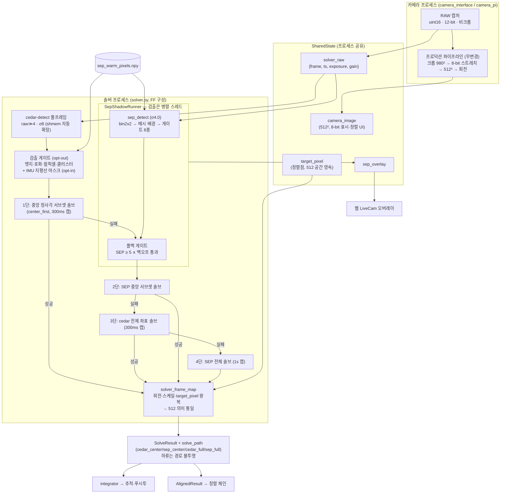

# cedar + SEP 하이브리드 솔빙 — 설계 문서

> 상태: **living(설계 정본)** — 코드가 바뀌면 이 문서를 함께 갱신한다.
> 코드 기준일: 2026-08-12 (`solver.py` / `sep_detect.py` / `sep_shadow.py` /
> `solver_frame_map.py` / `sep_warm_map.py` / `horizon_mask.py`).
> English version: [mf_cedar_sep_hybrid_design_en.md](mf_cedar_sep_hybrid_design_en.md)
>
> **문서 지형** — 이 주제는 문서 4종이 역할을 나눈다:
> - **이 문서**: 현재 설계의 정규 기술(무엇이 어떻게 동작하는가). 유일한
>   설계 권위.
> - [ADR m0023](../adr/m0023-cedar-sep-hybrid-solving.md): 아키텍처 결정과 근거
>   (왜 이 구조인가). 결정 기록이므로 갱신하지 않는다.
> - [mf_sep_fullframe_impl_ko.md](mf_sep_fullframe_impl_ko.md): 구현·튜닝
>   **이력**(실측 원자료, 튜닝 판정 경위 §6). 수치의 출처가 필요할 때 참조.
> - [mf_cedar_sep_hybrid_solve_20260728_ko.md](../mf_report/mf_cedar_sep_hybrid_solve_20260728_ko.md)
>   (커뮤니티 공지) / [mf_solver_3path_bench_20260801_ko.md](../mf_report/mf_solver_3path_bench_20260801_ko.md)
>   (밝은 하늘 벤치): 요약·1회성 실측.
> - [mf_cedar_fullframe_primary_plan_ko.md](mf_cedar_fullframe_primary_plan_ko.md)
>   (전환 계획·소비처 인벤토리·결정 기록) /
>   [mf_solver_fullframe_field_test_20260803_ko.md](../mf_report/mf_solver_fullframe_field_test_20260803_ko.md)
>   (풀프레임 실측 리포트): cedar 풀프레임 1차 전환 트랙(2026-08-03 채택).
>
> 자동 노출 아키텍처의 정규 소유자는 [ax/camera.md](../ax/camera.md),
> 포인팅 체인은 [ax/positioning.md](../ax/positioning.md). 이 문서는 그 사이의
> "검출→솔브 경로 선택"만 소유한다.

## 1. 목표와 제약

**목표 조건** (사용자 결정 2026-07-28): 광해로 별이 몇 개만 보이는 하늘에서
정확하게 솔빙되는 파인더. 이 조건에서 기존 경로(cedar-512)는 검출 0–1개로
직접 솔브 0%였고, SEP 풀프레임 경로가 솔브 전량을 담당한다(실측: ADR m0023
표, 3경로 벤치).

**설계 제약** (전 구간에 적용되는 불변 조건):

| 제약 | 구현 방식 |
| --- | --- |
| 프로덕션 512 경로 보존 | `solver_cedar_fullframe`=off이면 cedar 경로는 기존과 바이트 동일하게 실행되어 즉시 롤백할 수 있다. **기본 on에서는 cedar 1차가 비크롭 12-bit 원본(>>4)을 네이티브 FOV로 솔브**한다. 어느 쪽이든 SEP 폴백·하류 계약은 동일 |
| 하류 체인(추적·정렬·푸시투·SQM) 무변경 | SEP 솔루션을 기존 좌표 의미로 환산해 같은 메시지로 공급 — 하류는 어느 경로가 풀었는지 모른다 |
| 실험 코드는 프로덕션을 죽일 수 없다 | `sep_shadow`의 모든 진입점이 예외를 로그 후 삼킴(None 반환) |
| SD 쓰기 금지(명시적 디버깅 제외) | 섀도 CSV·덤프·로그 전부 tmpfs (§12) |
| `sep`은 선택 의존성 | 미설치 시 import 실패 없이 전 경로 무해화(None) |

## 2. 아키텍처 개요

폴백 하이브리드: cedar가 우선하고, 실패한 그 시도에서 SEP이 같은 노출의
12-bit 비크롭 원본으로 이어받는다. `solver_cedar_fullframe`=on(이 포크의
운용 구성, 2026-08-03 채택)이면 cedar 1차도 비크롭 원본(raw≫4)을 네이티브
FOV로 솔브하고, `solver_center_first`=on이면 좌표 레벨 4단 캐스케이드
(**cedar-중앙 정사각 → SEP-중앙 정사각 → cedar-전체 → SEP-전체**)가 되며
SEP 검출은 최초 cedar 중앙 단과 워커 스레드로 병렬 실행된다. 검출기보다
프레임 영역을 우선한다. 두 플래그 모두 off면 기존
2계층(cedar-512 → SEP)과 바이트 동일하다.

**블록 다이어그램** — 컴포넌트·데이터 채널 관점:



`target_pixel`은 프로덕션 솔브에는 그대로, SEP 솔브에는 `solver_frame_map`
매핑을 거쳐 들어가고, 정렬 갱신은 두 경로 모두 `AlignedResult`를 통해서만
이뤄진다(§8).

**시도별 데이터 흐름**:

```
카메라 프로세스 (camera_interface / camera_pi)
  RAW 캡처(uint16, 12-bit, 비크롭)
    ├─ set_solver_raw({frame, ts, exposure_us, gain})   ← SEP 경로 입력
    │    (solver_shadow_detect ∨ solver_sep_fallback일 때만 발행, rot90만 적용)
    └─ 크롭(980²) → 8-bit 스트레치 → 512² → 회전 → camera_image  ← 프로덕션 무변경

솔버 프로세스 (solver.py, 시도마다 — FF+center_first 구성 기준)
  [검출] cedar-detect(solver_raw≫4, σ8, max_size 10, binned, hot)
         → 게이트: 엣지·포화 샘플·웜픽셀·클러스터 (solver_cedar_ff_gates)
         → IMU 지평선 마스크: 고도 < 5° 검출 제거 (solver_horizon_mask, opt-in)
         ∥ 동시에 워커 스레드: sep_shadow.detect(solver_raw)
         (신선한 solver_raw 부재/cedar 연결 실패 시 그 시도만 512/tetra3 폴백)
  [1단] 중앙 정사각(min(h,w)²) 서브셋 솔브 — 4개 미만 or 전체와 동일하면 스킵
  [2단] 실패 ∧ SEP ≥ 5 ∧ 백오프 통과 → 스레드 join 후 SEP 중앙 서브셋
  [3단] 두 중앙 경로 실패 시에만 cedar 전체 좌표 솔브 (300ms 캡)
  [4단] 다시 실패하면 SEP 전체 (sep_shadow.solve, 1s 캡)
  [발행] SolveResult(+ solve_path) → integrator, 오버레이 1회 게시, CSV 1행
         Centroids = 게이트 후 크롭 창 내 검출 수 (AE 512 의미 보존)
```

**cedar 풀프레임 1차 채택 경위** (ADR m0023의 "보류"에서 변경, 2026-08-03
사용자 승인): 보류 사유였던 "밝은 하늘 18%"는 1차 **단독** 운용 기준이었고,
SEP 폴백을 유지한 채 1차만 교체하면 회귀 없이 어두운 하늘 이득(매치 3배·
순도 95%)을 얻는다는 판단. 광해 상승 곡선 실측으로 확인 — 배경 ≤62%에서
cedar-FF 직접 95–99%, 절벽(≥65–70%)은 물리 한계로 경로 무관
(실측 리포트 참조). 중앙 우선 캐스케이드는 사용자 설계(2026-08-04):
중앙 서브셋이 어두운 하늘에서 RMSE 24→13″(오프라인 A/B). 정식 어두운 밤
A/B와 2026-08-12 실기 재검증을 근거로 풀프레임·중앙 우선 플래그를 기본
on으로 전환했다. 같은 날 사용자 기준을 명확히 반영해 **모든 중앙 경로를
모든 전체 경로보다 우선**하도록 순서를 바꿨다. 이유는 상·하단의 광학 왜곡,
지평선 광해와 장애물이 패턴 오류를 일으킨다는 실기 관찰이며, 전체 프레임은
중앙 두 경로가 모두 실패했을 때만 쓰는 최후 수단이다. off 롤백 경로는
그대로 보존한다.

## 3. 프레임 공간과 좌표 정합 (`solver_frame_map.py`)

추적 무결성의 핵심. 세 좌표 공간을 구분한다:

| 공간 | 정의 | 사용처 |
| --- | --- | --- |
| **회전된 512** (정규) | 크롭→512 리사이즈→stage-5 회전 | 프로덕션 솔브, `target_pixel` 영속, 정렬 체인, SQM 측광 |
| **회전된 풀프레임** | 비크롭 원본에 같은 stage-5 회전 적용 | SEP 솔브가 수행되는 공간 |
| **풀프레임(무회전)** | `solver_raw` 그대로 (rot90만) | SEP 검출·웜픽셀 맵·LiveCam 오버레이 |

설계 원리: **SEP 솔브를 프로덕션과 같은 회전이 적용된 공간에서 수행**하면
RA/Dec/Roll과 정렬 의미가 동일해진다. 크롭이 중심 대칭이고 리사이즈가
등방이므로, 두 회전된 공간 사이의 `target_pixel` 변환은 회전이 상쇄되어
**"중심 기준 ×(crop_width/512) 스케일"**로 환원된다(모듈 docstring에 증명).

- `stage5_rotation_deg(screen_direction, camera_rotation)`: `camera_rotation`
  설정 시 `(-rot) % 360`, 아니면 screen_direction
  right/straight/flat3/as_bloom → 90°, 기타 → 270°. PIL `Image.rotate`
  (CCW, expand=False)와의 부호 규약은 테스트로 고정.
- `rotate_centroids`: 90° 배수는 캔버스 치수를 교환하는 정수 정확 매핑,
  임의각은 캔버스 중심 회전.
- `map_target_pixel_to_frame` / `map_frame_pixel_to_target`: 위 중심-스케일
  관계의 정/역방향. 정렬점을 512 공간 ↔ 회전된 풀프레임으로 오간다.
- `fov_estimate_deg(width, crop_w)`: 프로덕션 캘리브레이션 "크롭 980px =
  12°"에서 산출. imx462 풀프레임 가로 23.5° (패턴 DB max_fov 30° 이내).

**검증**: `test_sep_fullframe_solve.py` — tetra3 자체 별표를 두 경로로 각각
투영·솔브 → Roll 편차 0.000°, 정렬점 편차 20″(평면 피팅 잔차 수준). unit
스위트 상시 회귀. 실하늘 교차검증: 두 경로 동일 하늘 솔브 시 정렬점 512공간
1px 이내(듀얼솔브 테스트).

## 4. SEP 검출 파이프라인 (`sep_detect.detect_stars`)

입력: `solver_raw` 프레임(uint16 모자이크/모노, 임의 크기). 출력:
`SepDetection` — 풀프레임 픽셀 좌표 (y, x) 센트로이드(플럭스 내림차순),
플럭스, 배경 통계, `masked_count`.

```
bin2x2 평균 비닝 (float32, SNR ×2)                960×540 (imx462)
  → sep.Background(bw=32, bh=32) 메시 배경 추정·차감   ← 광해 그라디언트·구름 글로우 제거
  → sep.extract(thresh=σ, err=bkg.rms(),
                filter_kernel=3×3 가우시안, minarea=3)  ← 국소 RMS 상대 임계 + 매치드 필터
  → 품질 게이트 (아래 순서대로)
  → 플럭스 상위 max_stars, 좌표 ×2+0.5로 풀프레임 환산
```

**품질 게이트** — 순서와 근거 (임계는 전부 tetra3 매치 실측 대비 도출,
경위: impl §6.1/§6.3/§6.5):

| # | 게이트 | 파라미터(기본) | 걸러내는 것 |
| --- | --- | --- | --- |
| 1 | 포화 가드 | 내부(중앙 1/2) 중앙값 ≥ 0.98×풀스케일 → **정직한 0** 반환 | 두꺼운 구름이 센서를 태운 프레임의 가장자리 잡음 |
| 2 | 양성 플럭스 | flux > 0 | 배경 모델 잔재(0·음수 플럭스) |
| 3 | 가장자리 마진 | 경계 48px(풀해상도) 이내 제외 | 비네팅·배경 메시 경계 아티팩트 |
| 4 | 점광원 형태 | 장축 유한 ∧ ≤ 2.0 비닝px ∧ npix ≤ 40 | 구름 텍스처(실별 장축 p95 0.86, npix p95 10; 여유분은 디포커스 헤드룸) |
| 5 | 웜픽셀 마스크 | 맵 위치 반경 4px 이내 제거, `masked_count` 보고 | 센서 정적 결함 (§5). top-N 캡 **이전**에 적용 — 결함이 실별을 밀어내지 못하게 |
| 6 | 클러스터 | 반경 50px 내 이웃 > 1이면 제거 | 구름 에지를 SEP이 디블렌딩한 "검출 뭉텅이" (실별은 이 배율에서 전원 고립 — 이웃 0 실측) |

σ는 config `solver_sep_sigma`(기본 **4.0**)로 주입 — 함수 시그니처 기본값
3.5는 라이브러리 기본일 뿐 프로덕션 값이 아니다. σ4.0 채택 근거: 게이트가
순도를 담당(σ4.5 대비 실별 회수 +20–40%, 순도는 게이트 후 66→91%) — impl
§6.5 재판정.

## 5. 웜픽셀 맵 (`sep_warm_map`, `sep_detect.build_warm_pixel_map`)

야간 검출의 절반 이상이 센서 정적 결함이었다는 실측(19위치가 검출의 55%,
impl §6.3)에서 도입. **검출 재발이 아니라 raw 도메인에서 직접** 찾는다:

- 후보: 거리-2 이웃 4개(컬러 센서라면 동일 Bayer 채널 위치; 모노에서도
  희소 이웃으로 유효)의 중앙값 대비 **+45 ADU 초과**.
- 확정: 코퍼스 프레임의 **70%+에서 같은 위치 재발**. 별은 하늘과 함께
  이동해 한 프레임 간격에 빠져나가고, 순간 노이즈는 재발하지 않는다.
- 생성: `python -m PiFinder.sep_warm_map <스테이지덤프 디렉터리>` →
  `~/PiFinder_data/sep_warm_pixels.npy` ((N,2) int, solver_raw 방향).
  현행 배포 맵 47위치.

**운영 규칙**: ① 재생성은 **어두운 코퍼스로만** — 밝은 박명 프레임이 섞이면
재발률 희석으로 정당한 웜픽셀이 탈락(57→40 퇴보 실측). ② 웜픽셀은 센서
노화·온도로 늘어나므로 시즌마다 재생성 권장(주기는 미확정 — ADR m0023 잔여
운영 항목). ③ 맵 부재/로드 실패는 마스킹 없이 동작(로그만).

## 6. 러너와 폴백 정책 (`sep_shadow.SepShadowRunner`)

### 6.1 구성 (`create_if_enabled`)

`solver_shadow_detect ∨ solver_sep_fallback`일 때만 생성. 카메라
프로파일(`sqm/camera_profiles.py`)에서 크롭 기하(→ crop_width, FOV)와 비트
깊이(→ 포화 가드 4095)를 읽으므로 센서별 상수 하드코딩이 없다. 카메라 타입
공유 전이면 None → 솔버 루프가 다음 시도에 재생성 시도.

### 6.2 신선도 가드

`detect()`는 `solver_raw`가 **15초 이내**일 때만 사용(`MAX_FRAME_AGE_S`).
카메라 wedge나 경로 비활성화 직후의 낡은 프레임을 현재 시도로 오인하지
않기 위함.

### 6.3 폴백 발동 조건 (solver.py 배선과 합쳐서)

```
sep_run 존재                          ← detect 성공 (신선한 프레임 + sep 가용)
∧ fallback_enabled                    ← config solver_sep_fallback
∧ cedar 경로 솔브 실패 (RA 없음)
∧ SEP 검출 수 ≥ min_fallback_stars(5)
∧ fallback_should_attempt(검출 수)    ← 백오프 게이트 (§6.4)
```

`min_fallback_stars=5`의 근거: σ4.5 스윕에서 실별 구제 솔브의 절반이 검출
5–7개였고(예전 게이트 8은 σ3.5의 잡음 인플레이션 기준), 5 미만 솔브는 관측
0 (impl §6.5).

### 6.4 백오프 — 헛수고 방지와 즉시 재무장

실패한 폴백 솔브는 시도당 최대 solve_timeout(1 s)의 솔버 CPU를 태운다.
실내·두꺼운 구름에서는 웜픽셀·잔여 오검출로 게이트를 매번 통과할 수 있어
그 비용이 무한 반복된다. 설계:

- 연속 실패 n회 → 다음 `min(2ⁿ, 8)`회 시도를 스킵.
- **즉시 재무장 2경로**: ① SEP 검출 수가 마지막 실패 시의 **1.5배**로
  점프(구름 틈이 열리는 시그니처 — 실측: 마스크 후 ≤5 → ~30), ② 프로덕션
  솔브 성공(`note_solved()` — 하늘이 풀리는 상태이므로 다음 cedar 실패는
  즉시 구제 시도).

구제가 필요한 순간(별이 다시 보임)에 지연이 없고, 가망 없는 장면에서만
쉰다.

### 6.5 폴백 솔브 (`solve()`)

1. 센트로이드를 stage-5 회전각으로 회전 (→ 회전된 풀프레임 캔버스).
2. `target_pixel`을 512 공간 → 캔버스로 매핑, FOV 산출 (§3).
3. `t3.solve_from_centroids(cents, canvas, fov_estimate, fov_max_error=fov/3,
   match_max_error=0.005, return_matches=True, target_pixel, target_sky_coord,
   solve_timeout=1000)`.
4. 성공 시 `y/x_target`을 **512 공간으로 역매핑**(§8 정렬 체인이 그대로
   소비하도록).

참고: 프로덕션 512 솔브는 `fov_estimate 12.0 / fov_max_error 4.0`으로 같은
tetra3를 호출한다 — 파라미터 차이는 FOV 스케일뿐.

## 7. 솔버 배선 (`solver.py`)

폴백 솔루션을 정규 체인에 공급할 때의 규칙:

- **`matched_centroids` / `matched_stars` / `matched_catID` 제거**: 이들은
  풀프레임 좌표라서, 512 프레임을 읽는 SQM 측광에 섞이면 좌표 공간이
  오염된다. catID는 나머지 둘과 배열이 평행하므로 함께 제거해 메시지
  일관성 유지.
- **`Centroids`(검출 수)는 SEP 검출 수로 발행**: 자동 노출의 솔브
  홀드(ADR m0022)가 "실제로 솔브된 노출"에 앵커되도록. cedar 솔브 시에는
  기존대로 cedar 수.
- 성공/실패 메시지 형식·타이밍은 기존과 동일 — integrator 이하 하류는
  경로를 구분할 수 없다(의도된 불투명성).
- 솔브 성공(어느 경로든) 시 `note_solved()`로 백오프 리셋.
- **FF cedar 솔루션도 같은 규칙**: matched-* 3종은 풀프레임 좌표라 SQM 앞에서
  제거하되 오버레이용으로만 따로 보관(`attach_canvas_matched` — SEP 매치와
  같은 회전 캔버스 공간). `Centroids`는 **게이트 후 크롭 창 내 검출 수**로
  발행해 AE의 512 의미를 보존한다.
- **타임아웃 캡**: FF cedar 단 300ms(`CEDAR_FF_SOLVE_TIMEOUT_MS` — 성공
  솔브 실측 9–26ms, 실패 시 빠른 포기로 SEP 기회 보존), SEP 폴백
  1s(`FALLBACK_SOLVE_TIMEOUT_MS` — 500ms 캡은 실측 근거 미확보로 보류).
- **`SolveDiagnostics.solve_path`**: `cedar_center` / `sep_center` /
  `cedar_full` / `sep_full` — 기본 4단 경로. 이름은 검출 입력이 아니라 실제
  솔빙에 사용한 영역을 나타낸다. 레거시 롤백 모드는 `cedar_512`, Cedar
  서버 불가 모드는 `tetra3`. 진단 전용(하류 분기 금지), `/api/solution` 노출.

**cedar 1차 경로 자체의 가용성 방어** (하이브리드와 독립이지만 같은 루프):
cedar-detect-server 연결 실패(`CedarConnectionError`) 시
`tetra3.get_centroids_from_image`로 검출 폴백. logind `RemoveIPC`가 공유
메모리 세그먼트를 지운 경우 `PFCedarDetectClient._del_shmem` 오버라이드가
소실을 해제로 간주하고 같은 호출을 이미지 인라인(gRPC)으로 재시도 —
인라인 폴백에도 `detect_hot_pixels`를 명시 전달해 검출 품질을 유지한다
(d1875e04, 업스트림 #548 이식). 시스템 차원 예방은 설치 스크립트의
`RemoveIPC=no` 드롭인.

## 8. 하이브리드 정렬

정렬(align)도 같은 우선순위를 따른다. cedar가 풀면 기존 정렬 그대로
(폴백 분기는 cedar 실패 시에만 진입하므로 우선순위가 구조적으로 보장),
못 풀면:

1. 솔버가 보류 중인 정렬 좌표 `[[align_ra, align_dec]]`를
   `sep_shadow.solve(target_sky_coord=...)`로 전달.
2. tetra3가 회전된 풀프레임 캔버스에서 `y/x_target`을 반환.
3. `map_frame_pixel_to_target`으로 **512 공간에 역매핑** 후 정규 정렬
   체인(`AlignedResult` → `target_pixel` 영속)에 공급 — 정렬 저장 형식·
   config 무변경.

이로써 목표 하늘(cedar 불능)에서 정렬이 가능하다. 두 경로의 정렬점 일치
(512공간 1px 이내)는 듀얼솔브 테스트로 고정. 실망원경 정밀 검증은 운영
잔여 항목(§15).

## 9. 자동 노출 연동

정규 소유자는 [ax/camera.md](../ax/camera.md) §3b/§6b — 여기서는 접점만:

- 폴백 솔브 성공 시 `Centroids`=SEP 수 발행(§7) → 별 수 컨트롤러의 앵커
  트러스트(90 s 신뢰 창, ADR m0022)가 "솔브된 노출"에 고정된다. 구름
  통과 중 출렁임 방지.
- 실패 시도의 `Centroids`는 여전히 cedar 수(목표 하늘에서 ~0) — 무솔브
  구간의 회복 사다리가 cedar 실명에 의존한다. SEP 수 공급안은 "구름 중
  사다리 억제" 부작용으로 보류(사다리는 의도된 탐색) — 관찰 항목.

## 10. 오버레이·진단 채널

**LiveCam SEP 오버레이** — 의미론: **초록 = 어느 경로든 솔버가 tetra3
매치로 확정한 별**(솔브 프레임에선 정의상 오인 0), 주황 = 미확정 후보.

발행 수명주기(경합 방지가 요점): `detect()`가 후보를 러너 내부에 보관만
하고, 솔브 결과 확정 후 매치 정보를 부착해 **시도당 정확히 1회**
`publish_overlay()`로 게시한다. (후보를 detect 시점에 게시하면 다음 시도의
detect가 덮어써 확정/후보 구분이 화면에 못 닿는다 — 수정된 경합.)
매치 좌표 부착 경로 2종: SEP 솔브는 캔버스→역회전, cedar 솔브는 512→
중심-스케일 매핑→역회전 (`attach_production_matched`).

**섀도 CSV** (`solver_shadow_log.csv`, tmpfs, opt-in): 시도당 1행의 A/B
비교 (`cedar_centroids, matches, solved, sep_centroids, sep_top_flux,
sep_bkg, sep_rms, sep_ms, fallback_used, fallback_rmse, sep_masked` 등).
스키마 변경 시 기존 파일을 `.old`로 밀어내고 새로 시작(혼합 폭 방지).
튜닝 세션에만 켠다(ADR m0023 §2).

**API 단계별 진단(2026-08-12)**: `/api/solution`은 `solve_path`와 함께 다음
검출 수를 노출한다. SEP 구제 성공 시 기존 `Centroids`가 SEP 수로 바뀌어
Cedar 상태를 숨기던 문제를 해결한 관측 전용 필드이며, 하류 제어에는 쓰지
않는다.

| 필드 | 의미 |
| --- | --- |
| `CedarRawCentroids` | 풀프레임 Cedar 원검출 수 |
| `CedarGatedCentroids` | 품질·지평선 게이트 후 Cedar 수 |
| `CedarCenterCentroids` | 중앙 정사각 1단에 투입된 Cedar 수 |
| `SepCentroids` | 같은 프레임의 SEP 게이트 후 검출 수 |

필드가 없는 구버전 메시지와 Cedar/SEP가 실행되지 않은 경로는 `null`로
직렬화한다. 기존 `Centroids` 의미와 자동 노출 동작은 호환성을 위해
변경하지 않았다. 따라서 경로 판별은 `solve_path`, 단계별 검출 병목은 위
네 필드로 직접 확인한다. 라이브 sigma 스윕 시에는
`PFCedarDetectClient` 새 인스턴스 생성 금지(shmem 충돌) — gRPC 인라인으로
접속한다.

**경로 명칭 변경(2026-08-12)**: 종전 `cedar_ff_center`는 풀프레임 원본에서
검출했더라도 중앙 좌표만 솔빙에 사용하므로 `cedar_center`로 변경했다.
같은 원칙으로 `cedar_ff`→`cedar_full`, `sep`→`sep_full`로 명시화했다.
`ff`는 검출 구현과 솔빙 영역을 혼동시키므로 경로 이름에서 사용하지 않는다.

## 11. 안전·방어 설계 요약

| 층 | 방어 | 실패 시 동작 |
| --- | --- | --- |
| import | `sep` 선택 의존성, lazy import | 미설치 → 전 경로 None, 경고 1회 |
| 러너 진입점 전부 | try/except 로그 후 삼킴 | 실험 오류가 프로덕션 솔버에 전파 불가 |
| 프레임 | 신선도 15 s, 포화 가드 | 낡은/탄 프레임에 정직한 무시/0 |
| 검출 | 게이트 6종 (§4) | 오검출이 폴백 게이트·오버레이 오염 방지 |
| 솔브 | 백오프 (§6.4) | 가망 없는 장면의 CPU 소진 방지 |
| 최종 | tetra3 패턴 매칭 기각 | 가짜 센트로이드로는 솔브 자체가 안 됨 — 양일 야간 오솔브 0 실측 |
| 좌표 | matched_* 제거, 공간별 명시 매핑 | 풀프레임 좌표가 512 소비자(SQM 등)에 유입 불가 |

## 12. 설정·저장 정책

| 키 | 기본 | 의미 |
| --- | --- | --- |
| `solver_sep_fallback` | **true** | SEP 폴백 솔브 (+`solver_raw` 발행 트리거) |
| `solver_cedar_fullframe` | **true** | cedar 1차를 비크롭 원본·네이티브 FOV로 (off=기존 512 바이트 동일 롤백) |
| `solver_cedar_ff_gates` | **true** | FF 검출 품질 게이트 (엣지·포화·웜픽셀·클러스터) |
| `solver_horizon_mask` | false | IMU 지평선 마스크 (고도<5° 검출 제거) — 관측지 스카이라인별 opt-in |
| `solver_center_first` | **true** | 전역 중앙 우선 4단(Cedar 중앙→SEP 중앙→Cedar 전체→SEP 전체) + SEP 병렬 검출 |
| `solver_sep_sigma` | **4.0** | SEP 추출 임계(σ, 국소 배경 RMS 단위) |
| `solver_shadow_detect` | **false** | 섀도 A/B CSV — 튜닝 세션 opt-in |
| `camera_auto_dump` | false | 솔브 10연속 실패 시 3분 쿨다운 스테이지 덤프(자동 코퍼스 수집) |

모두 재시작 필요. 풀프레임·중앙 우선 기본화는 2026-08-12 적용했으며
각 플래그를 off로 바꾸면 이전 경로로 롤백된다. `solver_raw` 발행은 shadow/fallback/FF 어느 하나라도
쓰면 필요하다.

저장 정책(2026-07-28 사용자 결정): CSV·앱 로그·스테이지 덤프 전부
**tmpfs**. 덤프는 최근 30세트(~270 MB) 로테이션. 전원 차단 시 소실 —
보존은 웹 Logs "Save to SD" 또는 `/api/camera/stages` 다운로드로만.
웜픽셀 맵(`sep_warm_pixels.npy`)만 영속 데이터 디렉터리에 있다.

## 13. 성능·정확도 특성 (실측 요약)

수치의 원출처: impl §6, ADR m0023, 3경로 벤치. 대표값만 요약.

| 조건 | cedar-512 단독 | 하이브리드 |
| --- | --- | --- |
| 목표 광해 하늘 (07-28 박명, 08-01 밝은 밤) | 직접 솔브 **0%** | **88–98%** (SEP 전담) |
| 어두운 하늘 40분 혼합 (07-29) | 1,919 솔브 | +SEP 구제 1,711 = **95%** |
| 좋은 하늘 5분 (07-29) | 대부분 직접 | **100%** (cedar 우선 복귀 — 설계 동작) |

- **정확도**: 어두운 밤/박명 1σ 7–17″ (플레이트 스케일 44″/px의 ~0.3px).
  밝은 배경(p50 87%) 밤은 1σ ≈ 1′, p95 ≈ 2.6′ — SNR 저하로 인한 저하이며
  파인더 용도(아이피스 0.5–1°)에는 충분. AE on 재측정 가치 있음(벤치 §4).
- **비용**: SEP 검출 ~143 ms(경합 포함; 비경합 더 낮음), 폴백 시도당 총
  ~280 ms(실패한 cedar 1차 포함), 라이브 시도 주기 med 439 ms ≈ 2.3 Hz.
  cedar-512 검출 단독은 6–14 ms — 1차 경로가 싼 이유이자 우선인 이유.
- **순도**: 게이트 후 솔브 프레임 60–91%(하늘 밝기에 따라 변동). 순도는
  게이트가, 최종 진위는 tetra3가 담당(오솔브 0).

## 14. 테스트

| 테스트 | 검증 내용 |
| --- | --- |
| `test_sep_detect.py` | 검출·비닝·좌표, PIL 회전 규약 고정, target_pixel 매핑, 가장자리/포화 필터 |
| `test_sep_fullframe_solve.py` | 두 경로 솔브 동등성 (Roll 0°, 정렬점 20″) — 좌표 정합의 상시 회귀 |
| `test_auto_exposure_starcount.py` | 앵커 트러스트 포함 노출 컨트롤러 (연동 §9) |
| `test_camera_stage_dump.py` | 무손실 스테이지 저장·로테이션 |
| `test_solver_cedar_client.py` | shmem 소실 복구(RemoveIPC) — 테스트 전용 세그먼트명 사용 |

## 15. 알려진 한계·보류 결정

1. **밝은 배경에서 정확도 저하** (1σ ~1′, 벤치 3.3) — 물리적 SNR 한계.
   AE on 재측정 예정.
2. **실패 시도의 `Centroids`=cedar 수** — AE 회복 사다리의 cedar 의존
   (§9). 맑은 하늘 장시간 데이터로 재평가.
3. ~~cedar 풀프레임 보류~~ → **1차 교체로 채택**(2026-08-03, §2 경위).
   잔여: 정식 어두운 밤 오프라인 A/B 후 기본 on + ADR m0023 개정.
4. **프레임 전달 shared_memory 전환 보류** — 병목이 IPC가 아니라 검출
   감도. 착수 조건: 실전 노출 수백 ms 이하로 하락, 또는 대형 프레임
   소비자 증가 (impl §7-6).
5. **노출 중 이동 프레임 게이트 미배선** — 하이브리드 이전부터의 별도
   이슈([mf_solve_motion_gate_review_ko.md](mf_solve_motion_gate_review_ko.md),
   협의 대기). SEP 경로도 같은 노출을 쓰므로 동일하게 해당.
6. **운영 잔여** (ADR m0023): 실망원경 정렬~푸시투 정밀 검증, 웜픽셀 맵
   재생성 주기 확정.
