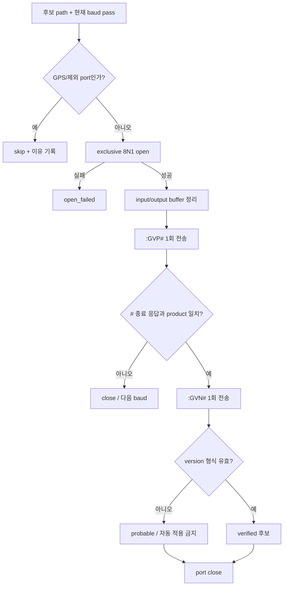
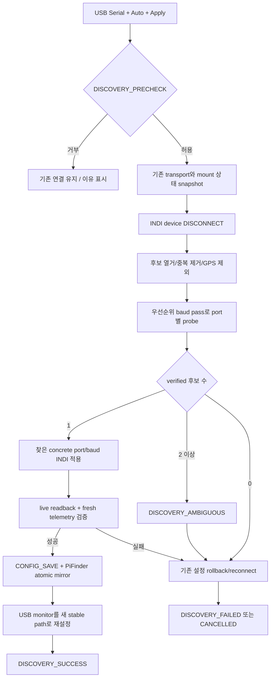

# INDI OnStepX USB Serial 포트 자동 탐색 설계안

상태: **구현 완료 / 자동·실장 검증 진행**
작성일: 2026-08-13

이 문서는 Web UI에서 OnStepX 연결 방식을 `USB Serial`로 설정하고 Serial Port를
`Auto`로 선택했을 때, **현재 연결되어 있는 serial 장치 중 OnStepX port와 통신
속도를 함께 찾아 적용하는 방법**을 정의한다. 자동 찾기는 장애 복구나 부팅 시 자동
재탐색 기능이 아니다. 2026-08-13 이 문서의 안전 경계를 기준으로 후보 정규화,
읽기 전용 probe, baud pass, Web 선택 UI, mount-control 단일 실행 transaction과
실패 원복을 구현했다.

관련 문서:

- [`mf_indi_serial_reconnect_design_ko.md`](mf_indi_serial_reconnect_design_ko.md)
- [`mf_mountcontrol_indi_flow_ko.md`](mf_mountcontrol_indi_flow_ko.md)
- [`mf_indi_connection_config_reconcile_20260812_ko.md`](../mf_report/mf_indi_connection_config_reconcile_20260812_ko.md)
- [`mf_indi_usb_reinsert_field_test_20260812_ko.md`](../mf_report/mf_indi_usb_reinsert_field_test_20260812_ko.md)

## 1. 목표와 비목표

목표:

- 사용자가 Web UI에서 `Connection Type = USB Serial`,
  `USB Serial Port = Auto`를 선택하고 Apply했을 때 현재 연결된 장치 중 OnStepX의
  stable port와 baud를 안전하게 찾는다.
- `/dev/ttyUSB0`처럼 재삽입 때 바뀌는 이름 대신 가능한 가장 안정적인 경로를
  선택한다.
- GPS, 다른 마운트, USB-UART 디버그 콘솔을 OnStepX로 잘못 선택하지 않는다.
- 검증이 끝나기 전에는 INDI XML과 PiFinder mirror를 변경하지 않는다.
- 탐색 성공 시 찾은 concrete stable path와 검증된 baud를 일반 수동 선택과 동일한
  transaction으로 적용·저장한다.
- 탐색 실패 시 기존 연결 설정과 mount 상태를 원래대로 복구한다.

비목표:

- 정상 연결 중에 더 좋아 보이는 포트로 자동 전환하지 않는다.
- `Auto`를 persistent port/baud 값으로 저장하거나 매번 연결할 때 검색하지 않는다.
- USB가 잠시 빠진 사건은 기존 stable by-id 재삽입 복구가 담당한다. 자동 찾기는
  그 복구를 시작하거나 대신하지 않는다.
- 탐색 과정에서 수동 이동, GoTo, Sync, park/unpark, tracking 명령을 만들거나
  재전송하지 않는다.
- VID/PID만으로 특정 제품을 확정하지 않는다.
- 부팅 시 자동 탐색, 지속 통신 이상 감시와 driver/server 자동 재시작은 별도
  과제로 유지한다.
- INDI server가 원격 host에 있을 때 PiFinder의 로컬 `/dev`를 검색하지 않는다.

## 2. 현재 소스 구조

현재 `sys_utils.list_onstep_serial_ports()`는 다음 glob 결과를 Web UI에 나열한다.

```text
/dev/serial/by-id/*
/dev/ttyUSB*
/dev/ttyACM*
```

이 함수는 경로와 실제 tty target을 보여 준다. 2026-08-13 실측에서 같은
`/dev/ttyUSB1`을 가리키는 by-id와 tty 경로가 각각 표시되어 사용자가 포트 두
개로 오인하는 문제가 확인됐다. 자동 탐색 구현 전의 독립 선행 수정으로 같은
실제 장치의 alias를 한 항목으로 합쳤다(2026-08-13 구현·실장 검증 완료).

```text
/dev/serial/by-id/usb-1a86_USB_Serial-if00-port0 -> /dev/ttyUSB1
/dev/ttyUSB1                                      -> /dev/ttyUSB1

기존 UI: 2개
수정 UI: by-id 대표 1개
```

목록 단계에서 적용할 규칙:

1. 각 경로를 `realpath`로 정규화한다.
2. 같은 realpath는 같은 실제 serial device로 묶는다.
3. 대표 경로는 `by-id → by-path → ttyUSB/ttyACM` 순으로 선택한다.
4. 현재 목록은 by-id와 tty를 수집하므로 같은 장치에서는 by-id 하나만 남는다.
5. 서로 다른 realpath는 VID/PID가 같아도 별도 장치로 유지한다.

이 dedup은 화면 목록과 향후 자동 탐색 후보 생성에 공통으로 사용하며, 기존
저장 설정이나 INDI 연결을 변경하지 않는다.

자동 탐색 구현으로 다음 동작도 추가됐다.

- configured GPS와 같은 실제 tty 제외
- 실제 OnStep `:GVP#`/`:GVN#` 응답 확인
- 마지막 검증값·9600·나머지 지원값 순서의 baud pass
- 유일 verified 후보만 적용하고 0개/복수 후보는 기존 설정 원복

USB VID/PID, serial number, physical location 표시는 후속 확장 항목이다. 현재
선택 합격 기준은 metadata가 아니라 실제 OnStep protocol 응답이다.

Web `INDI > LX200 OnStepX Driver Connection`은 사용자가 목록 또는 수동 경로와
baud를 선택한 뒤 `apply_indi_onstep_connection()`을 호출한다. 이 함수는 INDI
device를 disconnect하고 port/baud를 적용한 뒤 connect, live readback,
`CONFIG_SAVE`까지 수행한다.

mount-control 시작 시 설정 우선순위는 다음과 같다.

```text
INDI live property
→ INDI CONFIG_SAVE XML
→ 마지막 검증 PiFinder mirror
```

따라서 자동 탐색은 이 우선순위를 우회해 부팅할 때마다 설정을 덮어쓰면 안 된다.
탐색 결과는 기존 Web 저장 transaction과 동일하거나 더 강한 검증을 통과한
경우에만 새 effective transport가 되어야 한다.

## 3. 현재 장비의 식별 정보 실측

2026-08-13 현재 연결 장비:

```text
dynamic node: /dev/ttyUSB1
by-id: /dev/serial/by-id/usb-1a86_USB_Serial-if00-port0
by-path: /dev/serial/by-path/platform-xhci-hcd.0-usb-0:1:1.0-port0
USB driver: ch341
VID:PID: 1a86:7523
USB product: USB Serial
USB serial_number: 없음
physical location: 1-1
INDI port: 같은 by-id
INDI baud: 115200
```

핵심 제약은 이 CH340에 USB serial number가 없다는 점이다. `1a86:7523`은
일반적인 USB-UART 칩 식별자이므로 같은 칩을 사용하는 GPS, 다른 컨트롤러,
디버그 어댑터도 동일하게 보일 수 있다. 따라서 다음 조건은 단독 합격 기준이
될 수 없다.

```text
ttyUSB 또는 ttyACM이다
VID:PID가 1a86:7523이다
product 문자열이 USB Serial이다
by-id 이름에 1a86이 들어 있다
```

by-id는 현재 한 장비의 tty 번호 변경에는 안정적이지만, USB serial number가 없는
동일 CH340 두 개를 동시에 연결하면 장치 자체를 유일하게 식별하지 못할 수 있다.
이 경우 by-path는 물리 USB 소켓을 구분하지만 다른 소켓으로 옮기면 바뀐다.

## 4. OnStepX 읽기 전용 식별 방법

OnStepX 공식 소스 `src/telescope/Telescope.command.cpp`에는 다음 읽기 명령이
정의되어 있다.

| 명령 | 의미 | 공식 응답 형식 | 탐색 사용 |
|---|---|---|---|
| `:GVP#` | Product Name | 문자열 + `#` | 1차 필수 |
| `:GVN#` | Firmware Number | `M.mp#` | 2차 필수 |
| `:GVC#` | Config/Product Description | 문자열 + `#` | 표시용 선택 |
| `:GVH#` | Firmware Hardware/Pinmap | 문자열 + `#` | 표시용 선택 |

현재 OnStepX 공식 소스의 firmware name은 `On-Step`이다. 자동 탐색은 이동이나
설정 변경 명령이 아니라 `:GVP#`와 `:GVN#`만 사용한다.

검증 등급 제안:

```text
verified
  :GVP# 응답이 허용된 OnStep product name이고
  :GVN# 응답이 유효한 version 형식이다.

probable
  :GVP#만 맞고 version 응답이 없거나 비정상이다.
  사용자에게 후보로만 표시하고 자동 적용하지 않는다.

rejected
  응답 없음, framing 오류, product 불일치, 포트 open 실패.
```

허용 product 문자열은 실제 OnStep/OnStepX 호환 범위를 확인한 명시적 목록으로
관리하고, 단순히 `LX200` 응답이라는 이유로 합격시키지 않는다. `:GVC#`와
`:GVH#`는 구형 firmware에서 없을 수 있으므로 필수 조건으로 삼지 않는다.

참조한 공식 소스:

- [OnStepX repository](https://github.com/hjd1964/OnStepX)
- [Telescope.command.cpp의 firmware query](https://github.com/hjd1964/OnStepX/blob/d4874283ab74e390329b007f253595138e617752/src/telescope/Telescope.command.cpp#L193-L215)
- [OnStepX.ino firmware name/version](https://github.com/hjd1964/OnStepX/blob/d4874283ab74e390329b007f253595138e617752/OnStepX.ino#L39-L45)
- [Config.h serial baud 설정](https://github.com/hjd1964/OnStepX/blob/d4874283ab74e390329b007f253595138e617752/Config.h#L22-L29)

## 5. 후보 포트 생성과 정규화

후보 생성에는 pySerial `serial.tools.list_ports.comports()`와 Linux stable link를
함께 사용한다. pySerial은 USB 장치의 VID, PID, serial number, location 등을
제공하지만 운영체제에 따라 값이 없을 수 있으므로 보조 정보로만 사용한다.

후보 범위:

1. `/dev/serial/by-id/*`
2. USB 장치로 확인된 `/dev/ttyUSB*`, `/dev/ttyACM*`
3. by-id가 없거나 충돌할 때 `/dev/serial/by-path/*`
4. 사용자가 명시적으로 입력한 `/dev/...` 경로

제외 범위:

- PiFinder `gps_port`와 같은 실제 tty로 resolve되는 경로
- 내부 UART인 `/dev/ttyAMA*`, `/dev/serial0` 등
- 존재하지 않거나 character device가 아닌 경로
- 권한이 없거나 exclusive open에 실패한 포트
- 현재 정상 INDI 연결이 사용 중인 포트(강제 재탐색 승인 전)

중복 제거는 문자열이 아니라 `realpath`와 device identity를 기준으로 한다.
예를 들어 다음 세 경로는 한 후보로 묶는다.

```text
/dev/serial/by-id/usb-1a86_USB_Serial-if00-port0
/dev/serial/by-path/platform-xhci-hcd.0-usb-0:1:1.0-port0
/dev/ttyUSB1
```

저장 경로 우선순위:

```text
고유 serial number가 포함된 by-id
→ 현재 유일성이 확인된 by-id
→ 동일 어댑터가 여러 개면 사용자 선택을 받은 by-path
→ stable link가 없을 때만 동적 tty 경로 + 경고
```

pySerial 공식 문서는 link 포함 시 한 장치가 원본 경로와 symlink로 중복될 수
있다고 명시하므로, 중복 제거는 필수이다.

목록 dedup 합격 기준:

- by-id와 tty가 같은 realpath이면 by-id 한 항목만 반환한다.
- 서로 다른 tty target은 각각 유지한다.
- by-id가 없는 장치는 ttyUSB/ttyACM 항목으로 계속 표시한다.
- 목록 정리만으로 INDI/PiFinder 설정 파일을 쓰거나 device를 disconnect하지 않는다.

## 6. 통신 속도 자동 탐색

Serial Port에서 Auto를 선택하면 port와 baud를 함께 찾는다. 현재 PiFinder 지원
목록은 다음과 같다.

```text
9600, 19200, 38400, 57600, 115200, 230400, 460800
```

baud 시도 순서는 다음과 같다.

1. INDI live/XML에 마지막으로 검증된 baud
2. PiFinder mirror의 마지막 검증 baud
3. OnStepX 공식 기본값 9600
4. 위 값과 중복되지 않는 나머지 지원 baud 순서

현재 장비의 마지막 검증값은 115200이므로 첫 pass에서 바로 확인할 수 있다.
설정이 전혀 없는 장비에서는 공식 기본값 9600을 먼저 검사한다.

모든 조합을 후보별로 끝까지 순회하기보다 **baud pass 방식**을 사용한다.

```text
last verified baud로 모든 미확정 port 검사
→ 9600으로 모든 미확정 port 검사
→ 나머지 baud를 순서대로 모든 미확정 port 검사
```

한 port가 verified되면 그 port는 이후 baud pass에서 제외한다. 전체 port를 끝까지
확인하는 이유는 OnStep이 두 대 연결된 ambiguous 상황을 첫 발견 장치 하나로
오판하지 않기 위해서다. 한 port/baud 조합에는 `:GVP#`와 `:GVN#`를 각 한 번만
전송하고, 조합별 timeout과 전체 discovery deadline을 둔다. deadline이 끝나면
부분 결과를 자동 적용하지 않고 기존 설정으로 원복한다.

초기 timeout 제안값은 실장 시험에서 조정한다.

```text
PROBE_SETTLE_SECONDS = 0.15
PROBE_REPLY_TIMEOUT_SECONDS = 0.8
DISCOVERY_TOTAL_TIMEOUT_SECONDS = 30.0
```

일반 후보는 `:GVP#`가 실패하면 그 조합을 즉시 끝내므로 `:GVN#` timeout까지
소비하지 않는다. Web 요청은 이 시간 동안 HTTP connection을 block하지 않고
mount-control 상태를 polling한다.

잘못된 baud에서 반복 byte를 보내는 범위를 줄이기 위해 다음 제한을 둔다.

- user-triggered Auto+Apply 한 transaction에서만 탐색
- 동일 port/baud 재시도 금지
- verified port의 나머지 baud 검사 금지
- 후보 수, 현재 pass, 전체 elapsed time을 tmpfs 상태에 표시
- timeout 또는 cancel 뒤 background scan 금지

## 7. 단일 후보 probe 절차



probe 조건:

- 8 data bits, no parity, 1 stop bit, flow control off
- 짧고 유한한 read/write timeout
- `#`까지 읽되 응답 최대 길이를 제한
- 한 port/baud 조합당 식별 명령은 각 1회
- Linux에서는 가능한 경우 `exclusive=True`
- port open/close 전후 DTR/RTS 변화가 컨트롤러 reset을 일으키는 보드가 있는지
  실장 시험으로 확인
- probe 중 받은 원문은 길이 제한과 제어문자 제거 후 tmpfs 상태에만 기록

pySerial의 `exclusive`는 POSIX에서 다른 exclusive opener와 동시 open을 막지만,
모든 기존 프로그램이 같은 잠금을 사용한다는 보장은 없다. 따라서 INDI driver를
먼저 disconnect하고 mount-control이 탐색의 단일 소유자가 되는 절차가 더
중요하다.

참조:

- [pySerial port listing](https://pyserial.readthedocs.io/en/latest/tools.html)
- [pySerial Serial API와 exclusive access](https://pyserial.readthedocs.io/en/latest/pyserial_api.html)

## 8. Web UI와 실행 의미

별도 복구 버튼을 만드는 것이 아니라 기존 Serial Port 선택 목록에 다음 항목을
추가한다.

```text
Connection Type: USB Serial
USB Serial Port: Auto (Find connected OnStep)
Communication Speed: Auto (Detect with port)
Apply to INDI
```

Serial Port 목록 구조 제안:

```text
Auto (Find connected OnStep)
────────────────────────────
/dev/serial/by-id/...
/dev/ttyUSB...
/dev/ttyACM...
Manual entry
```

`Auto`는 port 값이나 운용 모드가 아니라 **Apply 시 실행하는 선택 명령**이다.
form에서는 `serial_port=__auto__` 같은 sentinel로 전달할 수 있지만, sentinel을
INDI XML이나 PiFinder config에 저장하면 안 된다.

사용자 동작과 결과:

1. 사용자가 `USB Serial`과 `Auto`를 선택한다.
2. `Apply to INDI`를 누른 동작을 자동 탐색과 유일 후보 적용에 대한 승인으로 본다.
3. mount-control이 현재 연결된 serial 후보를 한 번 검사한다.
4. verified OnStep 후보가 하나면 별도의 두 번째 Apply 없이 그 concrete stable
   path와 응답이 검증된 baud를 적용한다.
5. fresh telemetry까지 성공하면 concrete path/baud를 INDI와 PiFinder에 저장하고,
   Web 화면도 실제 찾은 값으로 다시 표시한다.
6. verified 후보가 없거나 여러 개면 저장하지 않고 기존 설정으로 원복한다.

Communication Speed 처리:

- concrete port나 Manual entry를 선택했을 때는 지금처럼 사용자가 baud를 고른다.
- Auto를 선택하면 Communication Speed도 `Auto (Detect)`로 표시하고 수동 baud
  dropdown은 비활성화한다.
- form에는 port와 baud 모두 `__auto__` sentinel을 전달할 수 있지만 persistent
  설정에는 저장하지 않는다.
- 성공 후에는 발견한 concrete baud가 선택된 상태로 표시·저장된다.

정상 연결 중에도 사용자가 Auto를 선택하고 Apply하면 전체 후보 검색 의사를
명시한 것이다. 현재 INDI 연결과 mount 상태를 snapshot한 뒤 잠시 disconnect하고
검색한다. 기존 연결이 이미 유일한 OnStep이면 같은 concrete path/baud로 다시
연결되며 설정 값은 불필요하게 변경되지 않는다.

이 설계에서는 다음 동작을 하지 않는다.

- 페이지를 열었다는 이유만으로 탐색
- USB Serial을 선택했다는 이유만으로 탐색
- PiFinder 부팅 또는 연결 실패 때 자동 탐색
- `usb_absent`/재삽입 복구 중 다른 port 탐색
- 저장된 concrete path가 없다는 이유만으로 background scan

탐색 시작 전 precheck:

```text
active driver = OnStep family
AND 요청 connection type = USB Serial
AND INDI server가 PiFinder의 local/loopback endpoint
AND manual/GoTo/guide/backlash/alignment 작업이 진행 중이 아님
AND USB 재삽입 recovery 또는 driver/controller restart 중이 아님
AND 다른 discovery transaction이 없음
```

하나라도 만족하지 않으면 INDI를 disconnect하기 전에 요청을 거부한다. 특히 INDI
server가 다른 컴퓨터에 있으면 serial device도 그 컴퓨터에 있으므로 PiFinder의
로컬 `/dev` 검색 결과를 적용할 수 없다. 이때 Auto 항목은 비활성화하거나 명확한
오류를 표시하고 concrete remote path의 수동 입력만 허용한다.

## 9. 전체 상태 순서도

탐색은 Web process가 직접 serial port를 열기보다 mount-control queue를 통해
단일 소유 상태 기계로 실행하는 것을 권장한다.



verified 후보가 둘 이상이면 Auto가 임의 선택하지 않는다. 기존 연결을 원복한 뒤
찾은 후보들의 stable path, product, version, 검증 baud, USB location을 화면에 보여
주고 사용자가 concrete port를 선택해 다시 Apply하도록 한다. 따라서 Auto+Apply는
**유일하게 검증된 후보에 한해 자동 적용**한다.

## 10. 적용 transaction과 실패 원복

현재 `apply_indi_onstep_connection()`은 connect와 live config readback 뒤 바로
`CONFIG_SAVE`를 수행한다. 자동 탐색 구현에서는 이 함수만 그대로 호출하기보다
다음 원자적 경계를 추가해야 한다.

탐색 시작 snapshot:

- 기존 effective port와 baud
- INDI connect 상태
- park/unpark, tracking, slew rate, track frequency
- USB monitor path와 health
- 기존 PiFinder mirror 값

Auto 탐색·적용 성공 조건:

```text
INDI CONNECTION=On
AND live DEVICE_PORT/baud가 선택값과 일치
AND 새 좌표 callback + 새 OnStep Status callback 수신
    OR reconnect된 동일 driver session에서 유효 좌표 + :GU# live readback 확인
AND park 상태가 탐색 전과 동일
```

실장 시험에서 OnStepX driver가 reconnect 직후 일부 동적 property를 정의하기 전에
첫 vector를 보내 새 PyIndi client의 callback이 누락되는 경계가 확인됐다. 따라서
기존 mount-control client를 유지하고 callback을 우선 사용하되, 누락 시에는 같은
새 driver session의 CONNECT, concrete transport readback, 유효 RA/DEC와
`OnStep Status.:GU# return`을 모두 확인해야만 fallback 검증을 통과한다.

위 조건이 모두 맞은 뒤에만 `CONFIG_SAVE`와 PiFinder atomic mirror를 수행한다.
location/time sync, unpark, tracking-on은 탐색 연결에서 강제하지 않는다.

실패 시:

1. 새 후보 INDI session을 disconnect한다.
2. 기존 port/baud를 INDI에 다시 적용한다.
3. 탐색 전 연결 상태였으면 보존 모드로 reconnect한다.
4. fresh telemetry와 park 상태를 확인한다.
5. PiFinder mirror는 처음부터 변경하지 않았으므로 그대로 유지한다.
6. rollback도 실패하면 반복 재시도하지 않고 명확한 실패 상태를 남긴다.

기존 설정이 없던 최초 설정 탐색에서는 rollback 대상이 없으므로 INDI device를
disconnect 상태로 두고 `config_invalid` 또는 discovery failure를 표시한다.

## 11. 다중 장치와 예외 정책

| 상황 | 동작 |
|---|---|
| OnStep verified 1개 | concrete path와 응답이 검증된 baud 적용·검증 |
| OnStep verified 2개 이상 | 기존 설정 원복 후 ambiguous 표시, concrete port 사용자 선택 필수 |
| 같은 CH340 2개, OnStep은 1개 | protocol 응답이 맞는 1개만 선택 |
| 같은 CH340 2개가 모두 OnStep | by-path/USB 위치와 응답 정보를 표시해 선택 |
| GPS와 OnStep 동시 연결 | configured GPS 실제 tty 제외, 나머지 protocol probe |
| 포트가 probe 도중 제거됨 | 해당 후보 실패, 전체 한 주기 종료 또는 다음 후보 진행 |
| port busy/permission denied | skip하며 이유 표시, 강제 kill 금지 |
| product만 맞고 version 없음 | probable, 자동 적용 금지 |
| 현재 정상 mount 연결 | Auto+Apply를 눌렀을 때만 snapshot 후 탐색 |
| 기존 configured path absent | background rewrite 금지, Auto+Apply 때만 탐색 |
| INDI server가 remote host | local discovery 거부, 기존 설정 유지 |
| mount 동작 또는 USB recovery 중 | busy로 거부, serial disconnect 금지 |

firmware version, config description, hardware/pinmap은 업데이트로 바뀔 수 있으므로
영구 장치 ID로 사용하지 않는다. USB serial number가 있으면 가장 강한 identity
보조값이고, 없으면 protocol 검증과 사용자 선택이 최종 기준이다.

## 12. 상태와 로그

기존 원칙대로 자동 탐색 로그와 상세 결과는 tmpfs가 기본이다.

mount-control 상태 필드 제안:

```text
serial_discovery_state
  idle / precheck / disconnecting / scanning / found / ambiguous /
  applying / verifying / success / failed / rollback

serial_discovery_candidate_count
serial_discovery_verified_count
serial_discovery_current_port
serial_discovery_current_baud
serial_discovery_selected_port
serial_discovery_selected_baud
serial_discovery_product
serial_discovery_version
serial_discovery_error
```

후보별 raw 응답은 길이를 제한하고 제어문자를 제거한다. 비밀번호나 일반 serial
stream을 기록하지 않는다. SD에 자동 진단 파일을 만들지 않으며, 사용자가 필요할
때 tmpfs 결과를 명시적으로 내보내는 방식만 허용한다.

## 13. 구현 위치 제안

| 파일 | 구현 역할 |
|---|---|
| `python/PiFinder/sys_utils.py` | 후보 열거/정규화, GPS 제외, port/baud read-only probe와 baud pass 생성 |
| `python/PiFinder/sys_utils_fake.py` | off-device fake API |
| `python/PiFinder/mountcontrol_indi.py` | 단일 소유 discovery 상태 기계, snapshot/rollback/fresh telemetry |
| `python/PiFinder/server.py` | `__auto__` Apply 요청 검증·queue 전달과 상태 조회 |
| `python/views/indi_mount.html` | Serial Port의 Auto 항목, baud Auto 연동, 진행/결과 UI |
| `python/tests/test_sys_utils.py` | metadata, 중복, probe parser, timeout 단위 테스트 |
| `python/tests/test_mountcontrol_indi.py` | 상태 기계, 보존, rollback, 경쟁 방지 테스트 |

Web 요청 하나가 전체 검색 완료까지 block되지 않도록 mount-control queue에 작업을
넣고 Web은 tmpfs 상태를 polling하는 구조가 적합하다. 탐색 중 기존 Web Apply,
driver restart, controller reboot가 동시에 실행되지 않도록 discovery lock과 상태
검사를 둔다.

## 14. 단계별 구현안

### Phase A — 후보와 protocol probe (**완료**)

- USB metadata 수집과 alias 중복 제거
- GPS port 제외
- `:GVP#`/`:GVN#` parser와 bounded timeout
- 마지막 검증값·9600·나머지 지원값 순서의 baud pass 생성
- pseudo-terminal 기반 단위 테스트
- 아직 INDI 설정 저장 없음

### Phase B — Serial Port Auto 선택형 Web 탐색 (**완료**)

- `USB Serial + Auto + Apply`를 mount-control queue 기반 비동기 탐색으로 전달
- 현재 연결 snapshot과 INDI disconnect
- 유일 후보는 자동 적용 단계로 전달, 여러 개/없음은 기존 설정 원복
- Cancel 시 기존 설정 reconnect

### Phase C — 선택 적용과 원복 (**완료**)

- port/baud 적용
- live config와 fresh telemetry 검증
- 성공 후에만 CONFIG_SAVE/mirror
- 모든 실패 지점의 rollback 테스트

### Phase D — 실제 장비 검증 (**완료**)

- CH340/OnStepX 실장 시간 측정
- GPS와 동시 연결 시험
- 동일 USB-UART 두 개 시험
- DTR/RTS에 의한 controller reset 여부 확인
- 페이지 load, 부팅, USB 재삽입 때 탐색이 실행되지 않는지 확인

## 15. 시험 계획과 합격 기준

자동 테스트:

- by-id/by-path/tty alias가 후보 하나로 합쳐진다.
- USB serial number, VID/PID, location이 없더라도 예외가 나지 않는다.
- configured GPS와 같은 realpath는 제외된다.
- 마지막 검증 baud, 공식 기본값 9600, 나머지 지원 baud 순서가 중복 없이
  만들어진다.
- 한 baud pass에서 모든 미확정 port를 검사한 뒤 다음 pass로 진행한다.
- verified port는 이후 baud에서 다시 probe하지 않는다.
- 전체 deadline 뒤 부분 탐색 결과를 자동 적용하지 않는다.
- `On-Step#` + 유효 version만 verified가 된다.
- timeout, 너무 긴 응답, 제어문자, 잘못된 framing은 rejected가 된다.
- verified 두 개를 자동 선택하지 않는다.
- probe 예외가 mount-control loop를 종료하지 않는다.
- 탐색 취소/후보 없음/후보 다수/적용 실패 각각에서 기존 설정이 복구된다.
- `__auto__`가 INDI XML이나 PiFinder config에 저장되지 않는다.
- fresh telemetry 전에는 CONFIG_SAVE/mirror write가 없다.
- park/tracking/manual/GoTo 상태를 임의 변경하지 않는다.

실장 시험:

1. Web에서 USB Serial + Auto + Apply를 실행한다.
2. 마지막 검증 baud 115200 첫 pass에서 현재 CH340/by-id 장비를 식별한다.
3. 마지막 검증값을 제거한 조건에서는 9600부터 시작해 실제 baud에서 식별하는지
   확인한다.
4. 케이블 재삽입 후 tty 번호가 달라도 같은 by-id를 선택한다.
5. 다른 USB serial 또는 GPS를 함께 연결해 오탐이 없는지 확인한다.
6. 동일 VID/PID USB-UART 두 개에서 protocol 응답 장치만 선택한다.
7. OnStep 두 개가 응답하면 ambiguous로 멈추는지 확인한다.
8. probe 중 cable 제거와 port busy를 재현한다.
9. 적용 직전/연결/readback/fresh telemetry/CONFIG_SAVE 각 실패를 주입해 원복한다.
10. 탐색 전후 park/tracking/slew rate와 위치·시간 설정이 동일한지 확인한다.
11. PiFinder, indiserver, driver 불필요한 restart와 SD 로그 생성이 없는지 확인한다.

최종 합격 기준:

- 장치 선택 근거가 metadata가 아니라 실제 OnStep 읽기 응답이다.
- 후보가 유일하지 않으면 자동 적용하지 않는다.
- Auto+Apply 요청과 유일 후보 검증 전에는 persistent 설정을 변경하지 않는다.
- 저장값은 `Auto`가 아니라 검증된 concrete stable path와 실제 응답 baud이다.
- 성공은 `CONNECT=On`뿐 아니라 새 좌표와 OnStep 상태로 확인한다.
- 실패하면 기존 연결로 원복하고 반복 retry storm을 만들지 않는다.
- 어떤 탐색 경로도 마운트 이동 명령을 보내지 않는다.

## 16. 권고 결론

첫 구현은 **Web Serial Port 목록의 `Auto (Find connected OnStep)` 선택형**으로
제한하는 것이 가장 안전하다.

```text
USB Serial + Auto + Apply
→ USB metadata로 현재 연결 후보 생성
→ alias 중복/GPS 제외
→ INDI disconnect로 serial 단일 소유
→ last verified / 9600 / 나머지 baud pass로 :GVP# + :GVN# 검증
→ verified 1개면 concrete port + 검증 baud 자동 적용
→ 0개 또는 여러 개면 기존 설정 원복 및 오류/선택 안내
→ fresh telemetry 검증
→ 마지막에만 CONFIG_SAVE와 PiFinder mirror
→ 실패 시 기존 설정 원복
```

단순히 첫 번째 ttyUSB, CH340 VID/PID 또는 by-id 이름만 골라 자동 저장하는 방식은
현재 장비의 USB serial number 부재와 다중 serial 장치 가능성 때문에 채택하지
않는다. 자동 찾기는 오직 사용자가 Serial Port에서 Auto를 선택하고 Apply했을 때
실행하며, 이후 운용과 USB 재삽입 복구에는 찾아서 저장한 concrete stable path를
사용한다.
