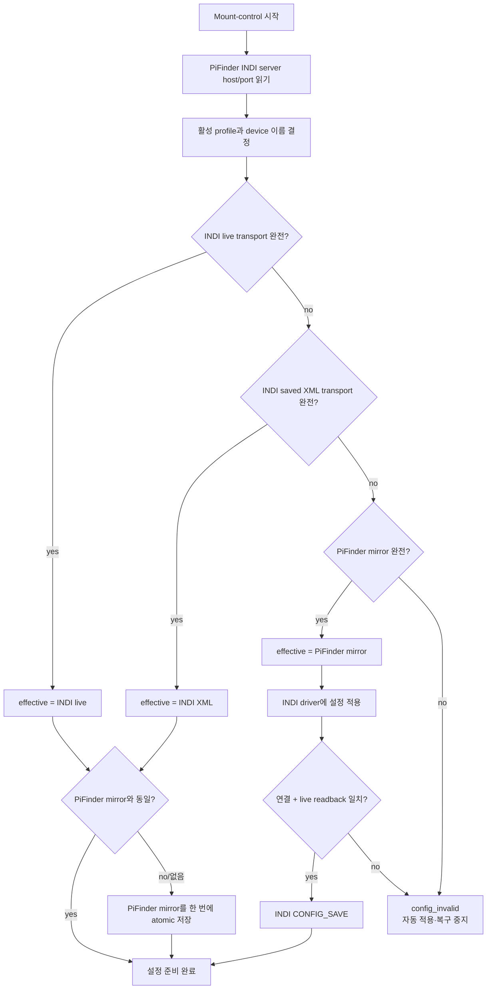
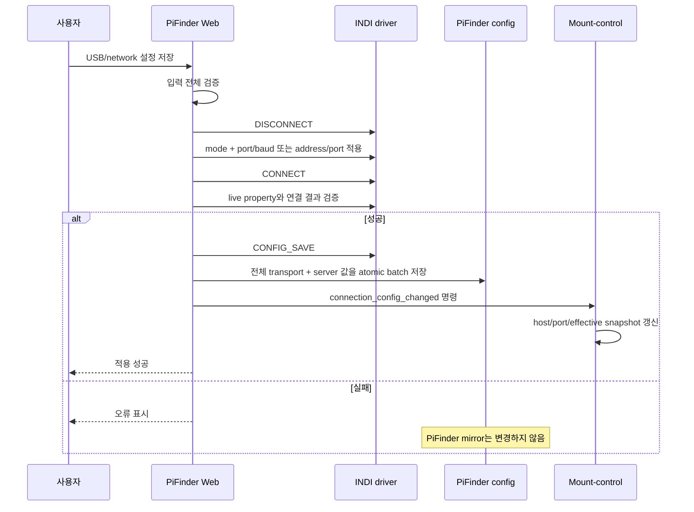
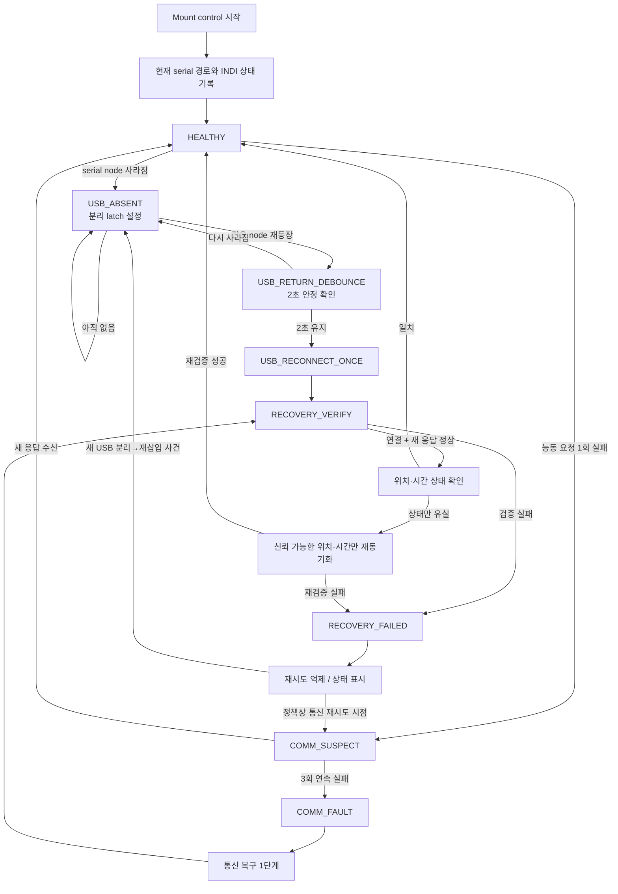
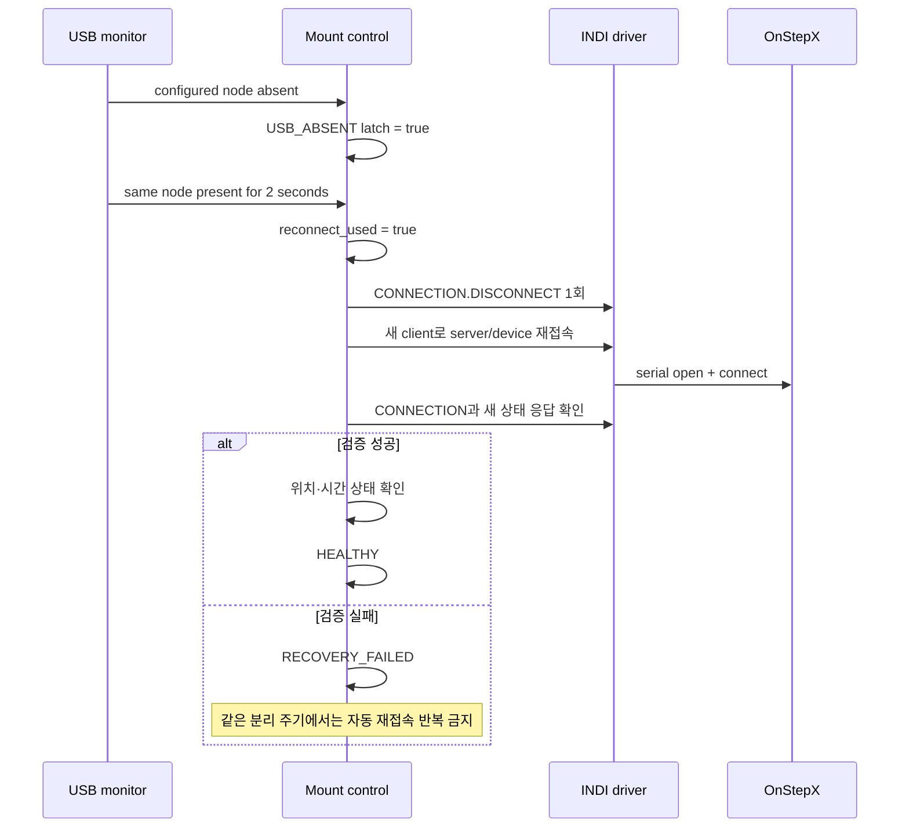

# INDI OnStepX Serial 재접속·통신 감시 설계안

상태: **1.2 설정 불일치 및 USB 재삽입 1회 복구 구현·실장 검증 완료 / 지속 통신 감시는 후속 과제**
작성일: 2026-08-12

관련 후속 설계:

- [`mf_indi_serial_auto_discovery_design_ko.md`](mf_indi_serial_auto_discovery_design_ko.md):
  Web Serial Port에서 Auto를 선택했을 때 현재 장치 중 OnStepX stable port를
  찾는 설정 기능 설계

## 1. 목적과 변경 경계

USB serial 케이블의 물리적 분리/재삽입과, 정상 연결 중 노이즈·일시 오류·컨트롤러 재부팅을 서로 다른 사건으로 판정하고 안전하게 복구한다.

이번 설계가 지켜야 할 경계:

- 기존 수동 이동 API, 방향 매핑, 대각선 이동, keepalive, lease, stop 동작은 수정하지 않는다.
- GoTo, guide, tracking 제어 로직도 수정하지 않는다.
- 감시와 재접속은 mount-control 내부의 별도 상태 기계로 구성한다.
- 로그와 상태 파일은 기존 `/dev/shm/pifinder` tmpfs만 사용한다. SD에는 자동 저장하지 않는다.
- 자동 복구는 새로운 이동 명령을 만들지 않는다.

## 1.1 현행 소스 상세 감사 결과

이 절은 2026-08-12 현재 서버 소스를 다시 추적한 결과이다. 이 가운데 설정의
이중 소스 문제는 1.2와 같이 수정했으며, 재접속·통신 감시 항목은 아직 수정하지
않았다.

### 이미 존재하는 연결 확인과 재접속

현재 mount-control에는 다음 기능이 이미 있다.

1. 서비스 시작 5초 뒤 `connect()` 실행.
2. `connected == false`이면 명령 큐가 비는 시점에 자동 연결 실행.
3. 실패 후 nominal 10초 간격으로 계속 재시도.
4. 상태 heartbeat에서 `PyIndi client.isServerConnected()`와 device의 `isConnected()`/`CONNECTION.CONNECT` 확인.
5. INDI server disconnect callback에서 `mark_disconnected()` 실행.

이 경로는 network 전용이 아니며 USB와 network 모두 같은 `connect()`를 사용한다. 그러나 USB device node의 소실/재등장을 직접 보지 않으므로 “케이블 재삽입 사건당 1회”가 아니라 연결되지 않은 동안 무기한 재시도하는 구조이다.

### 명목 주기와 실제 주기의 차이

- `STATUS_HEARTBEAT_INTERVAL`은 2초지만 heartbeat는 독립 thread/timer가 아니다. `mount_queue.get()`이 timeout인 경우에만 실행되므로 명령 처리가 계속되거나 `connect()`가 block되면 지연된다.
- `connect()`는 device 20초, `CONNECTION` property 20초, device connect 15초, 좌표 10초를 단계별로 기다릴 수 있다.
- retry deadline은 blocking `connect()` 호출 **전**의 `now`로 계산한다. 연결 시도가 10초보다 오래 걸리면 실패 직후 다음 시도가 사실상 바로 시작될 수 있다.
- 실장 로그에서도 21:49:53 시도 → 21:50:16 property timeout 뒤, 긴 10초 휴지 없이 다음 suppressed retry가 진행되어 21:50:36 연결된 흐름이 확인됐다.
- 연결 대기 중 mount-control queue가 block되므로 그동안 stop/deadman/새 명령 처리도 지연될 수 있다.

### 현재 health 판정의 한계

- `isServerConnected()`는 PiFinder↔indiserver만 확인한다.
- device `isConnected()`와 `CONNECTION.CONNECT`는 INDI가 가진 상태이며, 실제 serial 요청이 새 응답을 받았는지는 확인하지 않는다.
- `EQUATORIAL_EOD_COORD` callback은 좌표 값만 저장하고 마지막 새 응답 시각을 저장하지 않는다.
- heartbeat의 좌표 읽기는 cached property를 다시 읽으므로 오래된 좌표도 정상처럼 보일 수 있다.
- `TIME_UTC`와 `GEOGRAPHIC_COORD`는 연결 시 쓰거나 Web에서 표시할 뿐, 현재 mount-control은 새 응답 여부·시간 유실·위치 유실을 지속 감시하지 않는다.
- `removeDevice()`는 client 내부 device reference만 비우고 mount-control에 즉시 disconnect를 통보하지 않는다.
- 따라서 server와 driver가 살아 있고 `CONNECTION=On`이 stale인 통신 정지/노이즈/컨트롤러 재부팅은 놓칠 수 있다.

### 재접속 성공 판정과 상태 변경

현재 `connect()`는 다음을 순서대로 수행한다.

```text
INDI server 연결
→ telescope device 발견
→ CONNECTION property 발견
→ CONNECTION.CONNECT
→ 위치/시간 sync
→ unpark
→ sidereal mode + tracking on
→ 좌표 property 확인
→ connected=true
```

주의할 점:

- 위치/시간 sync, unpark, tracking enable의 반환값을 확인하지 않는다.
- 좌표 property가 존재하면 최종 `connected=true`가 될 수 있으므로 “연결됨”이 위치·시간·park·tracking까지 정상이라는 뜻은 아니다.
- 재접속은 장애 전 park/tracking 상태를 보존하지 않고 unpark와 tracking on을 시도한다.
- disconnect 시 `_coordinate_sync`만 지우며 GoTo/refine/guide/manual 내부 상태를 일괄 정리하지 않는다. 기존 수동 이동 정책과 충돌하지 않도록 새 복구 로직은 이 상태들을 임의 수정하면 안 된다.

### callback과 수동 재시작 경로의 경쟁 가능성

- `serverDisconnected()`는 callback thread에서 공용 `MountControlIndi` 상태를 직접 변경하며 client generation 확인이나 lock이 없다. 오래된 client의 늦은 callback이 새 연결 상태를 지울 가능성을 설계에서 차단해야 한다.
- 정상적인 임시 PyIndi client 종료도 `Disconnected from INDI server: 0` WARNING을 남긴다. 위치/시간 Web 동작 등이 만드는 정상 종료와 실제 장애 로그를 구분하기 어렵다.
- LCD의 Restart Driver는 mount-control queue를 거쳐 `restart_driver()`를 실행한다.
- Web `/indi/restart`는 mount-control을 거치지 않고 Web Manager를 직접 재시작한 뒤 별도로 driver connect를 실행한다. 동시에 mount-control의 disconnect callback/자동 연결도 움직일 수 있어 이중 connect 경쟁이 가능하다.

### 설정의 이중 소스와 현재 장비 불일치

연결 정보는 두 곳에 존재한다.

1. PiFinder `config.json`: 직접 LX200 sync, controller reboot, alignment reset과 mount-control server 주소에 사용.
2. INDI `~/.indi/LX200 OnStepX_config.xml`: driver가 실제로 여는 serial/TCP 설정.

현재 장비의 실측 상태:

```text
INDI XML:
  CONNECTION_SERIAL=On
  DEVICE_PORT=/dev/serial/by-id/usb-1a86_USB_Serial-if00-port0
  baud=115200

PiFinder config.json:
  onstep_connection_type 없음 → 코드 기본값 network
  onstep_serial_port 없음
  onstep_serial_baud 없음 → 코드 기본값 9600
  onstep_network_host 없음
```

일반 `connect()`는 INDI가 저장한 XML을 사용하므로 USB로 연결되지만, PiFinder 설정을 직접 사용하는 controller reboot/direct location-time sync/alignment reset은 network + 빈 host를 선택해 실패할 수 있다. USB 재삽입 감시를 추가하기 전에 두 설정을 단일 기준으로 맞추거나 명시적인 우선순위를 정해야 한다.

Web `/indi/driver`는 적용 성공 후 PiFinder 설정도 저장하지만, mount-control의 `indi_host`/`indi_port`는 프로세스 시작 때 고정된다. Web에서 server 주소를 바꾸고 `reload_config`만 보내면 실행 중 mount-control에는 즉시 반영되지 않는다.

### direct location/time sync 옵션의 특수 동작

`onstep_direct_lx200_location_time_sync=true`이면 `connect()` 시작 전에 exclusive LX200 sync가 INDI Web Manager를 stop/start하고 driver connect까지 실행한다. 따라서 이 옵션에서는 일반 auto-connect 한 번이 사실상 INDI 전체 재시작을 포함할 수 있다. `restart_driver()` 뒤 `connect()`가 다시 direct sync를 실행하면 연속 재시작도 가능하다. 새 복구 상태 기계는 이 옵션과 중복 실행되지 않도록 해야 한다.

### 테스트 공백

현재 테스트에는 USB 분리→재삽입, heartbeat disconnect 감지, run-loop retry 시각, blocking 중 stop 처리, Web Restart와 auto-connect 경쟁, stale 응답 판정의 통합 테스트가 없다. 구현 시 이 항목을 먼저 재현 테스트로 고정해야 한다.

## 1.2 설정 불일치 해소 — 구현 완료

상태: **2026-08-12 구현 및 실장 검증 완료**

### 설정 영역 분리

현재 한 화면에 표시되지만 실제로는 다음 두 설정 영역이 다르다.

| 영역 | 값 | 기준 저장소 |
|---|---|---|
| PiFinder→INDI server | `server_host`, `server_port` | PiFinder `config.json` |
| INDI driver→OnStep | `usb/network`, serial port/baud 또는 TCP address/port | INDI live property와 `~/.indi/<device>_config.xml` |

INDI server 주소는 INDI driver XML에서 알 수 없으므로 PiFinder 설정을 유일한 기준으로 유지한다. 반면 OnStep transport는 실제 port를 여는 INDI driver의 검증된 설정을 운용 기준으로 삼는다.

### 적용한 단일 기준 정책

OnStep transport의 우선순위:

```text
1. 연결된 INDI driver의 live property
2. INDI가 CONFIG_SAVE한 <device>_config.xml
3. PiFinder config.json의 마지막 검증 설정
4. 모두 불완전하면 config_invalid
```

해석:

- INDI live/XML은 **현재 driver가 실제로 사용할 운용 설정**이다.
- PiFinder 설정은 별도 desired 설정이 아니라, 마지막으로 검증된 INDI 운용 설정의 **persistent mirror**로 사용한다.
- 사용자가 PiFinder Web UI에서 새 값을 저장하는 순간에는 그 입력이 새 desired 설정이 된다. INDI 적용·연결·readback·`CONFIG_SAVE`가 모두 성공한 뒤에만 PiFinder mirror를 갱신한다.
- 사용자가 INDI Web Manager에서 직접 바꾼 경우에는 다음 reconciliation에서 INDI 값이 PiFinder mirror로 들어온다. driver를 예전 PiFinder 값으로 조용히 되돌리지 않는다.

이 정책을 택하는 이유:

- PiFinder mirror가 오래됐다는 이유로 정상 운용 중인 driver 연결을 자동 변경하지 않는다.
- direct sync/controller reboot처럼 INDI를 잠시 내려야 하는 기능도, 내려가기 전에 확정한 effective transport snapshot을 사용할 수 있다.
- 설정 충돌과 케이블이 단순히 빠진 상태를 구분할 수 있다. `/dev` node 부재는 설정 삭제 사유가 아니다.

### 정규화된 설정 형식

소스가 live/XML/PiFinder 중 어디든 다음 한 형식으로 변환한다.

```json
{
  "connection_type": "usb",
  "serial_port": "/dev/serial/by-id/usb-1a86_USB_Serial-if00-port0",
  "serial_baud": 115200,
  "network_host": "",
  "network_port": 9999,
  "source": "indi_live|indi_xml|pifinder",
  "verified": true
}
```

검증 규칙:

- mode는 `usb` 또는 `network`만 허용한다. 코드와 Web form의 실제 값은 `serial`이 아니라 `usb`이다.
- USB port는 `/dev/` 절대 경로여야 한다. 안정 경로 `/dev/serial/by-id/...`를 우선하지만, 장치가 현재 빠져 있어 경로가 존재하지 않아도 저장 설정 자체는 유효하다.
- USB baud는 지원 목록에 있어야 한다.
- network host는 비어 있지 않고 port는 1~65535여야 한다.
- 비활성 mode의 값은 보존할 수 있지만 effective transport 비교에서는 제외한다.
- XML device 이름은 현재 autostart profile의 telescope driver 이름과 정확히 일치해야 한다.

### 부팅 및 mount-control 시작 reconciliation



중요 조건:

- live/XML이 유효한 mismatch는 **driver를 재접속하지 않고 PiFinder mirror만 맞춘다**.
- PiFinder fallback을 INDI에 적용하는 것은 INDI live/XML 모두 불완전할 때의 부팅 복구로 제한한다.
- mirror 저장은 여러 `set_option()` 호출이 아니라 한 번의 atomic batch write로 수행한다. 중간 전원 차단으로 일부 키만 저장되는 것을 막는다.
- 값이 이미 동일하면 SD에 다시 쓰지 않는다.
- reconciliation 결과와 source는 tmpfs 상태 파일에 기록한다.

### Web UI 저장 transaction



현재 Web route는 INDI 적용 후 PiFinder 키 7개를 개별 저장하며 `reload_config`는 main process의 Config만 다시 읽는다. 제안안에서는 batch 저장과 mount-control 전용 `connection_config_changed` 명령을 추가해 서비스 재시작 없이 server host/port도 갱신한다.

### 충돌 및 실패 처리

| 상황 | 제안 동작 |
|---|---|
| INDI valid, PiFinder 없음 | INDI를 PiFinder에 1회 import |
| INDI valid, PiFinder와 다름 | INDI를 운용 기준으로 mirror 갱신, 상태에 `reconciled_from_indi` 기록 |
| INDI live 없음, XML valid | XML을 운용 기준으로 사용 |
| INDI live/XML invalid, PiFinder valid | PiFinder 값을 INDI에 1회 적용·검증 |
| 모두 invalid | 자동 connect/recovery 중지, `config_invalid` 표시 |
| USB node가 현재 없음 | 설정은 유지하고 `usb_absent`; network fallback 금지 |
| Web 적용 실패 | 기존 PiFinder mirror 유지, 부분 저장 금지 |
| CONFIG_SAVE 실패 | PiFinder mirror 갱신 금지, 사용자에게 저장 실패 표시 |

### 현재 장비의 1회 migration 실측 결과

서비스 재시작 전 PiFinder `config.json`에는 아래 연결 키가 모두 없었고, INDI
live property와 XML에는 동일한 USB 설정이 있었다. 첫 reconciliation은 INDI
live 값을 선택해 다음 PiFinder mirror를 한 번 저장했다.

```text
onstep_connection_type = usb
onstep_serial_port = /dev/serial/by-id/usb-1a86_USB_Serial-if00-port0
onstep_serial_baud = 115200
mount_control_indi_host = localhost
mount_control_indi_port = 7624
```

이 migration 자체는 driver 설정을 다시 적용하지 않았고, 이미 검증된 INDI
운용값만 PiFinder에 복사했다. 서비스 재시작 뒤 tmpfs 상태 파일에서 다음을
확인했다.

```text
connection_config_valid = true
connection_config_reconciled = true
connection_config_source = indi_live
state = connected
```

재시작 전후 `config.json` 비교 결과 위 5개 키 외의 기존 값은 바뀌지 않았다.
같은 설정으로 두 번째 재시작했을 때는
`connection_config_reconciled=false`였고, 파일 mtime·크기·SHA-256이 모두
그대로여서 일치 상태에서 SD에 다시 쓰지 않는 것도 확인했다.

### 구현 내용

1. `sys_utils.py`: live property/XML 파싱, 정규화, active transport 비교를 추가했다.
2. `config.py`: tmpfs lock을 사용하는 원자적 batch 저장과 default가 아닌 실제 저장값 조회를 추가했다.
3. `mountcontrol_indi.py`: 시작 시 `live → XML → PiFinder mirror` 순으로 조정하고, 유효 설정이 없으면 자동 접속을 차단한다.
4. `server.py`: Web 저장은 INDI 연결·readback·`CONFIG_SAVE`가 모두 성공한 뒤 7개 키를 한 번에 저장하고 mount-control에 endpoint 변경을 알린다.
5. 상태와 lock은 `/dev/shm/pifinder`에 두며 새 SD 로그는 추가하지 않았다.

집중 단위 테스트는 `146 passed`였고, 상세 실장 결과는
[`mf_indi_connection_config_reconcile_20260812_ko.md`](../mf_report/mf_indi_connection_config_reconcile_20260812_ko.md)에 기록했다.

## 2. 장애 유형 구분

### A. USB 물리 재삽입

판정 기준:

1. 설정된 안정 경로(`/dev/serial/by-id/...`)가 존재하다가 사라진다.
2. `USB_ABSENT` 상태를 latch한다.
3. 같은 안정 경로가 다시 나타나고 2초 동안 유지된다.
4. 이 분리→재등장 주기에서 재접속은 **정확히 1회만** 수행한다.

단순히 프로그램 시작 시 장치가 이미 존재하는 경우는 “재삽입”으로 보지 않는다. 새 분리 사건이 발생해야 1회 권한이 다시 생긴다.

### B. 연결 중 통신 이상

장치 파일이 계속 존재해도 다음 신호를 조합해 판단한다.

| 신호 | 의미 | 단독 장애 판정 여부 |
|---|---|---|
| INDI server 연결 상태 | PiFinder↔indiserver 세션 | 연결 해제는 즉시 장애 후보 |
| INDI device `CONNECTION` | driver↔OnStep 연결 | Off/Alert는 즉시 장애 후보 |
| OnStep 상태 요청 응답 시각 | 실제 요청에 대한 새 응답 여부 | 연속 timeout 시 통신 장애 |
| `TIME_UTC` readback | 컨트롤러 재부팅·시간 유실 감지 | 값 불일치만으로 serial 장애 판정 금지 |
| `GEOGRAPHIC_COORD` readback | 컨트롤러 재부팅·위치 유실 감지 | 값 불일치만으로 serial 장애 판정 금지 |
| 좌표 응답 시각 | driver 데이터 흐름 보조 확인 | RA/DEC 값이 안 변한다는 이유로 장애 판정 금지 |

위치와 시간은 두 가지 용도로 나눈다.

- **통신 생존 확인:** 동일한 값이어도 새 요청에 새 응답이 도착했는지를 본다.
- **상태 유실 확인:** 통신은 되지만 OnStep 값이 PiFinder의 신뢰 가능한 현재 위치/시간과 크게 다르면 컨트롤러 재부팅 또는 설정 유실로 분류한다.

## 3. 감시 주기와 debounce 제안

- USB device node: 1초 주기
- INDI 연결 상태: 2초 주기
- 능동 OnStep 상태 요청: 5초 주기
- 위치·시간 일치 확인: 30초 주기 또는 재접속 직후
- 일시 오류 허용: 5초 감시 3회 연속 실패(약 15초) 후 `COMM_FAULT`
- 성공 응답 2회 연속 수신 후 `HEALTHY` 복귀

한 번의 timeout이나 한 프레임의 Alert로는 복구를 시작하지 않는다. 단, USB node 소실은 물리 분리 사건이므로 즉시 `USB_ABSENT`로 전환한다.

## 4. 전체 상태 순서도



## 5. USB 재삽입 1회 복구 순서

상태: **2026-08-12 구현 및 실제 케이블 분리·재삽입 검증 완료**

2026-08-12 실장 시험에서 CH340은 재삽입 시 `/dev/ttyUSB0`에서
`/dev/ttyUSB1`로 바뀌었지만 설정된 by-id 경로는 동일하게 복원됐다. 기존 코드는
remove/add를 mount-control 상태에 반영하지 않아 60초 이상 stale
`CONNECT=On`/`connected`와 정지 좌표를 유지했다.

재삽입 후 INDI device에 `DISCONNECT`를 한 번 보내 stale state를 지우자 driver,
indiserver, PiFinder 재시작 없이 약 3.3초에 `CONNECT=On`, 약 6.7초에 새 좌표가
복원됐다. 따라서 1차 복구는 driver restart가 아니라 **같은 stable by-id의
재등장 → device DISCONNECT/CONNECT 1회 → 새 telemetry 검증**으로 확정한다.
상세 실측은
[`mf_indi_usb_reinsert_field_test_20260812_ko.md`](../mf_report/mf_indi_usb_reinsert_field_test_20260812_ko.md)를 참조한다.



현재 구현은 mount-control loop에서 설정된 serial 경로를 1초마다 확인한다.
분리 시 park/tracking/slew-rate/track-frequency를 snapshot하고 `usb_absent`로
전환해 기존 무기한 auto-connect를 억제한다. 같은 경로가 돌아와 2초간 유지되면
`DISCONNECT`와 보존 모드 `connect()`를 한 번 실행한다. 이 연결에서는
location/time sync, unpark, tracking-on을 강제하지 않으며, 연결 generation 이후의
새 좌표와 새 `OnStep Status` callback이 모두 들어와야 성공으로 판정한다.

성공 후 snapshot과 현재 park 상태가 다르면 안전을 위해 자동 park/unpark를 하지
않고 실패로 남긴다. tracking과 slew rate는 명확하게 달라진 경우에만 원래 상태로
복구한다. 예외 또는 fresh telemetry timeout은 `recovery_failed`로 latch되어 같은
분리 주기에서 반복 재시도하지 않는다. 오래된 INDI client의 늦은 disconnect
callback은 client generation으로 무시하고, 분리 직후 늦게 도착한 좌표 callback은
내부 generation만 갱신할 뿐 `usb_absent` 상태를 `connected`로 덮어쓰지 않는다.

실장 결과는 2초 debounce 뒤 device session reset을 정확히 한 번 수행했고, reset
시작 후 약 1.7초 안에 새 좌표와 OnStep 상태가 확인됐다. PiFinder, indiserver,
OnStepX driver PID는 모두 유지됐고 USB/by-id/115200 설정도 바뀌지 않았다.

재접속 시 보존하는 값:

- 장애 직전 park/unpark 상태
- 장애 직전 tracking 상태
- 사용자가 선택한 slew rate와 guide 관련 설정
- 위치·시간은 재전송하지 않으므로 GPS/수동 load/default 출처를 변경하지 않음

안전 원칙:

- 재접속 자체는 수동 이동·GoTo·guide 명령을 재전송하지 않는다.
- park 상태를 임의로 unpark하지 않는다.
- tracking 복원은 장애 직전 실제 tracking 상태가 명확하고 연결 검증이 끝난 경우에만 고려한다.
- 복구 중 사용자가 새 이동을 요청하면 `reconnecting` 상태를 반환하고 실행하지 않는 방안을 권장한다.

## 6. 정상 연결 중 통신 이상 복구안

`COMM_FAULT`에서는 다음 1단계를 제안한다.

1. INDI client 세션만 정리한다.
2. indiserver와 driver 프로세스는 유지한다.
3. device `CONNECTION` 재접속을 1회 요청한다.
4. `CONNECTION=On`만으로 성공 처리하지 않고 능동 OnStep 상태 요청의 새 응답을 확인한다.
5. 위치·시간 readback을 확인한다.
6. 값이 유실됐고 PiFinder 위치와 시간이 신뢰 가능할 때만 재동기화한다.

INDI driver 속성이 사라졌거나 1단계가 실패했을 때 Web Manager/driver까지 자동 재기동할지는 별도 승인이 필요하다. 프로세스 재기동은 다른 INDI client와 상태에도 영향을 주므로 현재 설계에서는 자동 실행으로 확정하지 않는다.

## 7. 위치·시간 검증 규칙 제안

시간:

- 시스템 시간이 GPS/NTP/A5 등으로 trusted인 경우에만 OnStep 시간과 비교·재동기화한다.
- 허용 차이는 5초를 제안한다.
- 시스템 시간이 provisional이면 읽기/상태 표시만 하고 OnStep에 쓰지 않는다.

위치:

- 현재 활성 위치가 GPS인지 사용자가 load한 위치인지 출처와 함께 사용한다.
- 위도/경도 허용 차이는 각각 0.01도(약 1 km)를 제안한다.
- 위치 불일치는 통신 장애가 아니라 `STATE_MISMATCH`로 분류한다.
- 사용자가 load한 위치는 GPS가 새로 잡혔다는 이유만으로 자동 덮어쓰지 않는다. 기존 위치 선택 정책을 따른다.

## 8. 상태 및 로그

`/dev/shm/pifinder/mount_control_status.json`에 다음 진단 필드를 추가하는 안을 제안한다.

```json
{
  "connection_health": "healthy|suspect|usb_absent|recovering|failed",
  "serial_present": true,
  "last_active_response_at": 0.0,
  "consecutive_comm_failures": 0,
  "recovery_reason": "usb_reinsert|communication_fault|null",
  "recovery_attempt": 0,
  "time_state": "ok|mismatch|untrusted|unknown",
  "location_state": "ok|mismatch|unknown"
}
```

로그는 상태 전이만 INFO/WARNING으로 남긴다. 1~5초 polling 성공과 반복 timeout은 매회 기록하지 않아 tmpfs 사용량과 CPU 부하를 제한한다.

## 9. 구현 전 확인이 필요한 항목

1. USB 재삽입 후 1회 복구 범위를 `INDI client/device reconnect`까지만 할지, 실패 시 `INDI driver restart`도 그 1회에 포함할지.
2. 정상 운용 중 통신 장애 1단계 실패 후 자동 재시도 여부와 간격.
3. 장애 직전 tracking이 On이었던 경우 자동 복원 허용 여부.
4. 제안한 시간 5초, 위치 0.01도, 연속 실패 3회의 임계값이 적절한지.

승인 전에는 이 문서의 재접속·감시 로직을 소스에 구현하지 않는다.
