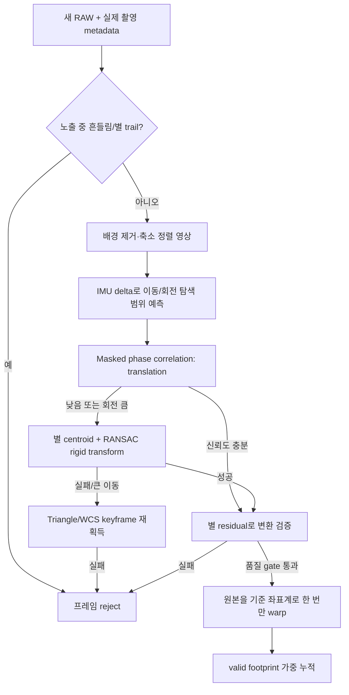

# MF LiveCam 라이브 스택 흔들림 보정 조사와 설계 후보

작성일: 2026-08-13
상태: **조사·설계 후보 / 제품 소스 미반영 / 달 주변 HDR 실험과 별개**

## 1. 범위와 결론

이 문서는 LiveCam RAW 라이브 스택에서 손으로 경통을 건드리거나 마운트가 미세하게
흔들리고 추적 오차·필드 회전이 발생했을 때, 별 상을 같은 위치에 맞추는 방법을
조사한다. 달빛 제거, HDR 촬영, plate solver 입력, 현행 솔빙 캐스케이드는 범위에
포함하지 않는다.

현재 `raw_live_stack.py`는 같은 shape/source/mode의 RAW를 정렬 없이 rolling
mean/sum/max로 누적한다. `mf_raw_live_stack_plan_ko.md`의 Stage 3 정렬과 Stage 4
quality filter는 아직 미구현이다.

PiFinder에 가장 적합한 방향은 단일 알고리즘이 아니라 다음의 **정렬 캐스케이드**다.

1. 노출 중 흔들림을 IMU와 별 모양으로 판정해 흐려진 프레임을 먼저 제외한다.
2. 정상 프레임은 축소·배경 제거 영상의 masked phase correlation으로 빠르게
   평행이동을 구한다.
3. 회전이 무시할 수 없거나 2번의 신뢰도가 낮으면 별 centroid 대응과 RANSAC으로
   회전+평행이동을 구한다.
4. 큰 이동으로 별 대응이 끊겼을 때만 triangle asterism 또는 유효한 plate-solve
   좌표로 기준 프레임을 다시 획득한다.
5. 모든 단계가 실패하면 억지로 누적하지 않고 프레임을 버리거나 새 스택 구간을
   시작한다.



## 2. 먼저 구분해야 할 흔들림

### 2.1 프레임 사이 이동 — 정렬 가능

노출 A와 노출 B 사이에 카메라 방향이 달라졌지만 각 노출 자체의 별이 점으로 찍힌
경우다. 기준 프레임에 대한 변환을 구해 B를 이동·회전시키면 누적할 수 있다.

### 2.2 노출 중 이동 — 일반 정렬로 복구 불가

한 노출이 진행되는 동안 카메라가 움직이면 별 PSF가 선이나 곡선으로 퍼진다. 프레임
전체를 한 번 이동하는 정렬은 퍼진 별을 다시 점으로 만들 수 없다. 복원
deconvolution은 PSF를 정확히 알아야 하고 잡음을 증폭시키므로 라즈베리파이 실시간
스택의 1차 방법으로 적합하지 않다.

이 경우에는 다음 중 하나가 필요하다.

- 실제 노출시간을 줄인다.
- 노출 시작/끝 quaternion 차이 또는 적분 gyro가 한계를 넘으면 프레임을 버린다.
- 별의 elongation/FWHM이 기준보다 커지면 프레임을 버린다.

PiFinder는 이미 일반 카메라 루프에서 노출 전후 IMU quaternion의 전체 각도 차이를
`imu_delta`로 계산한다. 다만 LiveCam `RawFrameInfo`에는 현재 이 값과 노출 시작/끝
quaternion이 전달되지 않으므로 구현 전에 metadata 경계를 보강해야 한다.

### 2.3 회전과 큰 자세 변화

짧은 시간의 작은 흔들림은 평행이동으로 근사할 수 있다. 광축 주위 회전이 있으면
화면 중심에서는 움직임이 작고 가장자리에서는 `반경 × 회전각`만큼 커지므로
translation만으로는 별이 방사형으로 두꺼워진다.

고정 초점의 하늘 영상은 물리적으로 scale이 변하는 장면이 아니다. 작은 움직임에는
2D rigid transform(회전+평행이동), 더 큰 카메라 회전에는 보정된 카메라의
`H = K R K^-1` rotational homography가 맞다. 처음부터 자유도가 높은 affine 또는
homography를 허용하면 잘못 검출한 별에도 과적합할 수 있으므로 단계적으로만 확장한다.

### 2.4 rolling-shutter 변형

IMX296은 global shutter라 빠른 움직임에 의한 rolling-shutter 왜곡이 없다. 반면
PiFinder의 IMX462와 HQ 카메라의 IMX477은 행별로 다른 시각에 노출되는 rolling
shutter이므로 빠른 흔들림에서는 한 개의 rigid transform으로 모든 행을 동시에 맞출
수 없다.

행별 IMU 보정은 이론적으로 가능하지만 sensor readout timing, 카메라-IMU 시간 동기,
카메라-IMU 축 보정이 모두 필요하다. 1차 구현에서는 비강체 보정을 하지 않고 해당
프레임을 motion/shape gate로 제외하는 편이 안전하다.

## 3. 가능한 정렬 방법 비교

| 방법 | 처리 가능한 변화 | 장점 | 약점 | PiFinder 판단 |
|---|---|---|---|---|
| IMU quaternion 차이 | 대략적인 3축 회전 | 영상이 어두워도 동작, 이동 프레임 사전 차단 | BNO055 오차·시간 오프셋·광축 외부보정 때문에 subpixel 정렬에는 부족 | **gate와 탐색 prior** |
| FFT phase correlation | x/y 평행이동 | 빠르고 subpixel 추정 가능, 밝기 scale 변화에 비교적 강함 | 회전 불가, 저SNR에서 불안정, 구름·지상광·고정 결함이 peak를 지배할 수 있음 | **빠른 1차 정렬** |
| 별 centroid + robust matching | 평행이동·회전, 제한된 scale | 별 장면에 직접 맞고 변환 residual로 검증 가능 | 검출 별이 적거나 hot pixel이 많으면 실패 | **주 정밀 정렬** |
| triangle asterism | 큰 이동·회전·scale 차이 | 별 ID를 몰라도 재획득 가능, 누락 별에 강함 | 조합/검출 비용이 크고 hot pixel 정제가 필수 | **keyframe 재획득** |
| plate solve/WCS | 큰 이동, 회전, 하늘 좌표 | 잘 풀리면 가장 명확한 절대 기준 | 매 프레임 수행은 느리고 흐린 프레임에서는 실패 | **드문 anchor/fallback** |
| ECC intensity 정렬 | translation/euclidean/affine/homography | mask와 초기값 사용 가능, 영상 전체 정보를 사용 | 별이 희박한 영상과 큰 초기 오차에 약하고 배경 변화에 끌릴 수 있음 | 2차 비교 후보 |
| sparse optical flow | 선택한 별의 국소 이동 | 여러 별의 이동을 직접 추적 | 점처럼 생긴 희미한 별은 일반 corner보다 불리하며 누적 drift 발생 | 보조 실험 후보 |
| dense optical flow | 위치별 비강체 이동 | rolling shutter·국소 왜곡 모델 가능 | 계산량·오적합 위험이 매우 큼 | 실시간 1차 범위 제외 |

OpenCV의 `phaseCorrelate`는 Fourier shift theorem으로 두 영상의 translation을 찾고
응답값으로 peak 집중도를 제공한다. scikit-image의 `phase_cross_correlation`은
subpixel DFT refinement와 유효 픽셀 mask를 지원하지만, 공식 문서도 phase
normalization이 고잡음에서 항상 최선은 아니라고 명시한다. 그러므로 PiFinder에서는
phase 방식과 비정규화 상관을 실제 저SNR RAW로 비교해야 한다.

Astroalign 계열은 일반 영상의 corner 대신 세 별로 만든 triangle invariant를
대응시키고 RANSAC으로 변환을 확인한다. 별 상은 서로 모양이 비슷해 일반 feature
descriptor가 구분하기 어려우므로, 큰 이동 재획득에는 ORB/SIFT보다 별 좌표 기하가
더 적합하다.

## 4. 권장 정렬 입력 영상

정렬 변환을 찾는 영상과 실제 누적하는 RAW는 분리한다.

```text
native RAW
 ├─ 정렬용: bias/공간 배경 제거 → 2×2 또는 4×4 bin → star-scale band-pass
 │          → edge·포화·결함 mask → transform 추정
 └─ 누적용: 원래 선형 RAW/채널 → 구한 transform을 딱 한 번 적용 → stack
```

정렬용 영상의 권장 처리:

- float32에서 profile bias를 뺀다.
- 큰 배경 그라디언트는 mesh background 또는 Gaussian 차영상으로 제거한다.
- 별 PSF보다 훨씬 작은 hot pixel과 훨씬 큰 구름·광해 구조를 band-pass에서 억제한다.
- sensor edge, 포화 영역, 알려진 warm/hot pixel을 mask한다.
- 연산량을 줄이기 위해 2×2 또는 4×4 bin 영상에서 먼저 이동량을 구하고 원본 좌표로
  환산한다.
- Hann window 또는 valid mask로 FFT의 반대쪽 edge wrap peak를 줄인다.

원본 밝기 영상 자체에 바로 correlation을 걸면 고정 hot pixel, 비네팅, 구름 또는
지상광이 실제 별보다 강한 정렬 기준이 될 수 있다. 반대로 매 프레임의 별 residual을
사용하면 움직이지 않는 sensor 결함은 제거하거나 낮은 가중치를 줄 수 있다.

## 5. 권장 캐스케이드 상세

### 5.1 Gate 0 — 입력 일관성

다음 중 하나면 새 프레임을 기존 스택에 섞지 않는다.

- shape, source, rotation 또는 Bayer/mono 의미 변경
- 실제 exposure/gain이 허용 오차 밖으로 변경
- 설정 변경 직후 transitional frame
- timestamp 역행·중복 또는 frame gap 과다
- 포화/저대비/유효 영역이 최소치 미달

현재 구현은 shape/source/mode/frame-limit 변화만 reset한다. exposure/gain과 실제 촬영
시각까지 확인해야 정렬 신뢰도와 밝기 누적이 함께 보장된다.

### 5.2 Gate 1 — 노출 중 motion blur

초기에는 다음 두 독립 증거 중 하나가 강하면 reject한다.

1. 노출 시작과 끝의 IMU angular delta가 profile별 한계를 넘음
2. 검출된 별의 median elongation 또는 FWHM이 현재 reference보다 크게 악화됨

IMU가 순간 충격을 놓칠 수 있고 별 shape는 저SNR에서 불안정하므로 둘을 같이 기록한
뒤 threshold는 현장 데이터에서 정한다. `moving=true`만 사용하는 것보다 실제 각도와
노출시간을 기록하는 것이 필요하다.

### 5.3 Fast path — masked phase correlation

reference와 current의 축소 residual 영상에서 `(dy, dx)`를 구한다. IMU로 예상한
이동 방향과 최대 범위를 벗어난 FFT peak는 거부한다. 다음 조건을 모두 통과할 때만
translation 결과를 사용한다.

- correlation peak/response가 최소치 이상
- 첫 번째 peak가 두 번째 후보 peak보다 충분히 우세
- 이동 후 valid overlap이 최소치 이상
- 대응 가능한 별 centroid residual의 median/p95가 한계 이하
- 화면 가장자리의 미모델 회전 오차가 허용 픽셀 이하

translation 허용 여부는 고정 회전각보다 다음 식으로 결정하는 편이 profile에 독립적이다.

```text
edge_rotation_error_px ~= usable_radius_px × abs(roll_delta_rad)
```

이 값이 예를 들어 0.5 pixel을 넘으면 다음 rigid-transform 단계로 보낸다. 실제 한계는
별 FWHM과 Web 표시 배율에 따라 실측한다.

### 5.4 Precision path — 별 centroid + RANSAC rigid transform

1. 배경 제거 영상에서 PSF 크기와 면적 gate를 통과한 별 centroid를 뽑는다.
2. IMU/phase 결과를 초기 translation·rotation 범위로 사용해 가까운 후보만 만든다.
3. 최소 3쌍 이상으로 2D rigid transform을 가정하고 RANSAC을 수행한다.
4. inlier 수, inlier 비율, reprojection residual, scale 변화량을 검사한다.
5. 고정 초점에서는 scale을 1로 고정한다. 진단을 위해 scale을 추정하더라도 매우 좁은
   범위를 벗어나면 잘못된 정렬로 판정한다.

자유 affine은 렌즈가 실제로 찌그러진 것이 아니라 잘못 연결된 별을 억지로 맞출 수 있다.
따라서 translation → rigid → calibrated rotational homography 순으로만 자유도를 늘린다.

### 5.5 Recovery path — triangle 또는 WCS keyframe

손으로 크게 움직여 직전 별의 근접 대응이 사라졌을 때 사용한다.

- 밝고 품질이 좋은 별 10~30개로 제한해 triangle invariant를 만든다.
- hot pixel/warm pixel map을 먼저 적용한다.
- 찾은 변환은 사용하지 않은 별의 reprojection residual로 다시 검증한다.
- 최근 plate solve와 정확히 timestamp가 대응하는 경우 그 WCS/roll을 keyframe prior로
  사용할 수 있다.
- 이동이 너무 커 기존 frame과 겹치는 유효 영역이 부족하면 기존 스택에 이어 붙이지
  않고 새 segment를 시작한다.

plate solve 결과가 오래됐거나 현재 LiveCam RAW와 다른 frame이면 정렬 anchor로 쓰지
않는다. 기존 SEP overlay도 timestamp와 frame geometry가 정확히 일치할 때만 재사용한다.

## 6. 기준 프레임과 누적 drift 방지

프레임 A→B, B→C, C→D처럼 직전 프레임 변환을 계속 더하면 작은 오차도 누적된다.
다음 정책을 권장한다.

- 모든 accepted frame은 가능한 한 고정 keyframe K에 직접 맞춘다.
- K와의 직접 정렬이 약할 때만 직전 프레임을 bridge로 사용하되, 합성 변환을 K의 별로
  다시 검증한다.
- reference 별이 화면 밖으로 많이 빠지거나 overlap이 낮아지면 스택을 새 segment로
  끊고 새 keyframe을 선택한다.
- keyframe은 별 수, FWHM, 포화, IMU motion이 가장 좋은 accepted frame으로 선택한다.
- 누적 영상 자체를 다음 정렬의 유일한 reference로 사용하지 않는다. 누적 과정에서
  PSF와 결함이 바뀌어 registration bias가 생길 수 있다.

## 7. 변환 적용과 스택 방식

### 7.1 한 번만 resample

매 프레임은 원본에서 keyframe 좌표로 한 번만 warp한다. 이미 warp한 영상을 반복해서
움직이면 별 PSF가 계속 넓어진다.

- translation-only 후보: Fourier shift와 bilinear/cubic shift를 비교한다.
- Fourier shift는 subpixel 이동에 유리하지만 zero-padding 없이 쓰면 반대 edge로
  wrap되고 날카로운 별 주변에 ringing이 생길 수 있다.
- 회전/rigid 후보: inverse mapping으로 한 번 resample한다.
- interpolation 외부 영역은 0을 실제 하늘값처럼 누적하지 않고 valid footprint=0으로
  표시한다.

```text
sum    += valid_weight × aligned_frame
weight += valid_weight
mean    = sum / max(weight, epsilon)
```

rolling window에서는 오래된 aligned frame의 `valid_weight × frame`과 weight를 함께
빼야 한다. 현재처럼 영상값만 빼면 이동으로 생긴 가장자리의 평균이 잘못된다.

### 7.2 Bayer RAW 주의

컬러 Bayer mosaic를 subpixel 이동한 뒤 마지막에 debayer하면 서로 다른 색 필터 샘플이
섞여 별 주변에 거짓 색과 해상도 손실이 생긴다.

후보는 다음 두 가지다.

1. Pi 성능 우선: Bayer 2×2 cell을 채널 또는 luminance superpixel로 만든 반해상도
   선형 영상에서 정렬·누적한다.
2. 색 품질 우선: 선형 RGB로 demosaic한 뒤 같은 transform을 각 채널에 적용한다.

native Bayer에 임의 subpixel shift를 적용하고 현행처럼 stack 뒤 debayer하는 방식은
채택하지 않는다. mono profile은 선형 RAW에 직접 warp할 수 있다.

## 8. IMU를 사용하는 올바른 범위

PiFinder의 BNO055 loop는 약 30 Hz이며 quaternion, timestamp와 선택적 raw gyro를
제공한다. 활용 우선순위는 다음과 같다.

1. 노출 중 움직임 frame gate
2. 영상 정렬의 최대 shift/rotation과 탐색 방향 제한
3. 별이 적을 때 직전 변환의 단기 예측
4. 충분한 보정 후 `H = K R K^-1` 초기값

IMU만으로 최종 subpixel warp를 결정하는 것은 권장하지 않는다. 카메라와 IMU의 축
정렬 오차, quaternion bias, 30 Hz sampling, 카메라 timestamp와의 지연 때문에 별이
보이는 상황에서는 영상 residual로 반드시 최종 보정해야 한다.

정확한 결합을 위해 향후 metadata에 다음이 필요하다.

- Picamera2 `SensorTimestamp`와 실제 `ExposureTime`
- exposure midpoint에 보간한 IMU quaternion
- exposure 구간의 최대/적분 gyro와 시작/끝 quaternion
- 카메라 광축과 IMU 좌표계의 고정 extrinsic rotation
- profile별 focal length/pixel scale 또는 카메라 intrinsic `K`

Picamera2의 `SensorTimestamp`는 부팅 이후 nanosecond 단위 센서 프레임 시각이다. 현재
LiveCam의 `timestamp=time.time()`은 publish 시각에 가까우므로 IMU 융합용 촬영 시각으로
대체해서는 안 된다. 두 clock의 offset을 측정해 같은 monotonic 시간축으로 변환해야
한다.

## 9. 권장 구현 우선순위

### Phase A — 독립 replay bench

제품 코드에 정렬을 넣기 전에 저장된 짧은 RAW burst로 다음을 비교한다.

- 무정렬 기준
- integer centroid translation
- masked phase correlation translation
- subpixel translation
- star RANSAC rigid transform
- triangle 재획득

원본 burst와 중간 결과는 기본적으로 `/dev/shm/pifinder/live_stack_align/`에 두고,
사용자가 명시적으로 내보낼 때만 SD에 저장한다.

### Phase B — shadow mode

LiveCam 화면에는 아직 적용하지 않고 각 프레임의 변환과 confidence만 계산한다.

```text
frame_id, sensor_timestamp, exposure_us, gain
imu_delta_deg, predicted_dx/dy/roll
method, dx, dy, roll, scale
correlation_response, inliers, residual_median/p95
accepted/rejected, reject_reason, processing_ms
```

로그는 tmpfs를 기본으로 하고 크기/보존시간 상한을 둔다.

### Phase C — translation 적용

confidence가 충분한 프레임에만 translation을 적용한다. 고정 keyframe, valid footprint,
rolling-window 제거가 먼저 완성돼야 한다.

### Phase D — rigid와 재획득

화면 가장자리 별이 두꺼워지는 실측이 있을 때 rigid transform을 켠다. triangle/WCS는
큰 이동 뒤 stack segment 재시작을 판단하는 저빈도 recovery로만 추가한다.

### Phase E — 고급 항목 판단

IMU homography, rolling-shutter row correction, optical flow는 앞 단계의 실패 corpus가
명확할 때만 검토한다.

## 10. 시험 장면과 평가 지표

### 10.1 합성 시험

동일 RAW에 정답이 알려진 변환을 적용한다.

- x/y: 0, 0.25, 0.5, 1, 3, 10, 50 pixel
- roll: 0, 0.02, 0.05, 0.1, 0.5, 2 degree
- 배경/노이즈/별 수 단계
- hot pixel, 구름형 저주파 구조, 포화광 추가
- 일부 frame의 motion blur와 잘못된 exposure 삽입

### 10.2 실장비 시험

- 완전 고정: 정렬이 거짓 움직임을 만들지 않는지
- 느린 무추적 drift
- 경통을 가볍게 건드린 순간 충격
- 천천히 평행 이동
- 광축 주위 회전
- 이동 중 노출해 별 trail 발생
- 별이 적은 영역과 구름 통과
- mono와 color Bayer profile
- `original_raw`와 `cropped_raw`

### 10.3 초기 품질 기준

수치는 독립 replay 결과로 확정하되 다음을 시작점으로 둔다.

```text
false accept = 0
정답 transform이 있는 시험의 registration residual median <= 0.25 px
registration residual p95 <= 0.75 px
고정 장면 stack의 별 FWHM 증가 <= 10%
노출 중 trail frame accept = 0
accepted frame의 valid overlap >= 70%
Pi 4 cropped_raw 정렬+stack p90 <= 300 ms/frame
```

중요한 평가는 preview가 보기 좋은지가 아니라 단일 frame 대비 stack 별의 FWHM,
peak SNR, ellipticity가 개선되는지다. 정렬 성공률만 높이고 별을 넓히는 알고리즘은
실패로 판정한다.

## 11. 최종 권고

첫 구현 후보는 다음의 최소 조합이 가장 안전하다.

```text
노출 중 IMU/별-shape reject
→ 4×4 binned background-subtracted frame
→ masked phase correlation translation
→ 별 centroid residual 검증
→ 원본을 keyframe으로 한 번만 subpixel shift
→ valid footprint weighted rolling mean
```

그 다음 실제로 화면 가장자리 회전 잔차가 확인될 때만 star-RANSAC rigid transform을
추가한다. Triangle matching은 일반 프레임마다 돌리지 않고 큰 이동 후 keyframe을
다시 잡는 용도로 제한한다. 이 구조가 Pi 4 처리량, 오정렬 방지, 별 상 보존 사이의
균형이 가장 좋다.

## 12. 참고 자료

- [OpenCV phaseCorrelate 공식 문서](https://docs.opencv.org/4.13.0/d7/df3/group__imgproc__motion.html)
- [scikit-image phase_cross_correlation 공식 문서](https://scikit-image.org/docs/stable/api/skimage.registration.html)
- [OpenCV ECC·Lucas-Kanade 공식 문서](https://docs.opencv.org/doc/doxygen/html/dc/d6b/group__video__track.html)
- [Astroalign 논문: triangle asterism 기반 천체영상 정렬](https://arxiv.org/abs/1909.02946)
- [SciPy Fourier shift 공식 문서](https://docs.scipy.org/doc/scipy/reference/generated/scipy.ndimage.fourier_shift.html)
- [Picamera2 SensorTimestamp 공식 매뉴얼](https://datasheets.raspberrypi.com/camera/picamera2-manual.pdf)
- [Raspberry Pi IMX296 Global Shutter Camera 사양](https://www.raspberrypi.com/products/raspberry-pi-global-shutter-camera/)
- [FRAMOS IMX462 Rolling Shutter 사양](https://framos.com/products/modules/framos-sensor-modules/fsm-imx462-sensor-module-26365/)
- [기존 RAW Live Stack 계획](mf_raw_live_stack_plan_ko.md)
