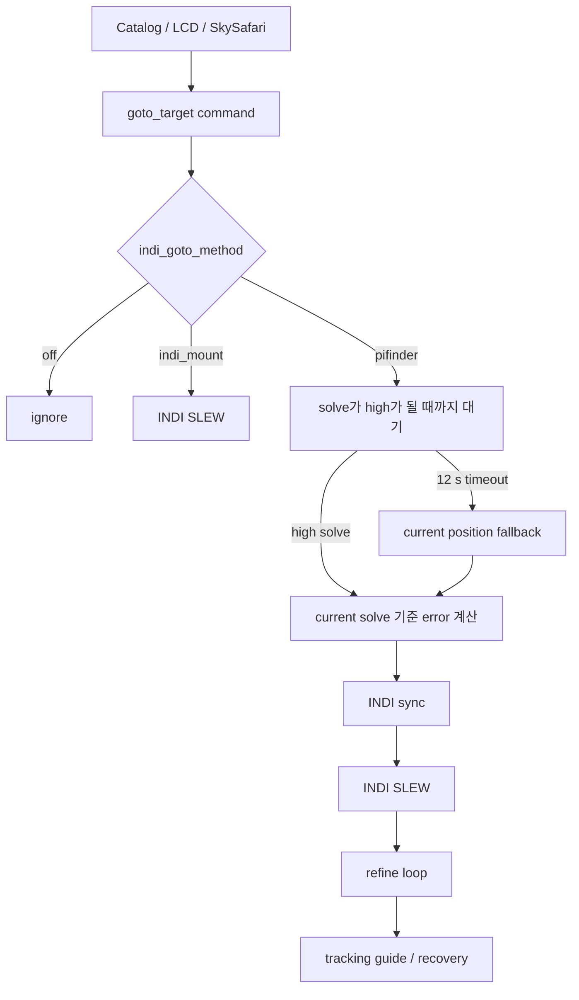
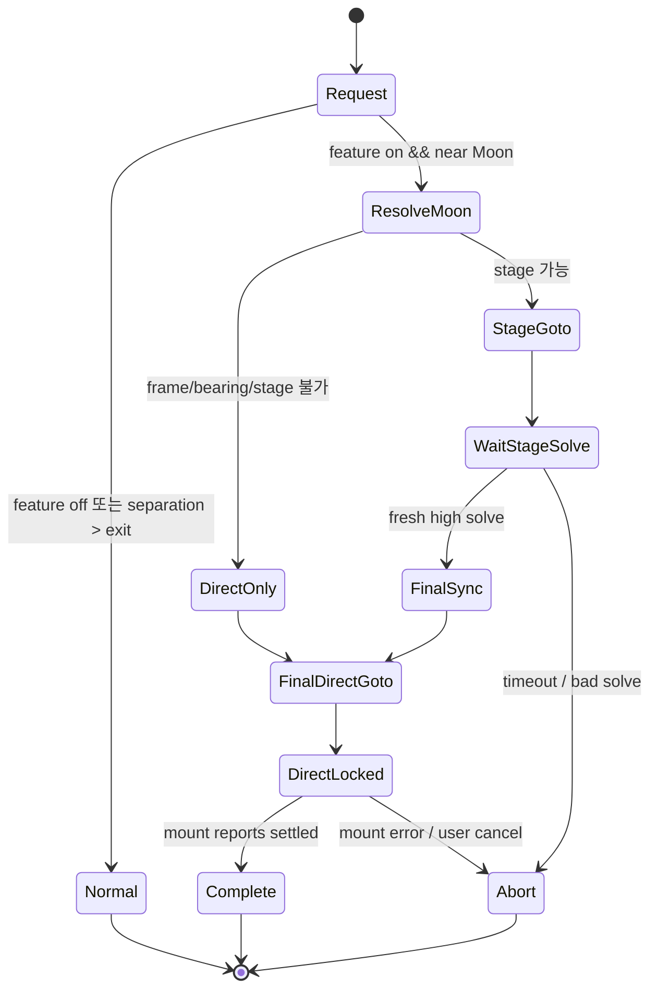

# 달 근접 GoTo 안전 핸드오프 설계

> 상태: 구현 전 설계안
> 범위: INDI GoTo가 켜진 PiFinder, 달 자체 및 달 근처의 모든 GoTo 대상
> 목적: 달빛 때문에 plate solve가 멈추거나 오인식되어도 IMU 추정 좌표를 근거로 mount sync/GoTo가 반복되지 않게 한다.

## 1. 결론

가장 안전한 방식은 이동 중 전역 `indi_goto_method`를 `pifinder`에서 `indi_mount`로 바꾸는 것이 아니다. 설정은 2초 주기로 reload되고, 기존 GoTo/guide loop와 겹칠 수 있다.

대신 `indi_goto_guide_service` 안에 **계획(plan) 단위의 moon-safe direct handoff**를 둔다. 이 기능은 테스트 기간에도 웹 INDI 페이지에서 즉시 On/Off할 수 있으며, 새 설치와 기존 설정에 키가 없는 경우의 기본값은 **On**이다.

1. 대상과 달의 각거리를, 해당 요청의 좌표 frame에서 계산한다.
2. 충분히 떨어져 solve 가능한 stage 지점까지는 기존 PiFinder solve 보정 GoTo를 사용한다.
3. stage에서 신선한 high-quality solve를 얻은 경우에만 한 번 sync한다.
4. 그 뒤 최종 대상(달 또는 달 근처 모든 천체)으로는 INDI `SLEW` GoTo만 수행한다.
5. direct 구간에서는 자동 sync, PiFinder refine, tracking guide pulse, recovery GoTo를 모두 금지한다.

stage를 만들 수 없거나 solve가 timeout이면 **실패 폐쇄(fail closed)** 한다. 즉 IMU/current fallback으로 sync 또는 recovery GoTo를 하지 않는다. 이 판단이 현 문제를 해결하는 핵심이다.

## 2. 현행 소스 분석

### 2.1 요청 진입점

| 진입점 | 현재 좌표/명령 | tracking rate |
| --- | --- | --- |
| LCD `ui/base.py` 숫자 5 | `goto_target` 뒤 `track_freq_command_for_target` | Planet은 ephemeris rate, 정적 대상은 sidereal |
| 웹 catalog `web_catalogs.py` | `_queue_mount_goto()`가 `goto_target` queue 적재 | `/push_planet/moon`은 Moon rate 적용 |
| SkySafari `pos_server.py` | EOD 좌표로 `goto_target` queue 적재 | 좌표가 planet과 일치하면 해당 rate |
| multi-point web 이동 | 별도 multi-point queue | v1 범위 밖 |

`main.py`는 `mount_control=true`일 때 `mountcontrol_queue`, `goto_guide_queue`, `IndiGotoGuideService`를 만들고 구동한다. 현재 test 장비처럼 mount USB가 없어도 service 로직 검증은 가능하지만, 실제 INDI SLEW 검증은 mount가 연결된 환경이 필요하다.

### 2.2 현재 PiFinder GoTo 흐름



현행 `indi_goto_guide_service.py`의 `_tick_goto_wait()`는 `PIFINDER_SOLVE_ANCHOR_WAIT_SECONDS = 12` 동안 `source == "solve"` 및 `quality == "high"`를 기다린다. timeout 뒤에는 경고를 남기지만 `current` 위치를 계속 사용하여 error를 계산하고, 조건을 만족하면 sync+GoTo를 실행한다.

`_tick_tracking_guide_states()`도 tracking recovery 전에 solve anchor를 기다린 뒤 timeout이면 current position으로 `_begin_tracking_recovery_goto()`를 수행한다. 이 경로는 sync 후 GoTo가 되므로, 달 근처에서 solve가 막힌 경우 IMU/fallback 좌표가 실제 mount 좌표로 확정되는 위험이 있다. 소스의 기존 테스트도 이 fallback 동작을 명시적으로 검증한다.

`mountcontrol_indi.py`의 일반 guide correction은 신선한 plate solve가 없으면 correction하지 않는다. 그러나 상위 service의 GoTo/recovery fallback은 별도 경로이므로, 이 보호만으로는 충분하지 않다.

### 2.3 이미 있는 tracking 정책

`track_freq_policy.py`는 대상 identity가 Planet이면 ephemeris 기반 non-sidereal rate를 만든다. Moon은 lunar tracking rate를 받으며, 정적 DSO/별은 sidereal rate를 받는다. SkySafari처럼 좌표만 받은 경우에는 `planet_positions_of_date()`와 0.1도 tolerance로 planet을 판별한다.

따라서 "달 근처"라는 이유로 Moon rate를 강제해서는 안 된다. 최종 tracking rate는 반드시 **최종 대상의 종류**로 정한다.

| 최종 대상 | final GoTo 뒤 rate |
| --- | --- |
| Moon | lunar ephemeris rate |
| Sun / planet | 해당 body ephemeris rate |
| DSO / star / unknown static | sidereal rate |

## 3. 좌표 frame과 달 기준점

이 기능에서 가장 중요한 입력은 `target–Moon separation`이다. 둘을 다른 epoch/frame으로 비교하면 stage 방향 자체가 틀어진다.

| 요청 종류 | 현재 관례 | Moon reference |
| --- | --- | --- |
| PiFinder catalog, LCD, web planet push | catalog/J2000 관례. `sf_utils.calc_planets()` 결과도 이 경로 | 같은 `calc_planets()`의 Moon J2000 |
| SkySafari / OnStep coordinate request | `EQUATORIAL_EOD_COORD`, equinox-of-date (JNow) | `track_freq_policy.planet_positions_of_date()`의 Moon EOD |
| frame을 알 수 없는 legacy command | 불명 | 안전 stage 계산 금지 |

`test_track_freq_policy.py`에는 J2000과 EOD를 섞으면 약 22 arcmin mismatch가 생길 수 있음을 확인하는 테스트가 있다. 구현 전에 static catalog의 frame을 audit하고, 각 entry point가 다음 metadata를 넣도록 한다.

```text
target_meta = {
  label: "Moon" | catalog name,
  target_kind: "planet" | "static" | "unknown",
  body_name: "MOON" | optional,
  coordinate_frame: "catalog_j2000" | "equinox_of_date" | "unknown",
  origin: "lcd" | "web_catalog" | "web_planet" | "skysafari"
}
```

기존 queue producer와 호환을 위해 metadata가 없는 `goto_target`은 계속 처리한다. 단 moon-safe 기능을 켠 경우 frame이 `unknown`이면 stage를 계산하지 않고 direct-only 또는 명시적 거부 중 설정된 fail-closed policy를 사용한다.

## 4. 제안 상태기계



`DirectLocked`는 일반 `indi_mount` mode와 달리, stage에서 얻은 solve anchor에 대한 audit 정보를 보존한다. 하지만 공통 안전 속성은 같다. 그 상태에서는 다음을 수행하지 않는다.

- 최종 대상 부근의 plate solve를 mount sync origin으로 채택
- PiFinder refine loop
- tracking guide pulse
- tracking recovery sync/GoTo
- timeout current position fallback
- 수동 retarget 자동 보정

사용자가 새 GoTo를 요청하거나 cancel하면 plan을 종료한다. config 변경은 진행 중 plan을 바꾸지 않고, 다음 plan부터 적용한다.

## 5. stage 기하

기본값은 IMX462의 약 10.38도 수평 FOV와 달 주변 산란광을 고려해 enter 20도, exit/stage 25도로 시작한다. enter/exit hysteresis로 경계에서 모드가 반복 전환되는 것을 막는다.

| 설정 | 초기값 | 의미 |
| --- | ---: | --- |
| `moon_safe_goto_enabled` | `true` | 달 근접 GoTo 안전 핸드오프 사용. 웹 INDI 페이지에서 On/Off |
| `moon_safe_goto_enter_deg` | `20.0` | 이 안쪽이면 moon-safe plan |
| `moon_safe_goto_exit_deg` | `25.0` | 해제/재진입 hysteresis 기준 |
| `moon_safe_goto_stage_deg` | `25.0` | Moon 중심에서 stage까지 거리 |
| `moon_safe_goto_require_solve_age_s` | `8.0` | sync에 쓸 solve freshness |
| `moon_safe_goto_solve_wait_s` | `12.0` | stage solve 최대 대기 |
| `moon_safe_goto_fail_closed` | `true` | stage solve 실패 시 sync 금지 |
| `moon_safe_goto_auto_resume` | `false` | 실패 후 자동 재시도 금지 |

유효성: `stage_deg >= exit_deg > enter_deg > 0`이며 모든 값은 설정 가능한 상한(예: 60도) 안이어야 한다.

달의 unit vector를 `m`, target unit vector를 `t`라 할 때, target 방위를 향하는 달 중심의 접선 방향은 다음과 같다.

```text
u = normalize(t - dot(m, t) * m)
stage = normalize(cos(stage_distance) * m + sin(stage_distance) * u)
```

RA/Dec로 `stage`를 다시 변환해 INDI stage GoTo에 사용한다. target이 Moon 자신이면 `t`와 `m`이 같아 방위가 정해지지 않는다. 이 경우에는 마지막 신뢰 가능한 high solve의 시선 방향으로 outward bearing을 정하고, 그것도 없으면 **direct-only**로 간다. 임의의 RA 방향을 선택해서는 안 된다.

## 6. 명령 및 service 설계

### 6.1 queue contract

기존 payload를 확장한다.

```text
{
  type: "goto_target",
  ra: <hours>, dec: <degrees>,
  target_meta: <optional object>
}
```

producer는 행성 이름 또는 catalog object identity가 있을 때 metadata를 채운다. SkySafari는 raw EOD 좌표임을 표시한다. legacy caller는 그대로 동작한다.

### 6.2 plan snapshot

`indi_goto_guide_service.py`에 `MoonSafeGotoPlan`(또는 동등 dataclass)을 추가한다.

```text
request + target_meta + validated moon-safe config snapshot
  -> frame별 Moon reference resolve
  -> separation / stage decision
  -> stage target, final target, final tracking policy, timestamps
```

전역 `_config`를 각 tick에서 다시 해석하지 않는다. 새 요청 시 snapshot을 만들고, 그 plan이 끝날 때까지 동일한 threshold와 fail-closed 값을 쓴다. 이는 config reload와 motion state의 경쟁을 제거한다.

`_tick_goto_wait()`와 `_tick_tracking_guide_states()`에는 다음 guard가 먼저 들어가야 한다.

```text
if active_plan.direct_locked:
    return  # no sync/refine/guide/recovery from local position
```

stage wait는 기존 fallback을 재사용하지 않는다. `fresh high solve` 조건은 source solve, quality high, finite RA/Dec, age <= configured freshness, 그리고 stage target과의 최대 허용 오차를 동시에 만족해야 한다. timeout은 `Abort` 상태와 사용자에게 보이는 원인을 남긴다.

### 6.3 final direct command의 순서

```mermaid
sequenceDiagram
  participant P as GoTo service
  participant S as Solver/current position
  participant M as INDI mount
  P->>M: SLEW(stage)
  P->>S: fresh high solve 대기
  alt valid stage solve
    P->>M: SYNC(stage solve) 단 1회
    P->>M: target tracking rate 설정
    P->>M: SLEW(final target)
    P->>P: direct_locked=true; guide/recovery off
  else timeout / invalid solve
    P->>P: abort; no sync; no recovery GoTo
  end
```

tracking rate는 final `SLEW` 직전에 한 번 적용한다. 현재 LCD/web/SkySafari entry point에서 별도로 넣는 rate command는 normal path 호환을 위해 남긴다. moon-safe plan에서는 service가 plan metadata를 기준으로 authoritative final rate를 보장하고, entry의 선행 rate가 있더라도 final rate가 덮어쓴다.

## 7. 변경 위치

| 파일 | 변경 내용 |
| --- | --- |
| 신규 `moon_safe_goto.py` | frame별 separation, spherical stage geometry, validation을 가진 순수 함수. INDI/queue side effect 없음 |
| `indi_goto_guide_service.py` | plan 생성, stage/final 상태, direct lock, timeout fail-closed, status 노출 |
| `web_catalogs.py` | catalog/planet push에 `target_meta` 추가 |
| `ui/base.py` | LCD target identity/frame metadata 전달 |
| `pos_server.py` | SkySafari EOD origin/frame metadata 전달 |
| `track_freq_policy.py` | 공용 body/rate resolver 공개 API를 추가하거나 metadata 기반 helper 추가. 기존 matching API 유지 |
| `default_config.json` | `moon_safe_goto_enabled: true` 및 threshold/fail-closed 기본값 추가 |
| `server.py` | INDI page render context, `/indi/goto_guide` checkbox parse·검증·persistent save |
| `views/indi_mount.html` | GoTo / Guide Settings의 Moon-safe On/Off checkbox와 설명 |
| `config.py` | atomic replace 뒤 parent directory `fsync`를 추가해 설정 rename의 전원 차단 내구성 보강 |
| `mountcontrol_indi.py` | 일반 SLEW/SYNC API 재사용. safety policy를 여기로 옮기지 않음 |

multi-point controller, LiveCam HDR/stack, plate solver algorithm, mount driver의 저수준 protocol은 v1에서 수정하지 않는다.

## 8. 웹 INDI 설정과 전원 후 유지

`python/views/indi_mount.html`의 기존 **GoTo / Guide Settings** form에 다음 checkbox를 추가한다.

```text
[x] Moon-safe GoTo handoff near the Moon
    Use a solved outer stage and a final direct INDI slew.
    No fallback sync, guide correction, or recovery GoTo near the Moon.
```

`python/PiFinder/server.py`의 `_indi_config_values()`가 현재 checkbox value를 render context로 제공하고, 동일한 `/indi/goto_guide` POST handler가 `moon_safe_goto_enabled`를 저장한다. 이 위치를 쓰면 기존 INDI 인증(`@auth_required`), Apply 버튼, 설정 화면 갱신 방식과 일관된다.

| 요구 | 설계 |
| --- | --- |
| 기본값 On | `default_config.json`, server render fallback, goto service config fallback을 모두 `true`로 둔다. 키가 없는 기존 `config.json`도 On으로 해석한다. |
| 사용 중 On/Off | checkbox를 바꾸고 **Apply GoTo / Guide Settings**를 누른다. 변경은 다음 GoTo plan부터 적용하며 진행 중 plan은 snapshot을 유지한다. |
| 정상 재시작 후 유지 | `Config.set_options({"moon_safe_goto_enabled": value})`로 `utils.data_dir/config.json`에 저장한다. session key를 사용하지 않는다. |
| 갑작스러운 전원 차단 후 유지 | 현재 Config의 temp-file `fsync` + atomic `os.replace()` 흐름을 사용하고, 구현 시 replace 뒤 parent directory도 `fsync`해 rename metadata까지 durable commit으로 만든다. 저장 성공 응답은 이 완료 뒤에만 보낸다. |
| 저장 실패 | 이전 값으로 유지하고 HTTP/UI error를 표시한다. service에는 reload command를 보내지 않는다. |

설정 On/Off는 mount driver의 INDI `CONFIG_SAVE`가 아니라 PiFinder의 persistent config에 속한다. INDI mount가 연결되지 않은 test device에서도 저장·reload·다음 plan 선택을 검증할 수 있어야 한다.

## 9. 상태 및 UI 계약

기존 goto/guide status에 다음처럼 read-only 진단 필드를 추가한다.

```text
moon_safe: {
  active, phase, target_label, target_kind,
  coordinate_frame, separation_deg,
  stage_ra, stage_dec, stage_solve_age_s,
  final_direct_locked, sync_count,
  fail_reason
}
```

UI에는 `moon-safe stage`, `waiting stage solve`, `direct final slew`, `aborted: no safe solve`를 표시한다. "solve timeout, fallback sync"처럼 보이는 모호한 상태는 허용하지 않는다. `sync_count`는 moon-safe plan에서 0 또는 1이어야 하며, 2 이상이면 invariant 위반으로 error를 남긴다.

## 10. 안전 불변조건

1. 달 근접 plan은 stale/IMU/current fallback 좌표로 `sync_mount()`를 호출하지 않는다.
2. final direct SLEW 후 local solve는 display/diagnostic만 가능하며 mount correction 입력이 될 수 없다.
3. target–Moon separation은 같은 coordinate frame에서만 계산한다.
4. tracking rate는 Moon proximity가 아닌 target identity로 정한다.
5. `direct_locked` plan에서는 guide pulse 및 recovery GoTo가 0회다.
6. stage sync는 fresh high solve에서 최대 한 번이다.
7. cancel, mount fault, stale telemetry는 safe abort하며 자동으로 PiFinder recovery를 시작하지 않는다.
8. feature가 기본 On이더라도, 달 근접이 아닌 요청과 명시적으로 Off인 요청은 기존 흐름을 보존한다.
9. checkbox의 사용자 선택은 persistent config commit이 성공한 뒤에만 성공으로 표시되며, 재기동 뒤 같은 값으로 restore된다.

## 11. 테스트 설계

| 층 | 검증 |
| --- | --- |
| 순수 unit | RA wrap, pole 부근, antipodal 입력, Moon target bearing, frame mismatch reject, stage 거리/방향 |
| config unit | 범위, `stage >= exit > enter`, snapshot immutability |
| web/persistence unit | 기본 On render, checkbox On/Off POST, config reload, 새 `Config` instance 및 service restart 뒤 값 restore, write/rename failure 시 이전 값 보존 |
| service unit | stage valid solve는 sync 1회+final SLEW 1회, timeout은 sync 0회, direct lock에서 guide/recovery 0회 |
| entry unit | LCD/web catalog는 J2000 metadata, SkySafari는 EOD metadata, legacy queue는 기존 normal path |
| tracking unit | Moon/planet/DSO 각각 final rate가 맞고 달 근접 DSO가 lunar rate가 아님 |
| regression | 기존 `indi_mount` mode deactivation, existing Pifinder fallback behavior는 feature off에서 그대로 |
| hardware dry run | mount 없이 fake mount queue로 상태/state ordering 검증 |
| hardware integration | 안전한 daylight/parked test mount에서 stage SLEW, single sync, final SLEW telemetry 및 abort 버튼 검증 |

특히 지금 보고된 재현 조건을 자동 시험으로 고정한다: stage 이후 final target 부근에서 12초 동안 high solve가 전혀 오지 않아도 sync/recovery GoTo가 추가로 발생하지 않아야 한다.

## 12. 단계적 도입

1. 순수 geometry/frame resolver와 unit test를 먼저 추가한다.
2. feature flag default On, 웹 On/Off, durable persistent save를 연결하고 fake mount test를 통과시킨다. 웹에서 Off를 선택하면 기존 PiFinder 동작을 명시적으로 재현할 수 있어야 한다.
3. test device에서 mount 없이 command ordering과 fail-closed 상태를 확인한다.
4. 실제 INDI mount는 낮은 위험의 비달 target으로 stage/final/cancel을 검증한다.
5. 달 가장자리, 달 근처 DSO, 달 자체 순으로 수동 검증한다. 각 run의 separation, stage solve age, sync count, final rate를 기록한다.
6. 테스트 기간에도 기본값은 On으로 유지하되, 위험을 비교하거나 기존 동작을 확인할 때만 웹에서 Off로 전환한다. 각 실행에서는 설정값도 기록한다.

## 13. 구현 전 확정할 사항

- static catalog 좌표의 정확한 epoch/frame을 source와 data file까지 audit한다.
- Moon itself의 stage bearing을 위해 사용할 마지막 solve의 freshness/quality 기준을 확정한다.
- direct-only가 가능한 mount driver에서 final slew completion을 어떤 INDI property로 판정할지 확인한다.
- 20/25도 초기값은 현장 산란광과 camera lens에 맞춰 profile화할지 결정한다.
- multi-point 이동에도 같은 policy를 적용할지는 v1 검증 후 별도 설계한다.

이 설계는 달을 target으로 하든 달 주변의 임의 천체를 target으로 하든 동일하게 적용한다. 중요한 경계는 "달 근처인가"가 아니라, **신뢰 가능한 plate solve를 mount coordinate correction에 써도 되는 구간인가**이다.
