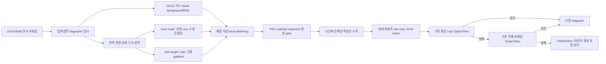
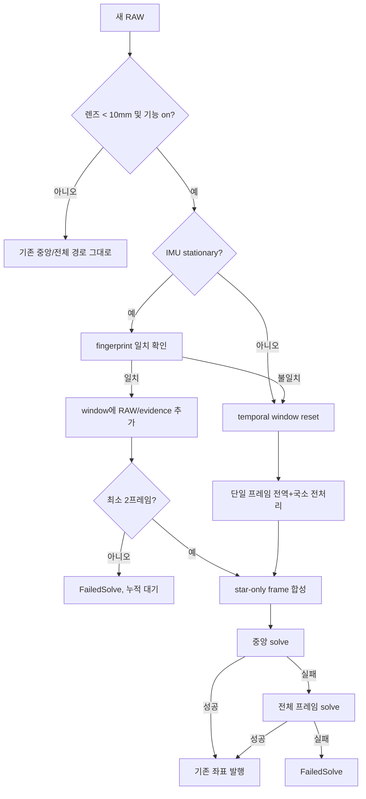

# MF 별빛 보존 RAW 전처리 및 중앙/전체 프레임 솔빙 설계

최종 업데이트: 2026-09-04

## 1. 결정과 목표

6mm 광각에서 타일별 솔빙은 달·건물광을 피해 여러 타일을 실제로 풀 수 있었지만,
주변 왜곡에 따른 위치/Roll 편차와 합의군 선택 문제 때문에 안정적인 좌표 발행 경로로
사용하지 않는다. 신규 광각 경로는 타일 솔빙을 중단하고 기존의 다음 두 단계만 유지한다.

1. 기존 중앙 crop 솔빙
2. 기존 전체 프레임 솔빙

두 솔버에 넣기 전에 원본 16-bit RAW에서 달, 건물광, 포화 halo, 구름의 큰 구조를
제거하고 별과 유사한 점광원 신호만 남긴다. 핵심 목표는 단순한 밝기 임계값이 아니다.
구름 사이로 잠시 보이는 별과 흐린 별도 여러 프레임의 약한 증거를 누적해 보존해야
한다.

타일 코드는 즉시 삭제하지 않고 feature flag를 끈 채 rollback 자료로 남긴다. 신규
코드는 기존 원본을 최소 변경하기 위해 `mf_` 접두 파일에 격리한다.

## 2. 2026-08-26 기준 데이터

신규 고정 corpus:

`PiFinder_data/captures/mf_replay/20260826_0016_star_only_preprocess_6mm`

- `imx462_color + 6mm`, 200ms, gain 29.512
- 중앙 달, 하단 건물광, 밝은 halo와 일부 구름, 상단 별
- lossless 16-bit RAW 20장, 모두 고유 frame ID이고 시간 순서가 단조 증가
- 전체 포화율 5.54–5.62%, median 12-bit ADU 2121–2126
- 기존 SEP 27–40개, clear-window gate 후 9–14개
- 픽셀 시간 표준편차 median 127 ADU, p90 186, p99 228
- 촬영 전 mean-10 스택도 별도 보존
- 재현 스크립트 `analyze_star_only.py`, 네 개의 star-only TIFF와
  `analysis.json`을 같은 디렉터리에 보존

함께 사용하는 회귀 corpus:

- `20260825_2248_cloud_6mm`: 구름 구조 오검출
- `20260825_2305_cloud_6mm`: 어두운 clear window의 반복 점광원
- `20260825_2324_cloud_gate_live_6mm`: 구름 통과와 정상 다중 타일 해
- `20260825_2334_moon_building_6mm`: 중앙 달·하단 건물광
- `20260825_2352_manual_exposure_sweep_6mm`: 50–400ms 노출 비교
- `20260826_0006_manual_mean10_stack_6mm`: mean-10에서 별 SNR 개선
- 기존 맑은 별 필드 및 16mm 정상 solve corpus

## 3. 전체 블록 다이어그램



## 4. 처리 원칙

### 4.1 좌표 불변

왜곡 보정을 위한 resample, 축소, 확대를 하지 않는다. 배경값과 신뢰도만 바꾸며 별의
centroid 위치는 원본 센서 좌표를 유지한다. 출력은 원본과 같은 높이·너비의 16-bit
star-only frame이다.

### 4.2 전역 hard mask는 최소화

전체 프레임 통계와 큰 연결 성분으로 다음만 완전히 제외한다.

- 센서 full scale의 98% 이상인 포화 core
- 포화 core에 연결된 큰 halo의 내부 안전 반경
- 여러 프레임에서 같은 위치와 넓이로 반복되는 고정 건물광/기구 구조
- 센서 가장자리의 기존 금지 영역

구름은 hard mask로 지우지 않는다. 구름 셀에도 별이 보일 수 있으므로 배경과 RMS에
따른 soft weight만 낮춘다. 달/건물광 mask도 과도하게 팽창시키지 않고, mask 밖의
점광원은 계속 평가한다.

### 4.3 10×10 국소 처리와 다중 scale

10×10 full-resolution cell마다 sigma-clipped median과 MAD 기반 RMS를 구한다. 셀
경계가 별 centroid를 이동시키지 않도록 background/RMS map은 bilinear interpolation
한다. 10×10만 사용하면 큰 halo 기울기를 놓치므로 32×32 및 96×96 robust background를
함께 계산한다.

```text
B(x,y) = robust combination(B10, B32, B96)
Z(x,y) = max(0, RAW(x,y) - B(x,y)) / max(RMS10(x,y), noise_floor)
```

별이 포함된 cell이 스스로 background를 올리는 것을 막기 위해 상위 outlier를 반복
제외한 median을 사용한다. 국소 밝기가 높다는 이유만으로 cell 전체를 버리지 않는다.

IMX462 컬러 RAW는 네 Bayer 위상의 median이 약 1,800–2,473 ADU로 크게 다르다. 네
위상을 섞어서 배경을 계산하면 이 차이가 고주파 점광원처럼 남는다. 따라서 10/32/96
배경과 MAD RMS, DoG 응답을 각각의 2×2 CFA 위상에서 독립 계산한 뒤 원래 픽셀 위치에
다시 합친다. demosaic/resample을 하지 않으므로 solver centroid 좌표는 바뀌지 않는다.

### 4.4 PSF 증거

whitened residual에 3×3/5×5 Gaussian matched filter를 적용한다. 다음 특성은 별
신뢰도를 올린다.

- 양의 중심 peak와 주변으로 감소하는 profile
- 제한된 semi-major 크기와 원형도
- 작은 connected area
- 인접 프레임에서 비슷한 centroid

넓은 구름 결, 달 halo, 건물 모서리는 gradient/면적/비대칭 때문에 낮은 가중치를
받는다. 단일 프레임의 강한 peak 하나만으로 최종 star-only 출력에 full strength를
주지 않는다.

### 4.5 희미한 구름 사이 별 보존

단순 temporal median은 절반 미만의 프레임에서 보인 별을 삭제하므로 사용하지 않는다.
각 프레임의 local-whitened PSF evidence를 누적한다.

```text
E = sum(clamp(Z_psf, 0, z_cap) * inverse_variance_weight)
P = number of frames with Z_psf >= weak_threshold
star_strength = E * persistence_weight(P, N)
```

- `P>=2`인 약한 반복 신호는 보존한다.
- 한 프레임에서만 나타난 구름 glint/cosmic/hot 신호는 강도를 제한한다.
- 흐린 프레임도 weight를 낮출 뿐 0으로 만들지 않는다.
- warm-pixel map과 고정 위치 반복성은 별 지속성과 별도로 먼저 제거한다.

시간 반복만으로는 고정 hot pixel도 별로 강화되므로 공간 PSF gate를 함께 적용한다.
약한 임계값을 넘은 연결 성분 중 3–30픽셀인 compact component만 인정하고, 인정된
core 둘레 3픽셀만 원래 residual을 복원한다. 반복 compact component는 100%로
보존한다. 한 프레임에서만 나타난 후보는 그 프레임 안에서 독립적으로 3.5σ 이상의
compact component를 형성할 때만 20% 강도로 보존한다. 서로 다른 프레임의 약한
픽셀들을 합쳐 단일 PSF를 만드는 것은 금지한다. 단일 픽셀과 큰 구름 결은 제거된다.
거의 모든 배경이 0이 되어 SEP의 RMS가 0이 되는 수치적 특이점을
막기 위해 출력에는 64 ADU pedestal와 ±3 ADU의 결정론적 저레벨 dither를 넣는다.
이 dither만 있는 제어 영상에서는 SEP 후보가 검출되지 않는다.

초기 window는 5프레임으로 시작하고 10프레임은 오프라인 비교 대상으로 둔다. 200ms
기준 5프레임은 약 1초의 광자 정보를 제공하면서 이동 시작 시 stale 좌표 위험을
제한한다.

## 5. 상태기계와 순서도



window fingerprint에는 camera type/format, lens/manual focal, RAW shape, rotation,
active calibration ID가 포함된다. 좌표계가 달라지는 항목이 바뀌면 즉시 reset한다.
노출과 gain은 각 프레임의 local background/noise 정규화로 흡수하므로 fingerprint에서
제외한다. 따라서 framewise auto exposure가 동작해도 최초 warm-up을 반복하지 않는다.

## 6. 기존 솔버 연결

- `mf_star_only_preprocess.py`: 전역/국소 background, mask, PSF evidence,
  temporal accumulator, star-only frame 생성
- `mf_star_only_state.py`: fingerprint와 작은 ring buffer, 진단값
- `solver.py`: 광각 feature gate와 중앙/전체 입력 frame 선택만 최소 추가
- 기존 Cedar/Tetra, target-pixel, Integrator 계약은 변경하지 않는다.
- `mf_wide_solver.py` 타일 호출은 실행하지 않는다. 소스는 rollback을 위해 보존한다.

star-only 처리가 예외/NaN/shape 불일치를 만들면 광각에서는 fail-closed로 좌표를
보류한다. 오염된 원본으로 자동 fallback해 구름/달 오발행 위험을 되살리지 않는다.
10mm 이상 또는 기능 off에서는 기존 동작을 그대로 유지한다.

## 7. 진단 API/로그

프레임마다 다음을 기록한다.

- window frame count와 reset reason
- saturation/hard-mask/soft-cloud 비율
- local RMS median/p90
- PSF evidence 후보 수, 반복 후보 수, star-only 최종 후보 수
- 중앙/전체 각각 centroid, matches, RMSE, solve 결과
- 처리 시간과 전체 solve latency

LiveCam에는 원본/배경/star-only/mask를 전환해 볼 수 있는 진단 preview를 추가하되,
기본 화면은 기존 영상을 유지한다.

Input Frame의 `Star-only preprocessing (5 frames)` 항목으로 star-only 결과를 직접
확인할 수 있다.

2026-09-03 이후 solver 전처리는 기본 ON이다. LiveCam의 `Solver preprocessing`
체크박스로 끌 수 있으며 변경값은 `livecam_solver_preprocess_enabled` 설정에 저장되어
브라우저 새로고침과 서비스 재시작 뒤에도 마지막 상태를 복원한다. 이 설정은 preview
processing ON/OFF와 독립적이다.

### 7.1 2026-09-04 LiveCam 표시 경로 정합성

solver 전처리가 ON이면 LiveCam의 star-only 입력은 카메라 프로세스에서 별도의 5프레임
window를 만들지 않는다. solver가 Cedar/SEP에 실제로 넘긴 최신 star-only 16-bit frame을
공유 상태에 게시하고, LiveCam은 그 동일한 frame과 다음 상태를 읽어 표시한다.

- `warming`: 현재 누적 수가 5프레임보다 작음
- `ready`: 최신 production star-only frame을 표시 중
- `waiting_for_stars`: 누적은 됐지만 보존할 반복 별 증거가 아직 없음
- `reset_moving`, `reset`, `fingerprint_changed`: 실제 전처리 window가 초기화됨
- `error`, `preview_error`: 전처리 또는 진단용 frame 게시 오류
- `disabled`: solver 전처리가 꺼짐

따라서 원본/cropped/star-only 선택을 바꾸는 행위만으로 production temporal window를
초기화하지 않는다. star-only를 선택한 첫 응답부터 이미 누적된 최신 상태와 frame을
표시하며, frame ID가 같아도 producer/source가 바뀌면 브라우저가 이미지를 다시 읽는다.
Live Stack이 켜져 있다면 서로 다른 입력 영상을 섞지 않기 위해 Live Stack 결과만
초기화되며 solver 전처리 누적에는 영향을 주지 않는다.

solver 전처리가 OFF일 때만 기존 카메라 측 star-only 누적기를 진단용 fallback으로
사용한다. 이 경우에는 star-only 선택 직후 1/5부터 새로 누적되는 것이 정상이다. 반대로
IMU 이동, RAW shape·format·회전·보정 변경, 전처리 오류처럼 production window가
실제로 무효화되는 사건에서는 오래된 star-only frame을 즉시 지워 화면과 solver 상태가
어긋나지 않게 한다. 공유 상태 게시 실패는 좌표 솔빙을 중단시키지 않도록 best-effort로
격리한다.

## 8. 단계별 구현

1. **P0 데이터 고정**: 현재 20 RAW와 기존 corpus checksum/metadata 문서화
2. **P1 오프라인 단일 프레임**: multi-scale background와 최소 hard mask 구현,
   centroid 이동 0 검증
3. **P2 시간축 보존**: 5/10프레임 evidence 비교, 흐린 별 recall과 구름 false
   positive 평가
4. **P3 기존 중앙/전체 오프라인 solve**: 타일 없이 solve rate/RMSE 비교
5. **P4 shadow 연결**: 좌표 발행 없이 실시간 진단만 수집
6. **P5 opt-in 발행**: IMU 정지/reset/fail-closed 검증 후 광각에서만 활성
7. **P6 타일 경로 비활성 확정**: 충분한 야간 회귀 뒤 UI/문서 정리

### 8.1 2026-08-26 구현/검증 상태

- P0 완료: 동일 조건 16-bit RAW 20장과 frame metadata 보존
- P1 완료: `mf_star_only_preprocess.py`에 CFA 분리 multi-scale background,
  큰 포화 성분 hard mask, soft illumination weight, DoG evidence 구현
- P2 5프레임 경로 완료: 반복 compact PSF와 단일 cloud-gap PSF의 차등 보존 구현
- P3 현재 corpus 완료: 원본은 네 묶음 모두 solve 실패, star-only는 네 묶음 모두
  기존 SEP 중앙 단계에서 solve 성공
- P4 보류: 중·대 스케일의 사용하지 않는 RMS 계산을 제거한 뒤 단일 프레임 처리
  시간은 약 1.37초에서 1.12–1.21초로 줄었고 출력은 픽셀 단위로 동일했다. 그러나
  여전히 기존 실시간 solver loop에 동기 연결하기에는 크므로, 다음 단계에서 저해상도
  background map/버퍼 재사용 또는 별도 worker를 적용한 뒤 shadow로 연결한다.

| RAW 묶음 | 중앙 SEP 수 | Matches | RMSE | RA (deg) | Dec (deg) | Roll (deg) |
|---|---:|---:|---:|---:|---:|---:|
| 01–05 | 20 | 11 | 78.3″ | 313.94483 | -20.09536 | 349.20308 |
| 06–10 | 21 | 13 | 79.9″ | 313.95723 | -20.12025 | 349.24864 |
| 11–15 | 16 | 8 | 86.0″ | 313.98997 | -20.12732 | 349.24413 |
| 16–20 | 29 | 15 | 82.6″ | 314.04517 | -20.09393 | 349.28887 |

20장 촬영 구간은 약 20.9초이고 중앙 해의 RA 이동은 0.1003°이다. 고정 관측 방향의
항성시 이동 예상량 약 0.087°와 같은 규모이며 Dec 편차와 Roll 편차도 각각 약
0.033°, 0.086° 범위다. 네 독립 해가 같은 하늘을 연속 추적한 것으로 판단한다.
Cedar 검출만으로는 아직 풀리지 않았으므로 현재 성공 근거는 기존 중앙/전체 계단의
SEP 단계이며, 실시간 연결 시에도 Cedar 성공을 필수 조건으로 삼지 않는다.

## 9. 승인 기준

- 모든 cloud/Moon/building corpus에서 잘못된 catalog 좌표 0
- 기존 맑은 6mm/16mm 성공 frame의 solve recall 저하 0 또는 사전 합의 범위
- 구름 사이 반복 별은 2프레임 이상이면 hard mask 때문에 일괄 삭제되지 않음
- star-only 전후 catalog-matched centroid 이동 median <0.1px, p95 <0.25px
- 중앙 우선 및 전체 fallback 순서 유지
- IMU 이동/렌즈/RAW 좌표계/회전 변경 즉시 window reset; 노출/gain 변경은 누적 유지
- 처리+solve latency가 관측용 허용 범위 안이며 메모리 상한 고정

## 10. 현재 결론

mean-10 실측은 별 수와 match 수를 크게 늘렸지만, LiveCam 스택은 현재 solver 입력이
아니며 단순 평균은 이동 시 stale/blur 위험이 있다. 신규 구현은 mean image를 그대로
연결하지 않고 local-whitened PSF evidence를 짧게 누적한다. 이렇게 해야 구름 사이의
희미한 별을 살리면서 달·건물광·구름 구조를 동시에 억제할 수 있다.

현재 corpus에서는 이 원리가 실제 중앙 solve 4/4로 확인됐다. 다만 처리 지연 최적화,
IMU 이동 reset, 다른 구름/맑은 하늘/16mm 회귀를 마치기 전에는 좌표 발행 경로를
활성화하지 않는다. 타일 solver 설정은 비활성 상태를 유지한다.

검증 상태는 신규 단위 테스트 9개, Ruff, 신규 모듈 mypy가 통과했다. 저장소 전체
테스트는 1,909 passed, 177 skipped이며 이번 파일과 무관한 기존 logging/RA·Dec UI/
UI smoke coverage 테스트 11개가 실패했다. 이 11개는 본 기능 범위에서 수정하지 않는다.

### 10.1 2026-08-27 박명·얇은 구름 회귀

`PiFinder_data/captures/mf_replay/20260827_2016_twilight_thin_cloud_6mm`에
6mm, 100ms, gain 29.512의 고유 RAW 15장을 보존했다. 원본은 묶음별 Cedar 1개,
SEP 3–8개로 솔빙에 필요한 실제 별이 부족했다. 이전 단일-frame 합성은 서로 다른
프레임의 약한 잡음을 결합해 SEP 상한 48개를 만들었으므로 보정이 필요했다.

단일-frame PSF를 프레임별로 독립 평가하도록 바꾼 뒤 현재 세 묶음은 모두 SEP 1개,
solve 실패를 정직하게 유지했다. 같은 수정으로 2026-08-26 야간 corpus 네 묶음을
재검증한 결과 중앙 solve 4/4를 유지했고 중앙 Matches 7–11, 전체 Matches 10–14였다.
따라서 5프레임, 2회 반복, 2.5σ 약한 반복 기준은 유지하고 단일-frame 합성만 수정한다.

### 10.2 2026-09-04 하단 강광해 별 복원

현장 화면과 같은 조건의 원본/production star-only 및 연속 RAW 5장을
`PiFinder_data/captures/mf_replay/20260904_lower_gradient_star_recovery`에 보존했다.
하단의 육안 확인 별이 누락된 원인은 두 가지였다.

- 이미 local RMS로 나눈 PSF SNR에 배경/노이즈 soft weight를 다시 곱해 광해 구간을
  이중 감점했다. 대표 별의 응답은 5.3σ에서 1.5σ로 낮아졌다.
- 4095 ADU에 닿은 9×8 px, 48 px 포화 별을 면적 16 px 이상이라는 이유만으로 큰
  지상광과 함께 hard mask했다.

PSF admission은 local RMS 정규화값만 사용하고, soft weight는 합성 출력 강도에만
유지한다. 포화 성분은 면적뿐 아니라 bounding-box도 함께 검사하여 96 px 이하이면서
가로·세로 16 px 이하인 compact 성분은 PSF/시간 반복 gate로 넘긴다. 큰 포화 하단
영역은 계속 hard mask된다. SEP의 tetra3 입력 상한 48개는 유지하되 LiveCam 진단용
마크만 필터 통과 후보 128개까지 별도로 보존한다.

동일 5장 재생에서 production Cedar 후보 중앙값은 59→94.5, Matches 중앙값은
19.5→53.5로 늘었고 solve 4/4 및 좌표 outlier 0을 유지했다. 해의 프레임 간 최대
분리는 0.046°→0.008°로 줄었다. 기존 강광해 30장 전체 회귀에서도 solve는
28/29→29/29, Matches 중앙값은 9.5→15, RMSE 중앙값은 66.3″→54.1″로 개선되었고
2° 이상 오솔브는 0이었다.
