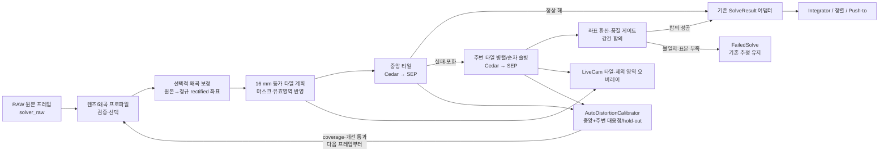
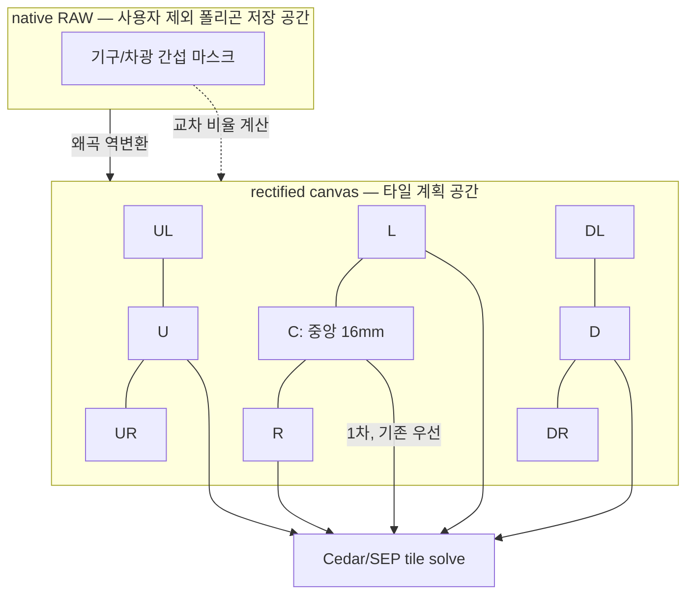
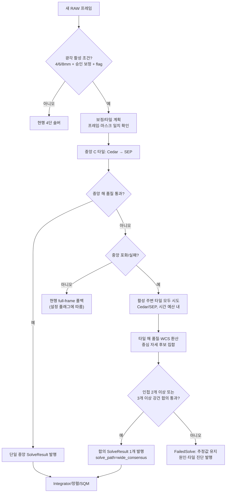
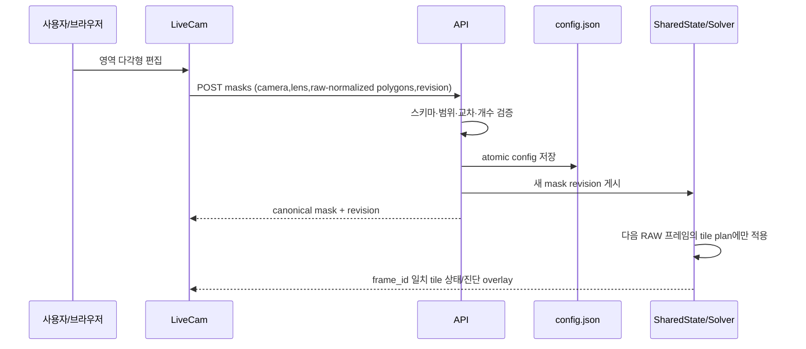

# 광각 렌즈 다중 구역 솔빙 및 왜곡 보정 — 상세 설계

> 상태: **구현본 / 야간 실측 대기** — 기존 경로 보호를 위해
> `wide_solver_enabled=false`가 기본이며, 자동 실측 계수의 최종 승인만 남았다.
> 작성일: 2026-08-20.
> 선행 문서: [optical-train FOV 통합](mf_optical_train_fov_integration_ko.md),
> [cedar+SEP 하이브리드 솔빙 설계](mf_cedar_sep_hybrid_design_ko.md),
> [LiveCam RAW/스택 계획](mf_raw_live_stack_plan_ko.md).

## 1. 목적과 결정

이 설계는 4/6/8 mm 광각 렌즈에서도 기존 16 mm 렌즈의 낮은 왜곡·검증된
솔빙 단위를 보존하면서, 달·기구·지평선 광해가 중앙을 가린 경우에도 주변의
정상 별 영역으로 자세를 구하기 위한 것이다.

**핵심 결정**은 다음과 같다.

1. `16mm` 중앙 솔빙과 현재의 4단 캐스케이드
   (`cedar_center → sep_center → cedar_full → sep_full`)는 변경하지 않는다.
2. 광각 경로는 화면을 축소해 전체를 한 번에 맞추지 않는다. 왜곡 보정 후
   **16 mm 등가 FOV 크기의 원본 해상도 크롭 타일**을 만든다. 검출 편의를 위한
   binning은 허용하지만, tetra3에 주는 타일과 좌표 환산에는 resize를 쓰지
   않는다.
3. 중앙 타일 해가 정상 품질이면 기존과 같은 단일 해를 우선한다. 중앙 포화·실패
   때에만 주변 타일 해들을 수집하며, 단일 주변 해는 절대로 포인팅을 갱신하지
   않는다.
4. 주변 폴백은 두 개 이상 타일의 해를 동일한 카메라 중심 기준 자세로 환산한
   뒤 합의(consensus)한 경우에만 `Integrator`에 하나의 결과를 낸다. 이동·달
   포화로 남은 별 영역이 인접 두 타일뿐인 경우도 지원하되, 이 경우에는 더
   엄격한 2-타일 일치 게이트를 적용한다.
5. 렌즈 배럴 표기만으로 왜곡 계수를 추정하지 않는다. 새 렌즈의 기본값은
   `보정 없음(k=0)`이며, 중앙과 주변부의 충분한 실측 solve로 자동 보정 계산이
   완료·검증된 경우에만 새 profile을 다음 프레임부터 활성화한다. 왜곡이
   통계적으로 0과 구별되지 않는 렌즈는 검증된 `0 보정` profile을 유지한다.

적용 대상은 **명시적으로 선택된 4/6/8 mm 렌즈**다. 요구사항의 “<10 mm”를
엄격히 적용하므로 10 mm는 렌즈 목록과 실측 보정 대상에는 포함하지만 기본적으로
기존 경로를 유지한다. 현장 결과가 충분하면 10 mm에 별도 opt-in을 허용할 수 있다.

## 2. 현재 구조와 확장 경계

현재 `optics.py`는 센서×렌즈로 crop FOV를 계산하고, `solver.py`는 원본
`solver_raw`의 cedar/SEP 검출을 중앙 우선으로 처리한다. `solver_frame_map.py`는
512 공간과 풀프레임 공간의 좌표를 보존한다. LiveCam은 이미 원본 RAW 위에 SEP
별 검출 오버레이를 그릴 수 있다.

새 구조는 이 하류 계약을 지킨다. `Integrator`, 정렬, SQM, 차트, API의 기존
`SolveResult` 소비자는 타일 개수나 왜곡 모델을 알 필요가 없다.



### 2.1 새 모듈의 책임

| 모듈/파일(예정) | 책임 | 기존 코드에 주지 않는 책임 |
| --- | --- | --- |
| `optics.py` | 4/6/8/10 mm 렌즈 선언, 안전한 FOV 계산 | 보정 영상 생성·설정 저장 |
| `lens_calibration.py` | 보정 프로파일 스키마·검증·왜곡/역왜곡 좌표변환 | 카메라 캡처·솔브 루프 |
| `wide_field_tiles.py` | 16 mm 등가 타일 계획, 마스크 교차, 원본 크롭/좌표 변환 | tetra3 호출·Integrator 갱신 |
| `wide_field_consensus.py` | 타일 해 품질검사, 중심 자세 환산, 합의·진단 | 직접 config 쓰기 |
| `solver.py` | 중앙 우선 뒤 타일 러너를 호출하고 최종 결과 하나만 발행 | UI 도형 처리 |
| `livecam_config.py` / API / `livecam.html` | 영속 제외 마스크, 타일 표시·편집 | 솔버 정책 판단 |

## 3. 렌즈와 왜곡 프로파일

### 3.1 추가 렌즈의 안전한 초기 등록

`LENSES`에 `4mm`, `6mm`, `8mm`, `10mm`를 추가한다. 처음 등록할 때는
`effective_focal_length_mm = nominal_focal_length_mm`로 두되, 이 값은 **사전
계획/표시용 provisional 값**이다. 12/16/25 mm처럼 현장 FOV로 보정된 값과
같은 신뢰도로 취급하지 않는다.

아래 값은 각 센서의 정상 production crop과 명목 초점거리로 계산한 가로 FOV다.
판매자·렌즈 배럴의 편차를 포함하지 않으므로 계수 확정 전에는 FOV gate나 타일
활성화의 근거가 될 수 없다.

| 렌즈 | IMX462/IMX290 | IMX296 | 상태 |
| --- | ---: | ---: | --- |
| 4 mm | 39.12° | 50.27° | provisional, 광각 대상 |
| 6 mm | 26.65° | 34.74° | provisional, 광각 대상 |
| 8 mm | 20.14° | 26.41° | provisional, 광각 대상 |
| 10 mm | 16.18° | 21.26° | provisional, 기본은 기존 경로 |

`Lens`에는 다음의 명시적 상태를 추가한다. 기존 키의 호환성은 유지한다.

```text
key, nominal_focal_length_mm, effective_focal_length_mm,
calibration_required, default_calibration_id
```

4–10 mm는 `calibration_required=true`, `default_calibration_id="none"`이다.
이 조합에서 메뉴는 선택 가능하지만 상태 화면에 “실측 보정 전: 기존 솔빙 사용”을
표시한다. 사용자가 렌즈를 선택했다고 해서 자동으로 실험 경로가 켜지지 않는다.

### 3.2 왜곡 모델과 기본값

초기 구현 모델은 OpenCV 호환 Brown–Conrady pinhole 모델이다. 정규화된 이상
좌표 `(x, y)`에 대해 반지름 `r²=x²+y²`일 때,

```text
x_d = x(1 + k1 r² + k2 r⁴ + k3 r⁶) + 2 p1xy + p2(r² + 2x²)
y_d = y(1 + k1 r² + k2 r⁴ + k3 r⁶) + p1(r² + 2y²) + 2 p2xy
```

를 사용한다. 실제 입력 영상에서 rectified 영상으로 가는 remap은 수치 역함수를
매 프레임 풀지 않고, 캘리브레이션 확정 시 생성한 map을 재사용한다. 매우 강한
fisheye 렌즈가 이 모델의 잔차 기준을 통과하지 못하면 `fisheye` 모델을 별도
프로파일 버전으로 도입한다. 그 전에는 해당 렌즈를 광각 솔빙에서 **지원하지
않는다**. 억지 보정은 무보정보다 위험하다.

안전 기본 프로파일은 다음과 같다.

```json
{
  "id": "none",
  "version": 1,
  "model": "none",
  "enabled": false,
  "k1": 0.0, "k2": 0.0, "k3": 0.0,
  "p1": 0.0, "p2": 0.0,
  "rms_px": null,
  "valid_radius_norm": 0.0
}
```

`none`은 영상과 좌표를 바꾸지 않는다. “기본값”은 임의의 왜곡 수치가 아니라
재현 가능하고 무해한 0 보정이다. 실측 보정 프로파일만 `enabled=true`가 될 수
있으며, camera type, raw size, crop, 렌즈 키, 보정 생성 시각과 checksum을 함께
갖는다.

### 3.2.1 렌즈 사양 TV distortion 수동 기본값

실측 자료가 아직 없더라도 렌즈 데이터시트에 **TV distortion**이 명시되어 있으면,
Advanced > Lens와 LiveCam의 `Lens calibration` 패널에서 이를 수동 입력해 초기
보정값으로 쓸 수 있다. 이 값은 광각 tile의 첫 shadow/보정 수집에서 사용할
`manual-tv` provisional profile이며, 자동 보정의 시작값이다.

수동 입력 항목은 아래처럼 값의 정의까지 함께 저장한다.

| 입력 | 필수 | 이유 |
| --- | --- | --- |
| TV distortion (%) | 예 | 데이터시트의 왜곡 크기 |
| 방향 (barrel / pincushion) | 예 | 제조사마다 부호 표기가 달라 내부 부호를 명확히 하기 위함 |
| 기준 image height (mm) | 예 | TV distortion이 명시된 렌즈 설계 반경/높이 |
| 기준의 뜻 (semi-height / full image-height / image-circle radius) | 예 | `%` 값이 적용되는 반경을 모르면 센서용 계수로 환산할 수 없음 |
| 사양 출처/메모 | 권장 | 렌즈 모델·데이터시트 페이지·사용자 측정 구분 |
| `Apply as provisional` | 예 | 사용자가 의도적으로 초기 rectification에만 쓰도록 확인 |

PiFinder는 camera profile의 pixel pitch와 실제 production crop에서 **현재 센서가
쓰는 물리 반지름** `r_sensor_mm`를 계산한다. 데이터시트 기준 반지름을
`r_ref_mm`, TV distortion을 소수 비율 `d_ref`로 바꾸면, 1차 radial 근사에서는
현재 센서 가장자리의 예상 왜곡을 다음처럼 먼저 축소한다.

```text
d_sensor = signed(d_ref) * (r_sensor_mm / r_ref_mm)^2
k1_initial = d_sensor
k2 = k3 = p1 = p2 = 0
```

이는 Brown–Conrady의 1차 radial 항만으로 만드는 **초기 추정**이다. 센서가
렌즈의 설계 image circle보다 작으면 `r_sensor_mm < r_ref_mm`이므로, TV 사양을
그대로 적용하는 것보다 실제 사용 영역에 맞는 작은 왜곡값을 얻는다. UI에는
원 TV 값, 기준 반지름, 계산된 sensor-edge 예상값과 내부 `k1_initial`을 모두
표시해 사용자가 확인할 수 있게 한다.

제조사 TV distortion의 정의가 위의 radial/상대 왜곡과 다르거나 기준 image
height가 없으면 자동 환산하지 않는다. 이 경우 입력을 저장은 할 수 있어도
`Apply`는 막고 `reference geometry required`를 표시한다. `k2/k3/p1/p2`를
임의로 채우지 않으며, 수동 TV 값이 좁은 FOV gate나 최종 좌표의 신뢰도 상향에
쓰이는 일도 없다.

수동 적용은 새 `manual-tv-<camera>-<lens>-<revision>` profile을 원자적으로
저장해 **다음 RAW 프레임**부터 rectified canvas의 provisional 기준으로 사용한다.
직전 profile은 보존하며 Reset/Rollback으로 복원할 수 있다. 수동 TV 입력은
사용자 조작이 있어야만 변경되고, 정상 관측 중 자동으로 다시 적용되지 않는다.

### 3.3 실측 캘리브레이션 절차와 승인 기준

1. 카메라·렌즈를 고정하고 주간에는 체스보드/ChArUco 보드 20–40장을 화면
   전역(특히 네 모서리)에 찍는다. 초점·조리개·해상도·crop은 실제 야간 설정과
   같아야 한다.
2. 오프라인 도구가 코너 검출, outlier 제거, Brown–Conrady fit, 재투영 RMS,
   유효 반지름을 산출한다. 원본·결과·명령·프로파일 JSON은 테스트 자료로 보관한다.
3. 야간에는 중앙 및 서로 다른 반경의 주변 타일에서 fitted FOV·RA/Dec/Roll
   잔차를 검증한다. 보정 전후를 같은 조건에서 비교한다.
4. RMS, 가장자리 잔차, 야간 타일 간 자세 불일치가 프로젝트의 사전 승인
   기준을 모두 통과할 때만 profile을 `enabled`로 승격한다. 수치 기준은 첫
   시험 코퍼스의 중앙값/분산을 본 뒤 문서와 테스트에 함께 고정한다.

#### 3.3.1 하늘 solve 기반 자동 왜곡 갱신

`wide_solver_auto_calibration_enabled`를 사용자가 켠 보정 수집 세션에서는
`AutoDistortionCalibrator`가 성공 solve의 **matched star 좌표와 WCS**를 모은다.
한 tile의 local plate 해만으로는 해당 tile 안의 왜곡을 흡수해 버릴 수 있으므로,
반드시 중앙 해를 기준 자세(anchor)로 삼고 같은 RAW에서 주변 tile의 matched
star가 가리키는 sky ray와 native RAW 좌표의 대응을 맞춘다. 여러 하늘 방향의
프레임을 누적해 Brown–Conrady 계수를 robust fit한다. 활성 `manual-tv` profile이
있으면 그 `k1_initial`을 fit의 초기값으로 쓰되, 수동값에 고정하지 않는다.

자동 갱신의 coverage 조건은 모두 필수다.

1. 각 수집 프레임에서 중앙 16 mm tile과 주변 tile이 모두 독립적인 품질
   조건으로 solve되어야 한다. 중앙이 포화·실패했거나 2-타일 emergency
   consensus만 가능한 프레임은 포인팅에는 쓸 수 있어도 **보정 학습에는 쓰지
   않는다**.
2. 대응점은 `central`, `mid`, `edge`의 세 반경 bin에 고르게 있어야 한다.
   `edge`는 rectified 유효 반지름의 바깥 구간이며, 주변부 왜곡을 실제 별로
   측정했다는 증거가 된다. 같은 인접 두 tile의 별만 반복해서 모아서는 완료가
   될 수 없다.
3. 여러 독립 프레임/하늘 방향에서 얻은 점만 사용한다. 같은 RAW의 많은 별은
   표본 수는 늘리지만 독립 관측 횟수를 늘리지 않는다.
4. 각 원천 tile의 match 수, tetra3 residual, 포화율, 마스크 비율, FOV와
   calibration fingerprint가 기록된다. 품질 미달·마스크 안·포화 성분 근처의
   점은 fit 전에 버린다.
5. fit은 robust loss와 hold-out 검증을 쓴다. 새 계수가 기존/0 보정보다 중앙
   잔차를 악화시키지 않고, 주변부 hold-out 잔차와 tile 간 중심 자세 불일치를
   유의하게 낮춰야 한다. 비정상 초점거리 변화, 유효 footprint 축소, 계수
   범위 초과도 거부 사유다.

통과하면 calibrator는 새 `auto-<camera>-<lens>-<revision>` profile과 활성
calibration ID를 **영속 calibration store**에 원자적으로 저장한다. 적용 시점은
현재 solve 중간이 아닌 **다음 RAW 프레임**이다. 이전 profile, fit 요약, 입력
frame ID, hold-out 결과와 checksum을 함께 보존하므로 `rollback calibration` 한
번으로 즉시 되돌릴 수 있다. coverage 또는 hold-out을 통과하지 못하면
profile/config는 바꾸지 않고 LiveCam에 부족한 반경 bin·거부 이유만 표시한다.

부팅 시 `CalibrationProfileStore`는 저장된 활성 profile을 읽고 camera type,
lens key, raw size, production crop, pixel pitch, distortion-model version,
checksum을 현재 optical train과 비교한다. 모두 일치하면 같은 `auto-*` profile을
자동 복원해 첫 광각 solve 전부터 사용한다. 하나라도 다르면 그 profile을 다른
장비 기록으로 보존하되 적용하지 않고 `none`/수동 선택 profile으로 안전하게
시작하며 LiveCam에 불일치를 표시한다. 따라서 자동 보정의 **결과는 재부팅 뒤에도
유지**되지만, 보정 수집 세션 자체는 재부팅 뒤 기본 off다.

왜곡이 적은 렌즈는 fit된 `k1..p2`가 0 보정 대비 유의한 개선을 만들지 못한다.
이 경우 calibrator는 계수를 억지로 갱신하지 않고, `model="none"`, 모든 계수 0,
`verified_from_sky=true`인 새 검증 profile을 활성화한다. 따라서 불필요한 remap
보간으로 중심·주변 별상을 악화시키지 않는다.

자동 갱신은 보정 수집 세션에서만 실행한다. 정상 관측 중에는 수집 결과가 있어도
렌즈 초점거리/왜곡 계수를 자동으로 바꾸지 않는다.

## 4. 좌표계와 16 mm 등가 타일

> LiveCam 타일 표시·제외 기능의 사용 방법은
> [광각 타일 LiveCam 운영 가이드](mf_wide_tiles_livecam_ko.md)를 따른다.
> 현재 구현은 원본 crop에서 Cedar/SEP 검출 후 Brown--Conrady를 centroid 좌표에
> 적용한다. 따라서 타일 영상을 축소하거나 업스케일하지 않는다. 실제 렌즈별
> 계수의 자동 승격 기준은 야간 실측에서 확정한다.

현재의 512 공간, 무회전 풀프레임, 회전 풀프레임은 그대로 유지한다. 여기에 두
공간을 더한다.

| 공간 | 좌표 원점/방향 | 용도 |
| --- | --- | --- |
| native raw | 센서 원본 `(y,x)` | 마스크 저장, RAW/LiveCam, 캘리브레이션 입력 |
| rectified canvas | optical axis 중심, 왜곡 제거 뒤 `(y,x)` | 타일 생성·원본 해상도 크롭·WCS 환산 |
| tile | rectified canvas 내부 16 mm 등가 창 | cedar/SEP 검출·tetra3 솔브 |
| 512 production | 기존 회전된 512 | `target_pixel`, 정렬·하류 호환 |

`TilePlanner`는 큰 광각 프레임을 512로 줄이지 않는다. 타일의 원본 크기는 렌즈
FOV와 무관하게 **최소 512×512 정사각 pixel**로 고정한다. 프레임을 모두 덮는 데
필요한 행·열 수는 홀수로 올려 중앙 `C` 타일의 중심이 optical center와 정확히
일치하게 하고, 인접 타일은 기본 20%를 목표로 중첩한다. 가장자리까지 덮기 위해
실제 중첩률은 그보다 클 수 있다. 16 mm FOV는 타일 크기를 정하는 값이 아니라,
타일별 WCS/FOV 진단·검증에 쓰는 광학 메타데이터다.



타일은 고정 3×3이 아니다. 필요한 행·열을 계산해 생성하고, rectified footprint
밖이거나 사용자 마스크에 크게 가려진 타일은 `excluded`로 표시한다. 진단과
설정과 진단에는 사람이 읽는 `C`, `U`, `UR` 등의 **영상 기준** 논리 ID와 함께,
정확한 rectified bounds·native footprint를 저장한다. `U/D/L/R`은 천구 방위가
아니라 LiveCam 영상의 위/아래/왼쪽/오른쪽이다. 원본 RAW 좌표는 crop bounds로만
보관하고 별도의 방향 ID를 만들지 않아, 화면 선택·제외 설정·솔빙 점수가 하나의
ID를 공유한다.

LiveCam은 실제 512px 타일 footprint가 서로 겹쳐 편집하기 어려워지는 것을 막기
위해, 클릭용 비중첩 논리 셀을 별도로 그린다. 각 셀은 하나의 실제 타일 ID에
연결된다. 실제 타일이 둘 이상 겹치는 영역은 **점선**으로 표시하며, 타일 이름은
각 클릭 셀 중앙에 둔다. 제외를 선택하면 논리 셀이 아니라 그 선택이 영향을 주는
실제 512×512 footprint를 반투명으로 표시한다. 중앙 `C`의 실제 512×512 footprint는
굵은 점선으로 항상 최상단에 강조한다. 이 레이어는 10 mm 이하에서만 노출되고 기본
표시는 Off다.

### 4.1 “크롭, 축소 금지” 규칙

타일의 solver frame은 rectified canvas에서 자른 원본 pixel grid다. 다음은
허용하지 않는다.

- 광각 전체 프레임을 16 mm FOV로 보이게 축소한 뒤 별을 검출/솔브하는 것
- 서로 다른 타일의 centroid를 한 화면에 재투영하여 하나의 가짜 전체 프레임으로
  솔브하는 것
- 타일의 WCS를 512 공간으로 단순 비율 확대/축소하는 것
- 512px보다 작은 원본 타일을 512×512로 업스케일한 뒤 솔브하는 것

타일 검출·솔브는 512px 이상 원본 정사각 좌표에서 수행하고, tetra3에는 실제
tile 입력 크기와 그 타일의 FOV를 전달한다. SEP의 2×2 binning, LiveCam 표시
resize는 검출/표시 전용이며 반드시 정확한 원본 tile 좌표로 역변환한다. tile solution의 `target_pixel`은
`TileCoordinateMap`을 통해 원래 카메라 optical center와 기존 512 정렬점의
의미로 변환한다.

## 5. 솔빙 상태기계

중앙의 정상 하늘에서 성능·동작을 바꾸지 않는 것이 첫 번째 안전 조건이다.



### 5.1 중앙 포화 판정

중앙의 실패만으로 주변 솔빙을 무제한 실행하지 않는다. 다음 중 하나일 때
`central_unusable` 사유를 만든다.

- 중앙 타일의 포화 픽셀 비율 또는 포화 연결 성분이 설정된 안전 한계를 넘는다.
- 달/강한 광원이 중앙 마스크의 사전 정의된 중심 반경을 덮고, 충분한 별 후보가
  남지 않는다.
- Cedar와 SEP가 모두 중앙에서 최소 검출·시간·품질 조건을 만족하지 못한다.

포화 임계값은 센서 bit depth와 노출에 의존한다. 코드는 상수를 복제하지 않고
`CameraProfile`의 saturation level과 진단 정책 객체를 이용한다. 임계값 자체는
첫 야간 캡처 코퍼스에서 확정하고 config로 노출하되, 기본값을 임의로 낮춰
주변 폴백을 자주 켜지 않는다.

### 5.2 주변 타일 순서와 시간 예산

1. 중앙을 제외한 `enabled` 타일을 optical center와의 거리, 포화/마스크 면적,
   직전 성공 이력 순으로 정렬한다.
2. 방향이 한쪽으로 몰리는 것을 막기 위해 첫 라운드는 서로 다른 방위의 타일을
   우선한다. 예: `N → E → S → W → diagonal`.
3. 필요한 최소 표본을 얻은 뒤에도 가능한 모든 활성 타일을 예산 내에서
   수집한다. 이는 “가능한 많은 구역”을 사용하되 노출 주기를 무너뜨리지 않는
   절충이다.
4. 각 tile은 Cedar 우선, 같은 tile에서 Cedar 실패 시 SEP를 쓴다. 한 tile의
   timeout·실패가 다음 tile을 막지 않는다.

예산, 최대 동시 작업 수, 최소 타일 수는 `WideFieldSolverPolicy` 하나가
소유한다. 초기 shadow 단계에서는 결과를 발행하지 않고 실제 장비의 시간·CPU
분포를 기록해 이 값을 고정한다.

## 6. 주변 해의 좌표 합의와 오동작 방지

### 6.1 타일 해를 카메라 중심으로 환산

각 성공 타일에는 tetra3가 준 WCS/RA/Dec/Roll과 tile 내 좌표가 있다.
`TileCoordinateMap`은 보정된 rectified canvas에서 tile의 위치를 알고 있으므로,
그 WCS를 **카메라 optical center 및 기존 `target_pixel`이 바라보는 하늘 좌표**로
평가한다. 이 변환을 거친 후보만 `AttitudeCandidate`가 된다.

```text
AttitudeCandidate = {
  tile_id, frame_id, calibration_id, solve_path,
  center_ra_dec, roll_deg, fitted_fov_deg,
  matches, residual, saturated_fraction,
  angular_offset_deg, timestamp
}
```

원본 타일 좌표나 단순 tile 중심 RA/Dec를 그대로 Integrator에 넘기는 것은 금지한다.
이 규칙이 주변부 solve가 중앙을 가리키는 것처럼 보이는 오동작을 막는다.

### 6.2 합의 규칙

중앙이 포화/실패한 주변 폴백은 다음을 모두 만족해야 한다.

1. 같은 RAW `frame_id`, 같은 lens/calibration fingerprint에서 나온 후보만 묶는다.
2. 최소 두 개의 성공 타일을 요구한다. 서로 변을 공유하거나 계획 overlap이 있는
   **인접 2-타일 쌍**은, 망원경 이동·달 포화·기구 간섭 때문에 다른 타일이
   포화 또는 별 부족으로 판정된 때에도 발행 후보가 될 수 있다. 단일 타일은
   언제나 거부한다.
3. 정확히 두 타일이면 RANSAC/다수결을 할 수 없으므로, 두 해가 같은 `frame_id`,
   calibration fingerprint에서 나왔고 각 해의 품질을 통과하며, optical center로
   환산한 위치와 Roll의 **2-타일 전용 엄격 잔차 한계** 안에서 일치해야 한다.
   이 한계는 3개 이상 합의의 outlier 한계보다 작게 두고 첫 야간 코퍼스에서
   고정한다. 두 해 중 하나라도 불량·불일치면 `wide_pair_disagree`로 실패한다.
4. 세 개 이상이면 후보들의 중심 간 최소 각분리와 방위 분산을 요구한다. match
   수, tetra3 residual, 마스크/포화 비율, optical center와의 거리를
   가중치로 사용한다. 가중치 상한을 두어 한 tile이 다수를 압도하지 못하게 한다.
5. 세 개 이상 후보에서는 구면 RA/Dec 거리와 Roll 잔차에 robust median/RANSAC으로 outlier를 제거한 뒤,
   남은 후보의 가중 평균 또는 quaternion 평균으로 중심 자세를 계산한다.
6. 사전 고정된 위치·Roll 잔차 한계 안에 있는 inlier가 최소 수를 만족해야 한다.
   아니면 `wide_consensus_disagree`로 실패하며, 마지막 좋은 포인팅은 유지한다.
7. 합의로 발행한 해에는 `solve_path="wide_consensus"`, 참여/제외 tile ID,
   inlier 수, 최대 잔차, calibration ID를 진단으로 붙인다.

최소 2는 중앙 포화 뒤 보이는 별 영역이 인접 구역으로 좁아지는 실제 운용 조건을
반영한다. 2-타일 쌍은 엄격한 직접 일치, 3개 이상은 강건 outlier 제거라는 서로
다른 정책을 적용한다. 중앙 정상 해는 이 다중 합의 규칙을 강제하지 않아 기존
반응성을 보존한다.

### 6.3 Integrator와 성공 확인

`Integrator`는 타일별 중간 결과를 보지 않는다. 2-타일 쌍 또는 다중 타일 합의의
결과 하나가 기존 `SolveResult` 계약으로 들어가며, 기존의 연속 성공 확인(3회)도
그 최종 결과에만 적용한다. 즉, 한 프레임의 tile 2개나 3개 성공은 “2회/3회 solve
성공”이 아니다. 시간적으로 독립된 3개 프레임에서 `wide_consensus`가 재현되어야
정상 solve로 승격된다.

이 분리는 빠른 오인식, 타일 간 상관된 잘못된 패턴, 달 주변의 불안정한 해가
정렬/추적 상태를 덮는 것을 막는다.

## 7. LiveCam 구역 확인·기구 간섭 마스크

### 7.1 사용자 경험

LiveCam의 Original RAW 프리뷰 위에 별 검출 오버레이와 독립적인 **Wide-field
regions** 레이어를 추가한다.

- 초록 테두리: 활성 타일, 회색 사선: 사용자 제외/footprint 밖 타일
- 노랑: 해당 프레임에서 포화 또는 품질 불충분, 보라: 합의 inlier tile
- 빨강: 타일 해가 합의에서 제외된 outlier
- 반투명 다각형: 사용자가 지정한 기구/차광 간섭 영역

보정 수집 세션에서는 별도 `Auto calibration` 상태도 보인다. 중앙/mid/edge
반경별 독립 frame 수와 matched star 수, hold-out 잔차, 현재/후보 profile,
“업데이트 가능” 또는 부족/거부 이유를 표시한다. TV distortion 수동 입력을
사용하면 원 사양·기준 image height·환산된 sensor-edge 값·`manual-tv` revision도
함께 보여 준다. Update가 완료되면 revision과 적용 예정 프레임을 표시하고,
`Rollback calibration`으로 직전 profile을 복원한다.

사용자는 `Edit excluded areas`를 누른 뒤 이미지에서 다각형을 찍어 추가하고,
꼭짓점 드래그/삭제, Undo, Reset profile, Save를 사용한다. 편집 중에는 솔버
마스크를 바꾸지 않는다. Save가 성공하면 다음 새 프레임부터 적용한다. 페이지
재진입과 재부팅 뒤에도 같은 렌즈 프로파일에서 복원된다.



### 7.2 영속 데이터와 안전성

마스크는 화면 픽셀이 아니라 **무회전 native RAW의 정규화 좌표**(0–1) 다각형으로
저장한다. 그러면 브라우저 표시 크기·rotation·rectification이 달라도 같은 물리적
기구 간섭 부위를 가리킨다. 렌즈별로 안전하게 분리한다.

```json
{
  "version": 1,
  "profiles": {
    "imx462_color:4mm": {
      "raw_size": [1920, 1080],
      "polygons": [[[0.00, 0.78], [0.22, 0.78], [0.18, 1.00], [0.00, 1.00]]],
      "revision": 4,
      "updated_at": "2026-08-20T00:00:00Z"
    }
  }
}
```

서버는 꼭짓점 범위, 최소 면적, 자기교차, 최대 polygon/vertex 수, raw size를
검증한다. sensor 해상도 또는 렌즈 키가 다르면 기존 마스크를 자동 재해석하지
않고 “다른 프로파일”로 표시한다. tile은 마스크가 tile 핵심 영역을 넘게 덮거나
검출 centroid가 마스크 안에 있으면 제외한다. 사용자가 모든 타일을 제외하면
광각 솔빙은 안전하게 비활성화되고 기존 솔버로 폴백한다.

제안 API는 다음과 같다.

| API | 목적 |
| --- | --- |
| `GET /api/solver/wide-field/status` | 활성 여부, profile/calibration ID, tile plan, frame_id, 마지막 tile/합의 진단 |
| `GET /api/solver/wide-field/masks?camera=…&lens=…` | 해당 프로파일의 canonical mask와 revision |
| `POST /api/solver/wide-field/masks` | revision 비교 후 마스크를 원자적으로 저장 |
| `POST /api/solver/wide-field/masks/reset` | 현재 camera+lens 프로파일 마스크만 삭제 |

이미지 API는 호환성을 위해 기존 `overlay=sep`를 유지한다. 새 레이어는
`overlays=sep,wide_regions`처럼 복수 지정하며, 구형 클라이언트의 동작은 바꾸지
않는다. 정적 마스크 외 프레임별 타일 결과는 `frame_id`가 일치할 때만 그린다.

## 8. 설정, feature flag, 관측성

모든 새 런타임 경로는 기본 off다.

| 설정 | 기본 | 의미 |
| --- | --- | --- |
| `wide_solver_enabled` | `false` | 전체 광각 타일 솔버 master flag |
| `wide_solver_shadow` | `true` (개발 단계) | 해/합의는 계산·로그만 하고 Integrator에 발행하지 않음 |
| `wide_solver_lenses` | `4mm,6mm,8mm` | 활성 후보 allow-list |
| `wide_solver_calibration_id` | `none` | 명시한 실측 profile만 사용 |
| `wide_solver_manual_tv_distortion` | 없음 | 렌즈별 TV distortion·기준 image height·방향을 저장하는 수동 provisional 입력 |
| `wide_solver_auto_calibration_enabled` | `false` | 사용자가 시작한 수집 세션에서만 중앙+주변 solve로 profile 자동 갱신 |
| `wide_solver_calibration_store_v1` | 빈 store | 자동/수동 profile, 활성 ID, fingerprint, revision, rollback 이력을 재부팅 뒤에도 보존 |
| `wide_solver_mask_store_v1` | 빈 store | 렌즈별 native RAW 제외 영역 |
| `wide_solver_max_regions` | 측정 후 확정 | 프레임당 tile 상한 |
| `wide_solver_min_consensus_regions` | `2` | 주변부 발행 최소 tile 수; 정확히 2개면 인접 쌍 엄격 게이트 적용 |

상태/API/로그에는 최소한 아래를 낸다: `wide_mode`, calibration fingerprint,
tile plan ID, 활성/제외 tile 수, tile별 detector·solve 결과·실행 시간, 중앙 포화
사유, consensus candidate/inlier/outlier 수, 중심 자세 잔차, 최종 `solve_path`.
원본 RAW나 대형 배열은 shared state/API에 싣지 않는다.

## 9. 검증과 롤백 기준

### 9.1 자동 시험

| 계층 | 필수 검증 |
| --- | --- |
| optics | 새 렌즈 키, provisional 표기, 16 mm 기준 타일 각폭, 기존 FOV 불변 |
| calibration | TV distortion 기준 반지름/부호 검증·작은 센서 반경 환산, 0 보정 항등성, 왜곡/역왜곡 round trip, fingerprint 불일치 거부, 중앙/mid/edge coverage·hold-out 통과 시에만 자동 revision 적용, 재부팅 뒤 일치 profile 복원/불일치 profile 미적용 |
| tile planner | 16 mm 크롭, overlap, footprint 경계, mask 교차, tile→raw/512 좌표 왕복 |
| solver | flag off 바이트 호환 경로, 중앙 성공 시 tile 미실행, 포화 시 주변 순서, tile timeout 격리 |
| consensus | 인접 2-타일 엄격 일치 성공/불일치 거부, 3개 이상 분산 inlier·outlier 제거, RA 0/360·Roll wrap 처리 |
| LiveCam/API | mask validation·재부팅 복원·revision 충돌, frame_id 일치 오버레이, 기존 SEP overlay 회귀 |
| integration | 합의 결과만 Integrator로 들어가며 3개 tile이 3회 성공으로 세지지 않음 |

### 9.2 현장 시험 순서

1. 16 mm에서 모든 flag off 기준선(성공률·좌표·지연)을 수집한다.
2. 각 4/6/8 mm 렌즈에서 왜곡 미보정 raw를 기록한다. TV distortion 사양이 있으면
   기준 image height·방향을 수동 입력해 sensor-edge 환산값을 확인하고, 중앙과
   주변 tile이 모두 solve되는 하늘 조건에서 자동 보정 수집을 실행한다.
   중앙/mid/edge coverage와 hold-out을 통과한 profile만 자동 활성화되는지 확인한다.
3. 보정 결과를 shadow mode로 타일화하여 tile 위치·LiveCam mask·좌표 왕복만
   확인한다. 이 단계는 하류 상태를 바꾸지 않는다.
4. 달 없는 맑은 하늘에서 중앙 타일과 기존 16 mm 기준을 동시 비교한다.
5. 달/강한 광원이 중앙을 포화시키는 조건에서 중앙 실패와 주변 합의 성공을
   분리 기록한다. 타일별 해와 합의 잔차를 반드시 보존한다.
6. 기구를 의도적으로 마스크한 A/B에서 제외 tile이 선택되지 않고, 남은 충분한
   방위의 타일만으로 통과하는지 확인한다.
7. 최소 3개의 독립 밤·방향에서 안정성, Integrator 3회 확인, reboot 뒤 mask
   및 자동 보정 profile 복원을 확인한 후 `wide_solver_shadow=false`를 검토한다.

중앙 기준보다 성공률, 위치 오차, solve 지연, 잘못된 update 중 하나라도 악화하면
즉시 master flag를 끄고 기존 16 mm/풀프레임 경로로 돌아간다. profile·mask·문서
데이터는 남기되, 보정 수집 세션의 coverage·hold-out을 통과하지 않은 자동 수정이나
무단 활성화는 하지 않는다.

## 10. 미결정 항목

- 실제 사용할 4/6/8/10 mm 렌즈의 제조사·센서별 실효 초점거리와 왜곡 계수
- Brown–Conrady 통과 여부 및 fisheye 모델 필요성
- 첫 실측 코퍼스에 근거한 포화·RMS·합의 위치/Roll 잔차·시간 예산 수치
- 4 mm에서 Raspberry Pi 세대별 허용 가능한 tile 수와 병렬도
- 기구 간섭 마스크의 권장 최소/최대 면적과 UI 편집 방식의 현장 사용성

이 항목들은 소스에 추정 상수로 넣지 않는다. 각 렌즈의 캘리브레이션/야간 결과를
리포트로 남긴 뒤 이 문서의 정책 값과 자동 테스트를 함께 갱신한다.
