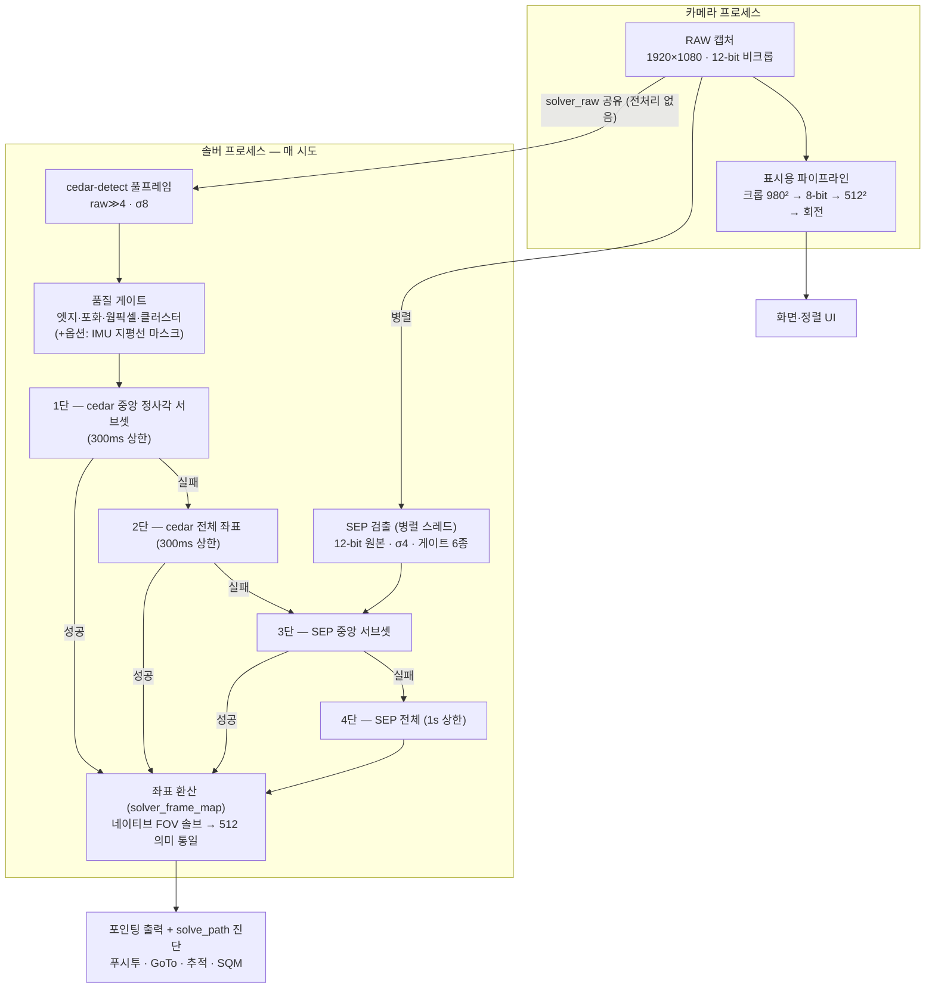

# MF_PiFinder 테스트 리포트 — 풀프레임 솔빙 파이프라인 실측 (2026-08-04)

> 커뮤니티 공유용 리포트입니다. **현재 소스 기준**(아래 구성) 결과만 담았고,
> 기존 경로와의 비교는 동일 프레임 오프라인 재측정으로 수행했습니다.
> 기술 상세: [하이브리드 설계 문서](mf_cedar_sep_hybrid_design_ko.md).
> English version: [mf_fullframe_solving_report_20260804_en.md](mf_fullframe_solving_report_20260804_en.md)

## 배경과 테스트 구성

PiFinder는 망원경이 "지금 어디를 보고 있는지"를 플레이트 솔빙으로 알아내는
장치입니다. 이 포크(MF_PiFinder)의 목표는 **도심 광해에서도 정확하게
솔빙되는 파인더**입니다.

- 장비: PiFinder(RPi) + imx462 (1920×1080, 12-bit), 서울 도심
- 측정 시 솔버 구성: `solver_cedar_fullframe`=on, `solver_cedar_ff_gates`=on,
  `solver_center_first`=on (지평선 마스크는 off — 관측지별 옵션)

## 솔빙 처리 구조 (현재 소스)

한 번의 솔브 시도가 처리되는 흐름입니다. 촬영은 한 번이고, 검출기 두 개
(cedar·SEP)가 같은 12-bit 비크롭 원본을 병렬로 처리하며, 솔브는 좌표
레벨의 4단 캐스케이드로 진행됩니다:

핵심 포인트:

1. **검출은 풀프레임**: 512² 크롭 대신 비크롭 원본을 씁니다. 시야 2.16배 =
   매칭에 쓸 실별이 그만큼 많고, 8-bit 변환 손실도 없습니다.
2. **품질 게이트**: 건물 창문 불빛 같은 지상 점광원 무리(클러스터),
   포화 광원, 센서 웜픽셀을 검출 단계에서 제거합니다 — 실측에서 건물
   구도의 가짜 검출 28~33개가 0~5개로 줄었습니다.
3. **중앙 우선 캐스케이드**: 광학 왜곡이 가장 적은 중앙 정사각 안의
   좌표로 먼저 풀고, 실패하면 전체 → SEP 순으로 내려갑니다. 실패 단은
   타임아웃 상한(300ms/1s)으로 빠르게 포기합니다.
4. **하류 무변경**: 어느 단이 풀었든 좌표는 기존 512 프레임 의미로
   환산되어, 정렬·GoTo·추적은 경로를 모릅니다. 경로는 `solve_path`
   진단 필드로만 확인합니다.

## 측정 방식

1. **동일 프레임 오프라인 재측정** (본 리포트의 핵심 비교): 실제 하늘에서
   저장한 스테이지 덤프에 현행 파이프라인과 기존 cedar-512 경로를 각각
   적용 — 같은 촬영본이므로 하늘 변화 교란이 없습니다.
   - 좋은 하늘 코퍼스: 2026-07-29 밤 6장
   - 밝은 광해 코퍼스: 2026-08-01 밤 50장 (배경 p50 = 풀스케일 87%)
2. **라이브 보조 측정**: 2026-08-03 밤 광해 상승 곡선(시도별 전수 CSV,
   1,552시도) — 게이트 도입 전 구성이라 참고용으로 병기.

## 결과

### 동일 프레임 비교 — 기존 512 경로 vs 현행 파이프라인

| 코퍼스 | 기존 cedar-512 | **현행 파이프라인** |
| --- | --- | --- |
| 좋은 하늘 (6장) | 4/6 솔브, 매치 7, RMSE 14″ | **6/6 솔브**, 매치 17, RMSE 17″ |
| 밝은 광해 (50장) | **0/50** | **44/50 (88%)**, 매치 10, RMSE 81″ |

성공 단계 분포(현행): 좋은 하늘 = cedar-중앙 3 + SEP-중앙 3,
밝은 광해 = SEP-전체 44. 시도당 처리 시간 med: 광해 284ms, 좋은 하늘
807ms(cedar 단 실패 후 SEP 구제가 섞인 프레임 포함).

### 라이브 광해 상승 곡선 (2026-08-03, 참고 — 게이트 도입 전 구성)

| 배경 밝기 (12-bit p50) | 솔브율 | cedar 직접 | 매치 med |
| --- | --- | --- | --- |
| 70% (건물 불빛 직접) | 10–17% | 0% | 8–12 |
| 62% | 98% | 95% | 12 |
| 55% | 100% | 99% | 14 |
| 43% | 97% | 95% | 13 |
| 별밭 표본 | 100% (10/10) | 100% | 25–27 (RMSE 20–29″) |

### 관찰

1. **기존 경로가 0%인 광해에서 현행 파이프라인은 88%**, 좋은 하늘에서도
   간헐 실패(4/6)가 사라져 6/6입니다.
2. **솔빙 한계선은 배경 65–70% 부근**(건물 불빛이 프레임에 직접 들어오는
   수준) — 검출 방식과 무관한 별 SNR의 물리 한계입니다.
3. 정확도는 파인더 용도에 충분합니다: 좋은 하늘 RMSE 14–29″, 광해 81″
   (아이피스 시야 0.5–1° 대비 여유).
4. 단계 분포가 조건에 따라 자동으로 이동합니다 — 좋은 하늘에선 cedar
   단이, 광해에선 SEP 단이 해결하며, 실패 단은 타임아웃 캡으로 비용이
   제한됩니다.

## 결론

풀프레임 검출 + 품질 게이트 + 중앙 우선 캐스케이드 구성으로, **같은
프레임에서 기존 경로 대비 좋은 하늘 4/6→6/6, 밝은 광해 0/50→44/50
(88%)**를 실측했습니다. 남는 실패 영역은 건물 불빛이 프레임을 지배하는
극한 조건뿐이며, 이는 검출기가 아닌 별 SNR의 한계입니다.

측정 원자료(시도별 CSV·코퍼스 경로)와 재현 절차는 저장소의
[실측 리포트](mf_solver_fullframe_field_test_20260803_ko.md)와
[설계 문서](mf_cedar_sep_hybrid_design_ko.md)에 있습니다.
