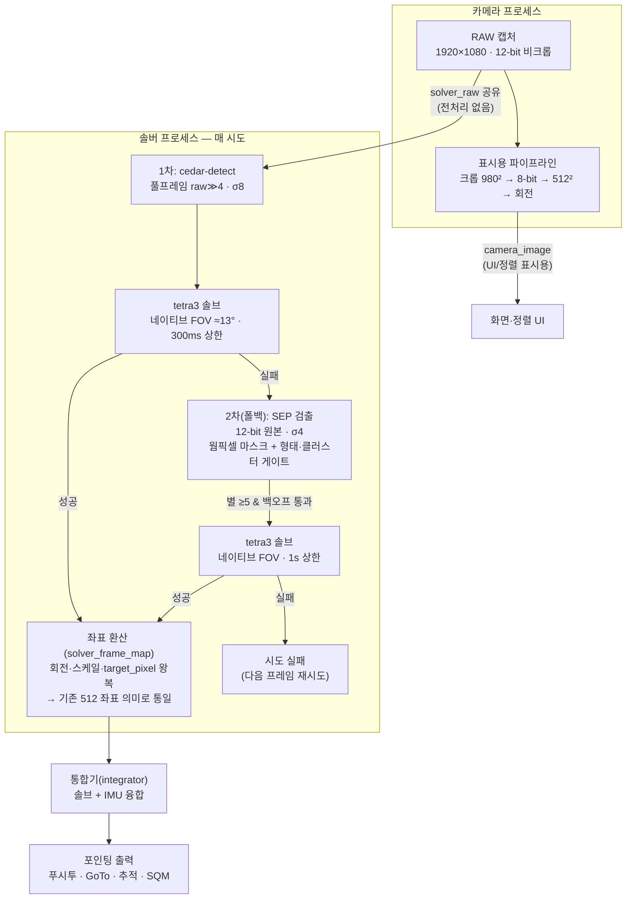

# MF_PiFinder 테스트 리포트 — 풀프레임 솔빙, 광해 실측 (2026-08-04)

> 커뮤니티 공유용 리포트입니다. 현재 운용 중인 구성 기준의 실측 결과만
> 담았습니다. 기술 상세는 [하이브리드 설계 문서](mf_cedar_sep_hybrid_design_ko.md)
> 참조.

## 배경

PiFinder는 망원경이 "지금 어디를 보고 있는지"를 플레이트 솔빙으로 알아내는
장치입니다. 이 포크(MF_PiFinder)의 목표는 **도심 광해에서도 정확하게
솔빙되는 파인더**이고, 이번 테스트는 검출기(cedar-detect)에 **크롭 없는
풀프레임을 직접 입력하는 구성**을 실제 광해 하늘에서 검증한 기록입니다.

- 장비: PiFinder(RPi) + imx462 (1920×1080, 12-bit), 서울 도심(광해+건물 불빛)
- 소프트웨어: MF_PiFinder 하이브리드 솔버 (cedar 풀프레임 1차 + SEP 폴백)

## 솔빙 처리 구조 (현재 구성)

한 번의 솔브 시도가 처리되는 흐름입니다:

핵심 포인트:

1. **검출은 풀프레임**: 기존 512² 크롭 대신 비크롭 원본을 cedar에 직접
   입력합니다. 시야가 2.16배 넓어져 매칭에 쓸 실별이 그만큼 늘고, 8-bit
   변환 손실도 없습니다 (cedar 검출은 밝기 스트레치에 불변이라 전처리
   없이 상위 8비트만 잘라 넣습니다).
2. **실패 시 SEP이 구제**: cedar가 못 풀면 같은 노출의 12-bit 원본에서
   SEP이 웜픽셀 마스크·형태 게이트를 거친 검출로 2차 솔브합니다.
3. **하류는 무변경**: 어느 경로가 풀었든 좌표는 기존 512 프레임 의미로
   환산되어 공급되므로, 정렬·GoTo·추적·SQM은 어떤 경로가 풀었는지
   모릅니다. 어느 경로가 풀었는지는 진단 필드(`solve_path`)로 확인합니다.

## 측정 방식

- **노출 고정**: 0.2s / 게인 30 (솔빙 성능만 보기 위해 자동 노출 배제)
- **시도별 전수 기록**: 모든 솔브 시도마다 검출 수·매치 수·성공 여부·경로·
  배경 밝기를 CSV(tmpfs)로 기록 — 총 ~2,200시도
- **광해 스트레스 방법**: 경통을 건물 불빛이 프레임 하단에 직접 들어오는
  위치에서 시작해 단계적으로 상승시키며, **배경 밝기(12-bit p50)를 광해
  강도의 지표**로 사용
- 좋은 조건 대조: 같은 밤 별밭 지향 표본으로 상한 성능 확인

## 결과

### 광해 상승 곡선

| 배경 밝기 (12-bit p50) | 솔브율 | cedar 직접 | SEP 구제 | 매치 수 med |
| --- | --- | --- | --- | --- |
| 70% (건물 불빛 직접) | 10–17% | 0% | 10–17% | 8–12 |
| 62% | 98% | **95%** | 3% | 12 |
| 55% | **100%** | **99%** | 1% | 14 |
| 43% | 97% | **95%** | 2% | 13 |
| 별밭 (대조) | 100% (10/10) | 100% | 0% | 25–27 |

### 관찰

1. **배경 ≤62%에서는 cedar 풀프레임이 직접 95–99%를 해결**합니다. 같은
   하늘에서 기존 512 크롭 경로의 매치는 6–10개 수준이었는데, 풀프레임은
   12–14개(별밭에서는 25–27개)로 매칭 여유가 2~3배입니다.
2. **솔빙 한계선은 배경 65–70% 부근**입니다. 건물 불빛이 프레임에 직접
   들어오는 수준으로, 이 위에서는 검출기 종류와 무관하게 진짜 별의 SNR이
   부족합니다. 이 영역에서는 게이트를 갖춘 SEP 폴백만 간헐적으로
   구제합니다(솔브 시 매치 12개, RMSE ~53″).
3. **정확도**: 별밭에서 RMSE 20–29″, 광해 구간에서도 솔브 성공 시 RMSE
   30–50″대 — 파인더 용도(아이피스 시야 0.5–1°)에 충분합니다.
4. **속도**: 성공 솔브의 tetra3 시간은 9–26ms, 시도 주기는 ~2Hz입니다.
   미솔빙 조건에서는 1차에 300ms 상한을 걸어 빠르게 포기하고 폴백에
   기회를 넘깁니다.

## 결론

풀프레임 검출 구성으로, **도심 광해(배경 43–62%)에서 솔브율 97–100%**,
그중 95% 이상을 1차 경로가 직접 해결하는 것을 실측으로 확인했습니다.
남는 실패 영역은 건물 불빛이 프레임에 직접 들어오는 극한 조건(배경
≥65–70%)뿐이며, 이는 검출 방식이 아닌 별 SNR의 물리 한계입니다.

측정 원자료(시도별 CSV)와 재현 절차는 저장소의
[실측 리포트](mf_solver_fullframe_field_test_20260803_ko.md)에 있습니다.
