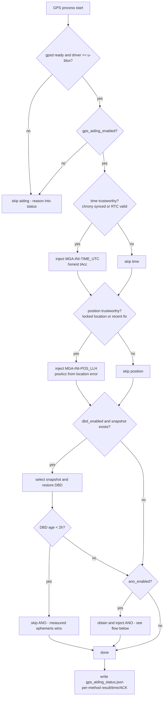
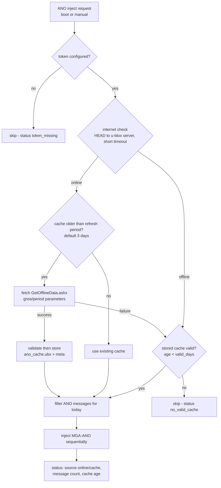
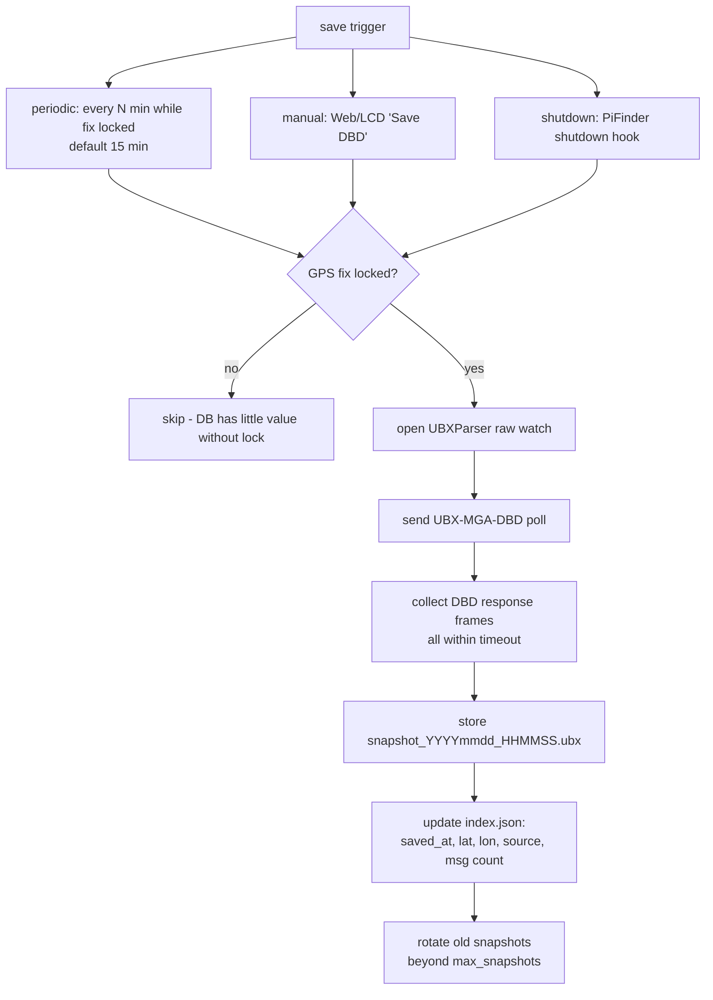
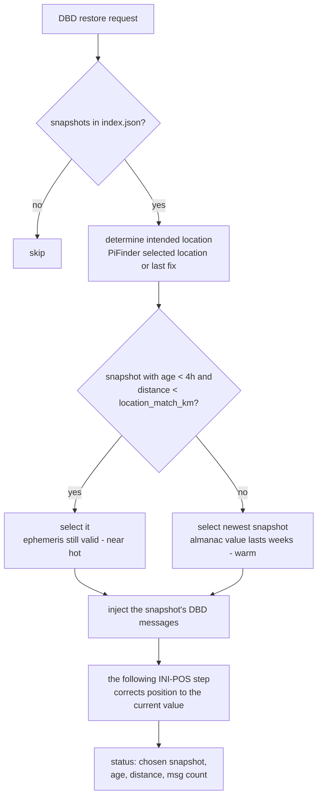
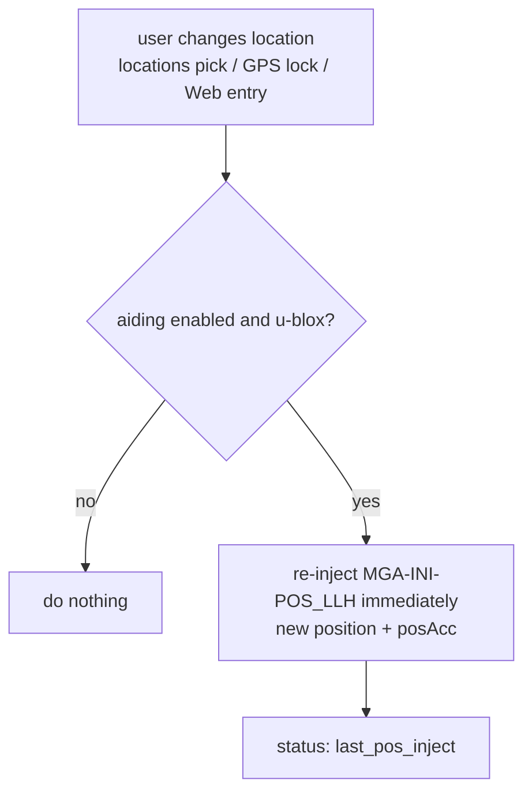

# MF PiFinder GPS Aiding Plan (u-blox only)

Created: 2026-07-14
Status: design draft (for review before implementation)

This document describes the design and operation flows for injecting the
Raspberry Pi's time, position, and assistance data into the u-blox receiver
(GEP-M1025, M10 SPG 5.10) after boot, to mitigate the full cold start the
receiver falls into after longer power-off periods. The flows and policies
here are to be agreed on before any implementation.

## Background

- The GEP-M1025 backs up its RTC/BBR with a supercapacitor, not a battery.
  It holds for minutes to a few hours, so after a day powered off the
  receiver loses time, ephemeris, and almanac and starts fully cold every
  session. (Its configuration persists in flash.)
- Cold vs warm start: the C/N0 of an already-tracked satellite is the same,
  but **acquisition sensitivity and TTFF differ greatly**. A cold receiver
  must blind-search the full Doppler x code space for every satellite
  (acquisition threshold ~ -148 dBm on the M10); warm/hot searches a narrow
  window and operates near the reacquisition sensitivity (~ -160 dBm). The
  effective difference is 10-15 dB.
- The 2026-07-14 diagnosis confirmed PiFinder-body EMI costs the GPS about
  10-15 dB (A-B-A measurement). Aiding partially offsets that loss, which
  makes it a practical workaround as well.

## Goals

- Turn the receiver's start right after boot from cold into warm (close to
  hot where possible).
- Must work at observing sites with no internet. Online access is
  "use it when available".
- The user can enable/disable each method and trigger inject/save manually.
- Do not disturb the existing GPS flow (gpsd, gps_gpsd/gps_ubx, time sync
  helper).
- Failures must never block boot or GPS reception (best-effort).

## Scope and assumptions

- **u-blox only**: UBX-MGA/UPD is u-blox proprietary. Gate on **receiver
  detection**, not config — gpsd `DEVICES` reports `driver == "u-blox"`
  (this device: `SW ROM SPG 5.10, PROTVER=34.10`). Works with either
  PiFinder GPS backend as long as the receiver is u-blox.
- **Use packages**: sends go through gpsd's `ubxtool`. Bookworm ships
  `/usr/bin/ubxtool` but it needs the `python3-gps` package (add to
  `pifinder_setup.sh`). If gpsd runs with `-b` (readonly) the feature
  disables itself and records the reason in status.
- Receiving (ACK checks, DBD capture) reuses the repo's `UBXParser` gpsd
  raw watch (`?WATCH raw:2`). No new serial access is created — gpsd keeps
  owning the port.
- The ROM firmware (SPG 5.10) may not support `UBX-UPD-SOS` (flash
  save/restore), so it is out of scope; host-side storage (③ MGA-DBD) is
  the single backup mechanism.

## The three methods

| # | Method | Data | Effect | Internet | Default |
| --- | --- | --- | --- | --- | --- |
| ① | MGA-INI time+position | Pi clock (chrony/RTC), PiFinder location | cold → warm; shrinks the search space | not needed | **On (baseline)** |
| ② | AssistNow Offline (MGA-ANO) | u-blox orbit predictions (valid for weeks) | warm → near hot for days/weeks | only to refresh | Off (token needed) |
| ③ | MGA-DBD backup/restore | nav DB the receiver actually collected (ephemeris/almanac) | near hot if recent, warm later | not needed | On |

- ① is the baseline and is always injected first.
- ② fetches fresh data at injection time when the internet is reachable
  (then stores + injects it); otherwise it injects the stored cache if that
  is still valid.
- ③ is stored and managed together with location metadata so the system
  can react immediately when the observing site changes (see "Reacting to
  location changes").
- The methods are not exclusive. The receiver itself prefers the better
  data among what is injected (measured ephemeris > predictions).

## Architecture

```text
New module: python/PiFinder/gps_aiding.py
Data:       ~/PiFinder_data/gps_aiding/
              ano_cache.ubx          (② cache)
              ano_cache_meta.json    (fetch time, gnss, validity)
              dbd/  snapshot_*.ubx   (③ snapshots, rotated)
              dbd/  index.json       (snapshot meta: time, location, source)
Status:     ~/PiFinder_data/gps_aiding_status.json
```

Execution:

- **Boot injection + periodic DBD backup**: the GPS process starts a
  `gps_aiding.start_worker()` daemon thread. It acts only after the gpsd
  connection is up and the receiver is detected as u-blox.
- **Manual actions (Web/LCD)**: server.py routes and LCD callbacks call
  the same module functions directly. No new queue.
- **Serialization**: every receiver write takes a file lock
  (`gps_aiding.lock`, flock), safe across processes.
- Sends run `ubxtool -P 34.10 -c CLASS,ID,<hex payload>` as a subprocess;
  verification/capture uses the UBXParser raw watch. MGA ACKs only arrive
  when `CFG-NAVSPG-ACKAIDING` is enabled, so ACKs are "recorded when seen"
  and their absence is not treated as failure (fire-and-forget allowed).

## Boot injection flow



Injection order principle: **time → position → DBD → ANO**. The receiver
needs time first to judge the validity of the ephemeris/prediction data
that follows.

## ② AssistNow Offline data management flow



- Fetch URL: `offline-live1.services.u-blox.com/GetOfflineData.ashx`
  (`token`, `gnss=gps,glo,gal,bds`, `period=4` weeks, `resolution=1` day).
  The token is a free u-blox Thingstream registration, entered in the Web
  settings.
- Never inject the whole multi-week file (hundreds of KB). **Filter to
  today ±1 day** (each ANO message carries a date field).
- A failed fetch never deletes the existing cache; only a validated new
  file replaces it.

## ③ MGA-DBD save/restore flows

Save (backup):



Restore (at boot):



- Ephemeris is only valid ~4 hours, so "age < 4h at the same site" is the
  best case. Otherwise the newest snapshot is injected for its
  almanac/ionosphere value (always better than cold, never harmful).
- Location tagging lives in the snapshot metadata (index.json). Snapshots
  are not kept per-site — ephemeris/almanac are location independent, and
  position is ①'s job. The distance match only decides whether to trust a
  snapshot as hot-start grade.

## Reacting to location changes



- For users moving between observing sites, the receiver's search
  assumptions update the moment the location changes. Hook points: the
  main.py `gps_msg == "fix"` path when the source is not GPS (manual/saved
  location applied) and the locations callbacks.

## User control (UI)

LCD:

```text
Settings > Advanced > GPS Settings > GPS Aiding
  Aiding        Off / On          (gps_aiding_enabled)
  Use ANO       Off / On          (gps_aiding_ano_enabled)
  Use DBD       Off / On          (gps_aiding_dbd_enabled)
  Inject Now    [action]          (re-inject ① plus enabled ②③)
  Save DBD      [action]          (back up DBD now)
```

Web (a GPS card or Tools section):

- Per-method toggles (including separate ① time/position toggles), ANO
  token input field
- Status: last inject time/result per method, ANO cache age/source, DBD
  snapshot list (time, location, age)
- Buttons: `Inject Now`, `Save DBD Now`, `Refresh ANO Now`
- Detailed knobs (intervals, thresholds) are Web-only

## Config keys (default_config.json)

```text
gps_aiding_enabled            true    whole feature
gps_aiding_time               true    ① time injection
gps_aiding_position           true    ① position injection
gps_aiding_ano_enabled        false   ② (needs a token, so default Off)
gps_aiding_ano_token          ""      u-blox AssistNow token
gps_aiding_ano_refresh_days   3       re-fetch period while online
gps_aiding_ano_valid_days     28      cache validity (matches fetch period)
gps_aiding_dbd_enabled        true    ③
gps_aiding_dbd_interval_min   15      periodic backup interval
gps_aiding_dbd_max_snapshots  5       rotation depth
gps_aiding_dbd_match_km       100     hot-start-grade distance threshold
```

All keys persist like normal settings (no session-only switch as in the
LiveCam processing case — aiding does not consume resources continuously).

## Safety rules

- **Never block boot**: every step has a timeout (sends a few seconds, ANO
  fetch ~10 s); failures log + record status and move on.
- **Never inject false data**:
  - Time: only when chrony is synced or the time sync helper trusts its
    source. Set `tAccS/Ns` honestly (hundreds of ms to seconds for NTP,
    large for RTC).
  - Position: only a locked saved location or a recent GPS fix. Reflect
    the location error in `posAcc` with a floor. When unsure, skip — a
    wrong injected position is worse than none.
- All receiver writes serialize through flock across processes. If gpsd
  runs with `-b`, disable with a status notice.
- The ANO cache is replaced only after the download validates (UBX frames
  parse, minimum size).
- Missing/broken ubxtool (package not installed) disables the feature with
  a status notice.

## Message/tool reference

```text
Send: ubxtool -P 34.10 -c <class,id,payload>
  MGA-INI-TIME_UTC   0x13 0x40 (type=0x10)  time + tAcc
  MGA-INI-POS_LLH    0x13 0x40 (type=0x01)  lat/lon/alt + posAcc
  MGA-ANO            0x13 0x20              orbit predictions (from cache)
  MGA-DBD            0x13 0x80              poll (empty) / restore (replay dump)
Receive: UBXParser raw watch
  MGA-ACK            0x13 0x60              only when ACKAIDING enabled
  MGA-DBD responses  0x13 0x80              capture target for backups
```

- UBXParser needs an MGA-class (0x13) raw frame passthrough (it currently
  parses NAV only). No parsing needed — store/replay the frame bytes as-is.

## Implementation stages

```text
Stage 1  gps_aiding.py skeleton + ① time/position + boot hook + status file
         (u-blox detection, flock, ubxtool wrapper, gating rules)
Stage 2  config keys + LCD menu + Web card/buttons (Inject Now)
Stage 3  ③ DBD: UBXParser MGA passthrough, backup (periodic/manual/
         shutdown), restore, index.json, location tagging/selection
Stage 4  ② ANO: fetch/validate/cache, date-filtered injection, token UI,
         Refresh Now
Stage 5  location-change hook, add python3-gps to pifinder_setup.sh,
         docs, field measurements
```

Each stage must be deployable and verifiable on its own. Stage 1 alone
already yields the cold → warm improvement.

## Test plan

- Indoors: send success/timeout, status file fields, flock contention,
  disabled behavior under gpsd `-b` / missing ubxtool.
- Outdoors A/B (reusing scripts/gps_acquisition_diag.py):
  - TTFF of cold (aiding off) vs ① vs ①+③ vs ①+②+③
  - reboot after hours powered off
  - moving between observing sites (location-change reaction)
- Regression: no impact on the existing GPS flow (fix/time/satellites
  messages, time sync helper). With aiding fully Off the behavior must be
  identical to today.

## Open questions (to settle before implementing)

1. ANO gnss combination — match the receiver defaults (GPS/GLO/GAL/BDS)
   but decide on GAL/BDS inclusion after looking at file size and
   injection time.
2. Where the shutdown DBD backup hook lives — PiFinder's normal shutdown
   path is short; a systemd `ExecStop` script may be more reliable.
3. gpsd 3.22 ubxtool compatibility with the M10 (PROTVER 34) — the raw
   `-c` send should be fine, but verifying this on hardware is the first
   task of Stage 1.
