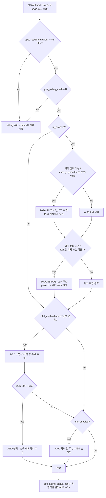
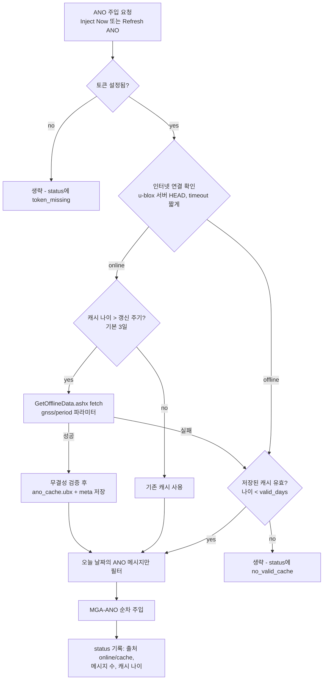
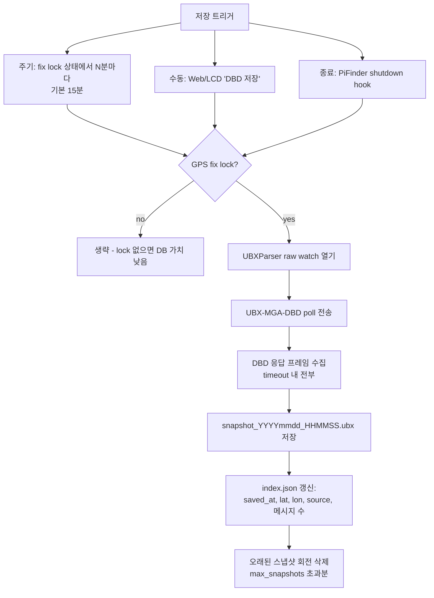
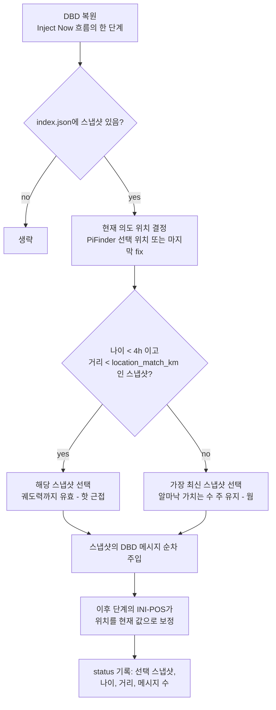
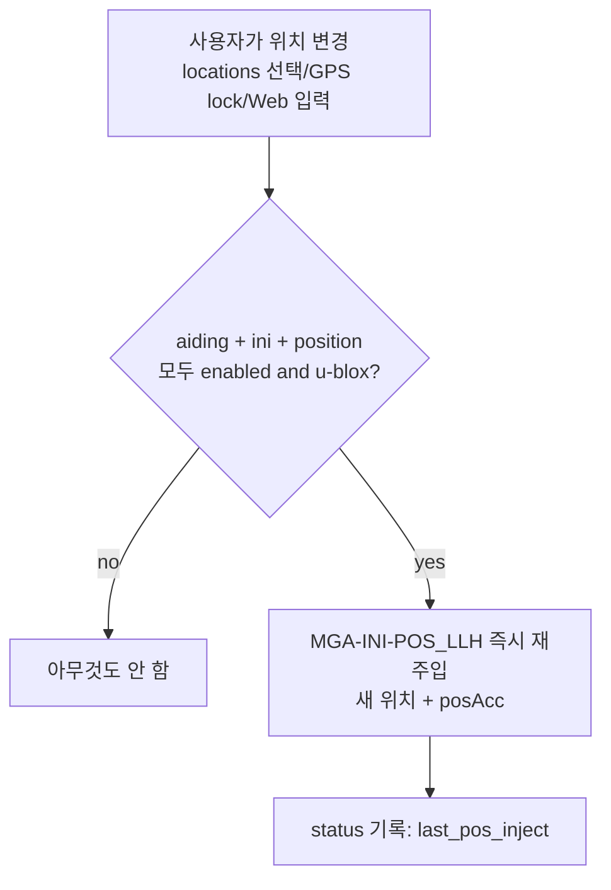

# MF PiFinder GPS Aiding Plan (u-blox 전용)

작성일: 2026-07-14
상태: 설계 초안 (구현 전 검토용)

이 문서는 u-blox 수신기(GEP-M1025, M10 SPG 5.10)가 장시간 전원 차단 후
콜드스타트로 시작하는 문제를 완화하기 위해, Raspberry Pi가 가진 시각·위치·
보조 데이터를 **사용자의 주입 요청 시점에** 수신기에 주입(aiding)하는
기능의 설계와 동작 순서를 정리한다. 구현 전에 이 문서로 동작 순서와
정책을 확정한다.

## 배경

- GEP-M1025의 백업 전원은 배터리가 아니라 슈퍼커패시터다. 유지 시간이
  분~수 시간 수준이라, PiFinder를 하루 이상 꺼두면 시각·궤도력·알마낙이
  모두 소실되어 매번 완전 콜드스타트가 된다. (설정은 플래시에 있어 유지됨)
- 콜드/웜 스타트에서 이미 추적 중인 위성의 C/N0 자체는 같지만,
  **획득(acquisition) 감도와 TTFF는 크게 다르다**. 콜드는 전 위성을
  넓은 도플러×코드 공간에서 blind 탐색해야 하므로 획득 문턱이 높고
  (M10 기준 약 -148 dBm), 웜/핫은 좁은 창만 탐색해 재획득 감도
  (약 -160 dBm)에 가깝게 동작한다. 실효 차이는 10~15 dB에 달한다.
- 2026-07-14 진단에서 PiFinder 본체 EMI가 GPS 신호를 10~15 dB 깎는 것을
  확인했다(A-B-A 측정). aiding은 이 손실을 부분적으로 상쇄하는
  실질적인 우회책이기도 하다.

## 목표

- **사용자가 주입을 요청한 시점**(LCD/Web의 Inject Now)에 수신기를
  콜드 → 웜(가능하면 핫에 근접) 스타트로 전환한다. **부팅 시 자동 주입은
  하지 않는다** — 수신기에 쓰는 시점은 항상 사용자가 결정한다.
- 인터넷이 없는 관측지에서도 동작해야 한다. 온라인은 "있으면 활용"이다.
- 사용자가 방식별로 켜고 끄고, 수동으로 주입/저장할 수 있어야 한다.
- 기존 GPS 흐름(gpsd, gps_gpsd/gps_ubx, time sync helper)을 흔들지 않는다.
- 실패해도 부팅과 GPS 수신 자체는 절대 방해하지 않는다 (best-effort).

## 범위와 전제

- **u-blox 전용**: 주입에 쓰는 UBX-MGA/UPD는 u-blox 프로토콜이다.
  게이트는 config가 아니라 **수신기 감지**로 한다 — gpsd `DEVICES` 응답의
  `driver == "u-blox"` (현재 기기: `SW ROM SPG 5.10, PROTVER=34.10`).
  gpsd/ublox 어느 백엔드를 쓰든 수신기가 u-blox이면 동작한다.
- **패키지 사용**: 전송 도구는 gpsd의 `ubxtool`을 쓴다. Bookworm에서
  `/usr/bin/ubxtool`은 이미 있으나 `python3-gps` 패키지가 필요하다
  (`pifinder_setup.sh`에 추가). gpsd가 `-b`(readonly)로 실행 중이면 기능을
  비활성화하고 상태에 사유를 남긴다.
- 수신(ACK 확인, DBD 캡처)은 리포에 이미 있는 `UBXParser`의 gpsd raw watch
  (`?WATCH raw:2`)를 재사용한다. 새 시리얼 접근은 만들지 않는다 —
  포트는 계속 gpsd가 소유한다.
- ROM 펌웨어(SPG 5.10)는 `UBX-UPD-SOS`(플래시 자동 저장/복원)를 지원하지
  않을 수 있으므로 계획에서 제외하고, 호스트(Pi) 저장 방식(③ MGA-DBD)으로
  통일한다.

## 세 가지 방식

| # | 방식 | 데이터 | 효과 | 인터넷 | 기본값 |
| --- | --- | --- | --- | --- | --- |
| ① | MGA-INI 시각+위치 | Pi 시계(chrony/RTC), PiFinder 위치 | 콜드 → 웜. 탐색 공간 대폭 축소 | 불필요 | On |
| ② | AssistNow Offline (MGA-ANO) | u-blox 서버의 궤도 예측(수 주 유효) | 웜 → 핫 근접. 며칠~몇 주 커버 | 갱신 시에만 | Off (토큰 필요) |
| ③ | MGA-DBD 백업/복원 | 수신기가 실제 수집한 nav DB(궤도력/알마낙) | 최근 사용 시 핫 근접, 이후 웜 | 불필요 | On |

- **세 방식 모두 사용자 선택 항목이다.** ①도 예외 없이 토글로 켜고 끈다
  (`gps_aiding_ini_enabled`). 어떤 방식도 사용자가 끄면 주입하지 않는다.
- ①이 활성화되어 있으면 항상 가장 먼저 주입한다 (시각이 있어야 뒤의
  데이터를 수신기가 검증할 수 있으므로).
- ②는 주입 시점에 인터넷이 되면 새로 받아서 저장+주입하고, 안 되면
  저장된 캐시가 유효할 때 캐시를 주입한다.
- ③은 위치 정보와 함께 저장·관리한다. 장소가 바뀌면 즉시 반응한다
  (아래 "위치 변경 반응" 참고).
- 세 방식은 배타적이지 않다. 수신기는 주입된 보조 데이터 중 더 좋은
  것(실측 궤도력 > 예측)을 스스로 우선한다.

## 아키텍처

```text
새 모듈: python/PiFinder/gps_aiding.py
데이터:   ~/PiFinder_data/gps_aiding/
            ano_cache.ubx          (② 캐시)
            ano_cache_meta.json    (fetch 시각, gnss, 유효기간)
            dbd/  snapshot_*.ubx   (③ 스냅샷, 회전 보관)
            dbd/  index.json       (스냅샷 메타: 시각, 위치, 소스)
상태:     ~/PiFinder_data/gps_aiding_status.json
```

실행 주체:

- **주입은 전부 사용자 요청으로만**: server.py 라우트와 LCD 콜백이
  같은 모듈의 주입 함수를 직접 호출한다. 별도 큐는 만들지 않는다.
  부팅 시 자동 주입 경로는 없다.
- **백그라운드 워커는 ③ 주기 DBD 백업 전용**: GPS 프로세스가 시작될 때
  `gps_aiding.start_worker()` 데몬 스레드를 띄우되, 이 워커는 수신기에
  aiding 데이터를 주입하지 않는다 — fix lock 상태에서 주기적으로
  DBD를 **읽어 저장**만 한다. gpsd 연결과 u-blox 감지가 끝난 뒤에만
  동작한다.
- **직렬화**: 수신기에 쓰는 모든 동작은 파일 lock
  (`gps_aiding.lock`, flock)으로 직렬화한다. 프로세스가 달라도 안전하다.
- 전송은 `ubxtool -P 34.10 -c CLASS,ID,<hex payload>` 서브프로세스,
  검증/캡처는 UBXParser raw watch. MGA ACK는 `CFG-NAVSPG-ACKAIDING`이
  켜져 있을 때만 오므로, ACK는 "확인되면 기록"하고 없어도 실패로
  간주하지 않는다(fire-and-forget 허용).

## 주입 요청 처리 순서도

주입은 사용자가 LCD/Web에서 `Inject Now`를 눌렀을 때만 실행된다.



주입 순서 원칙: **시각 → 위치 → DBD → ANO**. 시각이 있어야 수신기가
뒤따르는 궤도력/예측 데이터의 유효성을 판정할 수 있다.

## ② AssistNow Offline 데이터 관리 순서도



- 토큰: u-blox 보조데이터 서버 접근용 API 키 문자열. Thingstream
  (u-blox 서비스 플랫폼) 계정에서 발급받아 Web 설정에 입력한다.
- **서비스 전환 주의 (2026-07 기준)**: 기존 AssistNow Online/Offline
  (`offline-live1.services.u-blox.com/GetOfflineData.ashx?token=...`)은
  2026-05-31부로 EOM/EOS에 들어갔고 **신규 토큰은 더 이상 발급되지
  않는다** (기존 developer 토큰은 2028년 중반까지 동작). 대체 서비스인
  **AssistNow Predictive Orbits**는 M9/M10/F9/F10 수신기에 **무료**이고
  데이터가 **동일한 UBX-MGA-ANO 메시지**로 제공되므로, 주입/캐시/필터
  로직은 이 문서 그대로 유효하다 — 달라지는 것은 데이터 확보 경로
  (Thingstream 기기 등록 기반 인증)뿐이다. Stage 4 착수 시점에 최신
  엔드포인트/인증 방식을 확정한다.
- 파일 전체(수 주치, 수백 KB)를 다 넣지 않는다. **오늘 ±1일 메시지만
  필터해서 주입**한다 (각 ANO 메시지에 날짜 필드가 있음).
- 실패 시 기존 캐시를 지우지 않는다. 검증 통과한 새 파일로만 교체.

## ③ MGA-DBD 저장/복원 순서도

저장 (백업):



복원 (주입 요청 시):



- 궤도력은 ~4시간만 유효하므로 "나이 < 4h + 같은 장소"가 최상 케이스다.
  그 외에는 알마낙/이온층 보정 가치로 최신 스냅샷을 넣는다 (콜드보다
  항상 낫고, 해가 되지 않는다).
- 위치 태깅은 스냅샷 메타(index.json)에 저장한다. 장소별로 별도 보관할
  필요는 없다 — 궤도력·알마낙 자체는 위치 독립이고, 위치는 ①이 맡는다.
  매칭 판정은 "이 스냅샷의 궤도력을 핫스타트급으로 신뢰할지"의 기준이다.

## 위치 변경 반응



- 관측지를 옮겨 다니는 사용 패턴에서, 위치가 바뀌는 순간 수신기 탐색
  가정도 바로 갱신되도록 한다. 훅 지점은 main.py의 `gps_msg == "fix"`
  중 source가 GPS가 아닌 경우(수동/저장 위치 적용)와 locations 콜백.
- 위치 변경도 사용자의 명시적 행위이므로 "사용자 요청 시점 주입" 원칙에
  부합한다. 부팅처럼 사용자 개입 없이 일어나는 자동 주입은 아니다.

## 사용자 제어 (UI)

LCD:

```text
Settings > Advanced > GPS Settings > GPS Aiding
  Aiding        Off / On          (gps_aiding_enabled)
  Use INI       Off / On          (gps_aiding_ini_enabled, ① 시각+위치)
  Use ANO       Off / On          (gps_aiding_ano_enabled)
  Use DBD       Off / On          (gps_aiding_dbd_enabled)
  Inject Now    [action]          (활성화된 방식 전체 재주입)
  Save DBD      [action]          (지금 DBD 백업)
```

Web (GPS 관련 카드 또는 Tools):

- 방식별 토글(①시각/위치 분리 토글 포함), ANO 토큰 입력 필드
- 상태 표시: 방식별 마지막 주입 시각/결과, ANO 캐시 나이/출처,
  DBD 스냅샷 목록(시각·위치·나이)
- 버튼: `Inject Now`, `Save DBD Now`, `Refresh ANO Now`
- LCD보다 세부 설정(주기, 임계값)은 Web에만 노출

## 설정 키 (default_config.json)

```text
gps_aiding_enabled            true    기능 전체
gps_aiding_ini_enabled        true    ① (사용자 선택 토글, LCD/Web)
gps_aiding_time               true    ① 세부: 시각 주입 (Web 전용)
gps_aiding_position           true    ① 세부: 위치 주입 (Web 전용)
gps_aiding_ano_enabled        false   ② (토큰 필요해서 기본 Off)
gps_aiding_ano_token          ""      u-blox AssistNow 토큰
gps_aiding_ano_refresh_days   3       온라인일 때 재fetch 주기
gps_aiding_ano_valid_days     28      캐시 유효기간 (fetch period와 일치)
gps_aiding_dbd_enabled        true    ③
gps_aiding_dbd_interval_min   15      주기 백업 간격
gps_aiding_dbd_max_snapshots  5       회전 보관 수
gps_aiding_dbd_match_km       100     핫스타트급 신뢰 거리 임계
```

모든 키는 일반 설정처럼 저장된다 (LiveCam processing 같은 세션 전용
스위치는 없음 — aiding은 리소스를 상시 소비하지 않는다).

## 안전 규칙

- **UI와 GPS 수신을 절대 막지 않는다**: 주입은 사용자 요청 시에만
  실행되고, 모든 단계에 타임아웃(전송 수 초, ANO fetch 10초 내외),
  실패는 로그 + status 기록 후 다음 단계로. 주입 실행 중에도 LCD/Web은
  블로킹되지 않는다 (백그라운드 실행 + 상태 표시).
- **거짓 데이터를 넣지 않는다**:
  - 시각: chrony synced 또는 time sync helper가 신뢰하는 상태에서만.
    `tAccS/Ns`를 실제 신뢰도로 설정 (NTP면 수백 ms~수 초, RTC면 크게).
  - 위치: lock된 저장 위치 또는 최근 GPS fix만. `posAcc`에 위치 error를
    반영하고 하한을 둔다. 불확실하면 생략 — 틀린 위치 주입은 무주입보다
    나쁘다.
- 수신기 쓰기는 flock으로 전 프로세스 직렬화. gpsd `-b` 감지 시 기능
  비활성 + status에 안내.
- ANO 캐시는 다운로드 검증(UBX 프레임 파싱 성공, 최소 크기) 후에만 교체.
- ubxtool 부재/실패(패키지 미설치)면 기능 비활성 + status 안내.

## 메시지/도구 참고

```text
전송: ubxtool -P 34.10 -c <class,id,payload>
  MGA-INI-TIME_UTC   0x13 0x40 (type=0x10)  시각 + tAcc
  MGA-INI-POS_LLH    0x13 0x40 (type=0x01)  lat/lon/alt + posAcc
  MGA-ANO            0x13 0x20              궤도 예측 (캐시 파일에서)
  MGA-DBD            0x13 0x80              poll(빈 payload) / 복원(덤프 재전송)
확인: UBXParser raw watch
  MGA-ACK            0x13 0x60              ACKAIDING 켜진 경우만 수신
  MGA-DBD 응답        0x13 0x80              백업 캡처 대상
```

- UBXParser에 MGA 클래스(0x13) raw 프레임 패스스루를 추가해야 한다
  (현재는 NAV 계열만 파싱). 파싱은 불필요 — 프레임 bytes 그대로 저장/재전송.

## 구현 단계

```text
Stage 1  gps_aiding.py 뼈대 + ① 시각/위치 주입 + Inject Now 진입점(Web)
         + status 파일 (u-blox 감지, flock, ubxtool 래퍼, 게이트 규칙)
Stage 2  설정 키 + LCD 메뉴 + Web 카드/버튼 (Inject Now)
Stage 3  ③ DBD: UBXParser MGA 패스스루, 백업(주기/수동/종료), 복원,
         index.json, 위치 태깅/선택 규칙
Stage 4  ② ANO: fetch/검증/캐시, 날짜 필터 주입, 토큰 UI, Refresh Now
Stage 5  위치 변경 훅, pifinder_setup.sh에 python3-gps 추가, 문서 갱신,
         실측 검증
```

각 Stage는 독립적으로 배포/검증 가능해야 한다. Stage 1만으로도
콜드 → 웜 효과가 나온다.

## 테스트 계획

- 실내: 주입 명령 성공/타임아웃, status 파일 필드, flock 경합,
  gpsd `-b`/ubxtool 부재 시 비활성 동작.
- 실외 A/B (scripts/gps_acquisition_diag.py 재사용):
  - cold (주입 안 함) vs ① vs ①+③ vs ①+②+③ 의 TTFF 비교
    (각 케이스 모두 부팅 후 사용자가 Inject Now를 누른 시점 기준)
  - 전원 수 시간 차단 → 재부팅 → Inject Now 시나리오
  - 관측지 이동 시나리오 (위치 변경 반응 확인)
- 회귀: 기존 GPS 흐름(fix/time/satellites 메시지, time sync helper)
  무영향 확인. aiding 전체 Off 시 현재와 완전 동일해야 한다.

## 미해결 질문 (구현 전 확정 필요)

1. ② 데이터 소스 확정 — 사용자가 기존 AssistNow Offline 토큰을 보유한
   경우(classic 경로) vs 신규 Predictive Orbits(Thingstream 기기 등록)
   중 무엇을 기본으로 할지. 두 경로 모두 MGA-ANO 출력이라 주입 로직은
   공통이다.
2. ANO fetch의 gnss 조합 — 수신기 기본 설정(GPS/GLO/GAL/BDS)과 맞추되
   파일 크기와 주입 시간을 보고 GAL/BDS 포함 여부 결정.
3. 종료 시 DBD 백업 훅의 위치 — PiFinder 정상 종료 경로가 짧아서
   systemd `ExecStop` 스크립트가 더 안정적일 수 있음.
4. gpsd 3.22 ubxtool의 M10(PROTVER 34) 호환 — `-c` 원시 전송은 문제
   없을 것으로 보이나 Stage 1에서 실기기 확인이 첫 작업.
