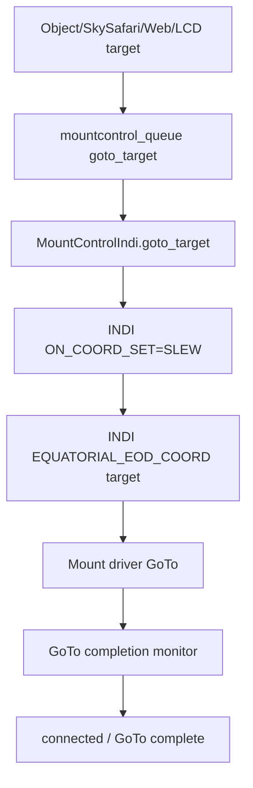
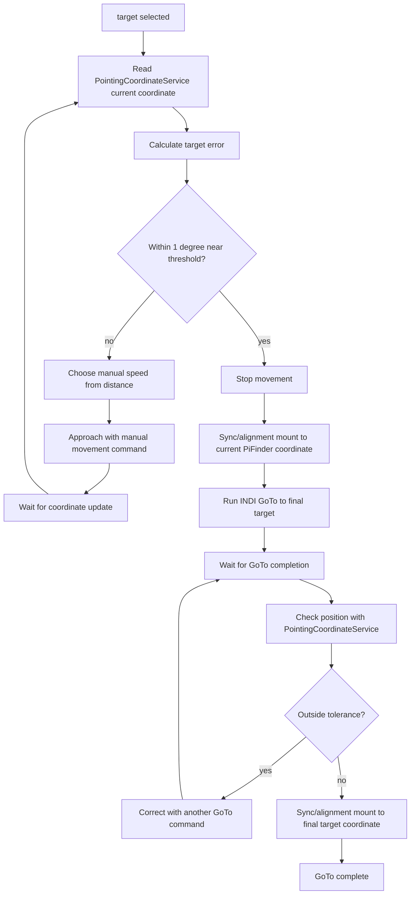
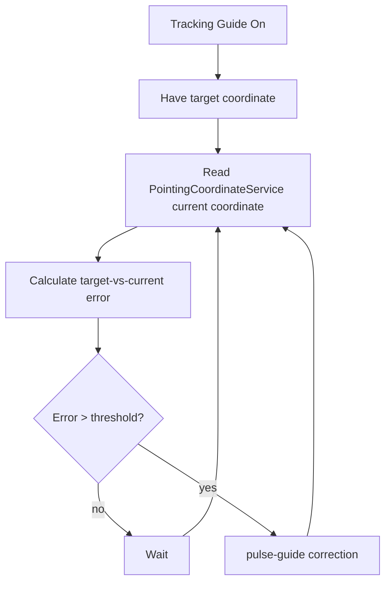
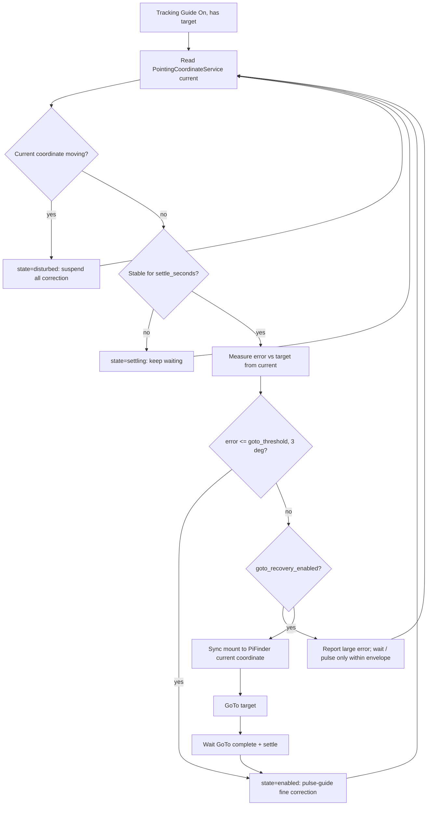

# MF PiFinder INDI GoTo / Guide Settings Draft

Baseline: `mf_pifinder` branch, 2026-07-08.

This document is a design draft for adding INDI mount `GoTo/Guide` settings
before implementation.

## Purpose

Let the user choose how INDI mount GoTo is performed and whether tracking guide
correction is enabled.

New settings UI:

- LCD: `Start > INDI > Setting > Goto/Guide`
- Web: bottom of the `/indi` tab/page

First-pass settings:

```text
GoTo Method
  - INDI Mount
  - PiFinder

Tracking Guide
  - On
  - Off
```

GoTo target input paths:

```text
LCD UI target selection
SkySafari target / GoTo
Web UI target setting
```

All three input paths should converge on the same mount-control target handling
and run either the `INDI Mount` or `PiFinder` procedure depending on the selected
`GoTo Method`.

## Current Related Implementation

Existing source pieces:

```text
python/PiFinder/mountcontrol_indi.py
  goto_target()
  toggle_guide_correction()
  _check_guide_correction()
  manual_move()
  stop_mount()

python/PiFinder/ui/indi.py
  UIIndiGuide
  number 5: toggles indi_goto_refine_once
  number 0: toggle_guide_correction

python/PiFinder/server.py
python/views/indi_mount.html
  SkySafari Mount Mode settings
  skysafari_indi_goto
  skysafari_indi_sync
  indi_goto_refine_once
  indi_goto_refine_accuracy_arcmin

python/PiFinder/pointing_coordinate_service.py
  current coordinate state for SkySafari/Web/LCD consumers
```

`goto_target()` currently uses INDI `ON_COORD_SET=SLEW` and
`EQUATORIAL_EOD_COORD` to send GoTo to the active mount driver.

`toggle_guide_correction()` currently compares solve-based target error and
sends short manual correction pulses.

## Implementation Architecture

To avoid destabilizing the existing system, the new feature should be
implemented as a separate service and separate source module.

Candidate new source file:

```text
python/PiFinder/indi_goto_guide_service.py
```

Responsibility split:

```text
pos_server.py
  Receives SkySafari LX200 commands
  Routes GoTo/Sync/Guide requests to the new service queue
  Keeps existing push-to UI behavior

server.py / views/indi_mount.html
  Web settings UI
  Routes Web target/stop requests to the new service queue

ui/indi.py, ui/object_details.py
  LCD settings UI
  Routes LCD target/stop requests to the new service queue

indi_goto_guide_service.py
  Selects the GoTo Method policy
  Runs the PiFinder GoTo state machine
  Runs the Tracking Guide state machine
  Reads PointingCoordinateService coordinates
  Sends only small primitive commands to the existing mountcontrol_queue

mountcontrol_indi.py
  Remains the existing INDI command executor
  Provides existing primitives such as connect, sync, goto_target,
  manual_move, and stop_mount
```

The new service does not replace mountcontrol. `MountControlIndi` stays as the
execution layer that talks to the INDI driver, while the new service becomes the
orchestration layer that sequences multiple primitive commands safely.

Draft process/queue structure:

```text
main.py
  mountcontrol_queue = Queue()
  goto_guide_queue = Queue()

  MountControl process
    input: mountcontrol_queue

  INDI GoTo/Guide process
    input: goto_guide_queue
    output: mountcontrol_queue
    reads: shared_state, mount_control_status.json
    writes: indi_goto_guide_status.json

  POS Server process
    SkySafari GoTo/Sync/Guide -> goto_guide_queue

  Web/LCD
    settings/config -> config.json
    target/stop/runtime commands -> goto_guide_queue
```

Candidate status file:

```text
data/indi_goto_guide_status.json
```

Minimum status fields:

```text
service_state
active_target_ra
active_target_dec
goto_method
tracking_guide_enabled
phase
last_error_arcmin
last_action
wait_reason
updated
```

## Implementation Rules and Risks

- The new service must be a short-tick state machine, not a long blocking loop.
- Stop/Abort commands must take priority in every phase.
- The existing `goto_target()` path must remain unchanged for
  `Goto Method = INDI Mount`.
- `skysafari_indi_goto` controls whether SkySafari GoTo is forwarded to mount
  features, while `indi_goto_method` controls how a forwarded GoTo is executed.
- `PointingCoordinateService` is the single coordinate-selection source.
- PiFinder GoTo must not start while the mount is parked or location/time is
  invalid.
- Manual approach must use leased manual movement with explicit keepalive or
  stop behavior.
- Tracking Guide must not intervene during user manual movement, GoTo, backlash
  test, or multi-point alignment.
- If pulse guide is unreliable for a driver, short manual movement fallback may
  be used, but the fallback must be shown clearly in status.
- OnStepX-specific behavior must be gated by driver name/capability detection;
  generic INDI mounts should use only standard INDI primitives.

## Proposed Config Keys

The settings should persist across service restarts.

```text
indi_goto_method = "indi_mount" | "pifinder"
  default: "indi_mount"

indi_tracking_guide_enabled = false | true
  default: false

indi_goto_refine_accuracy_arcmin
  existing setting.
  Candidate shared accuracy setting for PiFinder GoTo and tracking guide.

indi_pifinder_goto_near_threshold_deg = 1.0
  Default "near target" threshold for PiFinder GoTo.

indi_tracking_guide_threshold_arcmin
  Error threshold where Tracking Guide starts pulse-guide correction.
  The default should be decided through hardware testing.

indi_tracking_guide_settle_seconds = 2.0
  Coordinate must stay stable this long after an external disturbance
  before Tracking Guide measures error and corrects again.

indi_tracking_guide_motion_arcmin = 15.0
  Per-update current-coordinate delta above which Tracking Guide treats
  the scope as "being moved" (disturbed) and suspends all correction.

indi_tracking_guide_goto_recovery_enabled = false | true
  default: false
  Allow the sync + GoTo recovery motion for large post-disturbance errors.
  When Off, Tracking Guide only does pulse-guide within the pulse envelope
  and otherwise waits/reports; it never slews the mount.

indi_tracking_guide_goto_threshold_deg = 3.0
  Pulse-guide handles post-settle errors up to this size (default 3 deg).
  Errors strictly ABOVE this use the sync + GoTo recovery (when goto
  recovery is enabled); at/below it, pulse-guide corrects directly.
  This single boundary is also the practical pulse-guide envelope.
```

The exact key names may change during implementation, but this document uses
the names above.

## UI Design

### LCD

Menu location:

```text
Start
  INDI
    Setting
      Goto/Guide
```

Draft screen:

```text
Goto/Guide
  Goto Method
    INDI Mount
    PiFinder

  Tracking Guide
    Off
    On
```

Rules:

- Use left/right/square controls for selection and value changes.
- Save changes to config and send `reload_config`.
- Settings should be editable even when the INDI mount is disconnected.
- If tracking guide is running and the user switches it Off, send
  `toggle_guide_correction(false)` or equivalent stop behavior immediately.

### Web

Location:

```text
/indi
  ...
  [bottom] GoTo / Guide Settings
```

Fields:

```text
Goto Method
  radio or select:
    INDI Mount
    PiFinder

Tracking Guide
  checkbox or switch:
    On / Off

Apply button
```

This card should remain separate from the existing `SkySafari Mount Mode` card.
SkySafari settings control protocol forwarding, while `GoTo/Guide` controls the
INDI mount GoTo and correction policy.

## GoTo Method: INDI Mount

This preserves the current behavior.



Behavior:

- The mount driver slews to the target coordinate.
- PiFinder publishes mount readback to the coordinate service during motion.
- If `indi_goto_refine_once` is enabled, a one-shot solve-based refine can run
  after GoTo completes.
- If Tracking Guide is On, periodic guide correction can run against the target
  after GoTo.

## GoTo Method: PiFinder

In this mode, PiFinder uses `PointingCoordinateService` coordinates to approach
near the target with manual movement commands, then combines mount
sync/alignment with INDI GoTo for the final target.



Detailed procedure:

- **At GoTo start, auto-align: sync the mount to the current PiFinder
  coordinate.** This makes the mount aligned so the approach navigates with
  reliable mount readback (`current.source = mount`). Without this initial sync
  the mount stays unaligned and `current` falls back to the raw IMU
  (`source = imu_fallback`), which cannot navigate reliably indoors/without a
  solve.
- Current coordinates needed for movement calculation come from
  `PointingCoordinateService.CoordinateState.current`.
- Calculate distance and direction to the target, then choose manual movement
  direction and speed.
- Use higher speed when far from the target and lower speed as the target gets
  closer.
- The default near-target threshold is 1 degree.
- When inside the near threshold, stop manual movement.
- Sync/alignment the mount to the current coordinate PiFinder is reporting.
  This is the coarse sync step that aligns the mount coordinate system with
  PiFinder.
- Then run a normal INDI GoTo to the final target coordinate.
- After GoTo completion, use `PointingCoordinateService` to check target error.
- If the error is still outside tolerance, repeat corrective GoTo commands.
- When inside the target range, sync/alignment the mount to the final target
  coordinate. This final sync improves tracking precision after acquisition.

Speed policy (tuned on hardware, 2026-07-12):

```text
error >= 10 deg  -> rate 9 (Max)
error >=  3 deg  -> rate 8 (1/2 Max)
error >=  1 deg  -> rate 7 (48x)   # last leg before the 1-deg threshold
error <   1 deg  -> rate 6 (20x)   # only used if the threshold is lowered
```

The earlier draft ended the approach at 20x (~5'/s), which made the final degree
crawl (~17 s); the 48x last leg covers it in ~6 s and the final INDI GoTo still
lands at 0' reported error.

Known open issue (2026-07-12): a zero/short-move INDI GoTo (target already at
the mount position, e.g. the final/corrective GoTo after the mount was synced on
target) completes very slowly (~1-2 min) — OnStepX never reports goto-active for
a no-move GoTo, so mount-control's completion detection waits out its
grace/fallback window. Candidate fix: skip the INDI GoTo (go straight to final
sync) when the error is already inside the near threshold, or shorten the
no-move completion detection in mount-control.

Two motion-continuity rules found on hardware (both required):

- **OnStepX halts motion on a slew-rate change**, and a keepalive alone never
  restarts it — after `set_slew_rate` the service must re-send a fresh
  `manual_movement` (observed: readback froze right at a 9->8 transition and the
  stall guard aborted the approach).
- mount-control refuses keepalives after 10 s of continuous hold
  (`MANUAL_MOTION_MAX_CONTINUOUS_SECONDS`), so the approach re-sends a fresh
  `manual_movement` every `PIFINDER_MANUAL_RESTART_SECONDS = 8.0` s, mirroring
  the UI hold-to-move restart.

Safety notes:

- This mode depends heavily on `PointingCoordinateService` coordinate quality.
- Plate-solved coordinates are the most reliable.
- Without solving, IMU/mount fused coordinates can be used for coarse approach,
  but error may be larger.
- Do not start when the mount is parked or location/time is invalid.
- Stop/Abort must take priority during manual approach, final GoTo, and
  corrective GoTo.

### Hardware test finding: manual-approach motion dies between ticks (2026-07-12)

Symptom: with `indi_goto_method = pifinder`, the mount moves a little then stops,
and the approach never converges (it ends in `error`, `wait_reason = "pointing
coordinate stopped updating"`).

Root cause — the manual-approach **motion lease is shorter than the service tick
interval**, so the mount motion expires between commands:

- `_tick_manual_approach` sends `manual_movement` with
  `PIFINDER_MANUAL_LEASE_SECONDS = 0.8`.
- The service loop is bounded by `service_queue.get(timeout = HEARTBEAT_SECONDS =
  1.0)`, so the tick (and the next keepalive) only fires about **once per
  second**.
- 0.8 s lease < ~1.0 s tick, so mount-control's manual-motion deadline expires and
  it stops the mount before the next command. State drops back to `connected`.

Consequence in the coordinate chain (validated on hardware):

- While the mount is actually moving, everything works: mount-control reports
  `state = manual_motion`, `mount_motion_active = true`, and
  `PointingCoordinateService.current.source = mount` tracking the live driver
  `EQUATORIAL_EOD_COORD` smoothly.
- But because the lease keeps expiring, the mount is mostly stopped, so
  `mount_motion_active` reads `false` and `current` falls back to the
  **stopped-only** `mount_imu_delta` fusion (see
  `mf_coordinate_helper_plan`, "Mount + IMU Delta"). That coordinate does not
  track the motion (Dec effectively frozen), so the approach stalls and stops.

The coordinate side is **not** at fault — a direct hold-to-move (`_guide_move`,
lease 2.5 s, keepalive every ~0.25 s pumped by the UI loop) drives the mount
continuously with `state = manual_motion` and `current.source = mount` throughout.

Fix direction:

- Raise `PIFINDER_MANUAL_LEASE_SECONDS` comfortably above the tick interval (e.g.
  ~2.0–2.5 s, matching the working hold-to-move), and/or shorten the approach tick
  (a smaller wait than `HEARTBEAT_SECONDS` while an approach is active) so motion
  stays continuous and mount-control keeps `state = manual_motion`.
- With motion sustained, `PointingCoordinateService` stays on the `mount` source
  and the approach can converge.

### Hardware test finding: manual approach jogs in RA/Dec on an Alt/Az mount (2026-07-12)

Symptom (after the lease fix): the mount no longer stops, but the manual approach
goes the wrong way. It converges toward the target for a moment, then overshoots
and diverges — the error grows and the mount moves opposite to the intended
direction. Example run: target Dec 42.5 deg; the approach reached Dec ~42 deg,
then (commanding "southeast") ran Dec up to ~47 deg with RA moving the wrong way,
so the error climbed from ~274' back to ~432'.

Root cause — `_manual_direction_to_target` computes the jog direction in **RA/Dec**
(north/south from the Dec error, east/west from the RA error) and sends it as
`manual_movement` (`TELESCOPE_MOTION_NS` / `TELESCOPE_MOTION_WE`). On an **Alt/Az
mount** those motion buttons move in **Altitude / Azimuth**, not RA/Dec. The two
frames coincide only at special positions and otherwise rotate/invert as the scope
moves, so a fixed RA/Dec direction sends the mount the wrong way.

Verified: during the motion `current.source = mount` (IMU correctly held), so this
is not an IMU problem — it is a manual-jog **frame mismatch**.

Fix — make the manual approach mount-type aware, using the existing config
`mount_type` (`Alt/Az` | `EQ`):

- `EQ`: keep the RA/Dec direction logic (`north`/`south` from Dec, `east`/`west`
  from RA).
- `Alt/Az`: convert current and target RA/Dec to Alt/Az (`FastAltAz(lat, lon, dt)
  .radec_to_altaz`) and jog in Alt/Az:
  - altitude error -> `north` (Alt up) / `south` (Alt down). Verified on hardware:
    the `north` command (`MOTION_NORTH`) raises altitude.
  - azimuth error (shortest wrap) -> `east` / `west`. Confirmed on hardware:
    `east` increases azimuth, `west` decreases it.
- Needs the observer location and time for the conversion. Two fallbacks were
  required in practice (both hit during indoor testing):
  - `shared_state.datetime()` is `None` until a GPS/manual time is set -> fall
    back to the **system UTC clock** (kept synced by the time-sync helper).
  - `shared_state.location()` without a `lock` is the zeroed default
    (lat=lon=0), which flips the computed directions -> fall back to the **saved
    default location** from config (`locations` list, `is_default`).
  The converter's inputs are surfaced in the status file as `altaz_debug`.
- Only if no usable location exists at all, fall back to the RA/Dec logic.
- End-to-end verified indoors without solving (2026-07-12): auto-align sync at
  start, Alt/Az approach with matching commanded/correct directions, error
  799' -> 63' monotonically, near threshold -> sync + final INDI GoTo ->
  `complete` with 0' reported error.

## Tracking Guide

Tracking Guide is an On/Off correction feature independent of the selected GoTo
method.

Goal:

- While tracking a target, continuously check the current coordinate from
  `PointingCoordinateService`.
- When target-vs-current error exceeds a threshold, send an additional
  pulse-guide correction.
- The feature is controlled by the Tracking Guide On/Off setting.

Basic flow:



Coordinate priority:

```text
1. plate-solve-based PointingCoordinateService coordinate
2. mount + IMU delta coordinate after mount sync
3. IMU fallback coordinate before solve/initial state
```

Correction method:

```text
calculate error direction
  -> choose correction direction in RA/Dec or Alt/Az frame
  -> calculate pulse guide duration
  -> send INDI pulse guide or short manual motion command
  -> verify effect on next coordinate update
```

If a driver does not support pulse guide reliably, short manual movement leases
can be used as a fallback.

Off conditions:

- User switches Tracking Guide Off.
- Mount disconnect/error.
- Mount parked.
- User Stop/Abort.
- No active target.
- `PointingCoordinateService` coordinate unavailable.

Candidate status fields:

```text
guide_correction_enabled
guide_correction_target_ra
guide_correction_target_dec
guide_correction_error_arcmin
guide_correction_last_action
guide_correction_wait_reason
guide_correction_pulse_ms
guide_correction_threshold_arcmin
```

## Tracking Guide Enhancement: Disturbance Recovery

Baseline addition: 2026-07-11.

### Problem

The first Tracking Guide pass keeps sending pulse-guide corrections whenever the
solved position drifts from the target. If the scope is physically moved during
tracking (bumped, repositioned by hand, wind, cable pull), IMU + plate solve will
show the current coordinate changing. Correcting *while the scope is still moving*
chases a moving point and fights the user. It also treats a 2-degree displacement
the same as a 5-arcmin drift, so pulse-guide slowly crawls a large error that a
GoTo would close in one slew.

### Goal

While Tracking Guide is On and a target is held:

1. Detect an external disturbance from the coordinate/IMU signal and **suspend all
   correction** while the scope is moving. Do not correct from the first frame of
   motion; wait until motion stops.
2. Once motion has stopped and the coordinate has settled, measure the error to
   the target and choose recovery by magnitude:
   - **Small/medium error** (up to the GoTo threshold, default 3 degrees):
     pulse-guide fine correction.
   - **Large error** (strictly above the GoTo threshold, i.e. > 3 degrees): for
     accurate, fast recovery, **sync the mount to PiFinder's current coordinate**,
     send a **GoTo back to the target**, then near the target **resume pulse-guide
     fine correction**.
3. Every motion above is gated by settings. The sync + GoTo recovery is a
   separate On/Off (`indi_tracking_guide_goto_recovery_enabled`). When any gate is
   Off, the corresponding motion is skipped and only reported in status — the
   mount must never move while its gate is Off.

### State model

Tracking Guide gains a small internal state machine (states surfaced in
`tracking_guide_state`):

```text
off             tracking guide disabled in config
waiting_target  no tracking target yet
paused          suspended for GoTo/manual/backlash/multi-align or mount motion
waiting_mount   mount status unavailable / parked
waiting_coord   pointing coordinate unavailable or stale
disturbed       current coordinate is moving; all correction suspended
settling        motion stopped; waiting settle_seconds for a stable coordinate
enabled         steady; pulse-guide fine correction active (error in pulse band)
recovering_goto sync + GoTo recovery in progress (large error)
failed          recovery could not converge / pulse-guide reported failure
```

### Disturbance and settle detection

- The single coordinate source is `PointingCoordinateService` (consumed through the
  service's existing `_load_pointing_status`). It already selects the appropriate
  source (solve / mount+IMU / IMU) and publishes `current` plus `usable_for_goto`
  and `reason`. **Tracking Guide does not make its own solve/IMU judgment** — it
  trusts `usable_for_goto`. If the coordinate is not usable, state is
  `waiting_coord` and no correction runs.
- **Disturbed**: the per-update `current`-coordinate delta since the last stable
  sample is at or above `indi_tracking_guide_motion_arcmin` (default 15'), i.e.
  the scope is being moved. The intent is to catch any physical move.
- **Settled**: the coordinate delta stays below the motion threshold continuously
  for `indi_tracking_guide_settle_seconds` (default 2 s). The error to the target
  is then measured from the same `current` coordinate.
- This reuses the coordinate-progress idea already used by the PiFinder manual
  approach (`_update_coordinate_progress_tracking`), but with its own last-stable
  coordinate and timers so it does not clash with the manual-approach state.

### Recovery decision (after settle)



Bands, using the user-facing numbers:

```text
error <= 3 deg (goto_threshold)   -> pulse-guide fine correction
error > 3 deg                     -> sync + GoTo recovery, then pulse-guide near
                                     target; if recovery Off, wait/report (no slew)
```

Pulse-guide is still the mechanism that closes the final small error; the sync +
GoTo step exists so a large displacement is closed in one slew instead of being
crawled by pulses. The GoTo recovery reuses the existing sync + `goto_target()` +
settle/verify machinery already built for the final PiFinder GoTo, then hands back
to pulse-guide near the target.

### On/Off gating rules

- `indi_tracking_guide_enabled` Off -> whole feature off; if a correction was
  active, send `toggle_guide_correction(false)` once and go to `off`.
- `indi_tracking_guide_goto_recovery_enabled` Off -> never sync/GoTo from Tracking
  Guide; large errors stay in a waiting/report state (optionally pulse-guide if
  within the envelope). This is the "설정에 따라 On/Off" safety the user called out.
- Recovery never runs during user manual movement, GoTo, backlash test, or
  multi-point alignment (existing `paused` guard), nor while the mount reports
  motion or parked.
- Stop/Abort takes priority in every state and clears the recovery sub-state.

### New status fields

```text
tracking_guide_state              extended enum above
tracking_guide_recovery_mode      none | pulse | goto
tracking_guide_recovery_count     number of sync+GoTo recoveries since target set
tracking_guide_settle_remaining   seconds left before a settled correction
tracking_guide_error_arcmin       (existing) current-vs-target error
tracking_guide_last_action        (existing) human-readable last step
```

### Files changed (implemented 2026-07-11)

```text
python/PiFinder/indi_goto_guide_service.py   [done]
  _tick_tracking_guide is the settle-detect + banded recovery state machine;
  disturbance/settle tracking fields added; recovery_goto reuses the sync +
  goto_target + settle logic from the final-GoTo path; new status fields
  (tracking_guide_recovery_mode/count/settle_remaining) in _status_payload; new
  config keys loaded in _reload_config_if_needed; module docstring refreshed.

default_config.json   [done]
  indi_tracking_guide_* keys added with the defaults above.

python/PiFinder/server.py + python/views/indi_mount.html   [done]
  GoTo Recovery On/Off checkbox on the GoTo/Guide web card, plus a read-only
  "GoTo / Guide Status" panel (service/phase, guide state, error arcmin,
  recovery mode+count, last action) fed by indi_goto_guide_status.json through
  the /indi/current_values poll (new _goto_guide_status reader).

python/PiFinder/ui/menu_structure.py   [done]
  LCD Start > INDI > Setting > Goto/Guide gains a "GoTo Recovery" Off/On item
  bound to indi_tracking_guide_goto_recovery_enabled.
```

### Checklist

- No correction is sent while `tracking_guide_state = disturbed`.
- Correction resumes only after `settle_seconds` of stable coordinate.
- Error below the GoTo threshold uses pulse-guide only; no mount slew.
- Error above the threshold, with recovery On and a fresh solve, does
  sync -> GoTo -> pulse-guide, and updates `tracking_guide_recovery_count`.
- With recovery Off, a large error never slews the mount; status shows it waiting.
- Coordinate usability comes only from `usable_for_goto`; Tracking Guide makes no
  independent solve/IMU decision.
- Turning Tracking Guide Off mid-recovery stops motion immediately.

## Relationship to Existing Settings

These existing settings overlap with the new UI:

```text
indi_goto_refine_once
indi_goto_refine_accuracy_arcmin
```

Cleanup direction:

- `indi_goto_refine_accuracy_arcmin` can move into the `GoTo/Guide` card as the
  shared accuracy setting.
- `indi_goto_refine_once` can remain as an `INDI Mount` detail option, or be
  reinterpreted as `PiFinder final refine` after PiFinder GoTo is implemented.
- SkySafari forwarding settings (`skysafari_indi_goto`, `skysafari_indi_sync`)
  remain separate because they define SkySafari protocol behavior.

## Staged Implementation Plan and Checklists

Each stage should be small enough to commit. When practical, push after each
stage so hardware debugging has clear restore points.

### Stage 0: Documentation and Baseline

Goal:

- Finalize this document.
- Record a baseline without changing existing behavior.

Checklist:

- `git status` clearly shows the intended files.
- Existing `mountcontrol_indi.goto_target()` path is unchanged.
- Existing SkySafari GoTo forwarding semantics are unchanged.
- Documentation is committed/pushed separately from source changes.

### Stage 1: Separate Service Skeleton

Goal:

- Add `indi_goto_guide_service.py`.
- Add a separate process and `goto_guide_queue` in `main.py`.
- The service should not move the mount yet; it only writes a heartbeat status.

Checklist:

- If `mount_control = false`, the new service does not start.
- If `mount_control = true`, both MountControl and the new service start.
- `indi_goto_guide_status.json` updates periodically.
- Existing `mount_control_status.json` format is unchanged.
- Existing SkySafari coordinate polling still works.

### Stage 2: Settings UI and Config

Goal:

- Add `GoTo / Guide Settings` at the bottom of Web `/indi`.
- Add LCD `Start > INDI > Setting > Goto/Guide`.
- Settings are saved, but behavior still follows the existing path.

Checklist:

- `indi_goto_method` defaults to `indi_mount`.
- `indi_tracking_guide_enabled` defaults to `false`.
- Web settings persist after page reload.
- LCD settings persist after service restart.
- Red Night theme does not introduce white controls.

### Stage 3: Request Routing

Goal:

- Route SkySafari/Web/LCD target requests to the new service queue.
- If `Goto Method = INDI Mount`, the new service forwards the existing
  mountcontrol `goto_target` command unchanged.

Checklist:

- If `skysafari_indi_goto = false`, SkySafari GoTo is not forwarded to the mount.
- If `skysafari_indi_goto = true` and `indi_goto_method = indi_mount`, GoTo
  behaves the same as before.
- Existing Object Details / LCD / Web GoTo behavior is not broken.
- Stop/Abort still reaches mountcontrol immediately through the new route.

### Stage 4: PointingCoordinateService Input

Goal:

- The new service reads current coordinates from `PointingCoordinateService`.
- If coordinates are unavailable, it waits or fails safely.

Checklist:

- Solve coordinate source/quality/status appears in the status file.
- IMU fallback coordinates appear when solve is unavailable.
- Parked mount coordinates are not used as PiFinder GoTo input.
- No mount command is sent when coordinates are unavailable.

### Stage 5: PiFinder GoTo State Machine, First Pass

Goal:

- Add the PiFinder GoTo state machine.
- The first pass validates target/current/error calculation and Stop handling
  before doing automatic approach motion.

Checklist:

- Receiving a target sets `phase = planning`.
- Current-vs-target error is calculated.
- Park/location/time invalid conditions prevent start.
- Stop/Abort changes any phase to `idle/stopped`.
- No unintended manual movement is sent yet.

### Stage 6: PiFinder Manual Approach

Goal:

- Select manual movement direction and speed by target distance.
- Manage lease/keepalive/stop explicitly.

Checklist:

- Far targets use faster movement and near targets use slower movement.
- No single lease runs too long.
- If coordinates stop updating, motion stops and the service enters error state.
- Motion stops inside the 1-degree near threshold.
- User Stop immediately forwards `stop_movement` to mountcontrol.

### Stage 7: Coarse Sync and Final INDI GoTo

Goal:

- After near-target arrival, sync/alignment the mount to the current PiFinder
  coordinate.
- Run existing INDI GoTo to the final target.

Checklist:

- Mount coordinate sync state is recorded before and after sync.
- Final GoTo uses the existing `goto_target()` primitive.
- Completion detection includes settle time for OnStepX fine adjustment.
- Tracking Guide does not intervene during GoTo.

### Stage 8: Corrective GoTo and Final Sync

Goal:

- Check target error after final GoTo.
- Repeat corrective GoTo with a bounded retry count when needed.
- Final sync/alignment to the target once inside tolerance.

Checklist:

- Correction retry count has a hard limit.
- If error does not improve, the service stops in failed state.
- Final sync runs only once after entering target range.
- Tracking guide target is updated to the latest target after final sync.

### Stage 9: Tracking Guide

Goal:

- If `indi_tracking_guide_enabled` is On, correct target tracking.
- Use `PointingCoordinateService` current coordinate versus the target coordinate
  and send pulse guide or manual fallback.

Checklist:

- If there is no target, guide waits and sends no correction.
- Guide does not run during user manual movement.
- Guide does not run during GoTo/backlash/multi-align.
- Pulse-guide failure/fallback is visible in status.
- Switching Off stops active correction.

### Stage 10: Integration Test

Goal:

- Compare existing and new behavior.
- Verify safety conditions before deeper hardware testing.

Checklist:

- With `indi_goto_method = indi_mount`, existing SkySafari GoTo behaves the same.
- With `indi_goto_method = pifinder`, target/current/error/status are stable.
- Stop/Abort has priority in every stage.
- Service restart does not leave stale active state.
- INDI mount disconnect/reconnect leaves the new service safely waiting.
