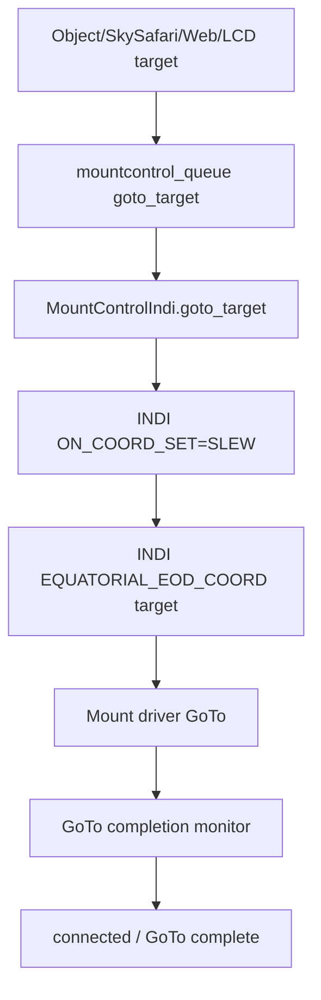
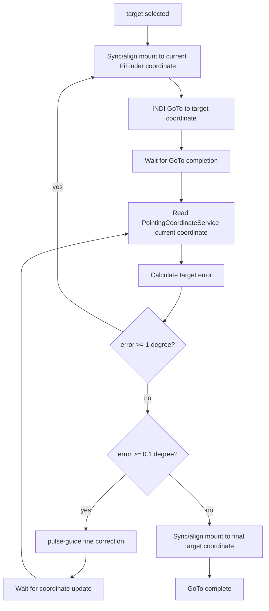
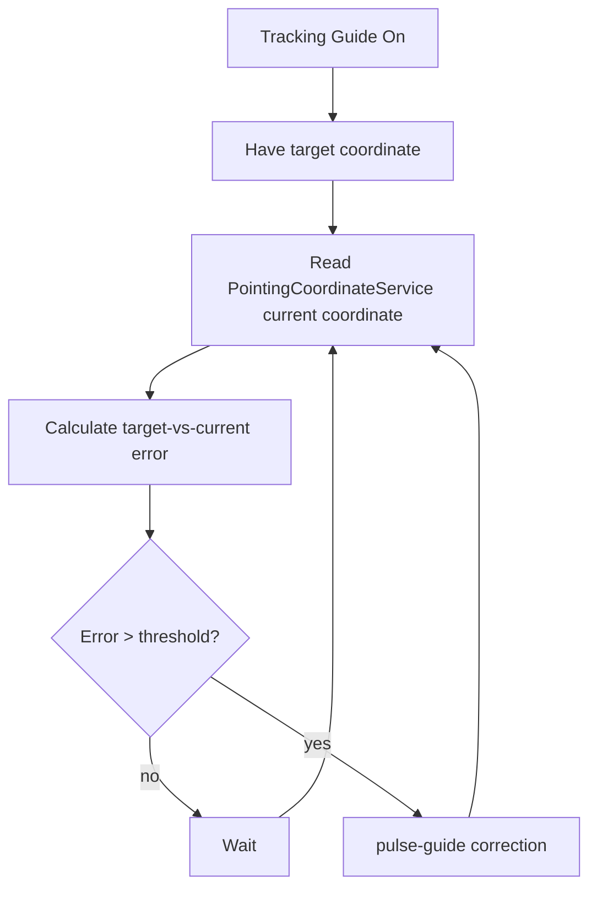
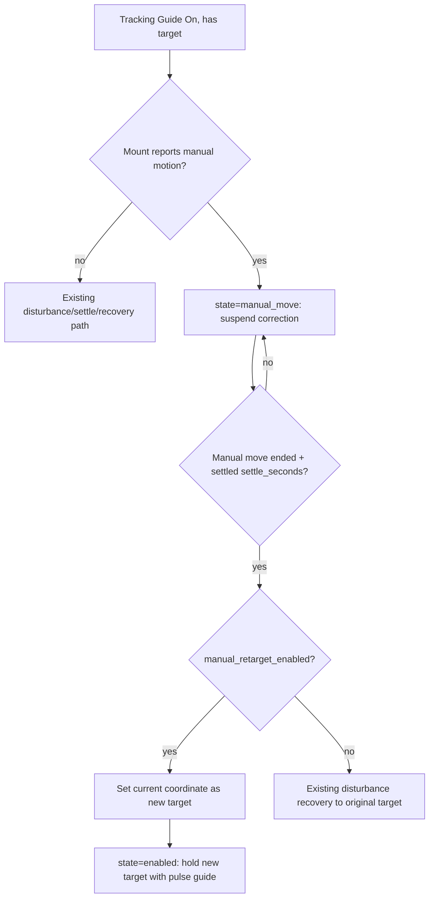

# MF PiFinder INDI GoTo / Guide Settings Draft

Baseline: `mf_pifinder` branch, 2026-07-08.

This document is a design draft for adding INDI mount `GoTo/Guide` settings
before implementation.

## Purpose

Let the user choose how INDI mount GoTo is performed and whether tracking guide
correction is enabled.

New settings UI:

- LCD: `Settings > INDI Setting > Goto/Guide`
- Web: bottom of the `/indi` tab/page

First-pass settings:

```text
GoTo Method
  - INDI Mount
  - PiFinder

Tracking Guide
  - On
  - Off
```

GoTo target input paths:

```text
LCD UI target selection
SkySafari target / GoTo
Web UI target setting
```

All three input paths should converge on the same mount-control target handling
and run either the `INDI Mount` or `PiFinder` procedure depending on the selected
`GoTo Method`.

## Current Related Implementation

Existing source pieces:

```text
python/PiFinder/mountcontrol_indi.py
  goto_target()
  toggle_guide_correction()
  _check_guide_correction()
  manual_move()
  stop_mount()

python/PiFinder/ui/indi.py
  UIIndiGuide
  number 5: toggles indi_goto_refine_once
  number 0: toggle_guide_correction

python/PiFinder/server.py
python/views/indi_mount.html
  SkySafari Mount Mode settings
  skysafari_indi_goto
  skysafari_indi_sync
  indi_goto_refine_once
  indi_goto_refine_accuracy_arcmin

python/PiFinder/pointing_coordinate_service.py
  current coordinate state for SkySafari/Web/LCD consumers
```

`goto_target()` currently uses INDI `ON_COORD_SET=SLEW` and
`EQUATORIAL_EOD_COORD` to send GoTo to the active mount driver.

`toggle_guide_correction()` currently compares solve-based target error and
sends short manual correction pulses.

## Implementation Architecture

To avoid destabilizing the existing system, the new feature should be
implemented as a separate service and separate source module.

Candidate new source file:

```text
python/PiFinder/indi_goto_guide_service.py
```

Responsibility split:

```text
pos_server.py
  Receives SkySafari LX200 commands
  Routes GoTo/Sync/Guide requests to the new service queue
  Keeps existing push-to UI behavior

server.py / views/indi_mount.html
  Web settings UI
  Routes Web target/stop requests to the new service queue

ui/indi.py, ui/object_details.py
  LCD settings UI
  Routes LCD target/stop requests to the new service queue

indi_goto_guide_service.py
  Selects the GoTo Method policy
  Runs the PiFinder GoTo state machine
  Runs the Tracking Guide state machine
  Reads PointingCoordinateService coordinates
  Sends only small primitive commands to the existing mountcontrol_queue

mountcontrol_indi.py
  Remains the existing INDI command executor
  Provides existing primitives such as connect, sync, goto_target,
  manual_move, and stop_mount
```

The new service does not replace mountcontrol. `MountControlIndi` stays as the
execution layer that talks to the INDI driver, while the new service becomes the
orchestration layer that sequences multiple primitive commands safely.

Draft process/queue structure:

```text
main.py
  mountcontrol_queue = Queue()
  goto_guide_queue = Queue()

  MountControl process
    input: mountcontrol_queue

  INDI GoTo/Guide process
    input: goto_guide_queue
    output: mountcontrol_queue
    reads: shared_state, mount_control_status.json
    writes: indi_goto_guide_status.json

  POS Server process
    SkySafari GoTo/Sync/Guide -> goto_guide_queue

  Web/LCD
    settings/config -> config.json
    target/stop/runtime commands -> goto_guide_queue
```

Candidate status file:

```text
data/indi_goto_guide_status.json
```

Minimum status fields:

```text
service_state
active_target_ra
active_target_dec
goto_method
tracking_guide_enabled
phase
last_error_arcmin
last_action
wait_reason
updated
```

## Implementation Rules and Risks

- The new service must be a short-tick state machine, not a long blocking loop.
- Stop/Abort commands must take priority in every phase.
- The existing `goto_target()` path must remain unchanged for
  `Goto Method = INDI Mount`.
- `skysafari_indi_goto` controls whether SkySafari GoTo is forwarded to mount
  features, while `indi_goto_method` controls how a forwarded GoTo is executed.
- `PointingCoordinateService` is the single coordinate-selection source.
- PiFinder GoTo must not start while the mount is parked or location/time is
  invalid.
- PiFinder GoTo approach reuses the mount sync + `goto_target()` primitives in a
  loop and hands off to pulse guide within the last 1 degree; it uses no manual
  movement.
- Tracking Guide must not intervene during user manual movement, GoTo, backlash
  test, or multi-point alignment.
- If pulse guide is unreliable for a driver, short manual movement fallback may
  be used, but the fallback must be shown clearly in status.
- OnStepX-specific behavior must be gated by driver name/capability detection;
  generic INDI mounts should use only standard INDI primitives.

## Proposed Config Keys

The settings should persist across service restarts.

```text
indi_goto_method = "indi_mount" | "pifinder"
  default: "indi_mount"

indi_tracking_guide_enabled = false | true
  default: false

indi_goto_refine_accuracy_arcmin
  existing setting. Used as the target accuracy of the PiFinder GoTo final
  pulse-guide alignment (0.1 deg = 6 arcmin). Also shared as the tracking-guide
  target accuracy.

indi_pifinder_goto_near_threshold_deg = 1.0
  The boundary where PiFinder GoTo stops the sync + mount GoTo loop and switches
  to pulse-guide fine correction. Errors at or above this repeat sync + GoTo;
  below it, pulse guide takes over and aligns down to the target accuracy
  (0.1 deg).

indi_pifinder_goto_max_gotos = 10
  Maximum number of sync + mount GoTo iterations (including the initial GoTo) in
  PiFinder GoTo. If the error does not fall below the near threshold (1 deg)
  within this many, the service stops in error. Default 10. (Replaces the old
  hardcoded `PIFINDER_MAX_CORRECTION_GOTOS = 2`.) Independently, if a step's error
  does not improve on the previous by at least
  `PIFINDER_MIN_ERROR_IMPROVEMENT_ARCMIN` (1 arcmin), it stops early so the mount
  does not keep slewing without converging.

indi_tracking_guide_threshold_arcmin = 10.0
  Error threshold where Tracking Guide starts pulse-guide correction.

indi_tracking_guide_settle_seconds = 4.0
  The scope must stay STILL this long after an external disturbance before
  Tracking Guide measures error and corrects again. Raised from 2.0 (Option A,
  2026-07-13) so a brief pause between hand-pushes does not trigger a recovery
  slew mid-interaction.

indi_tracking_guide_motion_arcmin = 15.0
  Per-update current-coordinate delta above which Tracking Guide treats
  the scope as "being moved" (disturbed) and suspends all correction.

### Disturbance responsiveness (Option A, 2026-07-13)

Symptom found on hardware: after a GoTo completed, moving the scope by hand
showed "no response" for a while, then it "moved once and snapped back to the
original position," then responded normally. Debugging (RAW IMU + fused
coordinate + mount state capture) showed:

- The IMU is NOT frozen; the fused coordinate reflects a push immediately while
  the mount is idle.
- The "no response" is the mount SLEWING (a corrective GoTo near arrival, or the
  Tracking Guide's own recovery GoTo): during a slew `mount_readback_priority`
  is set, so the pointing service uses the raw mount readback and the IMU delta
  is suppressed. The recovery slew returns the scope to target ("snap back").
- Because recovery fired every time the coordinate briefly stabilised, it looped
  while the operator was still handling the scope.

Fixes:

1. Settle keys off physical motion, not just the coordinate. `_tick_tracking_guide`
   now treats the IMU `moving` flag (BNO055 motion detection) as "moving" in
   addition to the arcmin coordinate delta, and refreshes the settle window
   while the IMU reports motion. So while the scope is being handled — even
   during a brief pause where the fused-coordinate delta dips below the
   threshold — it stays `disturbed` and never settles into a recovery. Recovery
   fires only once the scope is genuinely still for `settle_seconds`.
2. A guide-correction pulse no longer claims mount readback priority
   (mountcontrol `_motion_status`), so the IMU stays live during fine pulse
   corrections (the pulse is sub-arcminute and the IMU-delta rate gate discards
   it anyway).

Verified on hardware: with ~30 s of continuous hand movement the guide stayed
`disturbed` (coordinate tracked the push, median ~585'), fired exactly ONE
recovery GoTo ~3-4 s AFTER the scope was released, then returned to `enabled`.
Previously it looped recovery slews throughout the interaction.

indi_tracking_guide_goto_recovery_enabled = false | true
  default: false
  Allow the sync + GoTo recovery motion for large post-disturbance errors.
  When Off, Tracking Guide corrects with pulse-guide only, regardless of
  error size (large errors are reported in status); it never slews the mount.

indi_tracking_guide_goto_threshold_deg = 3.0
  Pulse-guide handles post-settle errors up to this size (default 3 deg).
  Errors strictly ABOVE this use the sync + GoTo recovery (when goto
  recovery is enabled); at/below it, pulse-guide corrects directly.
  This single boundary is also the practical pulse-guide envelope.

indi_tracking_guide_manual_retarget_enabled = true | false
  default: true
  When the scope is moved by a mount manual-movement command during tracking
  and then stops, adopt the stopped position (current coordinate) as the new
  target and keep tracking there, instead of recovering to the original target.
  Does not apply to a physical hand-push (disturbance) -- that keeps the
  existing disturbance recovery. When Off, a manual move is treated like a
  disturbance and recovers to the original target.
```

The exact key names may change during implementation, but this document uses
the names above.

## UI Design

### LCD

Menu location:

```text
Settings
  INDI Setting
    Goto/Guide
```

Draft screen:

```text
Goto/Guide
  Goto Method
    INDI Mount
    PiFinder

  Tracking Guide
    Off
    On
```

Rules:

- Use left/right/square controls for selection and value changes.
- Save changes to config and send `reload_config`.
- Settings should be editable even when the INDI mount is disconnected.
- If tracking guide is running and the user switches it Off, send
  `toggle_guide_correction(false)` or equivalent stop behavior immediately.

### Web

Location:

```text
/indi
  ...
  [bottom] GoTo / Guide Settings
```

Fields:

```text
Goto Method
  radio or select:
    INDI Mount
    PiFinder

Tracking Guide
  checkbox or switch:
    On / Off

Apply button
```

This card should remain separate from the existing `SkySafari Mount Mode` card.
SkySafari settings control protocol forwarding, while `GoTo/Guide` controls the
INDI mount GoTo and correction policy.

## GoTo Method: INDI Mount

This preserves the current behavior.



Behavior:

- The mount driver slews to the target coordinate.
- PiFinder publishes mount readback to the coordinate service during motion.
- If `indi_goto_refine_once` is enabled, a one-shot solve-based refine can run
  after GoTo completes.
- If Tracking Guide is On, periodic guide correction can run against the target
  after GoTo.

## GoTo Method: PiFinder

In this mode, PiFinder uses `PointingCoordinateService` coordinates and repeats
mount sync + INDI GoTo to approach the target, then within the last 1 degree
switches to pulse guide to align down to under 0.1 degree.

The earlier draft approached a far target with distance-based manual movement,
but hardware testing surfaced several problems (coordinate-frame mismatch, motion
lease management, slow final leg), so it is removed and replaced by the sync +
GoTo loop below.



Detailed procedure:

- **At GoTo start, auto-align: sync the mount to the current PiFinder
  coordinate.** This makes the mount aligned so the later error check uses a
  reliable mount readback (`current.source = mount`). Without this initial sync
  the mount stays unaligned and `current` falls back to the raw IMU
  (`source = imu_fallback`), making the error calculation inaccurate
  indoors/without a solve.
- Current coordinates for the error calculation come from
  `PointingCoordinateService.CoordinateState.current`.
- Right after the initial sync, run a normal INDI GoTo to the final target
  coordinate. The approach uses no manual movement and leaves all motion to the
  mount GoTo.
- After GoTo completion, use `PointingCoordinateService` to measure the error
  between the target and the current position.
- **error >= near threshold (default 1 degree)**: the mount readback is still far
  from the target, so sync the mount again to the current PiFinder coordinate and
  run another INDI GoTo to the final target. Repeat this sync + GoTo until the
  error falls below 1 degree, bounded by `indi_pifinder_goto_max_gotos`
  (default 10, including the initial GoTo). Because the sync re-aligns the mount
  frame to PiFinder's, each following GoTo only moves the remaining error.
- **error < 1 degree**: switch from mount slew to pulse guide, correcting until
  the error is below the target accuracy (`indi_goto_refine_accuracy_arcmin`,
  0.1 deg = 6 arcmin). This pulse-guide correction reuses the same correction
  logic as Tracking Guide.
- **error < target accuracy (0.1 deg)**: sync/align the mount once more to the
  final target coordinate and advance to `complete`. This final sync improves
  tracking precision afterward.
- At the start of every GoTo, reset the per-GoTo progress flags
  (`final_sync_sent`, `correction_count`, etc.). This prevents a stale flag left
  by the previous GoTo or a disturbance recovery from making the final sync a
  no-op, which would keep the state machine from reaching `complete`.

### GoTo completion detection (wait logic)

For each sync + GoTo step, "wait for GoTo completion" does not look at whether the
coordinate has reached the target; it **polls the mount motion-status flags to
decide whether the mount has finished slewing and stopped** (arrival accuracy is
checked in the separate error-measurement step afterward). The implementation is
`_tick_final_goto`, and the same logic serves the initial GoTo, corrective GoTos,
and the Tracking Guide recovery GoTo.

Procedure:

1. **Record the command time**: when a GoTo is sent, record `final_goto_sent_at`
   as now and reset the idle timer (`final_goto_idle_since`) to 0.
2. **Minimum wait**: for `PIFINDER_FINAL_GOTO_SETTLE_SECONDS` (currently 2.0 s)
   after the command, completion is not evaluated — a minimum window so the brief
   idle just before the mount starts slewing is not misread as "complete".
3. **Motion poll**: each tick, read the mount status summary; if any of the
   following is true the mount is "moving", so keep the idle timer reset and keep
   waiting (`last_action = "waiting for final INDI GoTo"`):
   - `mount_motion_active`
   - `goto_motion_active`
   - `manual_motion_direction` is set
   - the state string contains `slew` / `goto` / `moving` / `motion`
4. **Idle settle window**: when the mount looks stopped (all of the above false),
   start the idle timer on the first idle sample and accept completion only when
   the idle state holds for `PIFINDER_FINAL_GOTO_SETTLE_SECONDS` (2.0 s)
   continuously. If motion is detected again, reset the timer — this avoids
   misreading a mount like OnStepX (which pauses briefly between the near move and
   its fine adjustment) as complete.
5. **Error measurement after completion**: once idle has settled, re-read
   `PointingCoordinateService`, confirm `usable_for_goto` (error out if not), and
   measure the error to the target. That error drives the sync + GoTo repeat /
   pulse guide / complete branch.

Safety guards during the wait (each stops immediately in error):

- Mount status unavailable.
- Mount parked.
- Stop/Abort takes priority during this wait too.

`PIFINDER_FINAL_GOTO_SETTLE_SECONDS` is the settle time shared by the final and
corrective GoTo waits and the Tracking Guide sync + GoTo recovery wait.

Safety notes:

- This mode depends heavily on `PointingCoordinateService` coordinate quality.
- Plate-solved coordinates are the most reliable.
- Without solving, IMU/mount fused coordinates can be used for coarse approach,
  but error may be larger.
- Do not start when the mount is parked or location/time is invalid.
- Stop/Abort must take priority during the approach sync/GoTo, the repeated
  GoTos, and the final pulse guide.

## Tracking Guide

Tracking Guide is an On/Off correction feature independent of the selected GoTo
method.

Goal:

- While tracking a target, continuously check the current coordinate from
  `PointingCoordinateService`.
- When target-vs-current error exceeds a threshold, send an additional
  pulse-guide correction.
- The feature is controlled by the Tracking Guide On/Off setting.

Basic flow:



Coordinate priority:

```text
1. plate-solve-based PointingCoordinateService coordinate
2. mount + IMU delta coordinate after mount sync
3. IMU fallback coordinate before solve/initial state
```

Correction method:

```text
calculate per-axis (NS, WE) RA/Dec error
  -> calculate per-axis pulse-guide duration (error angle / guide rate)
  -> send INDI timed guide pulses (TELESCOPE_TIMED_GUIDE_NS/WE)
  -> verify effect on next coordinate update
```

### Pulse-guide implementation

Tracking correction uses **INDI standard timed guide pulses**. This is a separate
command from manual movement (`manual_move`, which is driven start/stop like a
button); a timed guide pulse moves at the guide rate for a specified **duration
(ms)**.

- **Command**: send a duration number to `TELESCOPE_TIMED_GUIDE_NS`
  (`TIMED_GUIDE_N` / `TIMED_GUIDE_S`) and `TELESCOPE_TIMED_GUIDE_WE`
  (`TIMED_GUIDE_W` / `TIMED_GUIDE_E`). The two axes are corrected independently.
- **Duration**: the time to move the axis error at that axis's guide rate.
  `duration_ms = |error_arcsec| / (guide_rate_x × 15.041 arcsec/s) × aggressiveness`.
  Only a fraction of the error (e.g. 70%) is closed per pulse and the 10 s loop
  converges; clamped to a min/max ms.
- **Guide rate**: read the driver's `GUIDE_RATE` (multiples of sidereal); fall
  back to a default (0.5×) if it is not reported.
- **Capability detection**: if the driver exposes `TELESCOPE_TIMED_GUIDE_*`, use
  timed guide pulses; otherwise fall back to the **short manual-movement lease**
  as before (result is cached).
- **Direction sign**: NS from the dec-error sign (positive → N), WE from the
  RA-error sign. The RA (WE) sign can be reversed per driver, so the element
  mapping is a single swappable constant to hardware-validate once.

This (1) keeps the tracking correction pulses from showing up as `manual_motion`
in mount status, so the [Manual Re-target] discrimination stays clean, and (2) is
more precise than the fixed-lease nudge because it moves only the time
proportional to the error angle.

Off conditions:

- User switches Tracking Guide Off.
- Mount disconnect/error.
- Mount parked.
- User Stop/Abort.
- No active target.
- `PointingCoordinateService` coordinate unavailable.

Candidate status fields:

```text
guide_correction_enabled
guide_correction_target_ra
guide_correction_target_dec
guide_correction_error_arcmin
guide_correction_last_action
guide_correction_wait_reason
guide_correction_pulse_ms
guide_correction_threshold_arcmin
```

## Tracking Guide Enhancement: Disturbance Recovery

Baseline addition: 2026-07-11.

### Problem

The first Tracking Guide pass keeps sending pulse-guide corrections whenever the
solved position drifts from the target. If the scope is physically moved during
tracking (bumped, repositioned by hand, wind, cable pull), IMU + plate solve will
show the current coordinate changing. Correcting *while the scope is still moving*
chases a moving point and fights the user. It also treats a 2-degree displacement
the same as a 5-arcmin drift, so pulse-guide slowly crawls a large error that a
GoTo would close in one slew.

### Goal

While Tracking Guide is On and a target is held:

1. Detect an external disturbance from the coordinate/IMU signal and **suspend all
   correction** while the scope is moving. Do not correct from the first frame of
   motion; wait until motion stops.
2. Once motion has stopped and the coordinate has settled, measure the error to
   the target and choose recovery by magnitude:
   - **Small/medium error** (up to the GoTo threshold, default 3 degrees):
     pulse-guide fine correction.
   - **Large error** (strictly above the GoTo threshold, i.e. > 3 degrees): for
     accurate, fast recovery, **sync the mount to PiFinder's current coordinate**,
     send a **GoTo back to the target**, then near the target **resume pulse-guide
     fine correction**.
3. Every motion above is gated by settings. The sync + GoTo recovery is a
   separate On/Off (`indi_tracking_guide_goto_recovery_enabled`). When any gate is
   Off, the corresponding motion is skipped and only reported in status — the
   mount must never move while its gate is Off.

### State model

Tracking Guide gains a small internal state machine (states surfaced in
`tracking_guide_state`):

```text
off             tracking guide disabled in config
waiting_target  no tracking target yet
paused          suspended for GoTo/backlash/multi-align or (non-manual) mount motion
manual_move     user is driving the mount with a manual-movement command; correction suspended
waiting_mount   mount status unavailable / parked
waiting_coordinate  pointing coordinate unavailable or stale
disturbed       current coordinate is moving; all correction suspended
settling        motion stopped; waiting settle_seconds for a stable coordinate
enabled         steady; pulse-guide fine correction active (error in pulse band)
recovering_goto sync + GoTo recovery in progress (large error)
failed          recovery could not converge / pulse-guide reported failure
```

### Disturbance and settle detection

- The single coordinate source is `PointingCoordinateService` (consumed through the
  service's existing `_load_pointing_status`). It already selects the appropriate
  source (solve / mount+IMU / IMU) and publishes `current`;
  `_load_pointing_status` derives `usable_for_goto` and `reason` from that
  status. **Tracking Guide does not make its own solve/IMU judgment** — it
  trusts `usable_for_goto`. If the coordinate is not usable, state is
  `waiting_coordinate` and no correction runs.
- **Disturbed**: the per-update `current`-coordinate delta since the previous
  sample is at or above `indi_tracking_guide_motion_arcmin` (default 15'), i.e.
  the scope is being moved. The intent is to catch any physical move.
- **Settled**: the coordinate delta stays below the motion threshold continuously
  for `indi_tracking_guide_settle_seconds` (default 4 s). The error to the target
  is then measured from the same `current` coordinate.
- Disturbance/settle detection keeps its own last-stable coordinate and timers so
  it does not clash with the PiFinder GoTo sync + GoTo loop state.

### Recovery decision (after settle)


Bands, using the user-facing numbers:

```text
error <= 3 deg (goto_threshold)   -> pulse-guide fine correction
error > 3 deg                     -> sync + GoTo recovery, then pulse-guide near
                                     target; if recovery Off, pulse-guide only
                                     (no slew)
```

Pulse-guide is still the mechanism that closes the final small error; the sync +
GoTo step exists so a large displacement is closed in one slew instead of being
crawled by pulses. The GoTo recovery reuses the existing sync + `goto_target()` +
settle/verify machinery already built for the final PiFinder GoTo, then hands back
to pulse-guide near the target.

### On/Off gating rules

- `indi_tracking_guide_enabled` Off -> whole feature off; if a correction was
  active, send `toggle_guide_correction(false)` once and go to `off`.
- `indi_tracking_guide_goto_recovery_enabled` Off -> never sync/GoTo from Tracking
  Guide; large errors are still corrected with pulse-guide only and reported in
  status. This is the "설정에 따라 On/Off" safety the user called out.
- `indi_tracking_guide_manual_retarget_enabled` On (default) -> after a mount
  manual move ends and settles, adopt the current coordinate as the new target
  (see "Manual Re-target" below). When Off, a manual move is treated like a
  physical disturbance and recovers to the original target.
- Recovery never runs during GoTo, backlash test, or multi-point alignment
  (existing `paused` guard), nor while the mount reports motion or parked.
- Stop/Abort takes priority in every state and clears the recovery sub-state.

### New status fields

```text
tracking_guide_state              extended enum above
tracking_guide_recovery_mode      none | pulse | goto
tracking_guide_recovery_count     number of sync+GoTo recoveries since target set
tracking_guide_settle_remaining   seconds left before a settled correction
tracking_guide_error_arcmin       (existing) current-vs-target error
tracking_guide_last_action        (existing) human-readable last step
```

### Files changed (implemented 2026-07-11)

```text
python/PiFinder/indi_goto_guide_service.py   [done]
  _tick_tracking_guide is the settle-detect + banded recovery state machine;
  disturbance/settle tracking fields added; recovery_goto reuses the sync +
  goto_target + settle logic from the final-GoTo path; new status fields
  (tracking_guide_recovery_mode/count/settle_remaining) in _status_payload; new
  config keys loaded in _reload_config_if_needed; module docstring refreshed.

default_config.json   [done]
  indi_tracking_guide_* keys added with the defaults above.

python/PiFinder/server.py + python/views/indi_mount.html   [done]
  GoTo Recovery On/Off checkbox on the GoTo/Guide web card, plus a read-only
  "GoTo / Guide Status" panel (service/phase, guide state, error arcmin,
  recovery mode+count, last action) fed by indi_goto_guide_status.json through
  the /indi/current_values poll (new _goto_guide_status reader).

python/PiFinder/ui/menu_structure.py   [done]
  LCD Start > INDI > Setting > Goto/Guide gains a "GoTo Recovery" Off/On item
  bound to indi_tracking_guide_goto_recovery_enabled.
```

### Checklist

- No correction is sent while `tracking_guide_state = disturbed`.
- Correction resumes only after `settle_seconds` of stable coordinate.
- Error below the GoTo threshold uses pulse-guide only; no mount slew.
- Error above the threshold, with recovery On and a fresh solve, does
  sync -> GoTo -> pulse-guide, and updates `tracking_guide_recovery_count`.
- With recovery Off, a large error never slews the mount; status reports
  pulse-only correction.
- Coordinate usability comes only from `usable_for_goto`; Tracking Guide makes no
  independent solve/IMU decision.
- Turning Tracking Guide Off mid-recovery stops motion immediately.

## Tracking Guide Enhancement: Manual Re-target

Baseline addition: 2026-07-15.

### Purpose

While tracking after arrival, when the user moves the scope to a new position
with a **mount manual-movement command** (keypad / UI hold-to-move) and lets go,
adopt the **stopped position (current coordinate) as the new target** and keep
tracking there, instead of recovering back to the original target. It is the
"lock onto wherever you pushed it" behavior.

This is the opposite direction from disturbance recovery:

- **Physical hand-push (disturbance)**: recover to the original target as before
  (pulse guide or sync + GoTo).
- **Mount manual-movement command**: adopt the stopped position as the new target
  (re-target).

The two are distinguished by signal. A mount manual move is reported by
mount-control as `manual_motion_direction` (state = `manual_motion`), so Tracking
Guide marks that interval as `manual_move` (correction suspended); a physical
hand-push shows up only through IMU/coordinate change as `disturbed`.

### Behavior

With Tracking Guide On, a target held, and
`indi_tracking_guide_manual_retarget_enabled` On:

1. While the mount reports manual motion, suspend all correction in the
   `manual_move` state (splitting the existing mount-motion pause by whether it
   is a manual move).
2. When the manual move ends (the mount no longer reports motion), wait for the
   coordinate to settle for `settle_seconds` so a wobble right after release does
   not re-target.
3. Once settled, **set the current coordinate as the new tracking target** and
   return to `enabled`, holding that position with pulse guide. There is no
   recovery slew/GoTo back to the mount.
4. After re-targeting the previous target is dropped; a later GoTo / Stop / new
   target set changes the target accordingly.

When the gate is Off, a manual move flows through the existing disturbance
recovery path and returns to the original target.



### On/Off gating

- `indi_tracking_guide_manual_retarget_enabled` On (default) -> after a manual
  move ends and settles, adopt the current coordinate as the new target.
- Off -> a manual move is treated like a physical disturbance and recovers to the
  original target.
- Re-target does not slew the mount (it only syncs the current position and holds
  it with pulse guide). Stop/Abort still takes priority in this state.

### New status fields

```text
tracking_guide_state              adds the manual_move value
tracking_guide_manual_retarget    (new) whether/when the last re-target happened
```

### Checklist

- No correction is sent while `tracking_guide_state = manual_move`.
- Do not re-target before `settle_seconds` of stable coordinate after the manual
  move ends.
- Re-target only when the gate is On; it adopts the current coordinate as the
  target with no mount slew/GoTo.
- With the gate Off, a manual move recovers to the original target via the
  existing disturbance recovery.
- A physical hand-push (`disturbed`) is not re-targeted and keeps the existing
  recovery path.
- The tracking guide target is updated to the new coordinate after re-target.

## Relationship to Existing Settings

These existing settings overlap with the new UI:

```text
indi_goto_refine_once
indi_goto_refine_accuracy_arcmin
```

Cleanup direction:

- `indi_goto_refine_accuracy_arcmin` can move into the `GoTo/Guide` card as the
  shared accuracy setting.
- `indi_goto_refine_once` can remain as an `INDI Mount` detail option, or be
  reinterpreted as `PiFinder final refine` after PiFinder GoTo is implemented.
- SkySafari forwarding settings (`skysafari_indi_goto`, `skysafari_indi_sync`)
  remain separate because they define SkySafari protocol behavior.

## Staged Implementation Plan and Checklists

Each stage should be small enough to commit. When practical, push after each
stage so hardware debugging has clear restore points.

### Stage 0: Documentation and Baseline

Goal:

- Finalize this document.
- Record a baseline without changing existing behavior.

Checklist:

- `git status` clearly shows the intended files.
- Existing `mountcontrol_indi.goto_target()` path is unchanged.
- Existing SkySafari GoTo forwarding semantics are unchanged.
- Documentation is committed/pushed separately from source changes.

### Stage 1: Separate Service Skeleton

Goal:

- Add `indi_goto_guide_service.py`.
- Add a separate process and `goto_guide_queue` in `main.py`.
- The service should not move the mount yet; it only writes a heartbeat status.

Checklist:

- If `mount_control = false`, the new service does not start.
- If `mount_control = true`, both MountControl and the new service start.
- `indi_goto_guide_status.json` updates periodically.
- Existing `mount_control_status.json` format is unchanged.
- Existing SkySafari coordinate polling still works.

### Stage 2: Settings UI and Config

Goal:

- Add `GoTo / Guide Settings` at the bottom of Web `/indi`.
- Add LCD `Start > INDI > Setting > Goto/Guide`.
- Settings are saved, but behavior still follows the existing path.

Checklist:

- `indi_goto_method` defaults to `indi_mount`.
- `indi_tracking_guide_enabled` defaults to `false`.
- Web settings persist after page reload.
- LCD settings persist after service restart.
- Red Night theme does not introduce white controls.

### Stage 3: Request Routing

Goal:

- Route SkySafari/Web/LCD target requests to the new service queue.
- If `Goto Method = INDI Mount`, the new service forwards the existing
  mountcontrol `goto_target` command unchanged.

Checklist:

- If `skysafari_indi_goto = false`, SkySafari GoTo is not forwarded to the mount.
- If `skysafari_indi_goto = true` and `indi_goto_method = indi_mount`, GoTo
  behaves the same as before.
- Existing Object Details / LCD / Web GoTo behavior is not broken.
- Stop/Abort still reaches mountcontrol immediately through the new route.

### Stage 4: PointingCoordinateService Input

Goal:

- The new service reads current coordinates from `PointingCoordinateService`.
- If coordinates are unavailable, it waits or fails safely.

Checklist:

- Solve coordinate source/quality/status appears in the status file.
- IMU fallback coordinates appear when solve is unavailable.
- Parked mount coordinates are not used as PiFinder GoTo input.
- No mount command is sent when coordinates are unavailable.

### Stage 5: PiFinder GoTo State Machine, First Pass

Goal:

- Add the PiFinder GoTo state machine.
- The first pass validates target/current/error calculation and Stop handling
  before doing automatic approach motion.

Checklist:

- Receiving a target sets `phase = planning`.
- Current-vs-target error is calculated.
- Park/location/time invalid conditions prevent start.
- Stop/Abort changes any phase to `idle/stopped`.
- No unintended manual movement is sent yet.

### Stage 6: PiFinder Sync + GoTo Loop Approach

Goal:

- After the start sync, GoTo the target; if the post-completion error is at or
  above the near threshold (default 1 degree), repeat sync + GoTo for a bounded
  count.
- Manage the repeat limit and stop explicitly.

Checklist:

- A single mount sync to the current PiFinder coordinate runs at the start.
- The initial GoTo uses the existing `goto_target()` primitive.
- After GoTo completion, if the error is >= 1 degree, sync + GoTo runs again.
- The sync + GoTo repeat count is bounded by `indi_pifinder_goto_max_gotos`
  (default 10).
- If the error does not improve (no-improvement guard), it stops in error even
  before the limit.
- Once the error is below 1 degree, the loop stops and hands off to the pulse
  guide stage.
- User Stop immediately forwards a mount stop/abort to mountcontrol.

### Stage 7: Pulse-Guide Fine Alignment

Goal:

- After the error is below 1 degree, use pulse guide to align to below the target
  accuracy (0.1 deg = 6 arcmin).
- The pulse-guide correction reuses the same logic as Tracking Guide.

Checklist:

- Below 1 degree, control switches from mount slew (GoTo) to pulse guide.
- Pulse-guide direction/duration is computed from the error direction and size.
- The loop stops once the error is below the target accuracy (0.1 deg).
- Pulse-guide failure/fallback is visible in status.
- No GoTo intervenes during fine alignment (no slew within 1 degree).

### Stage 8: Final Sync and Completion

Goal:

- Once the error is below the target accuracy (0.1 deg), run a single
  sync/alignment to the final target coordinate and advance to `complete`.
- Reset the per-GoTo progress flags at the start of every GoTo so the final sync
  is not a no-op.

Checklist:

- Final sync runs only once after entering the target accuracy.
- The per-GoTo flags (`final_sync_sent`, etc.) are reset at each GoTo start so the
  state machine reaches `complete`.
- Tracking guide target is updated to the latest target after final sync.
- The whole state machine terminates cleanly at `complete`.

### Stage 9: Tracking Guide

Goal:

- If `indi_tracking_guide_enabled` is On, correct target tracking.
- Use `PointingCoordinateService` current coordinate versus the target coordinate
  and send pulse guide or manual fallback.

Checklist:

- If there is no target, guide waits and sends no correction.
- Guide does not run during user manual movement.
- Guide does not run during GoTo/backlash/multi-align.
- Pulse-guide failure/fallback is visible in status.
- Switching Off stops active correction.

### Stage 10: Integration Test

Goal:

- Compare existing and new behavior.
- Verify safety conditions before deeper hardware testing.

Checklist:

- With `indi_goto_method = indi_mount`, existing SkySafari GoTo behaves the same.
- With `indi_goto_method = pifinder`, target/current/error/status are stable.
- Stop/Abort has priority in every stage.
- Service restart does not leave stale active state.
- INDI mount disconnect/reconnect leaves the new service safely waiting.
