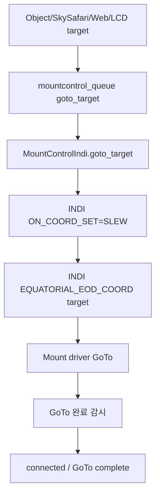
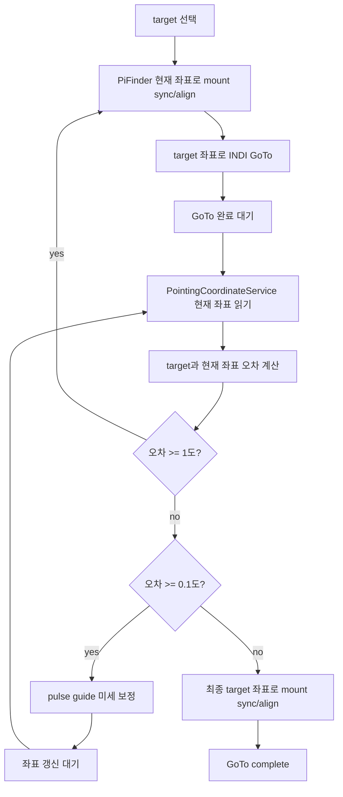
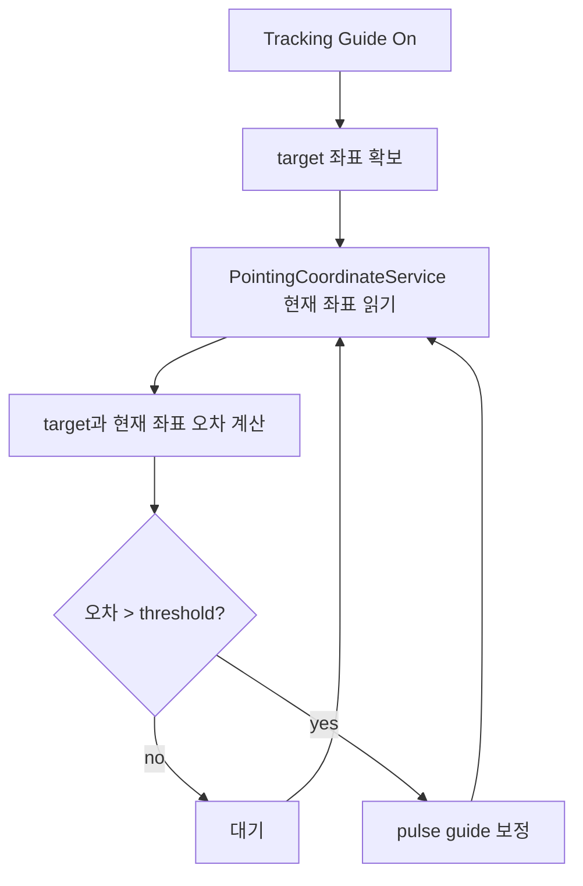
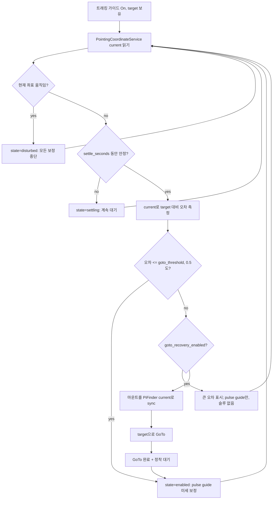
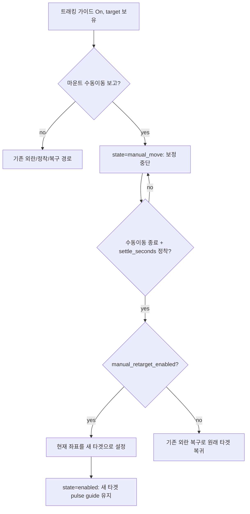

# MF PiFinder INDI GoTo / Guide 설정 설계 초안

작성 기준: `mf_pifinder` 브랜치, 2026-07-08.

이 문서는 INDI 마운트 기능에 추가할 `Goto/Guide` 설정 UI와 동작 방식을
구현 전에 정리하기 위한 설계 초안이다.

## 목적

INDI 마운트를 사용할 때 GoTo와 추적 보정 동작을 사용자가 명확히 선택할 수 있게 한다.

새 설정 UI:

- LCD: `Settings > INDI Setting > Goto/Guide`
- Web: `/indi` 페이지의 INDI 탭 제일 하단

1차 설정 항목:

```text
Goto 진행방법
  - INDI Mount
  - PiFinder

추적 가이드
  - On
  - Off
```

GoTo target 입력 경로:

```text
LCD UI를 통한 target 선택
SkySafari를 통한 target 설정
Web UI를 통한 target 설정
```

세 입력 경로는 모두 같은 mount-control target 처리로 모이고, 선택된
`GoTo Type`에 따라 `INDI Mount` 또는 `PiFinder` 절차를 수행한다.

## 현재 관련 구현

현재 소스에서 이미 존재하는 관련 기능:

```text
python/PiFinder/mountcontrol_indi.py
  goto_target()
  toggle_guide_correction()
  _check_guide_correction()
  manual_move()
  stop_mount()

python/PiFinder/ui/indi.py
  UIIndiGuide
  숫자 5: indi_goto_refine_once 토글
  숫자 0: toggle_guide_correction

python/PiFinder/server.py
python/views/indi_mount.html
  SkySafari Mount Mode 설정
  skysafari_indi_goto
  skysafari_indi_sync
  indi_goto_refine_once
  indi_goto_refine_accuracy_arcmin

python/PiFinder/pointing_coordinate_service.py
  SkySafari/Web/LCD가 사용할 현재 좌표 상태 제공
```

현재 `goto_target()`은 INDI 표준 `ON_COORD_SET=SLEW`와
`EQUATORIAL_EOD_COORD`를 사용해 마운트 driver에 GoTo를 보낸다.

현재 `toggle_guide_correction()`은 solve 기반 target 오차를 보고 짧은 수동 이동
correction을 보내는 구조다.

## 구현 아키텍처

기존 시스템을 흔들지 않기 위해 새 기능은 별도 서비스와 별도 소스로 구현한다.

새 소스 후보:

```text
python/PiFinder/indi_goto_guide_service.py
```

역할 분리:

```text
pos_server.py
  SkySafari LX200 명령 수신
  GoTo/Sync/Guide 요청을 새 서비스 큐로 전달
  기존 push-to UI 처리는 유지

server.py / views/indi_mount.html
  Web 설정 UI
  Web target/stop 요청을 새 서비스 큐로 전달

ui/indi.py, ui/object_details.py
  LCD 설정 UI
  LCD target/stop 요청을 새 서비스 큐로 전달

indi_goto_guide_service.py
  GoTo Type 정책 결정
  PiFinder GoTo 상태 머신 실행
  Tracking Guide 상태 머신 실행
  PointingCoordinateService 좌표 읽기
  기존 mountcontrol_queue로 작은 명령만 전송

mountcontrol_indi.py
  기존 INDI 명령 실행자 역할 유지
  connect, sync, goto_target, manual_move, stop_mount 등 기존 primitive 제공
```

새 서비스는 mountcontrol을 대체하지 않는다. 기존 `MountControlIndi`는 실제 INDI
driver에 명령을 보내는 실행 계층으로 남기고, 새 서비스는 여러 명령을 순서대로
조합하는 orchestration 계층으로 둔다.

프로세스/큐 구조 초안:

```text
main.py
  mountcontrol_queue = Queue()
  goto_guide_queue = Queue()

  MountControl process
    input: mountcontrol_queue

  INDI GoTo/Guide process
    input: goto_guide_queue
    output: mountcontrol_queue
    reads: shared_state, mount_control_status.json
    writes: indi_goto_guide_status.json

  POS Server process
    SkySafari GoTo/Sync/Guide -> goto_guide_queue

  Web/LCD
    settings/config -> config.json
    target/stop/runtime commands -> goto_guide_queue
```

상태 파일 후보:

```text
data/indi_goto_guide_status.json
```

상태 파일에는 최소한 다음 정보를 기록한다.

```text
service_state
active_target_ra
active_target_dec
goto_method
tracking_guide_enabled
phase
last_error_arcmin
last_action
wait_reason
updated
```

## 구현 원칙과 주의점

- 새 서비스는 긴 blocking loop로 동작하지 않고 짧은 tick 단위 상태 머신으로 동작한다.
- Stop/Abort 명령은 어느 phase에서도 최우선 처리한다.
- 기존 `goto_target()` 경로는 `GoTo Type = INDI Mount`일 때 그대로 유지한다.
- `skysafari_indi_goto`는 SkySafari GoTo를 mount 기능으로 전달할지 결정하는 설정이고,
  `indi_goto_method`는 전달된 GoTo를 어떤 방식으로 실행할지 결정하는 설정이다.
- `PointingCoordinateService`는 좌표 계산의 단일 기준으로 사용한다.
- PiFinder GoTo는 mount가 Park 상태이거나 위치/시간이 유효하지 않으면 시작하지 않는다.
- PiFinder GoTo 접근은 mount sync + `goto_target()` primitive를 반복 사용하고,
  마지막 1도 이내에서는 pulse guide로 넘긴다. 접근에 수동 이동은 사용하지 않는다.
- Tracking Guide는 사용자의 manual movement, GoTo, backlash test, multi align 중에는
  끼어들지 않는다.
- pulse guide가 driver별로 불안정하면 짧은 manual movement fallback을 사용하되,
  fallback 사용 여부를 상태에 명확히 표시한다.
- OnStepX 전용 기능은 driver 이름/기능 감지 후에만 사용하고, 일반 INDI 마운트에서는
  표준 INDI primitive만 사용한다.

## 제안 설정 키

새 설정은 장치 재시작 후에도 유지되어야 하므로 config option으로 관리한다.

```text
indi_goto_method = "indi_mount" | "pifinder"
  기본값: "indi_mount"
  웹 UI 라벨: **GoTo Type** (2026-07-17에 "GoTo Method"에서 변경)

indi_tracking_guide_enabled = false | true
  기본값: false

indi_goto_refine_accuracy_arcmin = 6.0
  solve 기반 정밀 보정의 목표 정확도(분각). 기본 6′ = 0.1도로 문서와 일치시켰다
  (이전 10′에서 하향). 공유 사용처: INDI Mount refine(`indi_goto_refine_once`),
  PiFinder GoTo 최종 pulse guide 정렬, SkySafari GoTo refine, LCD 수동 "Guide
  Correction". (자동 추적 가이드 밴드는 별도 키 `indi_tracking_guide_threshold_arcmin`
  사용.)

indi_guide_pulse_invert_we = false | true
  기본값: false
  timed guide pulse의 RA/Az(WE) 방향 반전. 마운트가 RA에서 반대로 가면 On.

indi_guide_pulse_invert_ns = false | true
  기본값: false
  timed guide pulse의 Dec/Alt(NS) 방향 반전. 마운트가 Dec에서 반대로 가면 On.

indi_pifinder_goto_near_threshold_deg = 1.0
  PiFinder GoTo에서 sync + 마운트 GoTo 반복을 끝내고 pulse guide 미세 보정으로
  전환하는 경계. 오차가 이 값 이상이면 sync + GoTo를 반복하고, 미만이면 pulse
  guide로 넘어가 목표 정확도(0.1도)까지 정렬한다.

indi_pifinder_goto_max_gotos = 10
  PiFinder GoTo에서 sync + 마운트 GoTo 반복(초기 GoTo 포함)의 최대 횟수. 이 횟수
  안에 오차가 근처 도달 범위(1도) 미만으로 들어오지 못하면 error로 중단한다.
  기본 10. (이전 구현의 `PIFINDER_MAX_CORRECTION_GOTOS = 2` 고정값을 대체한다.)
  이와 별개로, 한 스텝의 오차가 직전보다 `PIFINDER_MIN_ERROR_IMPROVEMENT_ARCMIN`
  (1분각) 이상 줄지 않으면 상한 도달 전이라도 조기 중단해 마운트가 수렴하지 못하는
  채로 계속 슬루하는 것을 막는다.

indi_tracking_guide_threshold_arcmin = 10.0
  추적 가이드가 pulse guide 보정을 시작할 오차 기준.

indi_tracking_guide_settle_seconds = 4.0
  외란 이후 망원경이 이 시간만큼 정지해 있어야 추적 가이드가 다시 오차를
  측정하고 보정한다. 밀기 사이의 짧은 멈춤에 recovery 슬루가 끼어들지
  않도록 2.0에서 상향(Option A, 2026-07-13).

indi_tracking_guide_motion_arcmin = 15.0
  현재 좌표의 tick당 변화량이 이 값 이상이면 망원경이 "외부 힘으로
  움직이는 중(disturbed)"으로 보고 모든 보정을 중단한다.

### 외란 반응성 (Option A, 2026-07-13)

실장비 증상: GoTo 완료 후 경통을 손으로 움직이면 한동안 "무반응"이다가, 한 번
움직였다 원위치로 되돌아오고, 그 뒤 정상 반응. RAW IMU + 융합 좌표 + 마운트 상태를
캡처해 디버깅한 결과:

- IMU는 얼지 않는다; 마운트가 idle일 때는 밀기가 융합 좌표에 즉시 반영된다.
- "무반응"의 정체는 마운트가 슬루 중일 때다(도착 부근의 corrective GoTo, 또는
  추적 가이드 자체의 recovery GoTo). 슬루 중엔 `mount_readback_priority`가 서서
  pointing service가 raw 마운트 readback을 쓰고 IMU delta가 억제된다. recovery
  슬루가 타겟으로 되돌리는 것이 "원위치 복귀"다.
- 좌표가 잠깐 안정될 때마다 recovery가 발동해, 조작 중에도 루프가 돌았다.

수정:

1. settle이 좌표뿐 아니라 물리적 움직임을 기준으로 한다. `_tick_tracking_guide`가
   arcmin 좌표 델타에 더해 IMU `moving` 플래그(BNO055 모션 감지)를 "움직임"으로
   취급하고, IMU가 움직이는 동안 settle 창을 계속 리셋한다. 그래서 경통을 다루는
   동안엔(융합 좌표 델타가 잠깐 임계값 아래로 떨어지는 순간에도) `disturbed`를
   유지하고 recovery로 넘어가지 않는다. 정말로 `settle_seconds`만큼 정지한 뒤에만
   recovery가 한 번 발동한다.
   - **IMU 플래그 상한 (2026-07-16)**: BNO055 플래그는 좌표 임계값보다 훨씬
     민감해(quat 델타 ~0.0003) 릴리즈 후 미세 흔들림으로 수십 초 유지될 수 있고,
     실측에서 recovery 시작이 30초 이상 지연됐다. 좌표가
     `settle_seconds x TRACKING_IMU_QUIET_OVERRIDE_MULTIPLE`(기본 2배 = 8초) 동안
     정지해 있으면 IMU 플래그 단독으로는 더 이상 recovery를 막지 못한다
     (좌표 이동은 계속 무제한으로 막는다 — 실제 밀기 진행 중 보호는 유지).
     override 발동은 로그로 남는다. 상태 전이도 이제 journal에 로깅된다
     (`Tracking guide disturbed -> settling (...)`).
2. guide-correction 펄스는 더 이상 마운트 readback 우선권을 주장하지 않는다
   (mountcontrol `_motion_status`). 미세 펄스 보정 중에도 IMU가 살아 있게 한다
   (펄스는 sub-arcminute이고 IMU-delta rate 게이트가 어차피 버린다).

실장비 검증: ~30초 연속 손 움직임 동안 가이드가 `disturbed`를 유지하고(좌표는 밀기
반영, median ~585'), 경통을 놓은 뒤 ~3–4초 후 recovery GoTo를 정확히 한 번만
발동한 뒤 `enabled`로 복귀. 이전엔 조작 내내 recovery 슬루가 반복됐다.

indi_tracking_guide_goto_recovery_enabled = false | true
  기본값: false
  외란 후 큰 오차에 대한 sync + GoTo 복구 동작 허용 여부.
  Off이면 오차 크기와 관계없이 pulse guide로만 보정하고(큰 오차는 상태에
  표시), 마운트를 절대 슬루하지 않는다.

indi_tracking_guide_goto_threshold_deg = 0.5
  pulse guide는 정착 후 오차를 이 크기까지 담당한다 (기본 0.5도 = 30 arcmin;
  메뉴 INDI Setting > Goto/Guide > Recovery Range에서 0.25~3도 선택).
  이 값을 "초과"하는 오차는 (복구가 켜져 있을 때) pulse guide 대신
  sync + GoTo 복구를 사용하고, 이하이면 pulse guide로 직접 보정한다.
  이 단일 경계가 곧 pulse guide의 실용 한계이기도 하다.

indi_tracking_guide_manual_retarget_enabled = true | false
  기본값: true
  트래킹 중 마운트 수동이동 명령으로 스코프를 옮겼다가 멈추면, 원래 타겟으로
  복귀하는 대신 멈춘 위치(현재 좌표)를 새 타겟으로 삼아 그 자리에서 추적을
  이어간다. 물리적 손밀기(외란)에는 적용하지 않고 기존 disturbance recovery를
  유지한다. Off이면 수동이동도 외란처럼 취급해 원래 타겟으로 복귀한다.
```

이름은 구현 시 바뀔 수 있지만, 문서에서는 위 이름을 기준으로 설명한다.

## UI 설계

### LCD

메뉴 위치:

```text
Settings
  INDI Setting
    Goto/Guide
```

화면 구성 초안:

```text
Goto/Guide
  GoTo Type
    INDI Mount
    PiFinder

  Tracking Guide
    Off
    On
```

조작 원칙:

- 좌우/사각 버튼으로 항목 선택과 값 변경.
- 값 변경 시 config에 저장하고 `reload_config`를 보낸다.
- 장비 연결 상태와 무관하게 설정은 변경 가능해야 한다.
- 실제 동작 중인 추적 가이드는 Off로 바꾸면 즉시 `toggle_guide_correction(false)`
  또는 동등한 stop 명령을 보낸다.

### Web

위치:

```text
/indi
  ...
  [제일 하단] GoTo / Guide Settings
```

표시 항목:

```text
GoTo Type
  radio 또는 select:
    INDI Mount
    PiFinder

Tracking Guide
  checkbox 또는 switch:
    On / Off

Apply 버튼
```

Web UI는 기존 `SkySafari Mount Mode` 카드와 구분한다. SkySafari 설정은
SkySafari protocol forwarding 정책이고, `Goto/Guide`는 INDI 마운트 자체의
GoTo/추적 보정 정책이다.

## GoTo Type: INDI Mount

현재 동작을 유지하는 모드다.



특징:

- 마운트 driver가 target 좌표로 이동한다.
- PiFinder는 진행 중 mount readback을 좌표 서비스에 제공한다.
- `indi_goto_refine_once`가 켜져 있으면 GoTo 완료 후 solve 기반 1회 refine을
  수행할 수 있다.
- 추적 가이드가 On이면 GoTo 이후 target을 기준으로 주기적 guide correction을
  수행한다.

## GoTo Type: PiFinder

PiFinder가 `PointingCoordinateService` 좌표를 기준으로, mount sync와 INDI GoTo를
반복해 target에 접근하고, 마지막 1도 이내에서는 pulse guide로 0.1도 미만까지
정밀 정렬하는 모드다.

이전 초안은 target이 멀 때 "거리별 수동 이동(manual approach)"으로 접근했으나,
실장비 테스트에서 여러 불편(좌표계 프레임 불일치, 모션 lease 관리, 저속 구간 소요
시간 등)이 있어 제거하고, 아래의 sync + GoTo 반복 방식으로 대체했다.



세부 절차:

- **GoTo 시작 시 자동 align: 현재 PiFinder 좌표로 mount를 sync한다.** 이렇게 하면
  mount가 aligned 되어 이후 오차 확인이 신뢰할 수 있는 mount
  readback(`current.source = mount`)을 사용한다. 이 초기 sync가 없으면 mount가
  미정렬 상태로 남아 `current`가 원시 IMU(`source = imu_fallback`)로 폴백되어,
  실내/무솔빙에서 오차 계산이 부정확해진다.
- 오차 계산에 필요한 현재 좌표는 `PointingCoordinateService`의
  `CoordinateState.current`를 사용한다.
- 초기 sync 직후 최종 target 좌표로 일반 INDI GoTo를 실행한다. 접근에 수동 이동은
  전혀 사용하지 않고 마운트 GoTo에 맡긴다.
- GoTo 완료 후 `PointingCoordinateService` 좌표로 target과 현재 위치의 오차를
  확인한다.
- **오차 >= 근처 도달 범위(기본 1도)**: mount readback이 아직 target과 크게 어긋난
  상태이므로, 현재 PiFinder 좌표로 mount를 다시 sync한 뒤 최종 target으로 다시
  INDI GoTo한다. 이 sync + GoTo를 오차가 1도 미만으로 들어올 때까지 반복하되,
  초기 GoTo를 포함한 최대 반복 횟수는 `indi_pifinder_goto_max_gotos`(기본 10)로
  제한한다. sync가 mount 좌표계를 PiFinder 좌표계에 다시 맞추므로, 다음 GoTo가 남은
  오차만큼만 이동한다.
- **오차 < 1도**: 마운트 슬루 대신 pulse guide로 전환해, 목표 정확도
  (`indi_goto_refine_accuracy_arcmin`, 0.1도 = 6분각) 미만이 될 때까지 미세
  보정한다. 이 pulse guide 보정은 추적 가이드와 같은 보정 로직을 재사용한다.
- **오차 < 목표 정확도(0.1도)**: 최종 target 좌표로 다시 sync/alignment하고
  `complete`로 넘어간다. 이 마지막 동기화는 이후 tracking 정밀도를 높이기 위한
  절차다.
- 각 GoTo를 시작할 때 per-GoTo 진행 플래그(`final_sync_sent`, `correction_count`
  등)를 반드시 리셋한다. 직전 GoTo나 외란 복구가 남긴 플래그 때문에 최종 sync가
  no-op이 되어 상태기계가 `complete`로 넘어가지 못하는 문제를 막는다.

### GoTo 완료 판정 (대기 로직)

각 sync + GoTo 스텝에서 "GoTo 완료 대기"는 좌표가 target에 도달했는지를 직접 보지
않고, **마운트가 슬루를 끝내고 정지했는지를 모션 상태 플래그로 폴링**해 판정한다
(도착 정확도는 완료 후 별도 오차 측정 단계에서 확인). 구현은 `_tick_final_goto`이며
초기 GoTo·보정 GoTo·추적 가이드 복구 GoTo에 모두 같은 로직이 쓰인다.

절차:

1. **명령 시점 기록**: GoTo를 보낼 때 `final_goto_sent_at`을 현재 시각으로 기록하고
   idle 타이머(`final_goto_idle_since`)를 0으로 리셋한다.
2. **최소 대기**: 명령 후 `PIFINDER_FINAL_GOTO_SETTLE_SECONDS`(현재 2.0초) 동안은
   완료 판정을 보류한다. 마운트가 슬루를 시작하기 직전의 잠깐 idle 상태를 "완료"로
   오판하지 않기 위한 최소 창이다.
3. **모션 폴링**: 매 tick마다 마운트 상태 요약을 읽어 아래 중 하나라도 참이면
   "움직이는 중"으로 보고 idle 타이머를 리셋한 채 대기를 계속한다
   (`last_action = "waiting for final INDI GoTo"`):
   - `mount_motion_active`
   - `goto_motion_active`
   - `manual_motion_direction`가 설정됨
   - 상태 문자열에 `slew` / `goto` / `moving` / `motion` 포함
4. **idle 정착 창(settle window)**: 마운트가 정지(위 조건 모두 거짓)로 보이면 첫
   idle 샘플에서 idle 타이머를 시작하고, idle 상태가
   `PIFINDER_FINAL_GOTO_SETTLE_SECONDS`(2.0초) 연속 유지될 때만 완료로 인정한다.
   중간에 다시 모션이 감지되면 타이머를 리셋한다 — OnStepX처럼 "근처 이동 후
   미세조정"으로 모션이 잠깐 멈췄다 재개하는 마운트를 완료로 오판하지 않는다.
5. **완료 후 오차 측정**: idle이 정착하면 `PointingCoordinateService`를 다시 읽어
   `usable_for_goto`를 확인하고(불가하면 error), target과의 오차를 측정한다. 이
   오차로 sync + GoTo 반복 / pulse guide / complete 분기를 결정한다.

대기 중 안전 가드(해당 시 즉시 error로 중단):

- 마운트 상태 unavailable.
- 마운트 parked.
- Stop/Abort는 이 대기 중에도 최우선으로 처리한다.

`PIFINDER_FINAL_GOTO_SETTLE_SECONDS`는 최종·보정 GoTo 대기와 추적 가이드의
sync + GoTo 복구 대기가 공유하는 정착 시간이다.

주의 사항:

- 이 모드는 `PointingCoordinateService`의 좌표 품질에 크게 의존한다.
- plate solve 좌표가 있으면 가장 신뢰도가 높다.
- solve가 없으면 IMU/mount 융합 좌표로 coarse 접근은 가능하지만 오차가 커질 수 있다.
- 마운트가 Park 상태이거나 위치/시간이 유효하지 않으면 시작하지 않는다.
- Stop/Abort는 접근 sync/GoTo, 반복 GoTo, 최종 pulse guide 어느 단계에서도 최우선
  처리한다.

## 추적 가이드

추적 가이드는 GoTo method와 별개로 On/Off 할 수 있는 보정 기능이다.

목표:

- target 추적 중 지속적으로 `PointingCoordinateService`의 현재 좌표를 확인한다.
- target 좌표와 현재 좌표가 일정량 이상 틀어졌을 때 pulse guide로 추가 보정한다.
- 기능 자체는 설정에서 On/Off 한다.

기본 흐름:



좌표 우선순위:

```text
1. plate solve 기반 PointingCoordinateService 좌표
2. mount sync 이후 mount + IMU delta 좌표
3. solve 없음/초기 상태의 IMU fallback 좌표
```

보정 방식:

```text
오차 방향 계산
  -> RA/Dec 기준 축별(NS, WE) 오차 계산
  -> 축별 pulse guide duration 계산 (오차 각도 / 가이드레이트)
  -> INDI 표준 timed guide pulse(TELESCOPE_TIMED_GUIDE_NS/WE) 전송
  -> 다음 좌표 갱신에서 효과 확인
```

### 펄스가이드 구현

트래킹 보정은 **INDI 표준 timed guide pulse**로 수행한다. 이는 수동이동
(`manual_move`, 버튼처럼 start/stop으로 구동)과는 다른 별도 명령으로, 지정한
**시간(ms)만큼** 가이드레이트로 이동한다.

- **명령**: `TELESCOPE_TIMED_GUIDE_NS`(`TIMED_GUIDE_N`/`TIMED_GUIDE_S`),
  `TELESCOPE_TIMED_GUIDE_WE`(`TIMED_GUIDE_W`/`TIMED_GUIDE_E`)에 각각 pulse
  시간을 number로 보낸다. NS/WE 두 축을 독립적으로 보정한다.
- **지속시간 계산**: 축 오차를 그 축의 가이드레이트로 이동하는 데 필요한 시간으로
  계산한다.
  `duration_ms = |오차_arcsec| / (guide_rate_x × 15.041 arcsec/s) × aggressiveness`.
  한 번에 오차의 일부(예: 70%)만 닫고 10초 주기 루프로 수렴시키며, 최소·최대
  ms로 clamp한다.
- **가이드레이트**: 드라이버의 `GUIDE_RATE`(sidereal 배수)를 읽어 사용하고,
  못 읽으면 기본값(0.5×)으로 폴백한다.
- **복귀 속도 전환**: 남은 오차가 `정확도 × 2`를 초과하는 동안은 `GUIDE_RATE`를
  **1.0×**(fast)로 올려 복귀 펄스가 두 배 빨리 이동하게 하고(1.0× 쓰기를 받는
  수정된 OnStepX 드라이버 필요), 오차가 그 밴드 안으로 들어오면 **0.5×**(fine)로
  내려 정밀 보정으로 마무리한다. 보정이 정확도 내로 수렴하거나 guide correction이
  꺼질 때도 0.5×로 복원한다. 드라이버가 `GUIDE_RATE` 쓰기를 거부하면 현재
  레이트를 그대로 쓰고 재시도하지 않는다(펄스 시간 계산은 항상 실제 레이트를
  다시 읽으므로 안전).
- **capability 감지**: 드라이버에 `TELESCOPE_TIMED_GUIDE_*` 프로퍼티가 있으면
  timed guide pulse를 쓰고, 없으면 기존처럼 **짧은 manual movement lease를
  fallback**으로 사용한다(감지 결과는 캐시).
- **방향 부호 반전**: NS는 dec 오차 부호(양수→N), WE는 RA 오차 부호로 정한다.
  드라이버마다 축 부호가 반대일 수 있어, 축별 반전을 config로 둔다
  (`indi_guide_pulse_invert_we`=RA/Az, `indi_guide_pulse_invert_ns`=Dec/Alt,
  기본 off; LCD·Web에서 토글). 반전은 timed guide pulse에만 적용되고 manual
  fallback에는 적용되지 않는다(그쪽 매핑은 이미 검증됨).
  - **실장비 검증(OnStepX, 2026-07-15)**: 실제 LX200 OnStepX에서 펄스를 쏘고 RA/Dec
    변화를 측정한 결과 `TIMED_GUIDE_E`→RA↑, `TIMED_GUIDE_W`→RA↓, `TIMED_GUIDE_N`
    →Dec↑ (모두 표준). 따라서 **기본 매핑이 맞고 반전 불필요**(두 반전 키 기본
    off 유지). 반전 옵션은 다른 드라이버 대비 안전장치로 둔다.
  - 같은 테스트에서 펄스 실이동량이 공칭 GUIDE_RATE(0.5×)의 ~1.6배로 측정되어,
    오버슛 방지를 위해 `GUIDE_PULSE_AGGRESSIVENESS`를 0.5로 보수적으로 둔다.

이 방식은 (1) 수동이동과 명령이 달라 트래킹 보정 펄스가 마운트 상태에
`manual_motion`으로 찍히지 않으므로 [수동 재타겟] 구분이 깔끔해지고, (2) 오차
각도에 비례한 시간만큼만 이동해 고정 lease 방식보다 정밀하다.

Off 조건:

- 사용자가 설정에서 Off 선택
- mount disconnect/error
- mount parked
- 사용자가 Stop/Abort
- target 없음
- `PointingCoordinateService` 좌표 unavailable

상태 표시 후보:

```text
guide_correction_enabled
guide_correction_target_ra
guide_correction_target_dec
guide_correction_error_arcmin
guide_correction_last_action
guide_correction_wait_reason
guide_correction_pulse_ms
guide_correction_threshold_arcmin
```

## 트래킹 가이드 보강: 외란 복구 (Disturbance Recovery)

추가 기준일: 2026-07-11.

### 문제

1차 트래킹 가이드는 solved 좌표가 target에서 벗어날 때마다 pulse guide 보정을
계속 보낸다. 추적 중 망원경이 물리적으로 움직이면(부딪힘, 손으로 재배치, 바람,
케이블 당김) IMU + plate solve로 현재 좌표가 변한다. **움직이는 도중에 보정하면**
움직이는 점을 쫓게 되어 사용자와 싸우게 된다. 또 2도 변위와 5분각 드리프트를
똑같이 취급해서, GoTo 한 번이면 닫을 큰 오차를 pulse로 천천히 기어가게 된다.

### 목표

트래킹 가이드가 On이고 target을 잡고 있을 때:

1. 좌표/IMU 신호로 외란을 감지하고, 움직이는 동안에는 **모든 보정을 중단**한다.
   움직임의 첫 프레임부터 보정하지 않고, 멈출 때까지 기다린다.
2. 움직임이 멈추고 좌표가 정착하면, target까지 오차를 측정해 크기별로 복구를
   선택한다:
   - **작은/중간 오차** (GoTo 임계값 이하, 기본 0.5도): pulse guide 미세 보정.
   - **큰 오차** (GoTo 임계값 초과, 즉 0.5도 초과): 정확하고 빠른 복구를 위해
     **마운트를 PiFinder 현재 좌표로 sync**하고 **target으로 GoTo**한 뒤, target
     근처에서 **pulse guide 미세 보정으로 복귀**한다.
3. 위 동작들은 모두 설정으로 게이트된다. sync + GoTo 복구는 별도 On/Off
   (`indi_tracking_guide_goto_recovery_enabled`)이다. 어떤 게이트가 Off이면 해당
   동작은 건너뛰고 상태로만 표시하며, 게이트가 Off인 동안 마운트는 절대 움직이지
   않는다. (사용자가 강조한 "설정에 따라 On/Off" 안전장치)

### 상태 모델

트래킹 가이드에 작은 내부 상태머신을 둔다 (`tracking_guide_state`로 노출):

```text
off             config에서 트래킹 가이드 비활성
waiting_target  아직 추적 target 없음
paused          GoTo/backlash/multi-align 또는 (수동이동이 아닌) 마운트 모션으로 일시중지
manual_move     사용자가 마운트 수동이동 명령으로 스코프를 움직이는 중; 보정 중단
waiting_mount   마운트 상태 unavailable / parked
waiting_coordinate  포인팅 좌표 unavailable/stale
disturbed       현재 좌표가 움직이는 중; 모든 보정 중단
settling        움직임 멈춤; settle_seconds 동안 좌표 안정 대기
enabled         정상; pulse guide 미세 보정 동작 (오차가 pulse 밴드 내)
recovering_goto sync + GoTo 복구 진행 중 (큰 오차)
failed          복구 수렴 실패 / pulse guide 실패 보고
```

### 외란·정착 감지

- 좌표 소스는 `PointingCoordinateService` 하나다 (서비스가 이미 가진
  `_load_pointing_status`로 가져온다). 이 서비스가 적합한 소스(solve / mount+IMU /
  IMU)를 선택해 `current`를 내려주고, `_load_pointing_status`가 그 상태에서
  `usable_for_goto`와 `reason`을 계산한다. **트래킹 가이드는 자체 solve/IMU
  판단을 하지 않고** `usable_for_goto`를 신뢰한다. 좌표가 usable하지 않으면
  `waiting_coordinate` 상태로 두고 보정하지 않는다.
- **disturbed**: 직전 샘플 대비 `current`의 tick당 변화량이
  `indi_tracking_guide_motion_arcmin`(기본 15′) 이상이면 움직이는 것으로 본다.
  물리적 이동을 잡는 게 목적이다.
- **settled**: 좌표 변화량이 임계값 아래로 `indi_tracking_guide_settle_seconds`
  (기본 4초) 동안 연속 유지되면 정착으로 본다. 정착 후 target 오차는 같은
  `current` 좌표로 측정한다.
- 외란·정착 판정은 자체 last-stable 좌표와 타이머를 별도로 두어, PiFinder GoTo의
  sync + GoTo 반복 상태와 충돌하지 않게 한다.

### 복구 결정 (정착 후)



밴드:

```text
오차 <= 0.5도 (goto_threshold) -> pulse guide 미세 보정
오차 > 0.5도                   -> sync + GoTo 복구 후 target 근처에서 pulse guide;
                                 복구 Off면 pulse guide만 (슬루 없음)
```

pulse guide는 여전히 마지막 작은 오차를 닫는 수단이고, sync + GoTo 단계는 큰
변위를 pulse로 기어가는 대신 한 번의 슬루로 닫기 위해 존재한다. GoTo 복구는 최종
PiFinder GoTo용으로 이미 만든 sync + `goto_target()` + 정착/검증 로직을 재사용한 뒤
target 근처에서 pulse guide로 넘긴다.

### On/Off 게이트 규칙

- `indi_tracking_guide_enabled` Off → 기능 전체 off; 보정 중이었으면
  `toggle_guide_correction(false)`를 한 번 보내고 `off`로 간다.
- `indi_tracking_guide_goto_recovery_enabled` Off → 트래킹 가이드가 절대
  sync/GoTo하지 않는다; 큰 오차도 pulse guide로만 보정하고 상태에 표시한다.
- `indi_tracking_guide_manual_retarget_enabled` On(기본) → 마운트 수동이동 종료·정착
  후 현재 좌표를 새 타겟으로 채택한다(아래 "수동 재타겟" 참고). Off이면 수동이동도
  물리적 외란처럼 취급해 원래 타겟으로 복귀한다.
- 복구는 GoTo, backlash 테스트, multi-point align 중에는 실행 안 함 (기존 `paused`
  가드), 마운트 모션/parked 중에도 안 함.
- Stop/Abort는 모든 상태에서 최우선이며 복구 하위 상태를 초기화한다.

### 타겟 안전 가드 (2026-07-16 추가)

밤샘 세션에서 타겟이 지평선 아래로 진 뒤 pointing reset을 하자, 밤새 살아 있던
타겟과 재정렬된 프레임 사이의 38도 오차가 외란으로 인식되어 복구 GoTo가 지평선
아래로 반복 슬루한 사고에서 도출:

- **최소 고도 가드**: 타겟 고도가 `indi_tracking_guide_min_target_alt_deg`
  (기본 10도) 미만이면 pulse/복구를 불문하고 타겟을 **폐기**(abandon)한다 —
  stop_movement로 진행 중 슬루를 중단하고, 타겟 해제 + `failed` + 경고 로그.
  고도는 shared_state의 location/datetime으로 계산하며(10초 캐시, 타겟 좌표로
  키잉) 계산 불가 시(위치/시각 없음) 가드는 건너뛴다. 항성시 추적만 유지된다.
- ~~**복구 오차 상한**~~ (2026-07-17 삭제): 오차가 10도를 넘으면 타겟을
  폐기하는 가드가 함께 들어갔었으나, 큰 수동 이동(손 슬루) 후의 정상적인
  복구까지 차단해 제거했다. 프레임 재정렬 사고는 최소 고도 가드와 reset
  연동이 담당한다.
- **reset 연동**: pointing reset이 `clear_tracking_target` 명령을 보내 타겟을
  마운트 명령 없이 해제한다. reset은 좌표 프레임의 재시작이므로 이전 타겟이
  새 프레임 기준의 오차를 만들면 안 된다.

### 신규 상태 필드

```text
tracking_guide_state              위 확장 enum
tracking_guide_recovery_mode      none | pulse | goto
tracking_guide_recovery_count     target 설정 이후 sync+GoTo 복구 횟수
tracking_guide_settle_remaining   정착 보정까지 남은 초
tracking_guide_error_arcmin       (기존) current-vs-target 오차
tracking_guide_last_action        (기존) 사람이 읽는 마지막 단계
```

### 변경한 파일 (2026-07-11 구현 완료)

```text
python/PiFinder/indi_goto_guide_service.py   [완료]
  _tick_tracking_guide가 정착 감지 + 밴드 복구 상태머신; 외란/정착 추적 필드
  추가; recovery_goto는 최종 GoTo 경로의 sync + goto_target + 정착 로직 재사용;
  _status_payload에 신규 필드(tracking_guide_recovery_mode/count/settle_
  remaining) 추가; _reload_config_if_needed에서 신규 config 키 로드; 모듈
  docstring 갱신.

default_config.json   [완료]
  위 기본값으로 indi_tracking_guide_* 키 추가.

python/PiFinder/server.py + python/views/indi_mount.html   [완료]
  GoTo/Guide 웹 카드에 GoTo Recovery On/Off 체크박스, 그리고 읽기전용
  "GoTo / Guide Status" 패널(service/phase, guide state, error arcmin, recovery
  mode+count, last action)을 indi_goto_guide_status.json → /indi/current_values
  폴링(신규 _goto_guide_status 리더)으로 표시.

python/PiFinder/ui/menu_structure.py   [완료]
  LCD Start > INDI > Setting > Goto/Guide에 indi_tracking_guide_goto_recovery_
  enabled에 연결된 "GoTo Recovery" Off/On 항목 추가.
```

### 체크리스트

- `tracking_guide_state = disturbed`인 동안 보정을 보내지 않는다.
- 좌표가 `settle_seconds` 안정된 후에만 보정을 재개한다.
- GoTo 임계값 미만 오차는 pulse guide만 사용; 마운트 슬루 없음.
- 임계값 이상 오차 + 복구 On + 최신 solve면 sync → GoTo → pulse guide를 하고
  `tracking_guide_recovery_count`를 갱신한다.
- 복구 Off면 큰 오차라도 마운트를 슬루하지 않고 pulse 보정만 하며 상태에 표시한다.
- 좌표 usable 판단은 `usable_for_goto`에만 의존하고, 트래킹 가이드가 독자적으로
  solve/IMU를 판단하지 않는다.
- 복구 중 트래킹 가이드를 Off하면 즉시 모션이 멈춘다.

## 트래킹 가이드 보강: 수동 재타겟 (Manual Re-target)

추가 기준일: 2026-07-15.

### 목적

타겟 도달 후 트래킹 중, 사용자가 **마운트 수동이동 명령**(키패드/UI hold-to-move
등)으로 스코프를 새 위치로 옮기고 손을 떼면, 원래 타겟으로 되돌리는 대신 **멈춘
위치(현재 좌표)를 새 타겟으로 삼아** 그 자리에서 추적을 이어간다. "밀어서 옮긴 곳을
그대로 잡아주는" 동작이다.

기존 외란 복구(disturbance recovery)와는 방향이 반대다:

- **물리적 손밀기(외란)**: 기존대로 원래 타겟으로 복귀(pulse guide 또는 sync + GoTo).
- **마운트 수동이동 명령**: 멈춘 위치를 새 타겟으로 채택(재타겟).

두 경우는 신호로 구분된다. 마운트 수동이동은 mount-control이
`manual_motion_direction`(state=`manual_motion`)로 보고하므로, 트래킹 가이드는 그
동안을 `manual_move` 상태로 표시하고(보정 중단), 이는 IMU/좌표 변화로만 잡히는
`disturbed`(물리적 손밀기)와 구분된다.

### 동작

트래킹 가이드 On, 타겟 보유, `indi_tracking_guide_manual_retarget_enabled` On일 때:

1. 마운트가 수동이동을 보고하는 동안 `manual_move` 상태로 모든 보정을 중단한다
   (기존 mount-motion pause를 수동이동 여부로 세분화).
2. 수동이동이 끝나면(마운트가 더 이상 모션을 보고하지 않음) 좌표가
   `settle_seconds` 동안 정착할 때까지 기다린다. 스코프가 멈춘 직후의 흔들림에
   재타겟하지 않기 위함이다.
3. 정착하면 **현재 좌표를 새 트래킹 타겟으로 설정**하고 `enabled`로 돌아가 그
   위치를 pulse guide로 유지한다. 마운트로의 복귀 슬루/GoTo는 없다.
4. 재타겟 후 이전 타겟은 버린다. 이후 GoTo/Stop/새 타겟 설정이 오면 그에 따라 다시
   타겟이 바뀐다.

게이트가 Off면 수동이동도 기존 외란 복구 경로로 처리되어 원래 타겟으로 복귀한다.



### On/Off 게이트

- `indi_tracking_guide_manual_retarget_enabled` On(기본) → 수동이동 종료·정착 후
  현재 좌표를 새 타겟으로 채택.
- Off → 수동이동도 물리적 외란처럼 취급해 원래 타겟으로 복귀(기존 disturbance
  recovery).
- 재타겟은 마운트를 슬루하지 않는다(현재 위치를 sync만 하고 그 자리를 pulse guide로
  유지). Stop/Abort는 이 상태에서도 최우선.

### 신규 상태 필드

```text
tracking_guide_state              manual_move 값 추가
tracking_guide_manual_retarget    (신규) 마지막 재타겟 발생 여부/시각 표시용
```

### 체크리스트

- 마운트 수동이동 중에는 `tracking_guide_state = manual_move`로 보정을 보내지 않는다.
- 수동이동 종료 후 `settle_seconds` 정착 전에는 재타겟하지 않는다.
- 재타겟은 게이트 On일 때만; 마운트 슬루/GoTo 없이 현재 좌표를 타겟으로 채택한다.
- 게이트 Off면 수동이동도 기존 외란 복구로 원래 타겟에 복귀한다.
- 물리적 손밀기(`disturbed`)는 재타겟 대상이 아니며 기존 복구 경로를 유지한다.
- 재타겟 이후 tracking guide target이 새 좌표로 갱신된다.

## 기존 설정과의 관계

현재 Web의 `SkySafari Mount Mode`에 있는 다음 항목은 의미가 겹칠 수 있다.

```text
indi_goto_refine_once
indi_goto_refine_accuracy_arcmin
```

정리 방향:

- `indi_goto_refine_accuracy_arcmin`은 `Goto/Guide` 공통 accuracy 설정으로
  이동할 수 있다.
- `indi_goto_refine_once`는 `GoTo Type = INDI Mount`에서 사용할 세부 옵션으로
  유지하거나, PiFinder GoTo 구현 후 `PiFinder final refine`로 의미를 바꿀 수 있다.
- SkySafari forwarding 설정(`skysafari_indi_goto`, `skysafari_indi_sync`)은
  SkySafari protocol 정책이므로 그대로 분리한다.

## 단계별 구현 계획과 체크리스트

각 단계는 커밋 가능한 단위로 나눈다. 가능한 경우 각 단계 완료 후 서버에 push해
디버깅 기준점을 남긴다.

### Stage 0: 문서와 기준선

목표:

- 본 문서 확정.
- 기존 동작을 바꾸지 않는 기준선을 기록.

체크리스트:

- `git status`에서 작업 대상이 명확한가.
- 기존 `mountcontrol_indi.goto_target()` 경로를 변경하지 않았는가.
- 기존 SkySafari GoTo forwarding 의미를 유지하고 있는가.
- 문서만 커밋/푸시되어 소스 변경과 분리되어 있는가.

### Stage 1: 별도 서비스 골격

목표:

- `indi_goto_guide_service.py`를 추가한다.
- `main.py`에서 별도 process와 `goto_guide_queue`를 생성한다.
- 서비스는 아직 mount를 움직이지 않고 status heartbeat만 기록한다.

체크리스트:

- `mount_control = false`이면 새 서비스도 시작하지 않는가.
- `mount_control = true`이면 MountControl과 새 서비스가 모두 시작되는가.
- `indi_goto_guide_status.json`이 주기적으로 갱신되는가.
- 기존 `mount_control_status.json` 형식이 바뀌지 않았는가.
- 기존 SkySafari 위치 조회가 계속 동작하는가.

### Stage 2: 설정 UI와 config

목표:

- Web `/indi` 하단에 `GoTo / Guide Settings`를 추가한다.
- LCD `Start > INDI > Setting > Goto/Guide`를 추가한다.
- 설정은 저장만 하고, 아직 동작은 기존 경로를 유지한다.

체크리스트:

- `indi_goto_method` 기본값이 `indi_mount`인가.
- `indi_tracking_guide_enabled` 기본값이 `false`인가.
- Web에서 설정 변경 후 재로딩해도 값이 유지되는가.
- LCD에서 설정 변경 후 재시작해도 값이 유지되는가.
- Red Night 테마에서 새 UI가 흰색 계열을 사용하지 않는가.

### Stage 3: 요청 라우팅

목표:

- SkySafari/Web/LCD target 요청을 새 서비스 큐로 보낼 수 있게 한다.
- `GoTo Type = INDI Mount`이면 새 서비스가 기존 mountcontrol `goto_target`
  명령을 그대로 전달한다.

체크리스트:

- `skysafari_indi_goto = false`이면 SkySafari GoTo가 기존처럼 mount로 전달되지 않는가.
- `skysafari_indi_goto = true`, `indi_goto_method = indi_mount`이면 기존과 같은 GoTo가
  수행되는가.
- Object Details / LCD / Web에서 기존 GoTo 동작이 깨지지 않는가.
- Stop/Abort가 새 서비스 경유 후에도 즉시 mountcontrol로 전달되는가.

### Stage 4: PointingCoordinateService 입력 연결

목표:

- 새 서비스가 `PointingCoordinateService` 현재 좌표를 읽는다.
- 좌표가 unavailable일 때 안전하게 대기/실패 처리한다.

체크리스트:

- solve 좌표가 있을 때 source/quality/status가 상태 파일에 표시되는가.
- solve가 없고 IMU fallback만 있을 때도 현재 좌표가 표시되는가.
- mount가 Park 상태이면 mount 좌표를 PiFinder GoTo 기준으로 사용하지 않는가.
- 좌표가 unavailable이면 mount 명령을 보내지 않는가.

### Stage 5: PiFinder GoTo 1차 상태 머신

목표:

- PiFinder GoTo 상태 머신을 추가한다.
- 1차 구현은 실제 자동 접근을 최소화하고, target/current/error 계산과 Stop 처리부터
  검증한다.

체크리스트:

- target 수신 후 `phase = planning`이 기록되는가.
- 현재 좌표와 target 오차가 계산되는가.
- Park/location/time invalid 조건에서 시작하지 않는가.
- Stop/Abort가 어느 phase에서도 `idle/stopped`로 전환되는가.
- 아직 의도하지 않은 manual movement가 발생하지 않는가.

### Stage 6: PiFinder sync + GoTo 반복 접근

목표:

- 시작 sync 후 target으로 INDI GoTo하고, 완료 후 오차가 근처 도달 범위(기본 1도)
  이상이면 sync + GoTo를 제한 횟수만큼 반복한다.
- 반복 상한과 stop을 명확히 관리한다.

체크리스트:

- 시작 시 현재 PiFinder 좌표로 mount sync가 한 번 수행되는가.
- 초기 GoTo가 기존 `goto_target()` primitive를 사용하는가.
- GoTo 완료 후 오차가 1도 이상이면 sync + GoTo가 다시 수행되는가.
- sync + GoTo 반복 횟수가 `indi_pifinder_goto_max_gotos`(기본 10)로 제한되는가.
- 오차가 줄지 않으면(개선 없음 가드) 상한 도달 전이라도 error 상태로 멈추는가.
- 오차가 1도 미만이 되면 반복을 멈추고 pulse guide 단계로 넘어가는가.
- 사용자가 Stop을 누르면 즉시 mount stop/abort가 mountcontrol로 전달되는가.

### Stage 7: pulse guide 미세 정렬

목표:

- 오차가 1도 미만이 된 뒤, pulse guide로 목표 정확도(0.1도 = 6분각) 미만까지
  미세 정렬한다.
- pulse guide 보정은 추적 가이드와 같은 보정 로직을 재사용한다.

체크리스트:

- 오차 < 1도에서 마운트 슬루(GoTo) 대신 pulse guide로 전환되는가.
- pulse guide 보정 방향/duration이 오차 방향과 크기에 맞게 계산되는가.
- 목표 정확도(0.1도) 미만이 되면 반복을 멈추는가.
- pulse guide 실패 시 fallback 여부가 status에 표시되는가.
- 미세 정렬 중 GoTo가 다시 끼어들지 않는가(1도 이내에서는 슬루 없음).

### Stage 8: final sync와 완료

목표:

- 오차가 목표 정확도(0.1도) 미만이 되면 최종 target 좌표로 mount sync/alignment를
  한 번 수행하고 `complete`로 넘어간다.
- 각 GoTo 시작 시 per-GoTo 진행 플래그를 리셋해 최종 sync가 no-op이 되지 않게 한다.

체크리스트:

- 목표 정확도 진입 후 final sync가 한 번만 수행되는가.
- 각 GoTo 시작 시 `final_sync_sent` 등 진행 플래그가 리셋되어 상태기계가 `complete`에
  도달하는가.
- final sync 이후 tracking guide target이 최신 target으로 설정되는가.
- 전체 상태기계가 `complete`로 안정적으로 종료되는가.

### Stage 9: Tracking Guide

목표:

- `indi_tracking_guide_enabled`가 켜진 경우 target 추적 보정을 수행한다.
- `PointingCoordinateService` 현재 좌표와 target 좌표의 오차를 기준으로 pulse guide
  또는 manual fallback을 보낸다.

체크리스트:

- target이 없으면 보정하지 않고 wait 상태로 남는가.
- 사용자가 manual movement 중이면 보정하지 않는가.
- mount가 GoTo/backlash/multi-align 중이면 보정하지 않는가.
- pulse guide 실패 시 fallback 여부가 status에 표시되는가.
- Off로 전환하면 진행 중 보정이 중지되는가.

### Stage 10: 통합 테스트

목표:

- 기존 동작과 새 동작을 비교한다.
- 실제 장비 테스트 전에 안전 조건을 모두 확인한다.

체크리스트:

- `indi_goto_method = indi_mount`에서 기존 SkySafari GoTo가 동일하게 동작하는가.
- `indi_goto_method = pifinder`에서 target/current/error/status가 안정적으로 표시되는가.
- Stop/Abort가 모든 단계에서 최우선인가.
- 서비스 재시작 후 status가 꼬이지 않는가.
- INDI mount disconnect/reconnect 상황에서 새 서비스가 안전하게 대기하는가.
