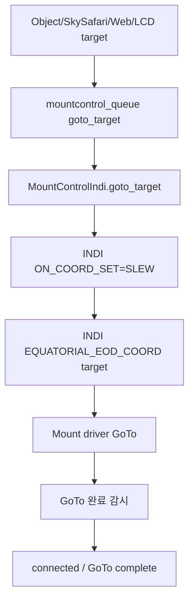
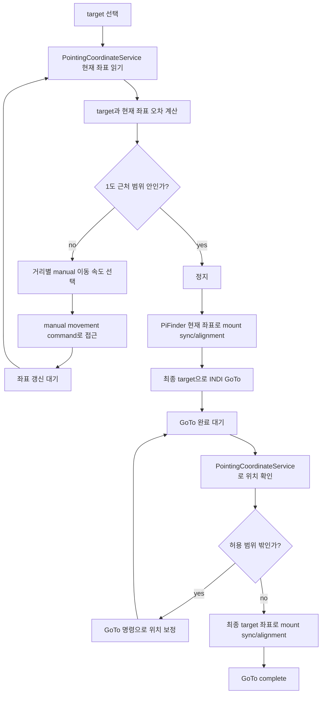
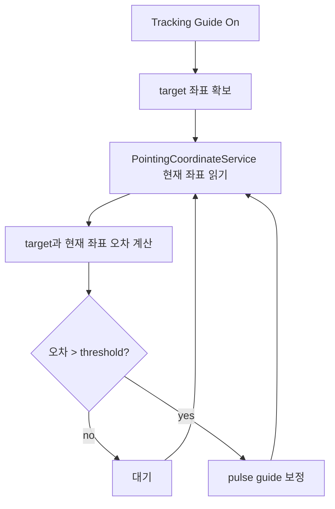

# MF PiFinder INDI GoTo / Guide 설정 설계 초안

작성 기준: `mf_pifinder` 브랜치, 2026-07-08.

이 문서는 INDI 마운트 기능에 추가할 `Goto/Guide` 설정 UI와 동작 방식을
구현 전에 정리하기 위한 설계 초안이다.

## 목적

INDI 마운트를 사용할 때 GoTo와 추적 보정 동작을 사용자가 명확히 선택할 수 있게 한다.

새 설정 UI:

- LCD: `Start > INDI > Setting > Goto/Guide`
- Web: `/indi` 페이지의 INDI 탭 제일 하단

1차 설정 항목:

```text
Goto 진행방법
  - INDI Mount
  - PiFinder

추적 가이드
  - On
  - Off
```

GoTo target 입력 경로:

```text
LCD UI를 통한 target 선택
SkySafari를 통한 target 설정
Web UI를 통한 target 설정
```

세 입력 경로는 모두 같은 mount-control target 처리로 모이고, 선택된
`Goto Method`에 따라 `INDI Mount` 또는 `PiFinder` 절차를 수행한다.

## 현재 관련 구현

현재 소스에서 이미 존재하는 관련 기능:

```text
python/PiFinder/mountcontrol_indi.py
  goto_target()
  toggle_guide_correction()
  _check_guide_correction()
  manual_move()
  stop_mount()

python/PiFinder/ui/indi.py
  UIIndiGuide
  숫자 5: indi_goto_refine_once 토글
  숫자 0: toggle_guide_correction

python/PiFinder/server.py
python/views/indi_mount.html
  SkySafari Mount Mode 설정
  skysafari_indi_goto
  skysafari_indi_sync
  indi_goto_refine_once
  indi_goto_refine_accuracy_arcmin

python/PiFinder/pointing_coordinate_service.py
  SkySafari/Web/LCD가 사용할 현재 좌표 상태 제공
```

현재 `goto_target()`은 INDI 표준 `ON_COORD_SET=SLEW`와
`EQUATORIAL_EOD_COORD`를 사용해 마운트 driver에 GoTo를 보낸다.

현재 `toggle_guide_correction()`은 solve 기반 target 오차를 보고 짧은 수동 이동
correction을 보내는 구조다.

## 구현 아키텍처

기존 시스템을 흔들지 않기 위해 새 기능은 별도 서비스와 별도 소스로 구현한다.

새 소스 후보:

```text
python/PiFinder/indi_goto_guide_service.py
```

역할 분리:

```text
pos_server.py
  SkySafari LX200 명령 수신
  GoTo/Sync/Guide 요청을 새 서비스 큐로 전달
  기존 push-to UI 처리는 유지

server.py / views/indi_mount.html
  Web 설정 UI
  Web target/stop 요청을 새 서비스 큐로 전달

ui/indi.py, ui/object_details.py
  LCD 설정 UI
  LCD target/stop 요청을 새 서비스 큐로 전달

indi_goto_guide_service.py
  GoTo Method 정책 결정
  PiFinder GoTo 상태 머신 실행
  Tracking Guide 상태 머신 실행
  PointingCoordinateService 좌표 읽기
  기존 mountcontrol_queue로 작은 명령만 전송

mountcontrol_indi.py
  기존 INDI 명령 실행자 역할 유지
  connect, sync, goto_target, manual_move, stop_mount 등 기존 primitive 제공
```

새 서비스는 mountcontrol을 대체하지 않는다. 기존 `MountControlIndi`는 실제 INDI
driver에 명령을 보내는 실행 계층으로 남기고, 새 서비스는 여러 명령을 순서대로
조합하는 orchestration 계층으로 둔다.

프로세스/큐 구조 초안:

```text
main.py
  mountcontrol_queue = Queue()
  goto_guide_queue = Queue()

  MountControl process
    input: mountcontrol_queue

  INDI GoTo/Guide process
    input: goto_guide_queue
    output: mountcontrol_queue
    reads: shared_state, mount_control_status.json
    writes: indi_goto_guide_status.json

  POS Server process
    SkySafari GoTo/Sync/Guide -> goto_guide_queue

  Web/LCD
    settings/config -> config.json
    target/stop/runtime commands -> goto_guide_queue
```

상태 파일 후보:

```text
data/indi_goto_guide_status.json
```

상태 파일에는 최소한 다음 정보를 기록한다.

```text
service_state
active_target_ra
active_target_dec
goto_method
tracking_guide_enabled
phase
last_error_arcmin
last_action
wait_reason
updated
```

## 구현 원칙과 주의점

- 새 서비스는 긴 blocking loop로 동작하지 않고 짧은 tick 단위 상태 머신으로 동작한다.
- Stop/Abort 명령은 어느 phase에서도 최우선 처리한다.
- 기존 `goto_target()` 경로는 `Goto Method = INDI Mount`일 때 그대로 유지한다.
- `skysafari_indi_goto`는 SkySafari GoTo를 mount 기능으로 전달할지 결정하는 설정이고,
  `indi_goto_method`는 전달된 GoTo를 어떤 방식으로 실행할지 결정하는 설정이다.
- `PointingCoordinateService`는 좌표 계산의 단일 기준으로 사용한다.
- PiFinder GoTo는 mount가 Park 상태이거나 위치/시간이 유효하지 않으면 시작하지 않는다.
- 수동 접근 중에는 lease 기반 manual movement를 사용하고, 주기적으로 keepalive 또는
  stop을 명확히 보낸다.
- Tracking Guide는 사용자의 manual movement, GoTo, backlash test, multi align 중에는
  끼어들지 않는다.
- pulse guide가 driver별로 불안정하면 짧은 manual movement fallback을 사용하되,
  fallback 사용 여부를 상태에 명확히 표시한다.
- OnStepX 전용 기능은 driver 이름/기능 감지 후에만 사용하고, 일반 INDI 마운트에서는
  표준 INDI primitive만 사용한다.

## 제안 설정 키

새 설정은 장치 재시작 후에도 유지되어야 하므로 config option으로 관리한다.

```text
indi_goto_method = "indi_mount" | "pifinder"
  기본값: "indi_mount"

indi_tracking_guide_enabled = false | true
  기본값: false

indi_goto_refine_accuracy_arcmin
  기존 설정 유지.
  PiFinder GoTo와 추적 가이드의 목표 정확도 후보로 사용한다.

indi_pifinder_goto_near_threshold_deg = 1.0
  PiFinder GoTo에서 "근처 도달"로 판단하는 기본 범위.

indi_tracking_guide_threshold_arcmin
  추적 가이드가 pulse guide 보정을 시작할 오차 기준.
  기본값은 실장비 테스트로 결정한다.
```

이름은 구현 시 바뀔 수 있지만, 문서에서는 위 이름을 기준으로 설명한다.

## UI 설계

### LCD

메뉴 위치:

```text
Start
  INDI
    Setting
      Goto/Guide
```

화면 구성 초안:

```text
Goto/Guide
  Goto Method
    INDI Mount
    PiFinder

  Tracking Guide
    Off
    On
```

조작 원칙:

- 좌우/사각 버튼으로 항목 선택과 값 변경.
- 값 변경 시 config에 저장하고 `reload_config`를 보낸다.
- 장비 연결 상태와 무관하게 설정은 변경 가능해야 한다.
- 실제 동작 중인 추적 가이드는 Off로 바꾸면 즉시 `toggle_guide_correction(false)`
  또는 동등한 stop 명령을 보낸다.

### Web

위치:

```text
/indi
  ...
  [제일 하단] GoTo / Guide Settings
```

표시 항목:

```text
Goto Method
  radio 또는 select:
    INDI Mount
    PiFinder

Tracking Guide
  checkbox 또는 switch:
    On / Off

Apply 버튼
```

Web UI는 기존 `SkySafari Mount Mode` 카드와 구분한다. SkySafari 설정은
SkySafari protocol forwarding 정책이고, `Goto/Guide`는 INDI 마운트 자체의
GoTo/추적 보정 정책이다.

## GoTo Method: INDI Mount

현재 동작을 유지하는 모드다.



특징:

- 마운트 driver가 target 좌표로 이동한다.
- PiFinder는 진행 중 mount readback을 좌표 서비스에 제공한다.
- `indi_goto_refine_once`가 켜져 있으면 GoTo 완료 후 solve 기반 1회 refine을
  수행할 수 있다.
- 추적 가이드가 On이면 GoTo 이후 target을 기준으로 주기적 guide correction을
  수행한다.

## GoTo Method: PiFinder

PiFinder가 `PointingCoordinateService` 좌표를 기준으로 target 근처까지 수동 이동
명령으로 접근한 뒤, mount 좌표 동기화와 INDI GoTo를 조합해 최종 target에
맞추는 모드다.



세부 절차:

- 이동량 계산에 필요한 현재 좌표는 `PointingCoordinateService`의
  `CoordinateState.current`를 사용한다.
- target까지의 거리와 방향을 계산해 manual movement 방향과 속도를 정한다.
- target과 멀 때는 고속으로 이동하고, 가까워질수록 속도를 낮춘다.
- 기본 근처 도달 범위는 1도이다.
- 근처 범위에 들어오면 manual movement를 정지한다.
- 정지 후 PiFinder가 보고 있는 현재 좌표로 mount를 sync/alignment한다.
  이 단계는 mount 좌표계를 PiFinder 좌표계와 맞추기 위한 coarse sync다.
- 그 다음 최종 target 좌표로 일반 INDI GoTo를 실행한다.
- GoTo 종료 후 `PointingCoordinateService` 좌표로 target과 현재 위치 차이를 확인한다.
- 오차가 일정 범위 이상이면 GoTo 명령을 사용해 위치 보정을 반복한다.
- 목표 위치 범위 안에 들어오면 최종 target 좌표로 다시 sync/alignment한다.
  이 마지막 동기화는 이후 tracking 정밀도를 높이기 위한 절차다.

속도 선택 초안:

```text
큰 오차       -> fast/slew 계열 수동 이동
중간 오차     -> find/center 계열 수동 이동
near threshold 근처 -> guide/slow 계열 수동 이동
```

정확한 속도 단계와 거리 구간은 실장비 테스트로 조정한다.

주의 사항:

- 이 모드는 `PointingCoordinateService`의 좌표 품질에 크게 의존한다.
- plate solve 좌표가 있으면 가장 신뢰도가 높다.
- solve가 없으면 IMU/mount 융합 좌표로 coarse 접근은 가능하지만 오차가 커질 수 있다.
- 마운트가 Park 상태이거나 위치/시간이 유효하지 않으면 시작하지 않는다.
- Stop/Abort는 manual 접근, 최종 GoTo, 보정 GoTo 어느 단계에서도 최우선 처리한다.

## 추적 가이드

추적 가이드는 GoTo method와 별개로 On/Off 할 수 있는 보정 기능이다.

목표:

- target 추적 중 지속적으로 `PointingCoordinateService`의 현재 좌표를 확인한다.
- target 좌표와 현재 좌표가 일정량 이상 틀어졌을 때 pulse guide로 추가 보정한다.
- 기능 자체는 설정에서 On/Off 한다.

기본 흐름:



좌표 우선순위:

```text
1. plate solve 기반 PointingCoordinateService 좌표
2. mount sync 이후 mount + IMU delta 좌표
3. solve 없음/초기 상태의 IMU fallback 좌표
```

보정 방식:

```text
오차 방향 계산
  -> RA/Dec 또는 Alt/Az 기준 correction 방향 결정
  -> pulse guide duration 계산
  -> INDI pulse guide 또는 짧은 manual motion command 전송
  -> 다음 좌표 갱신에서 효과 확인
```

pulse guide가 driver에서 안정적으로 지원되지 않는 경우에는 짧은 manual movement
lease를 fallback으로 사용할 수 있다.

Off 조건:

- 사용자가 설정에서 Off 선택
- mount disconnect/error
- mount parked
- 사용자가 Stop/Abort
- target 없음
- `PointingCoordinateService` 좌표 unavailable

상태 표시 후보:

```text
guide_correction_enabled
guide_correction_target_ra
guide_correction_target_dec
guide_correction_error_arcmin
guide_correction_last_action
guide_correction_wait_reason
guide_correction_pulse_ms
guide_correction_threshold_arcmin
```

## 기존 설정과의 관계

현재 Web의 `SkySafari Mount Mode`에 있는 다음 항목은 의미가 겹칠 수 있다.

```text
indi_goto_refine_once
indi_goto_refine_accuracy_arcmin
```

정리 방향:

- `indi_goto_refine_accuracy_arcmin`은 `Goto/Guide` 공통 accuracy 설정으로
  이동할 수 있다.
- `indi_goto_refine_once`는 `Goto Method = INDI Mount`에서 사용할 세부 옵션으로
  유지하거나, PiFinder GoTo 구현 후 `PiFinder final refine`로 의미를 바꿀 수 있다.
- SkySafari forwarding 설정(`skysafari_indi_goto`, `skysafari_indi_sync`)은
  SkySafari protocol 정책이므로 그대로 분리한다.

## 단계별 구현 계획과 체크리스트

각 단계는 커밋 가능한 단위로 나눈다. 가능한 경우 각 단계 완료 후 서버에 push해
디버깅 기준점을 남긴다.

### Stage 0: 문서와 기준선

목표:

- 본 문서 확정.
- 기존 동작을 바꾸지 않는 기준선을 기록.

체크리스트:

- `git status`에서 작업 대상이 명확한가.
- 기존 `mountcontrol_indi.goto_target()` 경로를 변경하지 않았는가.
- 기존 SkySafari GoTo forwarding 의미를 유지하고 있는가.
- 문서만 커밋/푸시되어 소스 변경과 분리되어 있는가.

### Stage 1: 별도 서비스 골격

목표:

- `indi_goto_guide_service.py`를 추가한다.
- `main.py`에서 별도 process와 `goto_guide_queue`를 생성한다.
- 서비스는 아직 mount를 움직이지 않고 status heartbeat만 기록한다.

체크리스트:

- `mount_control = false`이면 새 서비스도 시작하지 않는가.
- `mount_control = true`이면 MountControl과 새 서비스가 모두 시작되는가.
- `indi_goto_guide_status.json`이 주기적으로 갱신되는가.
- 기존 `mount_control_status.json` 형식이 바뀌지 않았는가.
- 기존 SkySafari 위치 조회가 계속 동작하는가.

### Stage 2: 설정 UI와 config

목표:

- Web `/indi` 하단에 `GoTo / Guide Settings`를 추가한다.
- LCD `Start > INDI > Setting > Goto/Guide`를 추가한다.
- 설정은 저장만 하고, 아직 동작은 기존 경로를 유지한다.

체크리스트:

- `indi_goto_method` 기본값이 `indi_mount`인가.
- `indi_tracking_guide_enabled` 기본값이 `false`인가.
- Web에서 설정 변경 후 재로딩해도 값이 유지되는가.
- LCD에서 설정 변경 후 재시작해도 값이 유지되는가.
- Red Night 테마에서 새 UI가 흰색 계열을 사용하지 않는가.

### Stage 3: 요청 라우팅

목표:

- SkySafari/Web/LCD target 요청을 새 서비스 큐로 보낼 수 있게 한다.
- `Goto Method = INDI Mount`이면 새 서비스가 기존 mountcontrol `goto_target`
  명령을 그대로 전달한다.

체크리스트:

- `skysafari_indi_goto = false`이면 SkySafari GoTo가 기존처럼 mount로 전달되지 않는가.
- `skysafari_indi_goto = true`, `indi_goto_method = indi_mount`이면 기존과 같은 GoTo가
  수행되는가.
- Object Details / LCD / Web에서 기존 GoTo 동작이 깨지지 않는가.
- Stop/Abort가 새 서비스 경유 후에도 즉시 mountcontrol로 전달되는가.

### Stage 4: PointingCoordinateService 입력 연결

목표:

- 새 서비스가 `PointingCoordinateService` 현재 좌표를 읽는다.
- 좌표가 unavailable일 때 안전하게 대기/실패 처리한다.

체크리스트:

- solve 좌표가 있을 때 source/quality/status가 상태 파일에 표시되는가.
- solve가 없고 IMU fallback만 있을 때도 현재 좌표가 표시되는가.
- mount가 Park 상태이면 mount 좌표를 PiFinder GoTo 기준으로 사용하지 않는가.
- 좌표가 unavailable이면 mount 명령을 보내지 않는가.

### Stage 5: PiFinder GoTo 1차 상태 머신

목표:

- PiFinder GoTo 상태 머신을 추가한다.
- 1차 구현은 실제 자동 접근을 최소화하고, target/current/error 계산과 Stop 처리부터
  검증한다.

체크리스트:

- target 수신 후 `phase = planning`이 기록되는가.
- 현재 좌표와 target 오차가 계산되는가.
- Park/location/time invalid 조건에서 시작하지 않는가.
- Stop/Abort가 어느 phase에서도 `idle/stopped`로 전환되는가.
- 아직 의도하지 않은 manual movement가 발생하지 않는가.

### Stage 6: PiFinder manual approach

목표:

- target과의 거리별로 manual movement 방향과 속도를 선택한다.
- lease/keepalive/stop을 명확히 관리한다.

체크리스트:

- 큰 오차에서 고속 이동, 작은 오차에서 저속 이동으로 전환되는가.
- 한 번에 너무 긴 lease를 걸지 않는가.
- 좌표가 갱신되지 않으면 자동으로 stop하고 error 상태가 되는가.
- 1도 근처 범위에 들어오면 manual movement가 멈추는가.
- 사용자가 Stop을 누르면 즉시 `stop_movement`가 mountcontrol로 전달되는가.

### Stage 7: coarse sync와 final INDI GoTo

목표:

- 근처 도달 후 PiFinder 현재 좌표로 mount sync/alignment를 수행한다.
- 최종 target으로 기존 INDI GoTo를 실행한다.

체크리스트:

- sync 전/후 mount coordinate sync 상태가 status에 기록되는가.
- final GoTo는 기존 `goto_target()` primitive를 사용하므로 기존 안정성을 유지하는가.
- OnStepX의 근처 이동 후 미세조정 구간을 고려해 완료 판정에 settle time을 두는가.
- GoTo 중 Tracking Guide가 끼어들지 않는가.

### Stage 8: corrective GoTo와 final sync

목표:

- final GoTo 후 목표 오차를 확인한다.
- 오차가 크면 보정 GoTo를 제한 횟수만 반복한다.
- 목표 범위 안이면 최종 target sync/alignment를 수행한다.

체크리스트:

- correction 반복 횟수 상한이 있는가.
- 오차가 줄지 않으면 실패 상태로 멈추는가.
- 목표 범위 진입 후 final sync가 한 번만 수행되는가.
- final sync 이후 tracking guide target이 최신 target으로 설정되는가.

### Stage 9: Tracking Guide

목표:

- `indi_tracking_guide_enabled`가 켜진 경우 target 추적 보정을 수행한다.
- `PointingCoordinateService` 현재 좌표와 target 좌표의 오차를 기준으로 pulse guide
  또는 manual fallback을 보낸다.

체크리스트:

- target이 없으면 보정하지 않고 wait 상태로 남는가.
- 사용자가 manual movement 중이면 보정하지 않는가.
- mount가 GoTo/backlash/multi-align 중이면 보정하지 않는가.
- pulse guide 실패 시 fallback 여부가 status에 표시되는가.
- Off로 전환하면 진행 중 보정이 중지되는가.

### Stage 10: 통합 테스트

목표:

- 기존 동작과 새 동작을 비교한다.
- 실제 장비 테스트 전에 안전 조건을 모두 확인한다.

체크리스트:

- `indi_goto_method = indi_mount`에서 기존 SkySafari GoTo가 동일하게 동작하는가.
- `indi_goto_method = pifinder`에서 target/current/error/status가 안정적으로 표시되는가.
- Stop/Abort가 모든 단계에서 최우선인가.
- 서비스 재시작 후 status가 꼬이지 않는가.
- INDI mount disconnect/reconnect 상황에서 새 서비스가 안전하게 대기하는가.
