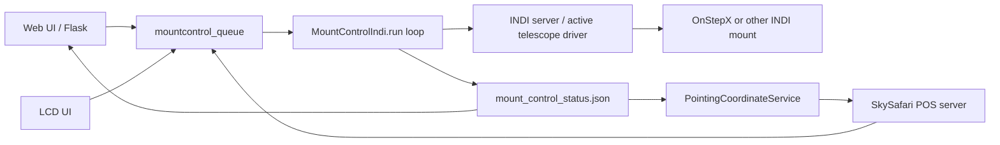
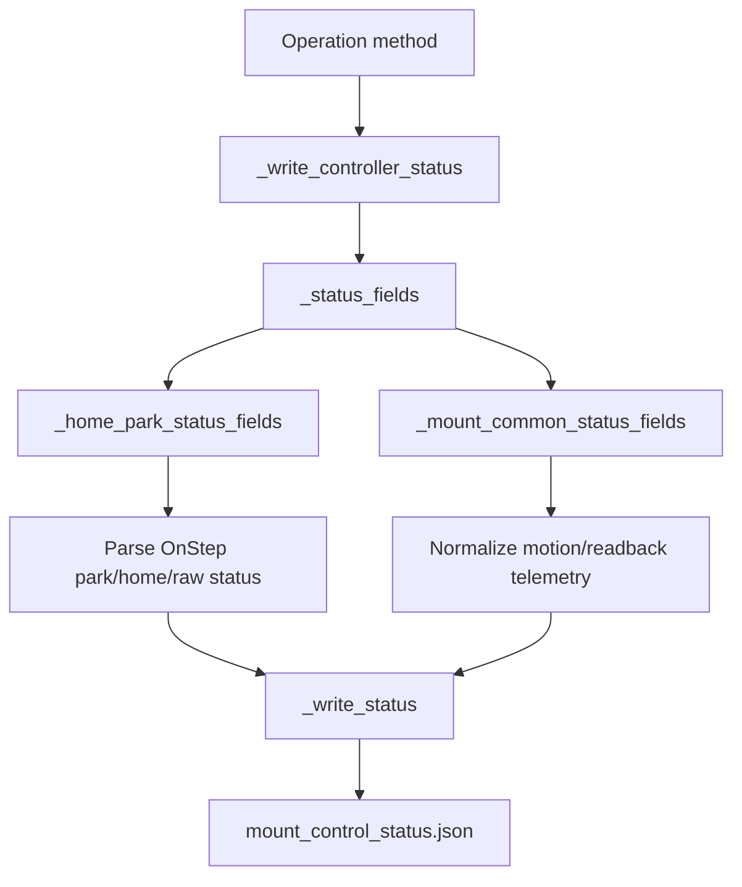
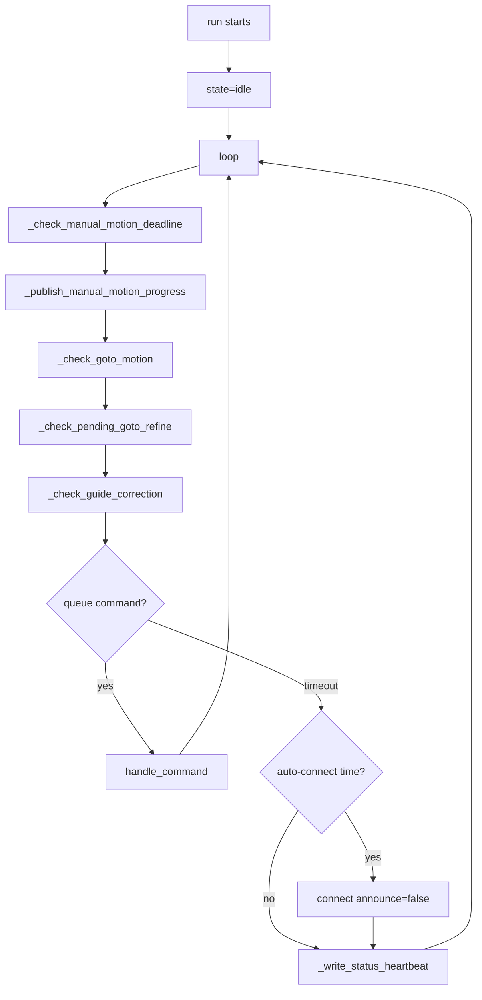
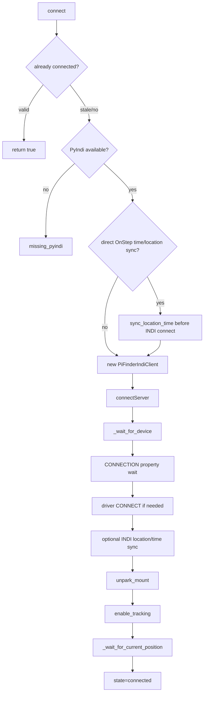
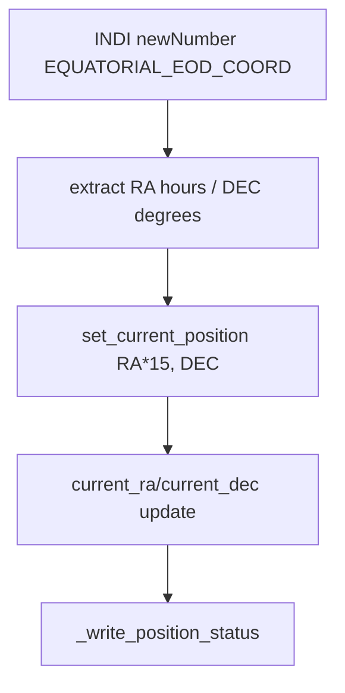
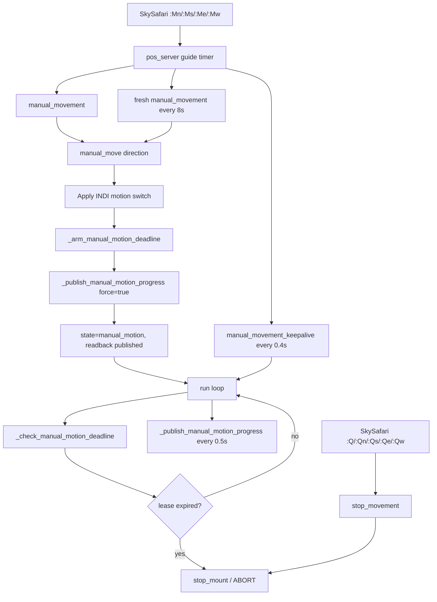
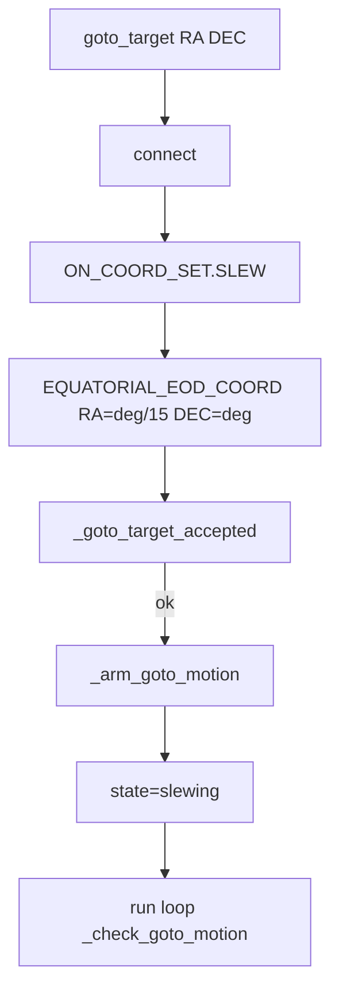
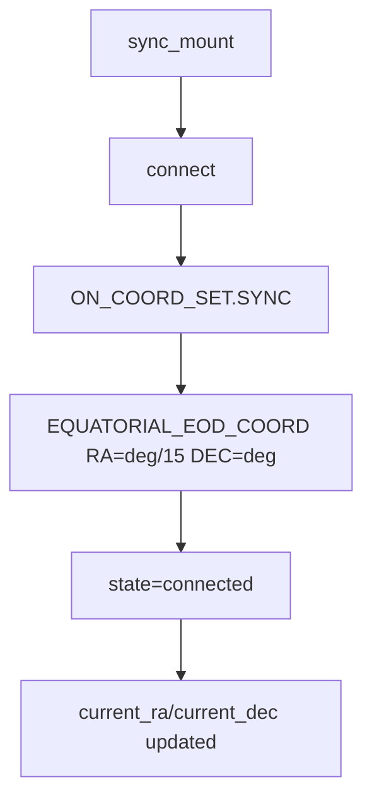
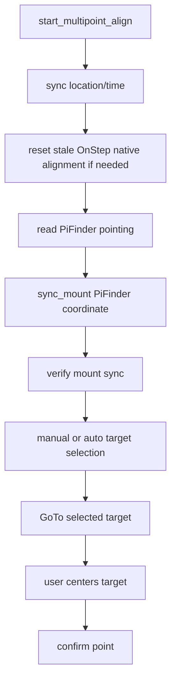
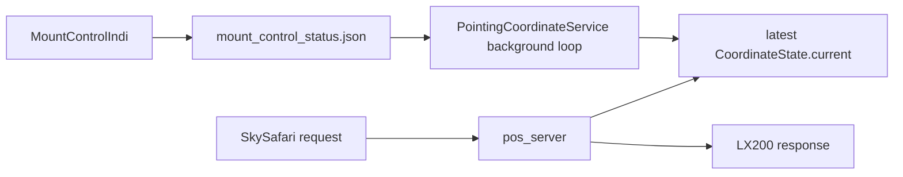

# MF PiFinder mountcontrol_indi Flow

This document describes the current behavior of
`python/PiFinder/mountcontrol_indi.py`: command dispatch, INDI driver control,
status publication, and the coordinate telemetry consumed by
`PointingCoordinateService`.

Related documents:

- `docs/mf_coordinate_helper_plan_en.md`
- `docs/mf_multipoint_align_flow_en.md`
- `docs/mf_backlash_measurement_flow_en.md`
- `docs/mf_goto_mount_source_structure_en.md`

## Role

`MountControlIndi` translates PiFinder mount commands into INDI telescope driver
operations. Web UI, LCD UI, keyboard handling, and SkySafari do not operate the
INDI driver directly; they enqueue commands and read status.



## Main Files

```text
python/PiFinder/mountcontrol_indi.py
python/PiFinder/pos_server.py
python/PiFinder/server.py
python/PiFinder/pointing_coordinate_service.py
python/PiFinder/indi_multipoint_align.py
python/PiFinder/indi_backlash_calibration.py
```

Runtime status files:

```text
/home/pifinder/PiFinder_data/mount_control_status.json
/home/pifinder/PiFinder_data/pointing_coordinate_status.json
```

## Common Mount Telemetry

`mount_control_status.json` includes legacy detail fields and common telemetry
fields. `PointingCoordinateService` should use the common fields first.

```text
mount_motion_active
  True when the mount is actually moving or command-wise expected to be moving.

mount_motion_type
  Diagnostic category: manual, goto, goto_refine_settle, guide_correction,
  align_goto, backlash_auto, etc.

mount_readback_priority
  True when current coordinate selection should prefer mount readback over IMU
  delta. This includes settle/refine windows where continuous physical motion
  may not be visible but mount readback must remain authoritative.
```

Legacy/debug fields remain in the status file:

```text
state
goto_motion_active
goto_refine_pending
manual_motion_direction
multipoint_align
backlash_auto
```

The coordinate service only falls back to those legacy fields when
`mount_readback_priority` is absent.

## Status Publication

Most status writes go through `_write_controller_status()`.



Important fields:

```text
state
message
updated
ra
dec
step_degrees
slew_rate
home_state
park_state
driver_mount_status
raw_mount_status
mount_motion_active
mount_motion_type
mount_readback_priority
target_ra
target_dec
target_error_deg
coordinate_sync
multipoint_align
backlash_auto
device
```

## Main Loop

`run()` owns the command loop.



The loop continues updating motion deadlines, GoTo completion, refine, guide
correction, and periodic status even when no UI command is queued.

Important timing constants:

```text
MANUAL_MOTION_LEASE_SECONDS = 1.2 sec
MANUAL_MOTION_MAX_CONTINUOUS_SECONDS = 10.0 sec

SkySafari POS server guide bridge:
_GUIDE_LEASE_SECONDS = 1.2 sec
_GUIDE_KEEPALIVE_SECONDS = 0.4 sec
_GUIDE_RESTART_SECONDS = 8.0 sec
_GUIDE_MAX_HOLD_SECONDS = 60.0 sec
```

## Connection Flow

`connect()` is called before most mount operations.



## INDI Coordinate Readback

When the INDI driver publishes `EQUATORIAL_EOD_COORD`, `PiFinderIndiClient`
updates `current_ra/current_dec`.



This event path is useful, but manual motion may not produce timely UI-visible
updates. Manual motion therefore also has explicit polling publication.

## Command Dispatch

`handle_command()` dispatches queue command types:

| Command | Function | Purpose |
| --- | --- | --- |
| `init` | `connect()` | Connect to INDI |
| `restart_driver` | `restart_driver()` | Restart INDI Web Manager/server/driver |
| `sync` | `sync_mount()` | Sync mount coordinates |
| `goto_target` | `goto_target()` | Send GoTo |
| `stop_movement` | `stop_mount()` | Abort mount motion |
| `manual_movement` | `manual_move()` | Start/continue manual movement |
| `manual_movement_keepalive` | `manual_motion_keepalive()` | Extend manual movement lease |
| `toggle_guide_correction` | `toggle_guide_correction()` | Solve-based guide correction |
| `set_slew_rate` | `set_slew_rate()` | Set driver slew rate |
| `refresh_slew_rate` | `refresh_slew_rate()` | Read driver slew rate |
| `refresh_backlash` | `refresh_backlash()` | Read backlash |
| `set_backlash` | `set_backlash()` | Apply backlash |
| `auto_backlash` | `auto_calculate_backlash()` | Start backlash motion test |
| `backlash_compass_continue` | `continue_backlash_compass_goto_loop()` | Continue backlash test |
| `backlash_compass_stop` | `stop_backlash_auto()` | Stop backlash test |
| `multipoint_align_start` | `start_multipoint_align()` | Start Multi Align |
| `multipoint_align_select_star` | `select_multipoint_align_star()` | Select alignment star |
| `multipoint_align_goto_target` | `select_multipoint_align_target()` | Use SkySafari target |
| `multipoint_align_confirm` | `confirm_multipoint_align()` | Confirm align point |
| `multipoint_align_clear_target` | `clear_multipoint_align_target()` | Clear only the current target and keep the session active |
| `multipoint_align_cancel` | `cancel_multipoint_align()` | Cancel Multi Align |

Backlash ownership:

- Manual Backlash save, automatic measurement state machine, GoTo measurement
  loop, solved-coordinate record capture, filtering, and recommendation
  generation live in `python/PiFinder/indi_backlash_calibration.py` as
  `BacklashCalibrationMixin`.
- `MountControlIndi` inherits that mixin and supplies shared mount operations:
  INDI connect, GoTo, Sync, Tracking, coordinate readback, and status
  publication.
- Automatic Backlash calculation reads PiFinder reference coordinates from
  `PointingCoordinateService.solved` and runs only when plate-solved pointing is
  valid. `PointingCoordinateService.current` is not used because it may contain
  fallback data.
- See `docs/mf_backlash_measurement_flow_en.md` for the detailed Backlash
  flowchart and formulas.

## Manual Motion

Manual motion is shared by Web UI, LCD UI, keyboard, and SkySafari guide
commands.



Direction mapping:

```text
north     -> TELESCOPE_MOTION_NS.MOTION_NORTH
south     -> TELESCOPE_MOTION_NS.MOTION_SOUTH
east      -> TELESCOPE_MOTION_WE.MOTION_WEST
west      -> TELESCOPE_MOTION_WE.MOTION_EAST
northeast -> north + west
northwest -> north + east
southeast -> south + west
southwest -> south + east
```

Manual motion status:

```text
state = manual_motion
mount_motion_active = true
mount_motion_type = manual
mount_readback_priority = true
manual_motion_direction = ...
ra / dec = current mount readback
```

SkySafari guide handling has one extra layer in `pos_server.py`:

- A guide move queues `manual_movement` and starts an internal keepalive timer.
- Every 0.4 seconds it queues `manual_movement_keepalive`.
- Every 8 seconds it queues a fresh `manual_movement` so the mount-control
  10-second continuous-motion guard does not stop a held SkySafari button.
- `:Q#`, `:Qn#`, `:Qs#`, `:Qe#`, and `:Qw#` stop the timer and queue
  `stop_movement`.
- A TCP command connection closing is not treated as a stop. SkySafari can send
  press and release commands on short-lived separate connections.
- A 60-second maximum hold time remains as a safety stop.

## GoTo

`goto_target()` uses INDI `ON_COORD_SET=SLEW` and `EQUATORIAL_EOD_COORD`.



GoTo progress status:

```text
state = slewing
mount_motion_active = true
mount_motion_type = goto
mount_readback_priority = true
goto_motion_active = true
ra / dec
target_ra / target_dec
target_error_deg
indi_busy
goto_wait_seconds
```

Completion requires stable conditions:

1. INDI busy is not true.
2. OnStep raw status no longer indicates active GoTo.
3. The target was observed active or the grace window has elapsed.
4. INDI busy is explicitly false.
5. Current position is within target tolerance.
6. Current readback is stable.
7. The ready state remains stable for the configured settle time.

## GoTo Refine and Guide Correction

GoTo refine waits for a fresh solve after a GoTo, syncs the mount to the solve
coordinate, then sends a second GoTo if needed.

Guide correction periodically compares fresh solved pointing with the target and
sends a short manual motion pulse when the error exceeds the configured
accuracy.

Both features are expected to publish common telemetry through the same status
path; actual movement uses either GoTo or manual motion publication.

## Sync

`sync_mount(ra, dec)`:



## Location and Time Sync

`sync_location_time()` chooses one of two paths:

- INDI property update.
- Exclusive direct OnStep LX200 sync, when configured for OnStepX.

Direct sync is exclusive because the OnStep TCP/serial port should not be shared
with an active driver connection.

## Multi Align Summary

Multi Align command flow:



Important rules:

- PiFinder and the mount are synchronized before star selection/GoTo.
- PiFinder pointing uses solved/estimated coordinates first, then IMU fallback.
- OnStep native alignment start is deferred to avoid resetting the home frame
  before the selection/GoTo phase.
- Confirm uses the most recently selected/GoTo target coordinate.
- If a manual LCD adjustment screen is left with the left key,
  `multipoint_align_clear_target` clears only the current target and returns to
  star selection. The active session is cancelled only when the UI returns to
  the Manual/Auto selection stage.

## SkySafari Coordinate Flow

SkySafari pulls coordinates; PiFinder does not push them.

```text
:GR# -> current RA
:GD# -> current Dec
```



Therefore SkySafari should not contain operation-specific coordinate logic.
The POS server should read the latest `PointingCoordinateService` state, and the
coordinate service should decide from common telemetry.

## Debug Checklist

During manual motion:

```text
mount_control_status.json:
  state == "manual_motion"
  mount_motion_active == true
  mount_motion_type == "manual"
  mount_readback_priority == true
  ra / dec change while moving

pointing_coordinate_status.json:
  current follows mount readback while readback priority is true
```

During GoTo:

```text
mount_control_status.json:
  state == "slewing"
  mount_motion_active == true
  mount_motion_type == "goto"
  mount_readback_priority == true
  target_ra / target_dec
  target_error_deg
  ra / dec change during movement
```

Debug order:

1. Check whether `mount_control_status.json` readback changes.
2. Check which source `pointing_coordinate_status.json` selected.
3. If both are correct but SkySafari is wrong, inspect POS `:GR#/:GD#`.
4. If mount status is stale, inspect INDI readback and the mount-control loop.
