# MF PiFinder mountcontrol_indi 동작 순서도

이 문서는 `python/PiFinder/mountcontrol_indi.py`의 현재 구현을 기준으로
INDI 마운트 제어 프로세스의 역할, 명령 처리 순서, 상태 발행 경로를 정리한다.

관련 문서:

- `docs/mf_coordinate_helper_plan_ko.md`: `PointingCoordinateService`와 SkySafari 좌표 응답 흐름
- `docs/mf_multipoint_align_flow_ko.md`: Multi Align의 사용자 흐름
- `docs/mf_backlash_measurement_flow_ko.md`: Backlash 측정 상태 machine과 계산식
- `docs/mf_goto_mount_source_structure_ko.md`: SkySafari GoTo/Push 구조와 소스 위치

## 전체 역할

`MountControlIndi`는 PiFinder 내부 명령을 INDI telescope driver 명령으로 변환하는
마운트 제어 프로세스이다. Web UI, LCD UI, SkySafari POS server 등이 직접 INDI에
접근하지 않고 queue 명령을 넣으면, 이 프로세스가 INDI server/driver와 통신한다.

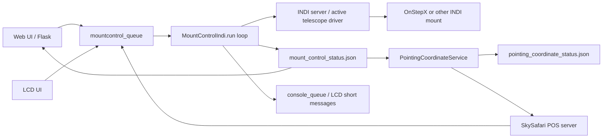

## 주요 파일과 데이터

소스:

- `python/PiFinder/mountcontrol_indi.py`
- `python/PiFinder/pos_server.py`
- `python/PiFinder/server.py`
- `python/PiFinder/pointing_coordinate_service.py`
- `python/PiFinder/indi_multipoint_align.py`
- `python/PiFinder/indi_backlash_calibration.py`

상태 파일:

```text
/home/pifinder/PiFinder_data/mount_control_status.json
/home/pifinder/PiFinder_data/pointing_coordinate_status.json
```

`mount_control_status.json`은 mount-control의 최신 상태 snapshot이다.
Web UI와 `PointingCoordinateService`가 이 파일을 읽는다.

대표 필드:

```text
state
message
updated
step_degrees
slew_rate
ra
dec
home_state
park_state
driver_mount_status
raw_mount_status
manual_motion_direction
manual_motion_lease_remaining
mount_motion_active
mount_motion_type
mount_readback_priority
goto_motion_active
target_ra
target_dec
target_error_deg
guide_correction_enabled
backlash_ra
backlash_de
backlash_auto
multipoint_align
coordinate_sync
device
```

## 시간 상수

중요한 현재 값:

```text
POSITION_STATUS_MIN_INTERVAL = 0.5 sec
STATUS_HEARTBEAT_INTERVAL = 5.0 sec
AUTO_CONNECT_START_DELAY = 5.0 sec
AUTO_CONNECT_RETRY_INTERVAL = 10.0 sec

MANUAL_MOTION_LEASE_SECONDS = 1.2 sec
MANUAL_MOTION_MIN_LEASE_SECONDS = 0.3 sec
MANUAL_MOTION_MAX_LEASE_SECONDS = 5.0 sec
MANUAL_MOTION_MAX_CONTINUOUS_SECONDS = 10.0 sec
MANUAL_MOTION_POLL_SECONDS = 0.1 sec
MANUAL_MOTION_STOP_RETRY_SECONDS = 0.5 sec

SkySafari POS server guide bridge:
_GUIDE_LEASE_SECONDS = 1.2 sec
_GUIDE_KEEPALIVE_SECONDS = 0.4 sec
_GUIDE_RESTART_SECONDS = 8.0 sec
_GUIDE_MAX_HOLD_SECONDS = 60.0 sec

GOTO_COMPLETE_MIN_SECONDS = 1.0 sec
GOTO_COMPLETE_STABLE_SECONDS = 4.0 sec
GOTO_COMPLETE_POSITION_STABLE_DEG = 0.02 deg
GOTO_COMPLETE_TARGET_TOLERANCE_DEG = 0.5 deg
GOTO_COMPLETE_FALLBACK_SECONDS = 180.0 sec
```

## 프로세스 시작과 메인 루프

`run()`은 mount-control 프로세스의 중심 루프이다.

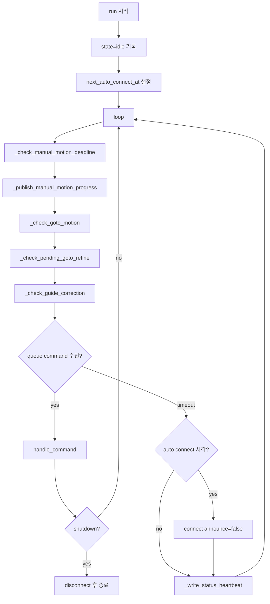

루프 특징:

- 명령이 없어도 주기적으로 수동 이동 deadline, GoTo 완료, refine, guide correction을 확인한다.
- 수동 이동 중이면 queue timeout이 짧아져 stop/deadman 처리가 빠르게 돈다.
- 서비스 시작 후 5초 뒤 자동 연결을 시도하고, 실패하면 10초 간격으로 재시도한다.
- 연결 후 heartbeat는 5초 간격으로 상태 파일을 갱신한다.

## 상태 기록 흐름

상태 기록은 대부분 `_write_controller_status()`를 통해 이루어진다.

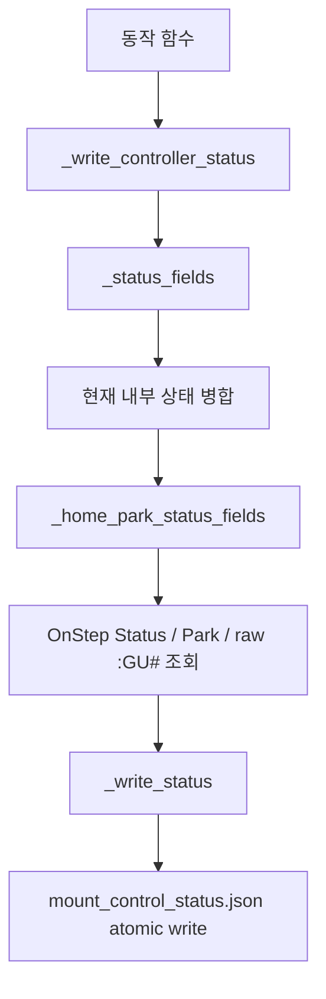

중요한 점:

- `_status_fields()`는 `current_ra/current_dec`를 항상 `ra/dec`로 넣는다.
- `_mount_common_status_fields()`는 동작별 내부 상태를 공통 telemetry로 정규화한다.
- manual motion, GoTo, guide correction, backlash, multipoint align 상태가 있으면
  같은 payload에 같이 들어간다.
- `PointingCoordinateService`는 이 상태 파일의 `ra/dec`,
  `mount_readback_priority`, `mount_motion_active`, `coordinate_sync`,
  `multipoint_align` 등을 사용해 현재 좌표 후보를 판단한다.
- `goto_motion_active`, `manual_motion_direction`, `goto_refine_pending`,
  `state`는 계속 남아 있지만 좌표 선택의 1차 기준은 공통 telemetry이다.

공통 mount telemetry:

```text
mount_motion_active
  실제 또는 명령상 마운트가 움직이는 중이면 true.

mount_motion_type
  manual / goto / goto_refine_settle / guide_correction /
  align_goto / backlash_auto 등의 진단용 분류.

mount_readback_priority
  좌표 서비스가 IMU delta보다 mount readback을 우선해야 하면 true.
  GoTo settle/refine처럼 실제 motion은 아닐 수 있지만 readback이
  authoritative 해야 하는 구간도 포함한다.
```

## INDI 연결 순서

`connect()`는 명령 실행 전에 자주 호출된다. 이미 정상 연결이면 바로 성공한다.

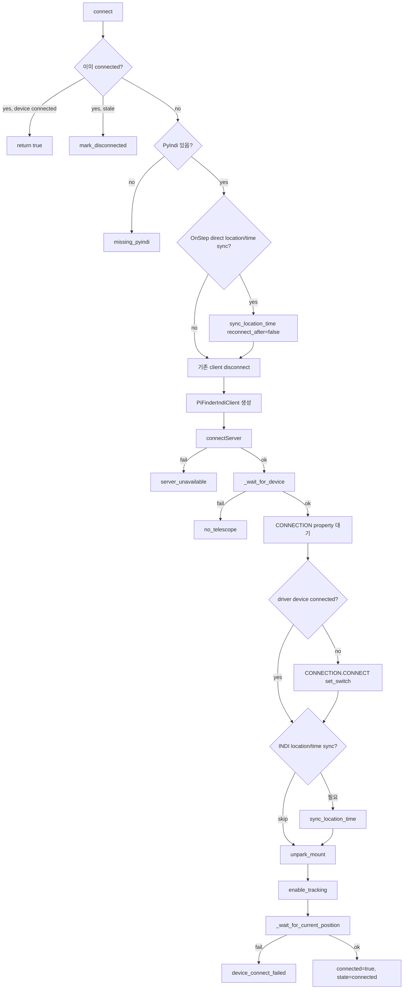

주의:

- OnStepX direct sync 설정이 켜져 있으면 INDI 연결 전에 exclusive LX200
  location/time sync를 수행할 수 있다.
- 연결 성공 후 현재 구현은 `unpark_mount()`와 `enable_tracking()`을 호출한다.
- 연결 마지막에는 `EQUATORIAL_EOD_COORD` readback을 기다려 `current_ra/current_dec`를 채운다.

## INDI client event와 위치 갱신

`PiFinderIndiClient.newNumber()`는 INDI에서 `EQUATORIAL_EOD_COORD` number vector가
갱신될 때 호출된다.

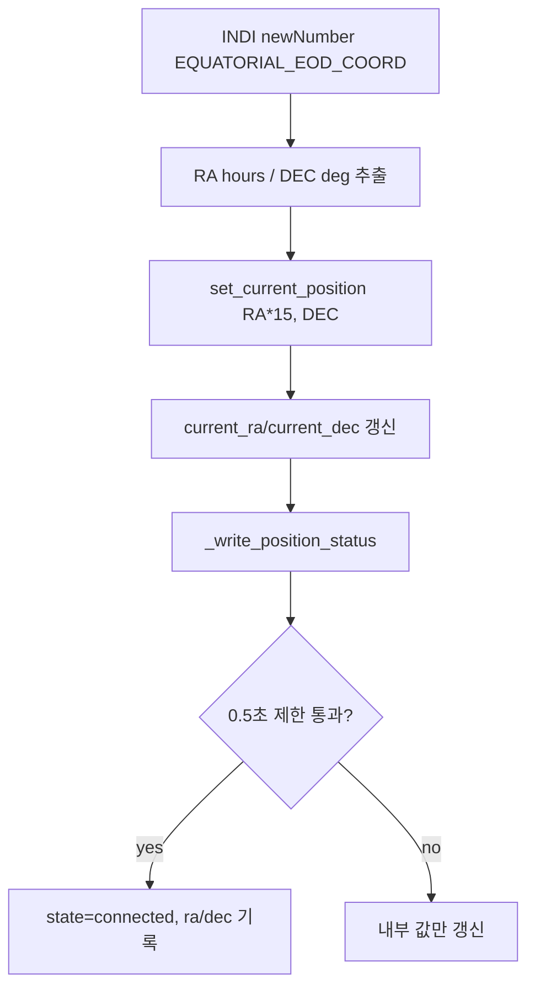

이 이벤트 기반 갱신은 일반 readback 변화에 유용하지만, 수동 이동 중에는 INDI driver가
newNumber를 즉시 발행하지 않거나 PiFinder 루프가 소비하지 못할 수 있다. 그래서
현재 구현은 수동 이동 중 별도 polling 발행도 수행한다.

## 명령 분배

`handle_command()`는 queue command의 `type`에 따라 실제 함수로 분기한다.

| command type | 처리 함수 | 의미 |
| --- | --- | --- |
| `shutdown` | return false | mount-control loop 종료 |
| `init` | `connect()` | INDI 연결 |
| `restart_driver` | `restart_driver()` | INDI Web Manager/server/driver 재시작 |
| `sync` | `sync_mount()` | mount 좌표를 지정 RA/Dec로 sync |
| `goto_target` | `goto_target()` | 지정 RA/Dec로 GoTo |
| `toggle_guide_correction` | `toggle_guide_correction()` | solve 기반 1회/반복 보정 토글 |
| `stop_movement` | `stop_mount()` | abort motion |
| `manual_movement` | `manual_move()` | 방향키 수동 이동 시작/유지 |
| `manual_movement_keepalive` | `manual_motion_keepalive()` | 같은 방향 lease 연장 |
| `increase_step_size` | `change_step(2.0)` | step 크기 증가 |
| `reduce_step_size` | `change_step(0.5)` | step 크기 감소 |
| `increase_slew_rate` | `change_slew_rate(1)` | slew rate 증가 |
| `reduce_slew_rate` | `change_slew_rate(-1)` | slew rate 감소 |
| `set_slew_rate` | `set_slew_rate()` | slew rate 직접 설정 |
| `refresh_slew_rate` | `refresh_slew_rate()` | driver slew rate 읽기 |
| `refresh_backlash` | `refresh_backlash()` | backlash readback |
| `set_backlash` | `set_backlash()` | backlash 값 저장 |
| `auto_backlash` | `auto_calculate_backlash()` | backlash motion test 시작 |
| `backlash_compass_continue` | `continue_backlash_compass_goto_loop()` | backlash test 다음 단계 |
| `backlash_compass_stop` | `stop_backlash_auto()` | backlash test 중지 |
| `multipoint_align_start` | `start_multipoint_align()` | Multi Align 시작 |
| `multipoint_align_select_star` | `select_multipoint_align_star()` | 별 선택 |
| `multipoint_align_goto_target` | `select_multipoint_align_target()` | SkySafari target으로 align target 설정/GoTo |
| `multipoint_align_confirm` | `confirm_multipoint_align()` | align point 확정 |
| `multipoint_align_clear_target` | `clear_multipoint_align_target()` | 현재 target만 지우고 세션 유지 |
| `multipoint_align_cancel` | `cancel_multipoint_align()` | Multi Align 취소 |

## 수동 이동 순서

수동 이동은 Web UI, LCD UI, Bluetooth/USB keyboard, SkySafari guide command가
공통으로 사용하는 핵심 경로이다.

SkySafari guide command 예:

```text
:Mn# -> north
:Ms# -> south
:Me# -> east
:Mw# -> west
:Q#  -> stop
```

`pos_server.py`는 guide move를 받으면 mount-control queue에 수동 이동 명령을
넣고, SkySafari가 짧은 TCP command connection을 반복해서 쓰는 경우에도 이동이
끊기지 않도록 내부 keepalive timer를 유지한다.

```text
{"type": "manual_movement", "direction": "...", "lease_seconds": ...}
{"type": "manual_movement_keepalive", "direction": "...", "lease_seconds": ...}
{"type": "stop_movement"}
```

순서:

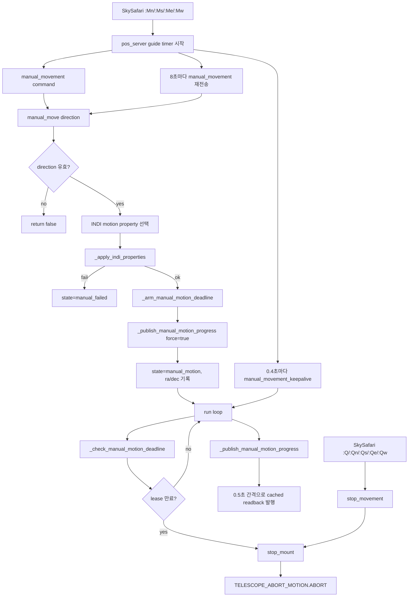

방향 매핑:

```text
north     -> TELESCOPE_MOTION_NS.MOTION_NORTH
south     -> TELESCOPE_MOTION_NS.MOTION_SOUTH
east      -> TELESCOPE_MOTION_WE.MOTION_WEST
west      -> TELESCOPE_MOTION_WE.MOTION_EAST
northeast -> north + west
northwest -> north + east
southeast -> south + west
southwest -> south + east
```

east/west가 반대로 매핑되는 이유:

- 현재 UI/사용자 기준 방향과 OnStep guide axis 방향을 맞추기 위한 보정이다.
- 이 보정은 테스트로 고정되어 있다.

deadman/lease 동작:

- `manual_move()`가 시작되면 기본 1.2초 lease가 잡힌다.
- 같은 방향 keepalive가 들어오면 mount-control deadline이 연장된다.
- mount-control 단일 `manual_movement`의 최대 연속 시간은 10초이다.
- SkySafari POS server는 누르고 있는 동안 0.4초 간격 keepalive를 보내고,
  8초마다 새 `manual_movement`를 보내 mount-control의 10초 연속 제한을
  넘지 않게 한다.
- SkySafari guide bridge의 전체 안전 제한은 60초이다.
- stop command 또는 lease 만료 시 `TELESCOPE_ABORT_MOTION.ABORT`를 보낸다.
- TCP command connection이 닫힌 것만으로는 stop을 보내지 않는다.
  SkySafari가 짧은 연결로 `:Mn#`과 `:Qn#`을 따로 보낼 수 있기 때문이다.
  실제 정지는 `:Q...#` 명령 또는 60초 안전 제한으로 처리한다.

좌표 발행:

- 수동 이동 시작 직후 `manual_motion` 상태와 현재 `ra/dec`를 강제로 발행한다.
- 이후 run loop에서 0.5초 간격으로 `ra/dec`를 갱신 발행한다.
- 이때 공통 telemetry는 `mount_motion_active=true`,
  `mount_motion_type=manual`, `mount_readback_priority=true`가 된다.
- `PointingCoordinateService`는 세부 동작 이름이 아니라
  `mount_readback_priority=true`를 보고 IMU delta를 보류하고 mount readback을 우선한다.

## GoTo 순서

`goto_target()`은 INDI 표준 `ON_COORD_SET=SLEW`와 `EQUATORIAL_EOD_COORD`를 사용한다.

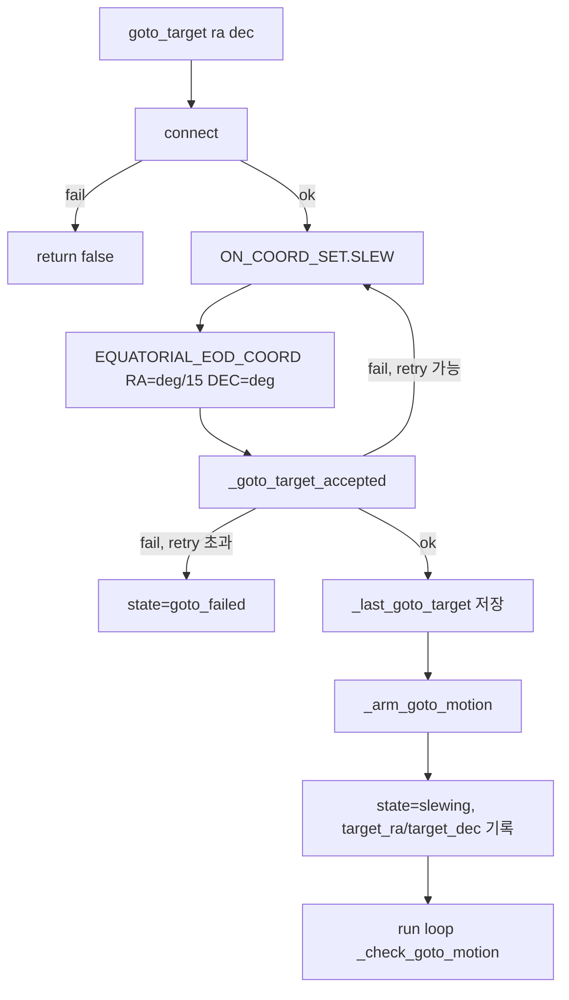

GoTo target acceptance는 다음 중 하나면 성공으로 본다.

- `TARGET_EOD_COORD` readback이 target과 3 arcmin 이내
- INDI mount busy 상태가 true
- OnStep raw status가 GoTo active로 보임
- 현재 좌표가 target과 3 arcmin 이내
- timeout 전 위 조건 중 하나를 만족

## GoTo 진행/완료 판정

GoTo가 시작되면 `_goto_motion` dict가 만들어진다.

```text
target_ra
target_dec
started_at
complete_ready_since
indi_seen_busy
onstep_seen_goto_active
last_complete_position
target_error_deg
position_change_deg
```

진행 중 루프:

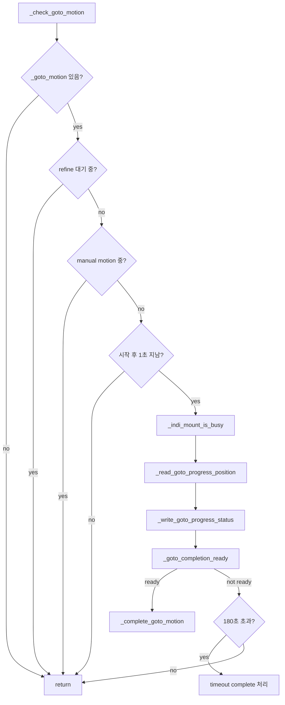

완료 판정 조건:

1. INDI busy가 true이면 완료 아님.
2. OnStep raw `:GU# return`에 GoTo active가 보이면 완료 아님.
3. OnStep complete가 true라도 busy/active를 한 번도 못 봤고 시작 후 3초 미만이면 관찰 대기.
4. INDI busy가 명확히 false가 아니면 완료 아님.
5. 현재 위치가 target과 0.5도보다 멀면 완료 아님.
6. 현재 위치가 직전 완료 후보 위치에서 0.02도보다 많이 움직였으면 완료 아님.
7. 위 조건을 통과한 상태가 4초 이상 유지되면 완료.

GoTo 진행 상태 발행:

```text
state = slewing
message = GoTo in progress
mount_motion_active = true
mount_motion_type = goto
mount_readback_priority = true
ra
dec
target_ra
target_dec
target_error_deg
indi_busy
goto_wait_seconds
goto_motion_active = true
```

이 값이 SkySafari 좌표 안정성에 중요하다. GoTo 중에는 mount readback을 계속 발행하고,
`PointingCoordinateService`는 `mount_readback_priority=true`를 보고 이를 우선 사용한다.

## GoTo refine와 guide correction

GoTo refine:

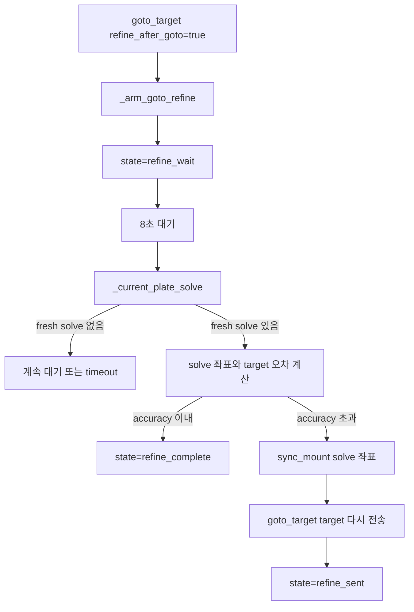

Guide correction:

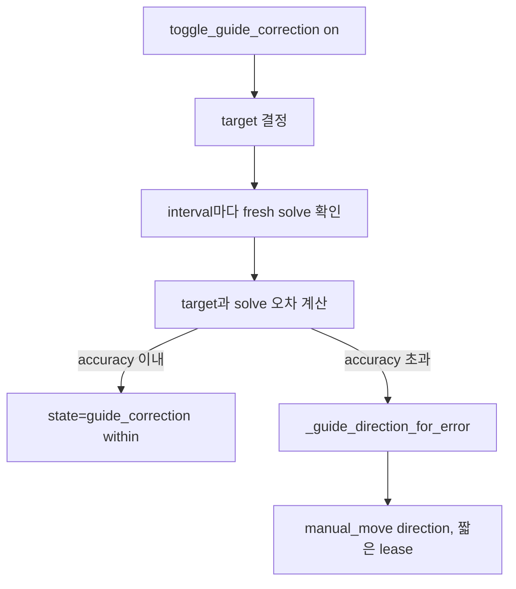

guide correction은 내부적으로 수동 이동 pulse를 사용한다.

## Sync 순서

`sync_mount(ra, dec)`는 INDI 표준 sync 경로를 사용한다.

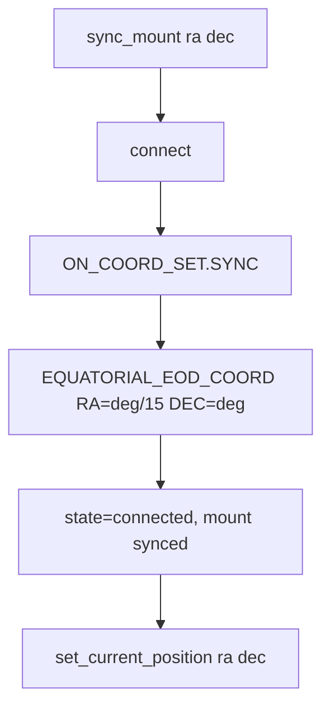

Multi Align과 SkySafari align/sync 동작에서 이 경로가 중요하다.

## Location/Time sync

`sync_location_time()`은 설정에 따라 두 경로 중 하나를 사용한다.

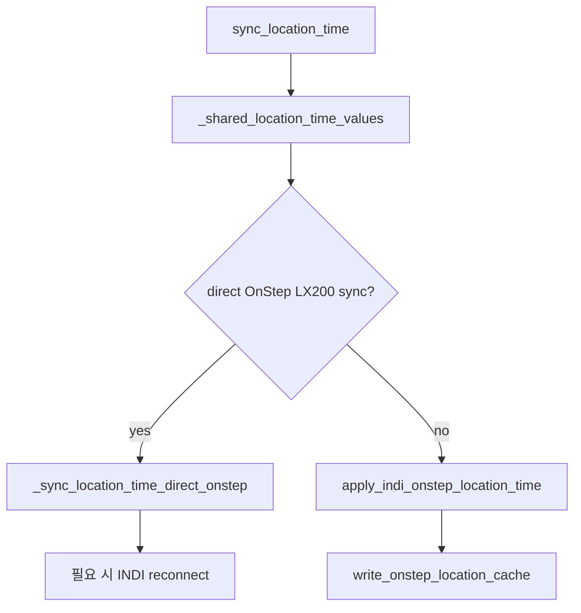

OnStep direct sync:

- INDI driver와 같은 TCP/serial port를 공유하면 충돌할 수 있으므로 exclusive 방식으로 처리한다.
- INDI를 멈추거나 driver 연결을 정리한 뒤 LX200 command를 직접 보내고 다시 연결한다.

INDI sync:

- PyIndi/INDI property를 사용해 latitude, longitude, elevation, UTC time을 보낸다.

## Park/Home/Tracking/Slew

Park/Home:

```text
park        -> TELESCOPE_PARK.PARK
unpark      -> TELESCOPE_PARK.UNPARK
set_home    -> TELESCOPE_HOME.SET
return_home -> TELESCOPE_HOME.GO
set_park    -> TELESCOPE_PARK_OPTION.PARK_CURRENT
```

Tracking:

- `_read_tracking_enabled()`는 driver property와 OnStep Status text를 함께 확인한다.
- `set_tracking(enabled)`는 tracking switch를 적용하고 confirm한다.

Slew rate:

- `set_slew_rate(rate)`는 `TELESCOPE_SLEW_RATE.<0..9>`를 적용한다.
- `refresh_slew_rate()`는 현재 driver switch 상태를 읽어 `self.slew_rate`를 갱신한다.

Guide rate:

- `set_guide_rate(rate)`는 driver의 guide rate number vector를 적용한다.
- 현재 backlash 테스트는 pulse guide 방식이 아니라 GoTo loop 방식으로 정리되어 있다.

## Backlash 관련 흐름 요약

Backlash의 수동 저장, 자동 측정 상태 machine, GoTo 측정 loop, solved 좌표 기록,
필터링, 추천값 계산은 `python/PiFinder/indi_backlash_calibration.py`의
`BacklashCalibrationMixin`에서 관리한다. `MountControlIndi`는 이 mixin을
상속하고, INDI 연결/GoTo/Sync/Tracking/status 발행 같은 공통 마운트 동작을
제공한다.

자동 Backlash 계산 좌표는 `PointingCoordinateService.solved`에서 가져오며,
plate solve가 유효한 상태에서만 동작한다. `PointingCoordinateService.current`
는 fallback이 섞일 수 있으므로 계산에는 사용하지 않는다.

Backlash UI 명령은 다음으로 들어온다.

```text
refresh_backlash
set_backlash
auto_backlash
backlash_compass_continue
backlash_compass_stop
```

`set_backlash()`:

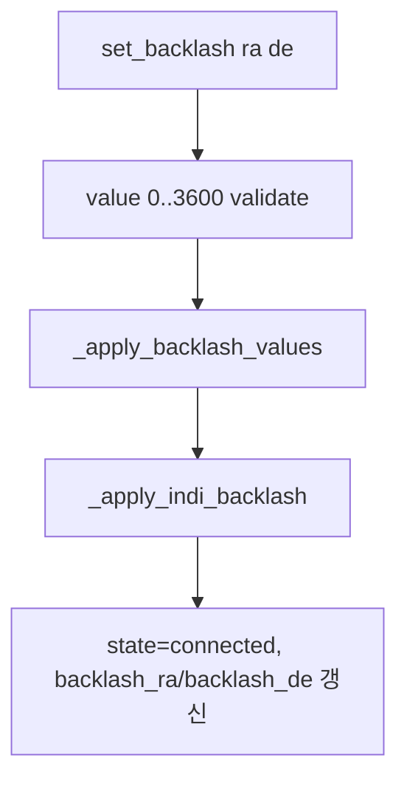

Auto backlash:

- 현재 주 모드는 `compass_goto_loop`이다.
- `PointingCoordinateService.solved`가 유효한지 확인한다.
- 안전 위치/마운트 모델/AltAz 또는 RA/Dec frame을 고려한다.
- 이동 기록은 상세 CSV/records 형태로 분석한다.
- 계산 결과를 UI에 표시하지만, 최종 적용은 사용자가 입력/저장하는 방식이다.

자세한 절차는 `docs/mf_backlash_measurement_flow_ko.md`와 실제 UI 상태를
함께 봐야 한다.

## Multi-Point Align 흐름 요약

명령:

```text
multipoint_align_start
multipoint_align_select_star
multipoint_align_goto_target
multipoint_align_confirm
multipoint_align_clear_target
multipoint_align_cancel
```

시작 순서:

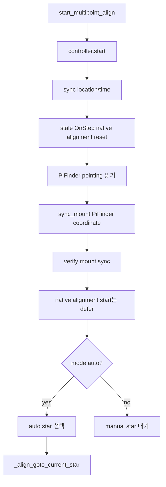

중요 규칙:

- Multi Align 시작 시 mount 좌표를 PiFinder 좌표에 먼저 sync한다.
- PiFinder 좌표는 solve/estimate가 있으면 그것을 우선하고, 없으면 IMU fallback을 사용한다.
- OnStep native alignment start는 현재 구현에서 즉시 시작하지 않고 defer한다.
  이유는 OnStep native align start가 home frame을 reset할 수 있어 star-selection/GoTo
  이전 PiFinder sync를 깨뜨릴 수 있기 때문이다.
- 별을 선택하면 target sent 여부를 기록한다.
- confirm은 가장 최근 GoTo/선택된 target 좌표를 기준으로 처리한다.
- native alignment session이 시작된 경우 `NewAlignStar.1`을 보내고,
  그렇지 않으면 `sync_mount()`로 현재 별 좌표에 sync한다.

자세한 순서도는 `docs/mf_multipoint_align_flow_ko.md`를 기준으로 본다.

## SkySafari와의 관계

SkySafari는 PiFinder에 좌표를 push 받지 않는다. LX200 명령으로 계속 요청한다.

```text
:GR# -> current RA 요청
:GD# -> current Dec 요청
```

PiFinder 쪽 흐름:

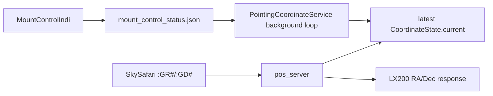

따라서 mount-control이 GoTo/수동 이동 중 `ra/dec`를 계속 발행해야 SkySafari 위치가
움직이는 중에도 자연스럽게 변한다.

## 디버깅 포인트

서비스 상태:

```bash
systemctl status pifinder.service --no-pager -l
```

mount-control 상태:

```bash
jq . /home/pifinder/PiFinder_data/mount_control_status.json
```

coordinate service 상태:

```bash
jq . /home/pifinder/PiFinder_data/pointing_coordinate_status.json
```

수동 이동 중 확인할 값:

```text
mount_control_status.json:
  state == "manual_motion"
  mount_motion_active == true
  mount_motion_type == "manual"
  mount_readback_priority == true
  manual_motion_direction != null  # 호환/진단용
  ra / dec가 0.5초 간격으로 변함

pointing_coordinate_status.json:
  current.source가 mount 또는 mount_delta 계열로 유지
  health warning에 mount motion/settle active가 보일 수 있음
```

GoTo 중 확인할 값:

```text
mount_control_status.json:
  state == "slewing"
  mount_motion_active == true
  mount_motion_type == "goto"
  mount_readback_priority == true
  goto_motion_active == true  # 호환/진단용
  target_ra / target_dec
  target_error_deg
  ra / dec가 이동 중 변함

pointing_coordinate_status.json:
  GoTo 중 IMU delta보다 mount readback 우선
```

문제가 생겼을 때 우선순위:

1. `mount_control_status.json`의 `ra/dec`가 실제로 갱신되는지 본다.
2. 갱신된다면 `pointing_coordinate_status.json`에서 어떤 source가 선택되는지 본다.
3. 둘 다 정상인데 SkySafari만 다르면 POS server의 `:GR#/:GD#` 응답 경로를 본다.
4. `mount_control_status.json`이 멈춰 있으면 INDI driver readback 또는 mount-control loop를 본다.

## 현재 수동 이동 좌표 갱신의 핵심

현재 수동 이동 좌표 갱신은 다음 세 함수가 담당한다.

```text
_read_manual_motion_progress_position()
_write_manual_motion_progress_status()
_publish_manual_motion_progress()
```

호출 위치:

```text
manual_move()
  -> 시작 직후 force publish

run()
  -> 매 loop 시작부
  -> queue timeout 후 empty branch
```

이 구조의 목적:

- SkySafari가 좌표를 요청할 때 최신 수동 이동 좌표를 받을 수 있게 한다.
- GoTo와 동일하게 움직이는 동안 mount readback을 우선하게 한다.
- IMU 흔들림이 수동 이동 중 좌표 오차로 섞이지 않게 한다.
