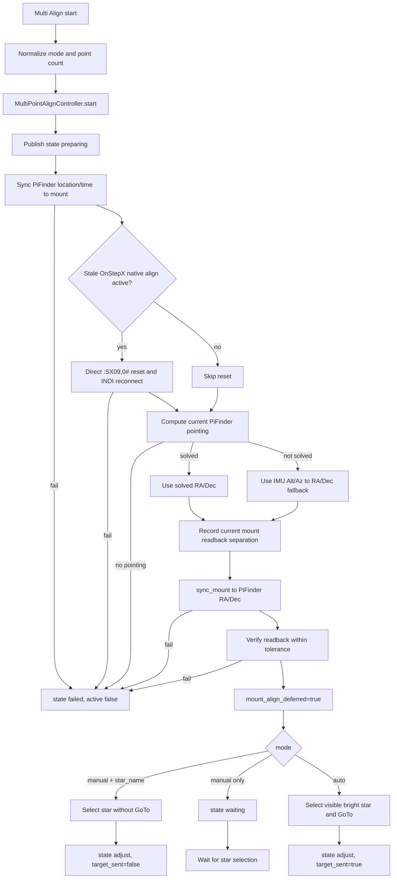
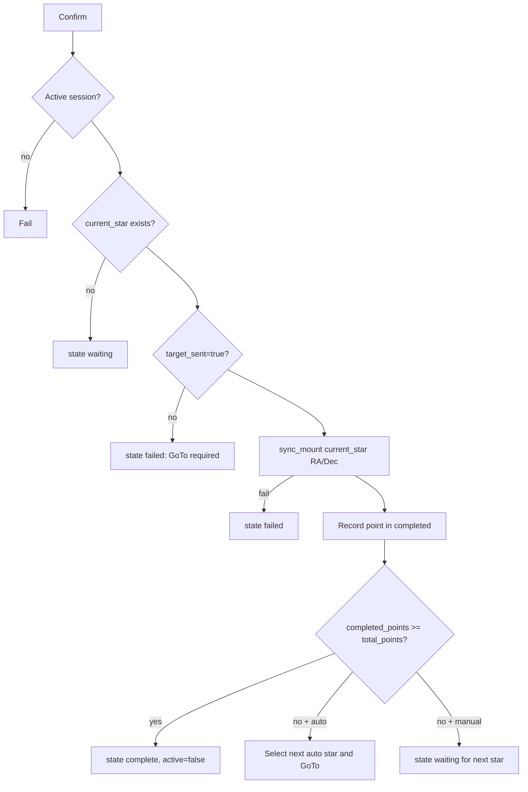

# MF PiFinder INDI Multi Align Source Flow

Baseline: `mf_pifinder` branch, 2026-07-08.

This document describes the current source-level INDI Multi Align flow used by
the Web UI, LCD UI, and SkySafari bridge. The shared state machine lives in
`python/PiFinder/indi_multipoint_align.py`; the UI layers only provide different
ways to drive that same flow.

## Purpose

Multi Align lets the user choose an alignment star or SkySafari target, move the
mount to it, manually center it in the eyepiece, and then sync the mount to the
target coordinates.

Current implementation rules:

- At Multi Align start, PiFinder first sends its location and current UTC time to
  the mount.
- PiFinder then syncs the mount to the pointing that PiFinder currently believes
  it is looking at, and verifies the mount readback.
- If plate solving is available, the solved PiFinder pointing is used.
- If plate solving is not available, IMU-derived pointing is used as a fallback.
- OnStepX native `:A<n>#` alignment is not started immediately.
- Confirm uses the latest target that was actually sent with GoTo, not the live
  mount readback.
- A selected star outside the altitude limits returns the session to waiting for
  another star instead of failing the whole session.
- Real hardware failures, location/time sync failures, and PiFinder-to-mount sync
  verification failures fail the session.

## Related Source

```text
python/PiFinder/indi_multipoint_align.py
  shared Multi Align session/state controller

python/PiFinder/indi_align.py
  bright-star catalog and star selection helpers

python/PiFinder/mountcontrol_indi.py
  location/time sync, stale OnStep align reset, PiFinder coordinate sync,
  GoTo, confirm, and cancel

python/PiFinder/ui/indi.py
  LCD INDI > Setting > Multi Align screens and keypad/keyboard handling

python/PiFinder/server.py
  Web /indi rendering and /indi/multipoint_align route

python/views/indi_mount.html
  Web INDI Multi Align UI and Ajax refresh

python/PiFinder/pos_server.py
  SkySafari LX200 GoTo/Align routing into the active Multi Align session

PiFinder_data/mount_control_status.json
  mount-control status published for Web/LCD/SkySafari routing
```

## Shared Controller

`MultiPointAlignController` owns the session lifecycle. `MountControlIndi` owns
hardware I/O. Web, LCD, and SkySafari are input layers that enqueue commands.

States:

```text
idle          no active session
preparing     location/time sync, stale align reset, PiFinder coordinate sync
waiting       waiting for star or SkySafari target selection
moving        GoTo has been requested
adjust        target GoTo sent; user should center and confirm
complete      requested point count finished
cancelled     user cancelled
failed        non-recoverable operation failure
```

Important session fields:

```text
active
mode                         manual or auto
total_points                 1..9
completed_points
completed
current_star                 current target; also used for SkySafari targets
available_stars
state
message
started_at / updated

location_time_synced
pifinder_sync_source         solve or imu
pifinder_sync_ra
pifinder_sync_dec
pifinder_mount_separation_arcmin
pifinder_mount_synced
pifinder_mount_verified
pifinder_mount_verify_separation_arcmin

mount_align_started          false in the current implementation
mount_align_deferred         native OnStepX align start was deferred
onstep_native_align_reset    whether stale native align reset was run
auto_reference
```

`current_star`:

```text
name
ra
dec
mag
target_sent                  whether GoTo was actually sent to the mount
```

Confirm requires `target_sent=true`. Selecting a star without sending GoTo is not
enough.

## OnStepX Native Align Policy

OnStep/OnStepX `:A<n>#` resets the mount home/frame in firmware. That can undo
the PiFinder-coordinate sync performed at Multi Align start. For that reason,
PiFinder currently defers native `AlignStars.<n>` / `NewAlignStar.0` alignment
start.

Confirm uses normal `sync_mount(target_ra, target_dec)` instead of native `:A+#`.
This keeps the flow mount-agnostic and avoids OnStepX home reset side effects.

If PiFinder later needs to build a real OnStepX multi-star pointing model inside
the controller, it should use the `:SX09`, `:SX0A`..`:SX0E` model-upload path as
a separate OnStepX-specific feature.

### Stale OnStepX Align Reset

If a previous test or external app left OnStepX native alignment active, normal
Sync can be consumed as an align-point accept. At Multi Align start,
`mountcontrol_indi.py` checks the OnStepX `Align Process` text fields. If a
native align is active, PiFinder performs an exclusive direct reset:

```text
1. Stop the INDI Web Manager profile.
2. Send direct LX200 commands to OnStep TCP/serial:
   :A?#        read current align status
   :SX09,0#    reset align upload/model state
   :A?#        verify reset status
3. Start the INDI Web Manager profile.
4. Reconnect the INDI driver.
```

A healthy reset readback is `:A?# -> 900#`.

## Start Flow

`MountControlIndi.start_multipoint_align()` is the common entry point.



When `star_name` is supplied to the start command, PiFinder only selects that
star. It does not move the mount until a separate select/GoTo command is sent.

## Target Selection and GoTo

Manual star selection:

```text
select_multipoint_align_star(star_name, goto=False|True)

1. Require an active session.
2. Look up the star with get_align_star(star_name).
3. Store name/ra/dec/mag in current_star with target_sent=false.
4. goto=false -> state=adjust.
5. goto=true -> _align_goto_current_star().
```

SkySafari target selection:

```text
1. SkySafari :Sr/:Sd stores the target.
2. :MS# routes to select_multipoint_align_target(..., goto=True).
3. The target name defaults to SkySafari Target N.
4. Successful GoTo sets target_sent=true.
```

GoTo:

```text
1. Require current_star.
2. Convert target RA/Dec to Alt/Az for the current location/time.
3. If altitude is below 20 deg or above 80 deg, clear current_star and return
   to state=waiting.
4. Otherwise call goto_target(ra, dec, refine_after_goto=False).
5. Verify INDI GoTo target accept/readback.
6. On success, set target_sent=true and state=adjust.
7. On GoTo reject/failure, clear current_star and return to state=waiting.
```

Altitude-limit rejection and GoTo rejection/failure are recoverable. The session
stays active so the user can select another star from LCD/Web or SkySafari.

## Confirm Flow



Recorded point fields:

```text
name
ra
dec
source                     web, lcd/ui, skysafari, ...
mount_align_started        false
mount_align_command        sync
confirmed_at
```

## Web UI Flow

`/indi/multipoint_align` handles:

```text
align_action=start
  Queue mode, points, and optional align_star.
  manual + align_star only selects the star; it does not GoTo.

align_action=select_star
  Store the selected star and GoTo it.

align_action=confirm
  Confirm the current target when target_sent=true.

align_action=cancel
  Close the session as cancelled.
```

Web actions use Ajax so pressing Start does not scroll the page back to the top.

## LCD UI Flow

`UIIndiMultiPointAlign` maps the shared session into LCD stages:

```text
points      choose alignment point count
mode        choose Manual or Auto
preparing   wait for location/time sync, stale align reset, PiFinder sync
star        choose a manual star or show an auto-selected star
guide       center the target and confirm
```

LCD controls:

- Points: `+/-` or `1..9`
- Mode: Manual / Auto
- Manual Star: right/square selects the star and sends GoTo
- Guide: `789 / 4 6 / 123` moves while held; release stops
- Guide: square confirms
- Left:
  - In Guide with Manual mode, send `multipoint_align_clear_target`, clear only
    the current target, and return to Manual Star. The session stays active.
  - From Manual Star/Preparing to the Manual/Auto mode screen, cancel the session.
  - From Manual/Auto mode to Points, there should be no active session.

Auto mode prefers solved pointing. IMU fallback exists, but solve-based Auto mode
is safer during real observing.

## SkySafari Integration

`pos_server.py` checks `mount_control_status.json`.

```text
Multi Align inactive:
  SkySafari GoTo/Sync follows normal PiFinder/INDI settings.

Multi Align active:
  SkySafari GoTo (:Sr/:Sd/:MS) routes to multipoint_align_goto_target.
  SkySafari Align/Sync (:CM) routes to multipoint_align_confirm.
```

This allows manual mode with SkySafari: choose a star in SkySafari, GoTo it,
manually center it, then press SkySafari Align/Sync to record the Multi Align
point.

## Hardware Verification

Verified on 2026-07-08 with OnStepX hardware and unit tests:

- A stale native OnStep align state was reset with direct `:SX09,0#`, then
  `:A?# -> 900#`.
- Multi Align start records `mount_align_started=false` and
  `mount_align_deferred=true`.
- PiFinder coordinate sync verified at `0.0 arcmin`.
- Vega selection/GoTo changed the real mount coordinates.
- Vega confirm recorded `completed_points=1` and `mount_align_command=sync`.
- Altair below the 20-degree limit returned to `waiting` instead of failing the
  session.
- GoTo rejection/failure or an altitude-limited target clears `current_star`,
  returns to `waiting`, and keeps the session active.
- On the LCD Guide stage, the left key clears only the manual target and returns
  to star selection. Cancellation happens only when returning to the Manual/Auto
  selection stage.
- Cancel closed the session with `active=false`, `state=cancelled`.

## Tests

Relevant tests:

```text
python/tests/test_mountcontrol_indi.py
python/tests/test_pos_server.py
python/tests/test_pointing_coordinate_service.py
```

Command:

```bash
python -m pytest \
  python/tests/test_pos_server.py \
  python/tests/test_mountcontrol_indi.py \
  python/tests/test_pointing_coordinate_service.py
```

Result on 2026-07-08:

```text
110 passed
```
