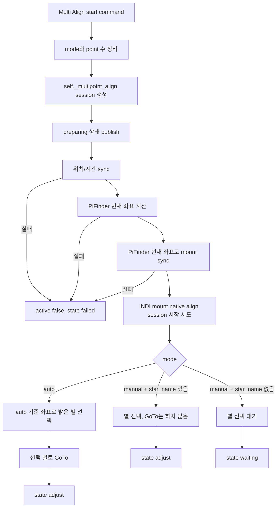
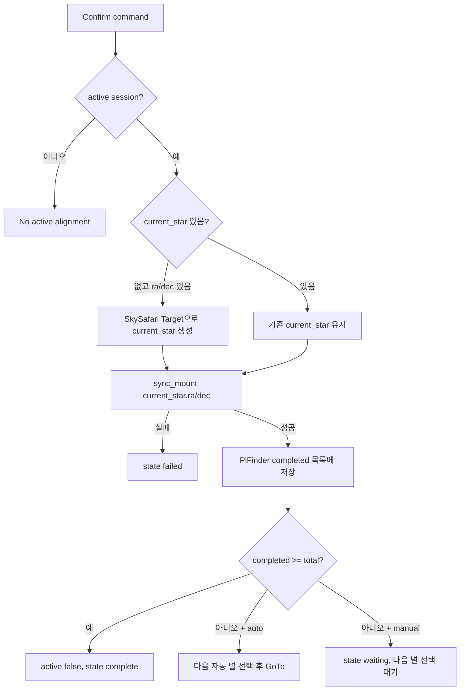
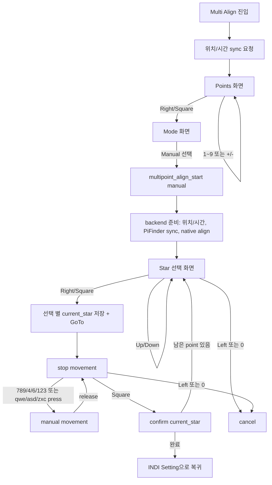
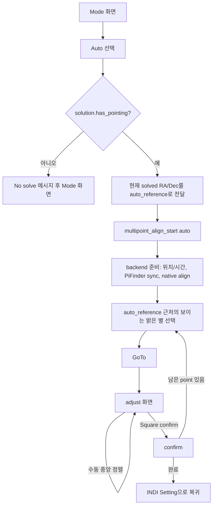
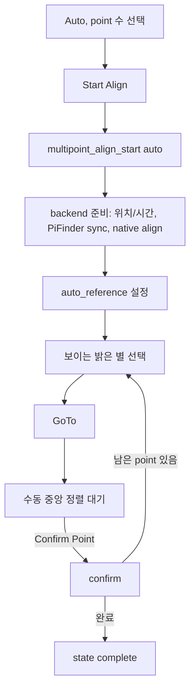
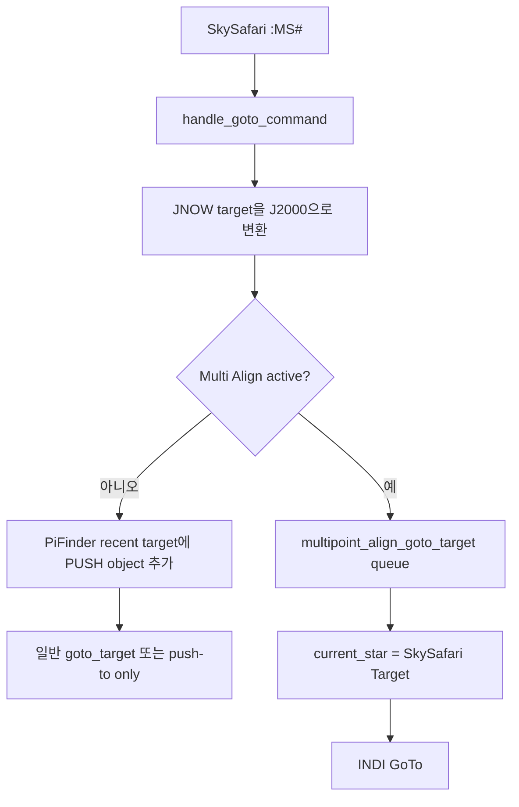
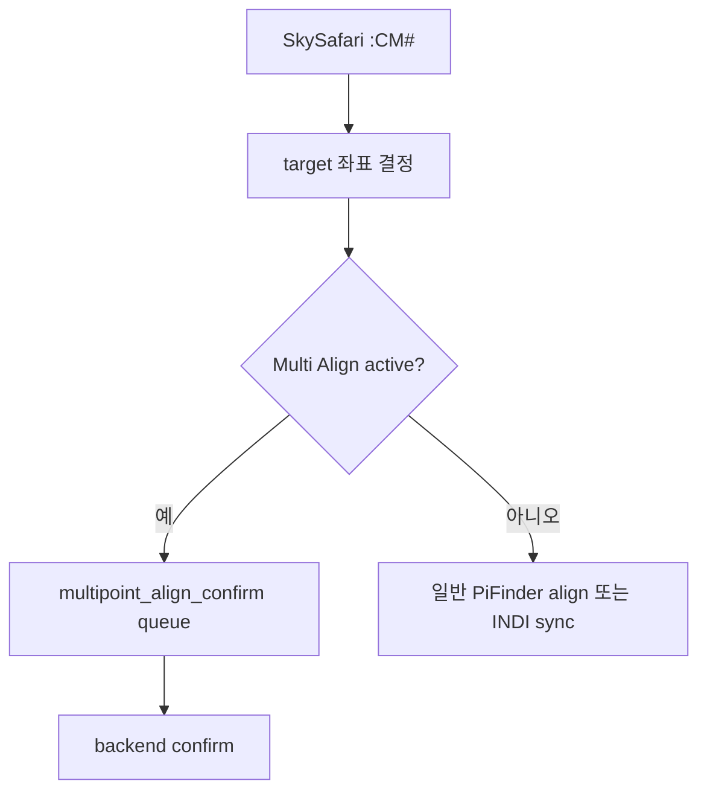

# MF PiFinder INDI Multi Align 소스 흐름

작성 기준: `mf_pifinder` 브랜치, 2026-07-06.

이 문서는 INDI Multi-Point Align 기능의 Web UI, LCD GUI, SkySafari 연동 흐름을 소스 기준으로 정리한다. Web과 LCD는 같은 mount-control 백엔드를 사용하지만 진입 방식, 별 선택 방식, 자동 모드 조건, 조작 화면이 일부 다르므로 별도 흐름으로 구분한다.

## 목적

Multi Align은 사용자가 선택한 정렬 기준 별 또는 SkySafari target을 실제 아이피스 중앙에 맞춘 뒤, 그 target 좌표를 INDI mount에 sync해서 마운트 정렬 모델을 보정하는 기능이다.

핵심 원칙은 다음과 같다.

- Multi Align 시작 시 PiFinder의 위치와 시간을 mount에 먼저 맞춘다.
- Multi Align 시작 시 PiFinder가 현재 보고 있다고 판단하는 좌표로 mount를 항상 sync한다.
- 초기 PiFinder 좌표 sync는 mount native align session을 시작하기 전에 수행한다. 그래야 OnStep/OnStepX에서 이 sync가 첫 align point 확정으로 소비되지 않는다.
- 정렬 확정 시점에는 현재 mount가 바라보는 좌표를 쓰지 않고, 가장 최근에 선택되었거나 GoTo 된 정렬 target 좌표를 사용한다.
- Plate solving이 된 상태에서는 PiFinder solved pointing을 기준으로 사용한다.
- Solving이 안 된 상태에서는 IMU 기반 pointing을 fallback으로 사용한다.
- LCD 자동 모드는 solved pointing이 없으면 시작하지 않는다.
- Web 자동 모드는 현재 백엔드가 PiFinder solved pointing 또는 IMU fallback을 사용해 기준 좌표를 만든다.

## 관련 소스

```text
python/PiFinder/indi_align.py
  밝은 별 catalog, 별 선택/필터링 helper

python/PiFinder/mountcontrol_indi.py
  Multi Align session 상태, 위치/시간 sync, GoTo, confirm, cancel 처리

python/PiFinder/ui/indi.py
  LCD INDI > Setting > Multi Align 화면과 keypad/keyboard 조작

python/PiFinder/server.py
  Web /indi 페이지 렌더링, /indi/multipoint_align route

python/views/indi_mount.html
  Web INDI 페이지의 Multi-Point Align UI와 Ajax 갱신

python/PiFinder/pos_server.py
  SkySafari LX200 GoTo/Align 명령을 Multi Align session으로 라우팅

PiFinder_data/mount_control_status.json
  mount-control process가 publish하는 상태 파일
```

## 공통 데이터 구조

mount-control process는 `self._multipoint_align`에 session을 저장하고, 상태 파일의 `multipoint_align` 항목으로 publish한다.

주요 필드는 다음과 같다.

```text
active              진행 중 여부
mode                manual 또는 auto
total_points        정렬할 전체 point 수, 1~9
completed_points    완료된 point 수
completed           완료된 target 목록
current_star        현재 정렬 target
available_stars     Web/LCD가 참조할 수 있는 밝은 별 이름 목록
state               waiting, moving, adjust, complete, cancelled, failed 등
message             UI 표시용 상태 메시지
started_at          시작 시각
updated             마지막 갱신 시각

pifinder_sync_source              solve 또는 imu
pifinder_sync_ra / pifinder_sync_dec
pifinder_mount_separation_arcmin
pifinder_mount_synced
auto_reference
```

`current_star`는 이름은 별이지만 SkySafari target에도 사용된다.

```text
current_star.name
current_star.ra
current_star.dec
current_star.mag
```

정렬 확정은 `current_star.ra/dec`를 기준으로 수행한다. 사용자가 GoTo 후 수동으로 target을 중앙에 맞춘 뒤 확정하면, mount 현재 방향이 이 target 좌표라고 sync하는 구조다.

## 밝은 별 목록

`python/PiFinder/indi_align.py`가 공통 별 목록을 제공한다.

- `BRIGHT_ALIGN_STARS`
  - `utils.astro_data_dir / "bright_stars.csv"`가 있으면 CSV에서 이름 있는 별을 읽는다.
  - CSV를 읽지 못하면 fallback bright star 목록을 사용한다.
  - magnitude 순으로 정렬된다.
- `ALIGN_STAR_MIN_ALTITUDE_DEG = 20.0`
  - 정렬 target으로 사용할 때의 최소 고도 기준이다.
- `visible_align_stars(...)`
  - 현재 위치/시간에서 고도 20도 이상인 별만 반환한다.
- `nearest_align_star(...)`
  - 기준 RA/Dec에 가장 가까운 밝은 별을 반환한다.
- `clamp_align_points(...)`
  - point 수를 1~9 범위로 제한한다.

## 사용하는 명령 요약

Multi Align에서 사용하는 명령은 크게 네 종류다.

| 목적 | PiFinder 내부 명령 | INDI 명령 / 속성 | OnStep 직접 LX200 명령 | 의미 |
| --- | --- | --- | --- | --- |
| 위치/시간 설정 | `sync_location_time` | 일반 INDI 경로에서는 `GEOGRAPHIC_COORD`, `TIME_UTC` 계열 속성 사용 | OnStepX 직접 동기화 경로에서는 `:St#`, `:Sg#`, `:Sv#`, `:SG#`, `:SL#`, `:SC#` | mount의 관측 위치와 시간을 PiFinder 기준으로 맞춤 |
| 초기 좌표 동기화 | `sync_mount(pifinder_ra, pifinder_dec)` | `ON_COORD_SET=SYNC`, `EQUATORIAL_EOD_COORD={RA,DEC}` | 드라이버 내부적으로 Sync/LX200 `:CM#` 계열로 처리될 수 있음 | Multi Align 시작 전에 mount가 현재 바라보는 좌표를 PiFinder 현재 좌표와 맞춤 |
| native align 시작 | `start_mount_alignment_session(points)` | `AlignStars.<points>=On`, `NewAlignStar.0=On` | OnStep/OnStepX align session 시작에 대응 | 이후 들어오는 Sync를 align point 확정으로 처리할 수 있는 상태를 만듦 |
| GoTo | `goto_target(ra, dec)` | `ON_COORD_SET=SLEW`, `EQUATORIAL_EOD_COORD={RA,DEC}` | 드라이버 내부적으로 Slew/LX200 `:MS#` 계열로 처리될 수 있음 | 선택한 별 또는 SkySafari target으로 이동 |
| align point 확정 | `confirm_multipoint_align()` -> `sync_mount(current_star.ra, current_star.dec)` | `ON_COORD_SET=SYNC`, `EQUATORIAL_EOD_COORD={RA,DEC}` | align session이 활성화된 OnStep/OnStepX에서는 Sync가 align point accept처럼 동작 | 사용자가 중앙에 맞춘 현재 mount 방향을 target 좌표로 확정 |
| SkySafari GoTo 입력 | `multipoint_align_goto_target` | backend에서 위 GoTo 명령으로 변환 | SkySafari는 `:Sr#`, `:Sd#`, `:MS#` 전송 | Multi Align active 중에는 Push 화면 전환 없이 정렬 target으로 저장하고 GoTo |
| SkySafari Align 입력 | `multipoint_align_confirm` | backend에서 align point 확정 Sync로 변환 | SkySafari는 `:Sr#`, `:Sd#`, `:CM#` 또는 `:CM#` 전송 | Multi Align active 중에는 일반 PiFinder align이 아니라 Multi Align confirm으로 라우팅 |

중요한 점은 `sync_mount()` 자체는 같은 INDI 명령을 사용한다는 것이다. 차이는 “언제 호출되는가”이다.

```text
native align session 시작 전 sync_mount
  -> 초기 좌표 맞춤
  -> align point로 세지 않아야 함

native align session 시작 후 confirm 단계의 sync_mount
  -> OnStep/OnStepX에서는 align point 확정처럼 처리될 수 있음
  -> 다른 INDI mount에서는 일반 Sync로 동작할 수 있음
```

### 위치/시간 동기화 명령 상세

OnStepX 설정에서 direct location/time sync가 켜져 있으면 PiFinder는 INDI driver와 OnStep TCP/serial 포트 충돌을 피하기 위해 INDI Web Manager profile을 잠시 정지하고 OnStep에 직접 LX200 명령을 보낸 뒤 다시 시작한다.

직접 LX200 경로에서 생성되는 명령:

```text
:St±DD*MM:SS#        latitude 설정
:Sg±DDD*MM:SS#       longitude 설정, OnStep web longitude 규칙에 맞춘 값
:Sv<meters>#         elevation 설정, elevation 값이 있을 때만 전송
:SG±HH:MM#           local time에서 UTC를 얻기 위한 offset
:SLHH:MM:SS#         local time 설정
:SCMM/DD/YY#         local date 설정
```

일반 INDI 경로에서는 `indi_setprop` 계열로 다음 속성을 설정한다.

```text
<device>.GEOGRAPHIC_COORD.LAT=<latitude>
<device>.GEOGRAPHIC_COORD.LONG=<OnStep longitude>
<device>.GEOGRAPHIC_COORD.ELEV=<elevation>
<device>.TIME_UTC.UTC=<YYYY-MM-DDTHH:MM:SS>
<device>.TIME_UTC.OFFSET=<local UTC offset hours>
```

Multi Align 시작 시에는 `sync_location_time(reconnect_after=True, include_default_location=True)`를 사용한다. GPS lock이 없더라도 PiFinder default location과 현재 UTC 시간을 사용해 mount를 초기화하기 위함이다.

## 공통 백엔드 시작 흐름

`mountcontrol_indi.start_multipoint_align()`가 Web, LCD, SkySafari 보조 흐름의 공통 시작점이다.



### 시작 준비 단계

시작 준비는 모든 mode에서 공통이다.

```text
1. session 생성 직후 state=preparing을 status 파일에 publish한다.
   - SkySafari 서버가 이 시점부터 Multi Align active 상태로 인식해야 한다.
   - 그래야 SkySafari GoTo가 일반 PushTo/GoTo 흐름으로 새지 않고 multipoint align target으로 라우팅된다.

2. sync_location_time(reconnect_after=True, include_default_location=True)
   - GPS lock이 있으면 현재 GPS/loaded 위치와 PiFinder 시간을 사용한다.
   - GPS lock이 없으면 default location과 현재 UTC 시간을 fallback으로 사용한다.

3. _current_pifinder_pointing_for_align()
   - shared_state.solution().has_pointing()이면 solved pointing을 사용한다.
   - solved pointing이 없으면 IMU Alt/Az를 RA/Dec로 변환해서 사용한다.
   - 둘 다 실패하면 Multi Align 시작 실패.

4. mount 현재 RA/Dec readback을 읽는다.

5. PiFinder 기준 좌표와 mount readback의 각거리 차이를 계산해 session에 기록한다.

6. 차이 크기와 관계없이 sync_mount(pifinder_ra, pifinder_dec)를 수행한다.
   - Multi Align의 첫 GoTo는 반드시 이 초기 sync 이후에만 실행된다.
   - 이 시점에는 아직 native align session을 시작하지 않았으므로, OnStep/OnStepX에서 이 sync가 align point로 소비되지 않아야 한다.

7. start_mount_alignment_session(points)를 실행한다.
   - OnStep/OnStepX처럼 native align session이 있는 mount는 이 단계에서 align session을 시작한다.
   - 해당 INDI 속성이 없는 mount에서는 실패를 치명 오류로 보지 않고 PiFinder Multi Align을 계속 진행한다.
```

이 단계의 sync는 “현재 PiFinder가 보고 있는 방향”과 “mount가 알고 있는 방향”을 맞추기 위한 초기 동기화다. 각 정렬 point의 confirm과는 별개다.

### 마운트 네이티브 align session 시작

초기 위치/시간 sync와 PiFinder 좌표 sync가 성공하면 `start_mount_alignment_session(points)`가 실행된다.

```text
1. INDI mount에 연결한다.
2. OnStep 계열 드라이버가 제공하는 AlignStars 속성에 point 수를 설정한다.
   - 예: 3점 정렬이면 AlignStars.3 = On
3. NewAlignStar.0(Start Align)을 On으로 보내 mount 내부 align session을 시작한다.
4. 성공하면 session.mount_align_started = true로 기록한다.
5. 해당 INDI 속성이 없는 mount에서는 실패를 치명 오류로 보지 않고 PiFinder Multi Align을 계속 진행한다.
```

OnStep / OnStepX에서는 align session이 활성화된 상태에서 일반 Sync(`:CM#`)가 들어오면 firmware 쪽에서 align point 추가로 처리된다. 따라서 confirm 단계에서 별도의 직접 `:A+#` 명령을 보내지 않고, 기존 `sync_mount(current_star.ra, current_star.dec)` 경로를 유지한다. 이렇게 해야 다른 INDI mount와의 호환성을 해치지 않으면서 OnStepX에서는 mount 내부 정렬 모델도 함께 갱신된다.

## 공통 target 선택과 GoTo

### 수동 별 선택

`select_multipoint_align_star(star_name, goto=False|True)`

```text
1. active session 확인.
2. session이 없으면 manual session을 자동 시작한다.
3. get_align_star(star_name)로 catalog 별을 찾는다.
4. session.current_star에 별 이름, RA, Dec, mag를 저장한다.
5. goto=True이면 _align_goto_current_star() 실행.
6. goto=False이면 state를 adjust로 두고 사용자가 직접 이동/확정할 수 있게 한다.
```

### SkySafari target 선택

`select_multipoint_align_target(ra, dec, name, goto=True)`

```text
1. active session 확인.
2. SkySafari에서 들어온 RA/Dec를 current_star로 저장한다.
3. 기본 이름은 SkySafari Target이다.
4. goto=True이면 _align_goto_current_star() 실행.
```

### GoTo 수행

`_align_goto_current_star(session)`

```text
1. current_star 확인.
2. current_star RA/Dec를 현재 위치/시간 기준 Alt/Az로 변환한다.
3. 고도가 20도 미만이면 실패 처리한다.
4. goto_target(ra, dec, refine_after_goto=False)를 호출한다.
5. 성공하면 state를 adjust로 바꾸고 사용자에게 중앙 정렬 후 confirm을 요구한다.
```

Multi Align 중 GoTo refine은 꺼져 있다. 정렬 작업 자체가 사용자의 수동 중앙 정렬과 confirm을 전제로 하기 때문이다.

## 공통 confirm 흐름

`confirm_multipoint_align(ra=None, dec=None, source="ui")`



중요한 점은 confirm에 RA/Dec가 함께 들어오더라도 이미 `current_star`가 있으면 기존 `current_star`를 우선한다는 것이다. 이렇게 해야 SkySafari에서 `GoTo`로 선택한 target이 정렬 target으로 유지되고, 뒤따르는 `Align/Sync` 명령의 좌표 파싱 차이로 target이 바뀌지 않는다.

또 하나의 중요한 점은 confirm의 `sync_mount()`가 두 가지 역할을 한다는 것이다.

- PiFinder session에는 현재 point를 completed 목록에 저장한다.
- OnStep / OnStepX mount align session이 시작되어 있으면 INDI Sync가 mount 내부 align point로도 반영된다.

이 덕분에 다음 별로 이동할 때 mount의 GoTo도 방금 중앙 정렬한 별을 기준으로 보정된 모델을 사용한다.

## LCD GUI 흐름

LCD 위치는 `Start > INDI > Setting > Multi Align`이다.

LCD 클래스는 `UIIndiMultiPointAlign`이며 `UIIndiGuide`를 상속한다. 따라서 adjust 화면에서는 guide 화면과 같은 press/release 이동, slew rate 변경, keepalive 로직을 사용할 수 있다.

### LCD 진입 시점

`UIIndiMultiPointAlign.active()`는 화면 진입 시 mount-control에 다음 명령을 보낸다.

```python
{"type": "sync_location_time", "include_default_location": True}
```

따라서 LCD Multi Align 화면에 들어오면 먼저 위치/시간이 mount에 맞춰진다. GPS lock이 없으면 default location을 fallback으로 사용할 수 있다.

### LCD stage 구조

```text
points  -> point 수 선택
mode    -> manual 또는 auto 선택
star    -> manual 별 선택
adjust  -> GoTo 후 수동 중앙 정렬 및 confirm
```

### LCD 수동 모드



LCD manual mode의 특징:

- `_start_manual()`은 별을 바로 선택하지 않고 backend session만 시작한다.
- 별 목록은 현재 위치/시간 기준으로 고도 20도 이상인 별을 우선 표시한다.
- 위치/시간 계산이 실패하거나 보이는 별이 없으면 전체 bright star 목록을 fallback으로 사용한다.
- 별 선택 후 `multipoint_align_select_star` 명령에 `goto=True`를 넣어 mount GoTo를 시작한다.
- adjust 화면 중앙에는 카메라 영상이 보이고, 하단에는 keypad 이동 설명이 overlay된다.
- 확정은 square key로 수행한다.

LCD manual mode에서 실제 queue 명령 순서:

```text
1. 화면 진입
   -> {"type": "sync_location_time", "include_default_location": true}

2. Manual start
   -> {"type": "multipoint_align_start", "mode": "manual", "points": N}

3. backend start_multipoint_align()
   -> state=preparing publish
   -> sync_location_time(reconnect_after=True, include_default_location=True)
   -> sync_mount(pifinder_ra, pifinder_dec)
      INDI: ON_COORD_SET=SYNC
      INDI: EQUATORIAL_EOD_COORD={RA: pifinder_ra/15, DEC: pifinder_dec}
   -> start_mount_alignment_session(N)
      INDI: AlignStars.N=On
      INDI: NewAlignStar.0=On

4. 별 선택 후 Right/Square
   -> {"type": "multipoint_align_select_star", "star_name": "...", "goto": true}
   -> goto_target(star_ra, star_dec, refine_after_goto=False)
      INDI: ON_COORD_SET=SLEW
      INDI: EQUATORIAL_EOD_COORD={RA: star_ra/15, DEC: star_dec}

5. 중앙 정렬 후 Square
   -> {"type": "multipoint_align_confirm"}
   -> sync_mount(current_star.ra, current_star.dec)
      INDI: ON_COORD_SET=SYNC
      INDI: EQUATORIAL_EOD_COORD={RA: current_star.ra/15, DEC: current_star.dec}
      OnStep/OnStepX: native align session이 활성화되어 있으면 align point 확정으로 처리될 수 있음
```

### LCD 자동 모드



LCD auto mode는 시작 전에 solved pointing을 요구한다. 이는 자동으로 적절한 별을 고르고 이동하기 위해 현재 PiFinder 좌표가 충분히 신뢰 가능해야 한다는 UI 정책이다.

## Web UI 흐름

Web 위치는 `/indi` 페이지의 `Settings > Multi-Point Align` 영역이다.

관련 route:

```text
GET  /indi
GET  /indi/current_values
POST /indi/multipoint_align
```

Web route는 현재 `_require_onstepx_driver(indi_cfg)`를 통과해야 Multi Align action을 queue에 넣는다. 따라서 Web UI에서는 OnStepX driver 사용이 전제된다.

### Web UI 요소

```text
Align Status
Align Progress
Current Align Star
Align Mode: Manual / Auto
Align Points: 1~9
Alignment Star 목록
Start Align
GoTo Selected Star
Confirm Point
Cancel Align
```

버튼 상태:

- Start Align: session active가 아니면 활성화, active이면 비활성화.
- GoTo Selected Star: session active일 때 활성화.
- Confirm Point: session active일 때 활성화.
- Cancel Align: 항상 활성화.

### Web 수동 모드

```mermaid
flowchart TD
    A[/indi 페이지] --> B[Manual, point 수, 별 선택]
    B --> C[Start Align]
    C --> D[server가 star_name 유효성 검사]
    D --> E[multipoint_align_start manual + star_name]
    E --> F[backend 준비: 위치/시간, PiFinder sync, native align]
    F --> G[current_star 저장, GoTo는 하지 않음]
    G --> H[Web 상태 adjust 표시]
    H --> I{사용자 선택}
    I -->|GoTo Selected Star| J[multipoint_align_select_star goto=True]
    J --> K[GoTo 후 중앙 정렬 대기]
    I -->|Confirm Point| L[현재 current_star confirm]
    K --> L
    L -->|남은 point 있음| M[다음 별 선택 대기]
    L -->|완료| N[state complete]
    I -->|Cancel Align| O[cancel]
```

Web manual mode의 특징:

- Start 시점에 별을 하나 선택해야 한다.
- Start는 선택 별을 `current_star`로 설정하지만 GoTo는 하지 않는다.
- 실제 이동은 `GoTo Selected Star` 버튼을 눌렀을 때 수행한다.
- 사용자가 드롭다운에서 다른 별을 선택하고 `GoTo Selected Star`를 누르면 현재 정렬 target이 그 별로 바뀐다.
- Web 별 목록은 전체 `BRIGHT_ALIGN_STARS` 목록이다. 화면에서 고도 필터링을 미리 하지는 않으며, GoTo 단계에서 backend가 고도 20도 미만 target을 실패 처리한다.

Web manual mode에서 실제 queue 명령 순서:

```text
1. Start Align
   -> POST /indi/multipoint_align
      action=start
      mode=manual
      points=N
      star_name=선택 별
   -> {"type": "multipoint_align_start", "mode": "manual", "points": N, "star_name": "..."}

2. backend start_multipoint_align()
   -> state=preparing publish
   -> sync_location_time(reconnect_after=True, include_default_location=True)
   -> sync_mount(pifinder_ra, pifinder_dec)
   -> start_mount_alignment_session(N)
   -> select_multipoint_align_star(star_name, goto=False)

3. GoTo Selected Star
   -> POST /indi/multipoint_align action=goto
   -> {"type": "multipoint_align_select_star", "star_name": "...", "goto": true}
   -> goto_target(star_ra, star_dec, refine_after_goto=False)

4. Confirm Point
   -> POST /indi/multipoint_align action=confirm
   -> {"type": "multipoint_align_confirm"}
   -> sync_mount(current_star.ra, current_star.dec)
```

### Web 자동 모드



Web auto mode는 LCD처럼 UI 레벨에서 solved pointing을 강제하지 않는다. backend는 `_current_pifinder_pointing_for_align()`에서 solved pointing을 우선 사용하고, 없으면 IMU 기반 pointing을 fallback으로 사용한다.

## Web Ajax 갱신 흐름

`python/views/indi_mount.html`의 JavaScript는 `/indi/current_values`를 주기적으로 읽어 상태를 갱신한다.

Multi Align 관련 갱신:

```text
updateMultipointAlign(payload.multipoint_align)
  -> Align Status text
  -> Align Progress text
  -> Current Align Star text
  -> Start/GoTo/Confirm/Cancel button state
```

Form submit은 reload 없이 `/indi/multipoint_align`에 Ajax POST를 보낸다.

```text
Start
  -> 버튼을 active 상태처럼 먼저 바꿈
  -> POST /indi/multipoint_align
  -> refreshIndiState()

Cancel
  -> 버튼을 inactive 상태처럼 먼저 바꿈
  -> POST /indi/multipoint_align
  -> 1.5초, 3초 뒤 추가 refresh

GoTo / Confirm
  -> POST /indi/multipoint_align
  -> 즉시 refresh, 0.5초 뒤 추가 refresh
```

## SkySafari 연동 흐름

SkySafari는 LX200 명령으로 PiFinder에 접속한다.

일반 GoTo sequence:

```text
:SrHH:MM:SS#      target RA 설정
:Sd+DD*MM:SS#     target Dec 설정
:MS#              GoTo 시작
```

일반 Align/Sync sequence:

```text
:SrHH:MM:SS#      target RA 설정 또는 최근 target 유지
:Sd+DD*MM:SS#     target Dec 설정 또는 최근 target 유지
:CM#              Align/Sync 확정
```

### Multi Align이 active일 때의 GoTo

`pos_server._queue_indi_goto_if_enabled()`는 `multipoint_align.active`를 확인한다.



Multi Align active 상태에서는 SkySafari GoTo가 일반 PushTo 화면 전환이나 일반 INDI GoTo가 아니라 `multipoint_align_goto_target`으로 들어간다. 이 target이 이후 confirm의 기준 target이 된다.

### Multi Align이 active일 때의 Align/Sync

`pos_server.handle_sync_command()`는 가장 먼저 Multi Align active 여부를 확인한다.



Multi Align active이면 일반 PiFinder align, IMU align, INDI sync 흐름으로 가지 않고 `multipoint_align_confirm`으로 라우팅한다.

주의할 점:

- SkySafari의 GoTo와 Align은 둘 다 `:Sr`/`:Sd`로 target 좌표를 설정할 수 있다.
- 실제 구분은 `:MS#`가 뒤따르면 GoTo, `:CM#`가 뒤따르면 Align/Sync로 한다.
- Multi Align active일 때 `:CM#`는 정렬 point confirm으로 해석된다.
- confirm 시 이미 `current_star`가 있으면 `:CM#`에 포함된 RA/Dec보다 `current_star`가 우선한다.

## LCD와 Web의 차이

| 항목 | LCD GUI | Web UI |
| --- | --- | --- |
| 진입 위치 | `Start > INDI > Setting > Multi Align` | `/indi`의 Multi-Point Align 섹션 |
| 진입 시 위치/시간 sync | 화면 진입 즉시 `sync_location_time` 요청 | Start 시 backend prepare 단계에서 sync |
| 수동 Start | session만 시작하고 별 선택 화면으로 이동 | 선택된 별을 current target으로 저장, GoTo는 하지 않음 |
| 수동 별 목록 | 현재 위치/시간에서 보이는 별 우선 필터링 | 전체 bright star 목록 표시 |
| 별 GoTo | 별 선택 화면에서 Right/Square | `GoTo Selected Star` 버튼 |
| 수동 중앙 정렬 | Guide 유사 overlay, keypad/keyboard press-release | Web mount control 또는 외부 조작 |
| Confirm | Square key | `Confirm Point` 버튼 |
| Cancel | Left 또는 0, adjust에서는 먼저 stop | `Cancel Align` 버튼, 항상 활성화 |
| Auto 시작 조건 | solved pointing 필수 | backend가 solve 우선, IMU fallback 가능 |
| Auto 기준 좌표 | LCD가 현재 solved RA/Dec를 `target_ra/target_dec`로 전달 | backend prepare의 PiFinder pointing을 기준으로 사용 |
| 상태 갱신 | mount status 파일을 읽어 stage 동기화 | `/indi/current_values` Ajax 갱신 |
| driver gate | LCD command path에는 Web route gate 없음 | Web route에서 OnStepX driver 요구 |

## 정상 동작 시나리오

### LCD manual

```text
1. Multi Align 화면 진입.
2. 위치/시간 sync command 전송.
3. Points에서 1~9개 선택.
4. Mode에서 Manual 선택.
5. backend가 state=preparing을 publish한다.
6. backend가 위치/시간 sync를 수행한다.
7. backend가 PiFinder 현재 좌표로 mount sync를 수행한다.
   - 이 sync는 native align session 시작 전이므로 초기 좌표 맞춤이다.
8. backend가 native align session을 시작한다.
   - OnStepX: AlignStars.N, NewAlignStar.0
9. Star 화면에서 보이는 밝은 별 선택.
10. Right/Square로 GoTo.
11. Guide 유사 화면에서 숫자 또는 qwe/asd/zxc로 별을 중앙에 맞춤.
12. Square로 confirm.
    - 이때 sync_mount(current_star.ra, current_star.dec)가 실행된다.
    - native align session이 이미 시작되어 있으므로 OnStepX에서는 align point 확정으로 처리될 수 있다.
13. 남은 point가 있으면 Star 화면으로 돌아감.
14. 마지막 point면 complete 후 INDI Setting으로 복귀.
```

### Web manual

```text
1. /indi 페이지에서 Manual, point 수, 별 선택.
2. Start Align 클릭.
3. backend가 state=preparing을 publish한다.
4. backend가 위치/시간 sync를 수행한다.
5. backend가 PiFinder 현재 좌표로 mount sync를 수행한다.
6. backend가 native align session을 시작한다.
7. 선택 별이 current_star가 되지만 아직 GoTo하지 않음.
8. GoTo Selected Star 클릭.
9. 별 중앙 정렬.
10. Confirm Point 클릭.
11. 남은 point가 있으면 다음 별 선택 후 GoTo/Confirm 반복.
12. 마지막 point면 complete.
```

### SkySafari manual 보조

```text
1. LCD 또는 Web에서 Multi Align manual session을 시작.
2. backend가 위치/시간 sync, 초기 PiFinder 좌표 sync, native align session 시작을 순서대로 완료한다.
3. SkySafari에서 정렬할 별을 선택하고 GoTo.
4. PiFinder pos_server가 GoTo target을 Multi Align current_star로 저장하고 INDI GoTo를 전달.
5. 사용자가 아이피스 중앙에 별을 맞춤.
6. SkySafari에서 Align/Sync를 누름.
7. pos_server가 :CM#를 Multi Align confirm으로 라우팅.
8. backend가 current_star 좌표로 mount sync.
   - OnStepX native align session이 활성화되어 있으면 이 sync가 align point 확정으로 처리될 수 있다.
9. 남은 point가 있으면 반복.
```

## 실패 조건과 확인 포인트

### 시작 실패

확인할 것:

- mount-control process가 실행 중인지.
- `sync_location_time(include_default_location=True)`가 성공하는지.
- GPS lock이 없을 때 default location이 설정되어 있는지.
- solved pointing 또는 IMU pointing 중 하나라도 사용 가능한지.
- Multi Align 시작 시 mount readback과 PiFinder 좌표 차이와 관계없이 초기 `sync_mount()`가 성공하는지.
- 초기 `sync_mount()`가 `start_mount_alignment_session()`보다 먼저 실행되는지.
- `start_mount_alignment_session()` 후에는 confirm 전까지 불필요한 `sync_mount()`가 추가로 들어가지 않는지.

### GoTo 실패

확인할 것:

- `current_star`가 설정되어 있는지.
- 선택 target의 고도가 20도 이상인지.
- INDI driver가 connected 상태인지.
- `goto_target(..., refine_after_goto=False)`가 성공하는지.
- OnStepX driver의 slewing 종료 상태가 status 파일에 정상 반영되는지.

### Confirm 실패

확인할 것:

- active session이 있는지.
- `current_star`가 있는지.
- SkySafari confirm만 들어왔고 current_star가 없으면 RA/Dec가 함께 들어왔는지.
- `sync_mount(current_star.ra, current_star.dec)`가 성공하는지.
- OnStepX에서 native align session이 시작되어 있어 confirm sync가 align point로 반영되는지.

### Web과 LCD 상태 불일치

확인할 것:

- `/home/pifinder/PiFinder_data/mount_control_status.json`의 `multipoint_align` 필드.
- Web `/indi/current_values` 응답의 `multipoint_align`.
- LCD `_sync_stage_from_status()`가 active/current_star/state를 어떻게 해석하는지.
- Web JavaScript `updateMultipointAlignButtons(active)`가 버튼을 active 상태와 맞게 바꾸는지.

## 디버깅 체크리스트

상태 파일 확인:

```bash
python -m json.tool /home/pifinder/PiFinder_data/mount_control_status.json
```

주요 로그 키워드:

```text
Multi-point alignment
Align star
SkySafari sync routed to INDI multi-point alignment
SkySafari INDI GoTo queued
Could not sync location/time before multi-point alignment
Could not sync mount coordinates to PiFinder before alignment
```

관련 테스트:

```bash
python -m pytest python/tests/test_mountcontrol_indi.py python/tests/test_indi_align.py python/tests/test_ui_guide_keys.py
```

확인해야 할 invariants:

- Multi Align 시작 후 `active=True`.
- 시작 순서는 `sync_location_time` -> 초기 `sync_mount(pifinder_ra,pifinder_dec)` -> `start_mount_alignment_session`이어야 한다.
- 수동 Start 직후 LCD는 별 선택 대기, Web은 선택 별이 `current_star`가 되지만 GoTo는 하지 않음.
- GoTo 후 `state=adjust`, `current_star` 유지.
- Confirm 후 `completed_points`가 1 증가.
- Manual에서 남은 point가 있으면 `state=waiting`, `current_star=None`.
- Auto에서 남은 point가 있으면 다음 `current_star`가 자동 선택되고 GoTo가 시작됨.
- 마지막 point confirm 후 `active=False`, `state=complete`.
- Cancel 후 `active=False`, `state=cancelled`.

## 향후 수정 시 주의점

- `current_star`는 confirm target의 단일 기준이다. Web, LCD, SkySafari 경로가 모두 이 필드를 같은 의미로 사용해야 한다.
- SkySafari `:CM#`는 Multi Align active 상태에서 일반 PiFinder align으로 흐르면 안 된다.
- Auto mode에서 별을 고를 때는 현재 위치/시간을 사용해 지평선 아래 target을 제외해야 한다.
- Solved pointing이 있으면 IMU fallback보다 solved pointing을 우선해야 한다.
- Solving 이후 IMU 보정값이 초기화되는 흐름과 Multi Align의 초기 PiFinder/mount sync가 충돌하지 않는지 확인해야 한다.
- Web과 LCD의 차이를 줄일 때는 사용자가 의도하지 않은 GoTo가 발생하지 않도록 Start와 GoTo를 분리해서 유지하는 것이 안전하다.
