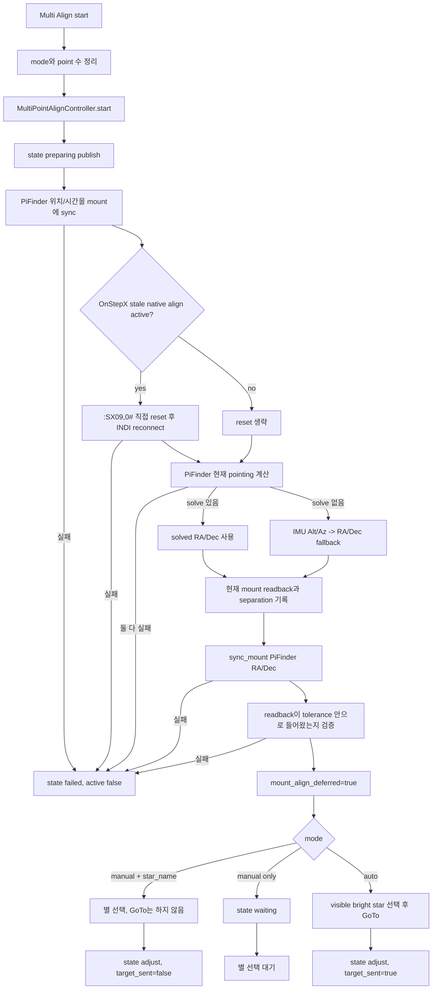
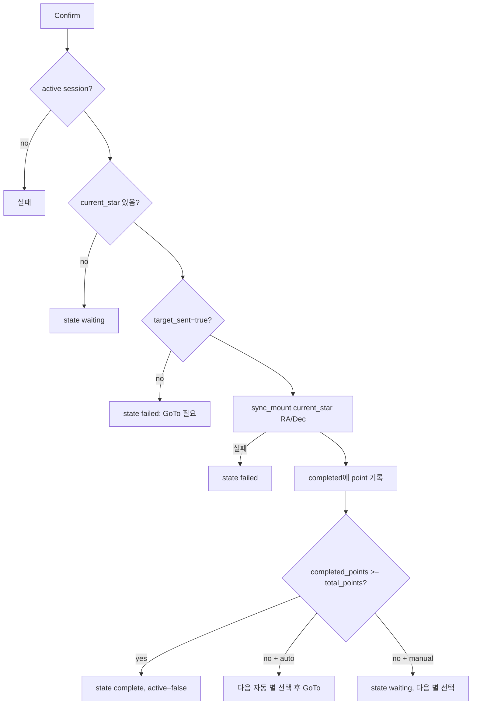

# MF PiFinder INDI Multi Align 소스 흐름

작성 기준: `mf_pifinder` 브랜치, 2026-07-08.

이 문서는 현재 소스 기준의 INDI Multi Align 구조와 Web UI, LCD GUI,
SkySafari 연동 흐름을 정리한다. Multi Align의 핵심 절차는
`python/PiFinder/indi_multipoint_align.py`의 공통 컨트롤러가 관리하고,
Web/LCD/SkySafari는 각자의 입력 방식만 이 공통 흐름에 얹는다.

## 목적

Multi Align은 사용자가 선택한 정렬 기준 별 또는 SkySafari target을 실제
아이피스 중앙에 맞춘 뒤, 그 target 좌표를 mount에 sync해서 이후 GoTo와
좌표계를 더 잘 맞추는 기능이다.

현재 구현의 핵심 원칙은 다음과 같다.

- Multi Align 시작 시 PiFinder의 위치와 시간을 mount에 먼저 맞춘다.
- 시작 직후 PiFinder가 현재 보고 있다고 판단하는 좌표로 mount를 sync하고
  readback을 검증한다.
- Plate solving이 된 상태에서는 PiFinder solved pointing을 기준으로 사용한다.
- Solving이 안 된 상태에서는 IMU 기반 pointing을 fallback으로 사용한다.
- OnStepX native `:A<n>#` align session은 즉시 시작하지 않는다.
- 사용자가 확정하는 좌표는 현재 mount readback이 아니라 가장 최근에 GoTo로
  보낸 target 좌표다.
- 선택한 별이 고도 제한 밖이면 세션을 실패시키지 않고 다음 별 선택 대기로
  돌아간다.
- 실제 GoTo 실패, 위치/시간 sync 실패, PiFinder 좌표 sync 검증 실패는 세션
  실패로 처리한다.

## 관련 소스

```text
python/PiFinder/indi_multipoint_align.py
  Multi Align 공통 session/state controller

python/PiFinder/indi_align.py
  밝은 별 catalog, 별 선택/필터링 helper

python/PiFinder/mountcontrol_indi.py
  위치/시간 sync, stale OnStep align reset, PiFinder 좌표 sync,
  GoTo, confirm, cancel 처리

python/PiFinder/ui/indi.py
  LCD INDI > Setting > Multi Align 화면과 keypad/keyboard 조작

python/PiFinder/server.py
  Web /indi 페이지 렌더링, /indi/multipoint_align route

python/views/indi_mount.html
  Web INDI 페이지의 Multi Align UI와 Ajax 갱신

python/PiFinder/pos_server.py
  SkySafari LX200 GoTo/Align 명령을 Multi Align session으로 라우팅

PiFinder_data/mount_control_status.json
  mount-control process가 publish하는 상태 파일
```

## 공통 컨트롤러

`MultiPointAlignController`가 session lifecycle을 소유한다.
`MountControlIndi`는 하드웨어 I/O를 담당하고, Web/LCD/SkySafari는 queue
command를 보내는 입력 계층으로만 동작한다.

공통 상태:

```text
idle          active session 없음
preparing     위치/시간, stale align reset, PiFinder 좌표 sync 준비
waiting       별 또는 SkySafari target 선택 대기
moving        GoTo 명령 전송 중
adjust        target GoTo 후 사용자가 중앙 조정/확정할 차례
complete      요청한 point 수 완료
cancelled     사용자가 취소
failed        복구 불가능한 동작 실패
```

주요 session 필드:

```text
active
mode                         manual 또는 auto
total_points                 1..9
completed_points
completed
current_star                 현재 target. 별뿐 아니라 SkySafari target도 사용
available_stars
state
message
started_at / updated

location_time_synced
pifinder_sync_source         solve 또는 imu
pifinder_sync_ra
pifinder_sync_dec
pifinder_mount_separation_arcmin
pifinder_mount_synced
pifinder_mount_verified
pifinder_mount_verify_separation_arcmin

mount_align_started          현재 구현에서는 false
mount_align_deferred         OnStepX native align start 지연 여부
onstep_native_align_reset    stale native align reset 수행 여부
auto_reference
```

`current_star` 구조:

```text
name
ra
dec
mag
target_sent                  GoTo가 mount로 실제 전송되었는지 여부
```

Confirm은 `target_sent=true`인 target에서만 가능하다. 즉 별을 선택만 하고
GoTo하지 않은 상태에서 confirm을 누르면 실패한다. 이는 SkySafari Align/Sync와
일반 GoTo target을 구분하기 위한 안전장치다.

## OnStepX native align 처리 정책

OnStep/OnStepX의 `:A<n>#` 명령은 firmware에서 home/frame을 reset한다.
이 동작은 Multi Align 시작 전에 수행한 PiFinder 기준 sync를 깨뜨릴 수 있다.
따라서 현재 PiFinder Multi Align은 OnStepX native `AlignStars.<n>` /
`NewAlignStar.0` 시작을 즉시 호출하지 않고 지연한다.

현재 confirm 단계는 mount native `:A+#` 대신 일반 `sync_mount(target_ra,
target_dec)`를 사용한다. 이 방식은 다음 목적을 가진다.

- PiFinder가 선택한 target 좌표를 기준으로 현재 mount 방향을 맞춘다.
- OnStepX native align 시작으로 인한 home reset을 피한다.
- OnStepX가 아닌 다른 INDI mount에서도 같은 공통 흐름을 유지한다.

향후 OnStepX 내부의 진짜 multi-star pointing model을 만들려면 `:SX09`,
`:SX0A`..`:SX0E` 계열의 alignment model upload 경로를 별도 기능으로 구현하는
것이 맞다.

### stale OnStepX align reset

이전 테스트나 외부 앱에서 OnStepX native align session이 남아 있으면 일반
Sync가 align point accept처럼 소비될 수 있다. Multi Align 시작 시
`mountcontrol_indi.py`는 OnStepX의 `Align Process` 상태를 확인하고, 진행 중인
native align이 감지되면 다음 순서로 정리한다.

```text
1. INDI Web Manager profile 정지
2. OnStep TCP/serial에 직접 LX200 명령 전송
   :A?#        현재 align 상태 조회
   :SX09,0#    align upload/model state reset
   :A?#        reset 후 상태 재확인
3. INDI Web Manager profile 재시작
4. INDI driver 재연결
```

정상 reset 후 OnStep direct `:A?#` 응답은 `900#` 형식으로 확인된다.

## 시작 흐름

공통 시작점은 `MountControlIndi.start_multipoint_align()`이다.



시작 command에 `star_name`이 있더라도 즉시 GoTo하지 않는다. Web UI의 Start가
페이지 위치를 유지하고 target만 설정할 수 있도록 하기 위함이다. 실제 이동은
별 선택 화면이나 Web의 별 선택 action에서 `goto=true`로 별도 요청한다.

## Target 선택과 GoTo

### 수동 별 선택

`select_multipoint_align_star(star_name, goto=False|True)`

```text
1. active session 확인
2. get_align_star(star_name)로 catalog 별 검색
3. current_star에 name/ra/dec/mag 저장, target_sent=false
4. goto=false이면 state=adjust로 전환
5. goto=true이면 _align_goto_current_star() 실행
```

### SkySafari target 선택

Multi Align active 중 SkySafari GoTo는 일반 PushTo 화면으로 새지 않고
`multipoint_align_goto_target`으로 라우팅된다.

```text
1. SkySafari :Sr/:Sd target 저장
2. :MS#가 들어오면 select_multipoint_align_target(..., goto=True)
3. current_star 이름은 SkySafari Target N
4. GoTo 성공 시 target_sent=true
```

### GoTo 수행

`_align_goto_current_star(session)`

```text
1. current_star 확인
2. target RA/Dec를 현재 위치/시간 기준 Alt/Az로 변환
3. 고도 < 20도 또는 고도 > 80도이면 current_star를 지우고 state=waiting
4. 제한 안에 있으면 goto_target(ra, dec, refine_after_goto=False)
5. INDI GoTo target accept/readback 검증
6. 성공 시 target_sent=true, state=adjust
7. GoTo 거부/실패 시 current_star를 지우고 state=waiting
```

고도 제한 밖 target과 GoTo 거부/실패는 장비 오류가 아니므로 세션 실패로
처리하지 않는다. 세션은 active 상태를 유지하고, 사용자는 LCD/Web 또는
SkySafari에서 다른 별을 다시 선택할 수 있다.

## Confirm 흐름

`confirm_multipoint_align(source)`



기록되는 completed point:

```text
name
ra
dec
source                     web, lcd/ui, skysafari 등
mount_align_started        false
mount_align_command        sync
confirmed_at
```

## Web UI 흐름

`/indi/multipoint_align` route가 다음 action을 처리한다.

```text
align_action=start
  mode, points, optional align_star를 queue에 넣는다.
  manual + align_star는 별 선택만 수행하고 GoTo하지 않는다.

align_action=select_star
  선택한 별을 current_star로 설정하고 goto=true로 GoTo한다.

align_action=confirm
  current_star가 target_sent=true이면 sync로 point를 확정한다.

align_action=cancel
  session을 cancelled로 닫는다.
```

Web은 Ajax 갱신으로 `mount_control_status.json`의 `multipoint_align` 필드를
표시한다. Web에서 Start 후 화면이 상단으로 튀지 않도록 action은 Ajax로
처리된다.

## LCD UI 흐름

`UIIndiMultiPointAlign`은 공통 session 상태를 읽어 다음 stage를 표시한다.

```text
points      정렬 point 수 선택
mode        Manual / Auto 선택
preparing   위치/시간 sync, stale align reset, PiFinder sync 대기
star        Manual 별 선택 또는 Auto 추천 별 표시
guide       선택 target GoTo 후 수동 중앙 조정
```

LCD 조작 요약:

- Points 화면: `+/-` 또는 `1..9`로 point 수 선택
- Mode 화면: Manual 또는 Auto 선택
- Manual Star 화면: 별 목록에서 오른쪽/사각 버튼으로 선택 및 GoTo
- Guide 화면: `789 / 4 6 / 123` 방향 이동, 손을 떼면 정지
- Guide 화면: 사각 버튼으로 Confirm
- 왼쪽 버튼:
  - Guide 화면에서 Manual mode이면 `multipoint_align_clear_target`을 보내 현재
    target만 지우고 Manual Star 화면으로 돌아간다. 이때 session은 유지된다.
  - Manual Star/Preparing 화면에서 Manual/Auto 선택 화면으로 돌아갈 때 session을 cancel한다.
  - Manual/Auto 선택 화면에서 Points 화면으로 돌아갈 때는 active session이 없어야 한다.

Auto mode는 solved pointing을 우선 사용하며, solved pointing이 없으면 현재
코드에서는 IMU fallback을 사용할 수 있다. 실제 관측 운용에서는 solve 이후
Auto mode를 쓰는 것이 더 안전하다.

## SkySafari 연동

`pos_server.py`는 Multi Align active 상태를 `mount_control_status.json`에서
확인한다.

```text
Multi Align inactive:
  SkySafari GoTo/Sync는 일반 PiFinder/INDI 설정에 따라 처리된다.

Multi Align active:
  SkySafari GoTo(:Sr/:Sd/:MS)는 multipoint_align_goto_target으로 라우팅된다.
  SkySafari Align/Sync(:CM)는 multipoint_align_confirm으로 라우팅된다.
```

따라서 Manual mode에서 SkySafari로 별을 선택하고 GoTo한 뒤 아이피스 중앙에
수동 조정하고 SkySafari Align/Sync를 누르면, PiFinder는 그 target을 Multi
Align point로 확정한다.

## 실제 장비 확인 결과

2026-07-08 현재 OnStepX 실장비와 단위 테스트로 확인한 내용:

- 이전 OnStep native align 상태가 남아 있을 때 `:SX09,0#` 직접 reset으로
  `:A?# -> 900#` 상태를 확인했다.
- Multi Align 시작 시 `mount_align_started=false`,
  `mount_align_deferred=true`로 기록된다.
- PiFinder 기준 sync readback 검증은 `0.0 arcmin`으로 통과했다.
- Vega 선택/GoTo가 실제 장비 좌표 변경으로 이어졌다.
- Vega confirm 후 `completed_points=1`,
  `mount_align_command=sync`로 기록되었다.
- Altair가 현재 위치/시간에서 고도 20도 아래로 계산될 때 세션은 failed가
  아니라 `waiting`으로 돌아갔다.
- GoTo 거부/실패 또는 고도 제한 밖 target은 `current_star`를 지우고
  `waiting`으로 돌아가며, session은 active 상태를 유지한다.
- LCD Guide 화면에서 왼쪽 버튼을 누르면 manual mode에서는 target만 지우고
  별 선택 화면으로 돌아간다. 취소는 Manual/Auto 선택 화면으로 돌아갈 때만 수행한다.
- Cancel 후 `active=false`, `state=cancelled`로 정리되었다.

## 테스트

관련 단위 테스트:

```text
python/tests/test_mountcontrol_indi.py
python/tests/test_pos_server.py
python/tests/test_pointing_coordinate_service.py
```

확인 명령:

```bash
python -m pytest \
  python/tests/test_pos_server.py \
  python/tests/test_mountcontrol_indi.py \
  python/tests/test_pointing_coordinate_service.py
```

2026-07-08 기준 결과:

```text
110 passed
```
