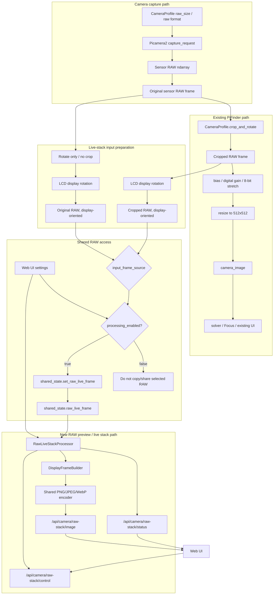
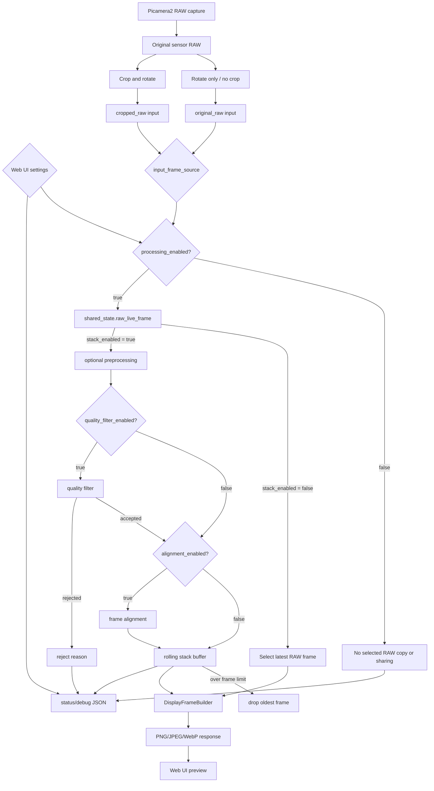

# MF PiFinder RAW Live Stack Plan

Date: 2026-07-08

This document describes the design and staged implementation plan for a RAW
camera live-stack feature. The feature will read PiFinder's RAW camera frames,
process them in a separate module, and expose a more detailed star image in the
Web UI.

The main goal is to keep the existing plate-solving, Focus, Preview, and SQM
paths stable. The work should be implemented in small stages so each stage can
be tested and debugged independently.

## Goals

- Use the Pi camera backend RAW capture path regardless of camera type.
- Select the direct processing input from Web UI settings.
  - `original_raw`: use the uncropped RAW frame, but rotate it to match the
    existing display orientation.
  - `cropped_raw`: use the existing profile crop/rotate result to reduce
    processing load and memory use.
- The new module needs a shared access point for the selected RAW frame. This
  document uses `shared_state.raw_live_frame()` /
  `shared_state.set_raw_live_frame()` as temporary names.
- Leave the existing 512x512 processed solver image path unchanged.
- Show a server-generated display preview from the latest single selected RAW
  frame as the default Web UI output.
- Apply stretch, Bayer averaging, live stacking, alignment, and rejection
  filters only when the corresponding Web UI options are enabled.
- Allow each processing option to be enabled, stopped, and reset independently.
- Run on both Pi 4 and Pi 5 without excessive CPU or memory pressure.
- Expose enough debug data to inspect RAW input, processed preview, stack state,
  and reject reasons.

## Current PiFinder RAW Flow

The Pi camera backend currently handles RAW frames as follows:

```text
Picamera2 raw capture request
  -> acquire sensor RAW with the camera profile raw_size / raw format
  -> raw ndarray, viewed as uint16
  -> current code does not store this original RAW frame in shared state
  -> CameraProfile.crop_and_rotate()
  -> bias/digital gain/8-bit stretch
  -> PIL image resize(512, 512)
  -> camera_image shared PIL frame
  -> existing solver/UI path
```

Related files:

- `python/PiFinder/camera_pi.py`
  - `CameraPI.capture()`
  - RAW capture, profile crop/rotate
  - needs a shared point for the frame selected from pre-crop original RAW or
    crop/rotate RAW
  - existing processed image resize to 512x512
- `python/PiFinder/sqm/camera_profiles.py`
  - per-sensor raw format, raw size, crop, rotation, bit depth, bias offset
- `python/PiFinder/state.py`
  - needs selected RAW frame getter/setter for the new module
- `python/PiFinder/api_extensions.py`
  - `/api/camera/raw`
- `python/PiFinder/ui/preview.py`
  - LCD Preview RAW display helper

Current RAW capture settings, new module input candidates, and existing crop results:

| Camera | `original_raw` input | `cropped_raw` input | Existing processed output |
| --- | ---: | ---: | ---: |
| IMX296 | 1456x1088 | 1088x1088 | 512x512 |
| IMX462 / IMX290 | 1920x1080 | 980x980 | 512x512 |
| HQ / IMX477 | 2028x1520 | about 1516x1520 | 512x512 |

Important notes:

- The new module uses the RAW capture path, not the existing 512x512 processed
  image.
- `original_raw` is not cropped, but it applies the same orientation correction
  as `CameraProfile.rotation_90` so it matches the existing display direction.
- `cropped_raw` uses the existing profile crop/rotate result and therefore
  reduces the number of pixels to process.
- The selected RAW frame also applies the same `camera_rotation` or
  `screen_direction` display rotation used by LCD Focus/Preview, so Web LiveCam
  and the LCD use the same direction.
- For example, IMX462 is 1920x1080 with `original_raw` and 980x980 with
  `cropped_raw`.
- The RAW sharing point should carry metadata such as source, shape, rotation,
  exposure time, gain, timestamp, and frame id.
- There is no dedicated observation-friendly original RAW stretch API yet.

## Proposed Architecture

The new feature should be a separate consumer of the uncropped original RAW
frame produced by the camera capture path. The existing crop/rotate and 512x512
processed image path used by the solver, Focus, Preview, and existing UI should
remain unchanged.

Architecture principles:

- CameraPI continues to perform Picamera2 RAW capture.
- The sensor RAW ndarray received from Picamera2 is the common reference frame
  for the new module.
- Two paths branch from the same sensor RAW frame.
  - Existing PiFinder path: crop/rotate, then bias/digital gain/stretch/resize
    to the 512x512 processed image.
  - New RAW processing path: only when `processing_enabled=true`, choose
    `original_raw` or `cropped_raw` from the Web UI `input_frame_source` setting,
    copy that selected frame into a separate shared-state entry such as
    `shared_state.raw_live_frame()`, and convert it into a Web-display frame on
    the server.
- When `original_raw` is selected, rotate the full-frame RAW without cropping so
  it matches the existing display direction.
- The selected RAW array is used only for server-side processing and debug
  statistics; it is not sent directly to Web UI.
- If `processing_enabled=false`, block the pipeline at
  `shared_state.set_raw_live_frame()` so RAW copies, shared-state
  storage, downstream image processing, and encoding do not run.
- The camera capture loop also skips the LiveCam publish helper when
  `processing_enabled=false`, so this feature does not keep an extra pre-crop
  original RAW reference alive while disabled.
- The first implementation must not change camera capture timing or the solver
  input image.



In this architecture, the new module input point is the RAW frame selected by
Web UI. `original_raw` is a full-frame RAW rotated to the same display direction
without cropping, and `cropped_raw` is the existing crop/rotate result.

Recommended file layout:

```text
python/PiFinder/livecam_config.py
  lightweight settings helpers
  no numpy/Pillow import

python/PiFinder/raw_live_stack.py
  RawLiveStackProcessor
  RawFrameInfo
  StackState
  stretch helpers
  frame quality helpers
  DisplayFrameBuilder
  display frame encoder helpers

python/PiFinder/server.py or api_extensions.py
  /api/camera/raw-stack/status
  /api/camera/raw-stack/image
  /api/camera/raw-stack/control

python/views/livecam.html
  LiveCam Web UI
```

Start without a separate process. The first implementation can run on Web
requests or a short background update path. If CPU load and frame latency become
visible, split it into a dedicated process later.

## Output Policy And Web UI Options

The default behavior is not live stacking. When the Web UI setting
`processing_enabled` is enabled, the camera capture loop copies the RAW frame
selected by `input_frame_source` into `shared_state.raw_live_frame()`. Only after
that does the module process the latest selected RAW frame on the server and
convert it into a browser-displayable compressed image. When `processing_enabled`
is disabled, the pipeline is blocked at the `shared_state.set_raw_live_frame()`
call site. The new module does not copy RAW, store it in shared state, stretch,
update the stack, or encode images; it returns status only.

The original RAW array is not sent to Web UI. Minimal tone mapping, resize,
8-bit conversion, and image encoding are still required for browser display, but
the stack accumulator is used only when `stack_enabled` is enabled.

Transfer policy:

- Server-side processing input: selected RAW ndarray, either `original_raw` or
  `cropped_raw`, shared only when `processing_enabled=true`.
- Server-side processing result: latest selected RAW preview or stack accumulator.
- Web API response: display PNG/JPEG/WebP image plus JSON status.
- Original RAW download or raw/float stack download is out of scope for the
  first implementation.
- If `processing_enabled=false`, the image API does not create a new image. Use
  one consistent policy: `204 No Content` or a small dark placeholder.
- If `processing_enabled=false`, do not reuse an older
  `shared_state.raw_live_frame()` frame. Report disabled/no-frame in status.

Default output:

```text
latest raw_live_frame()
  -> selected display source = latest selected RAW
  -> DisplayFrameBuilder
  -> Web UI selected RAW preview
```

When stack-related options are enabled in the Web UI, the selected processing
steps are applied to the same RAW input.

```text
latest raw_live_frame()
  -> optional preprocessing
  -> optional quality filter
  -> optional alignment
  -> stack accumulator
  -> selected display source = stack accumulator
  -> DisplayFrameBuilder
  -> Web UI stacked preview
```

`DisplayFrameBuilder` is the shared downstream conversion layer used by both the
latest selected RAW preview and stacked preview.

```text
selected display source
  -> tone mapping / percentile stretch
  -> optional Bayer 2x2 average or mono conversion
  -> resize to display_size
  -> uint8 conversion
  -> PNG/JPEG/WebP encoding
  -> /api/camera/raw-stack/image response
```

Full output selection flow by user settings:



Initial defaults:

| Option | Default | Meaning |
| --- | --- | --- |
| `processing_enabled` | `false` | Fully disables RAW preview/stack processing starting at selected RAW sharing |
| `input_frame_source` | `original_raw` | Choose full-frame RAW or cropped RAW as Processor input |
| `output_source` | `latest_selected_raw` | Build a display preview from the latest selected RAW frame |
| `stack_enabled` | `false` | Live accumulation disabled |
| `stack_mode` | `mean` | Default accumulation method once stacking is enabled |
| `stack_frame_limit` | `10` | Rolling stack limit; only the latest N accepted frames are kept |
| `preview_mode` | `raw_display` | Convert camera RAW into one displayable preview |
| `color_mode` | `theme` | `theme` tints the final luminance image to the current Web theme; `color` keeps the final RGB preview for Bayer RAW cameras |
| `web_image_format` | `jpeg` | Display image format sent to the browser |
| `display_size` | `768` | Server-side display size before transfer |

`alignment_enabled` and `quality_filter_enabled` are candidate options for
Stage 3/4. The first implementation keeps them as follow-up work rather than
persisted settings.

The stack is not an infinite accumulator. Each new RAW frame is added to the
stack, and the oldest frame is dropped once `stack_frame_limit` is exceeded.
Because night use often involves long exposure times already, the frame limit is
the primary stability control instead of a separate sampling interval. This
rolling window reduces whiteout/trailing when the telescope is moved or focus is
adjusted. Future alignment/tracking-aware stacking should build on the same
rolling window behavior.

Theme/Color handling is applied only during the final display conversion after
stacking. The stack buffer and mean/sum/max accumulator must not contain a theme
tint; they keep the selected RAW input's base brightness/color data.

Therefore Stage 1 validates stable previews for both `original_raw` and
`cropped_raw`, and Stage 2 adds the ability to switch the output source to a
stacked preview from the Web UI.

The initial Web UI should require `processing_enabled` to be explicitly enabled
before the selected RAW frame is shared and preview images are generated. This
top-level switch prevents unnecessary RAW copies, shared-state memory use, and
CPU use when the Web UI is open but image processing is not needed. Use
`input_frame_source=cropped_raw` when processing load needs to be reduced.

## Library Survey

`python/requirements.txt` already includes `numpy`, `pillow`, and `scipy`.
The first implementation should use only these existing dependencies.

| Library | Already installed | Use | Decision |
| --- | --- | --- | --- |
| NumPy | yes | RAW ndarray handling, float accumulator, mean/max/sigma statistics | Stage 1 required |
| Pillow | yes | Server-side display resize and PNG/JPEG/WebP encoding | Stage 1 required |
| SciPy | yes | `ndimage.shift`, blur/quality helpers | Stage 2/3 candidate |
| OpenCV | no | `accumulate`, `phaseCorrelate`, faster image registration | optional later |
| scikit-image | no | `phase_cross_correlation` subpixel registration | optional later |
| ccdproc / astropy | no | astronomy image combine, sigma clipping | offline/later candidate |

Findings from official documentation:

- NumPy `ndarray.astype()` may allocate a new array when casting. The stacker
  should avoid unnecessary copies by using explicit accumulator dtypes and
  `astype(np.float32, copy=False)` where appropriate.
- SciPy `ndimage.shift()` can shift arrays by subpixel amounts, but interpolation
  order and boundary mode affect CPU cost and edge artifacts.
- OpenCV `phaseCorrelate()` detects translational shifts between images, and the
  `accumulate*` functions are designed for image accumulation. OpenCV would be a
  new dependency.
- scikit-image `phase_cross_correlation()` is useful for registration shift
  estimation, but it is also a new dependency.
- ccdproc `Combiner` is useful for astronomy image combine workflows, but it is
  heavier than needed for the first real-time Pi Web preview target.

References:

- NumPy ndarray astype: https://numpy.org/doc/stable/reference/generated/numpy.ndarray.astype.html
- SciPy ndimage shift: https://docs.scipy.org/doc/scipy/reference/generated/scipy.ndimage.shift.html
- SciPy gaussian_filter: https://docs.scipy.org/doc/scipy/reference/generated/scipy.ndimage.gaussian_filter.html
- OpenCV motion analysis / phaseCorrelate / accumulate: https://docs.opencv.org/4.x/d7/df3/group__imgproc__motion.html
- scikit-image registration: https://scikit-image.org/docs/stable/api/skimage.registration.html
- ccdproc Combiner: https://ccdproc.readthedocs.io/en/latest/api/ccdproc.Combiner.html

## Staged Implementation Plan

### Stage 0. RAW Input And Status

Goal:

- Show RAW input size, dtype, min/max, percentile values, and frame age in Web UI.
- Do not implement stacking yet.

Work:

- Define `RawFrameInfo`.
- When `processing_enabled=true`, have the camera loop share the RAW frame
  selected by `input_frame_source` through `shared_state.raw_live_frame()`.
- Calculate source/shape/dtype/rotation/statistics from
  `shared_state.raw_live_frame()`.
- Add a draft `/api/camera/raw-stack/status` endpoint.
- Add a read-only Web UI status panel.

Tests:

- Confirm IMX462 reports 1920x1080 with `input_frame_source=original_raw`.
- Confirm IMX462 reports 980x980 with `input_frame_source=cropped_raw`.
- Confirm IMX296 reports 1456x1088 with `original_raw` and 1088x1088 with
  `cropped_raw`.
- Confirm `original_raw` is displayed in the same orientation as the existing
  crop/rotate path.
- Confirm disabled/no-frame status is reported when `processing_enabled=false`.
- Confirm no-camera or no-RAW state is handled safely.
- Confirm existing `/api/camera/raw`, solver, and Focus screen behavior remains unchanged.

### Stage 1. RAW Stretch Preview

Goal:

- Display one selected RAW frame as the default Web UI output only when
  `processing_enabled` is enabled.
- The default source is the latest single selected RAW frame, not a stack.
- Validate stretch and Bayer/mono handling before live stacking.

Pipeline:

```text
selected raw uint16
  -> selected display source = latest selected RAW
  -> DisplayFrameBuilder
  -> uint8 PNG/JPEG/WebP response
```

Candidate settings:

- `input_frame_source`: original_raw, cropped_raw
- `output_source`: latest_selected_raw, stack
- `preview_mode`: raw_display, stretched, bayer_2x2_average
- `low_percentile`: default 1.0
- `high_percentile`: default 99.5
- `display_size`: default 768
- `color_mode`: default Theme; use Color to keep the RGB preview for Bayer cameras
- `web_image_format`: default JPEG; use PNG when lossless debugging is needed

Tests:

- Background should not collapse to black when no stars are visible.
- Saturated or flat indoor frames should be handled gracefully.
- Changing `input_frame_source` should change preview shape/FOV and reset the
  stack accumulator.
- Selecting `cropped_raw` should reduce CPU and memory load on Pi4.
- With `color_mode=theme`, the Red Night theme should tint the preview red.
- With `color_mode=color`, Bayer cameras should render an RGB preview while mono
  cameras keep the existing luminance display.

### Stage 2. Live Stack Without Alignment

Goal:

- Stack multiple RAW frames to make stars more visible when movement is small.
- Start with mean/sum/max stacking and no alignment.
- Accumulate and output the stacked result only when both `processing_enabled`
  and `stack_enabled` are enabled in Web UI.

State:

```text
stack_enabled
processing_enabled
input_frame_source
output_source
frame_count
accepted_count
rejected_count
stack_mode
frame_limit
latest_frame_age
raw_shape
last_error
```

Stack modes:

- `mean`: default once stacking is enabled; useful for noise reduction.
- `sum`: emphasizes faint stars; requires a float32 accumulator.
- `max`: useful for trails and star visibility, but hot-pixel sensitive.

Controls:

- Stack On
- Stack Off
- Reset
- Save current stack PNG
- Save current raw/float stack data later, separate from the preview response
- Switching Processing Off or Stack Off resets the stack accumulator so unused
  float buffers are not retained.

Tests:

- Frame count increases while running.
- Frame count stops when stopped.
- Reset clears the accumulator.
- Pi4 CPU usage remains acceptable.

### Stage 3. Simple Frame Alignment

Goal:

- Reduce star smearing caused by drift, hand movement, or mount movement.
- Start with translation only. Do not handle rotation or scale initially.

Candidate methods:

1. Star-centroid integer shift
   - Detect the brightest star candidates and compare displacement to a reference.
   - No new dependencies.
   - Can fail with few stars or hot pixels.

2. SciPy shift-based subpixel apply
   - Use `scipy.ndimage.shift()` after calculating a shift.
   - Keep interpolation and edge behavior configurable.

3. OpenCV/scikit-image phase correlation
   - Consider only if accuracy or speed requires it.
   - First verify Pi4 install size, wheel availability, and CPU cost.

Recommended rollout:

- Stage 3A: calculate and display alignment confidence only.
- Stage 3B: apply integer shifts only when confidence is high.
- Stage 3C: add subpixel shifts later.

Tests:

- A fixed star field reports near-zero shift.
- A small manual motion reports the expected shift direction.
- Low-confidence frames are rejected rather than stacked.

### Stage 4. Quality Filter

Goal:

- Reject frames that would damage the stack.

Reject candidates:

- No RAW frame.
- dtype or shape changed.
- Exposure/gain changed or camera buffer is flushing.
- Saturated fraction is too high.
- Background percentile span is too low.
- Too few star candidates.
- Alignment confidence is low.
- Motion blur or star trails are suspected.

Tests:

- Moving the camera by hand increases reject count.
- Bright indoor frames trigger saturation handling.
- Exposure changes reset the stack or reject affected frames.

### Stage 5. Web UI Integration

Initial location:

- Add a `LiveCam` menu item between `Tools` and `Logs` in the top Web UI menu.
- Use `/livecam` for the page route and `/api/camera/raw-stack/*` for API routes.
- Later, move it to `Observations` or a dedicated `Camera` tab if the workflow
  becomes central.

UI layout:

- Preview image
- Processing On / Off
- Input frame source: original RAW / cropped RAW
- Output source: latest selected RAW preview / stacked preview
- Stack On / Off / Reset
- Reset Defaults
- Stack mode select
- Stack Frames (Max 60)
- Preview header controls: Color mode, Image format, Download
- Frame count / accepted / rejected
- Raw shape / dtype / exposure / gain
- Stretch low/high controls
- Download image
- Last reject reason

Web transfer format:

- `/api/camera/raw-stack/status`: returns JSON state and statistics only.
- `/api/camera/raw-stack/image`: returns a server-converted display PNG/JPEG/WebP
  image, not the original RAW array.
- `/api/camera/raw-stack/download`: downloads the current stack/latest selected
  result. Downloads always force `color_mode=color`, even when the Web preview is
  using `color_mode=theme`. If the preview format is WebP, the downloaded file is
  converted to PNG for compatibility and preservation.
- `/api/camera/raw-stack/control`: saves settings, resets the stack, and restores
  defaults.
- Display images are resized on the server before transfer.
- If `processing_enabled=false`, the image endpoint follows the no-content or
  placeholder policy without heavy processing.
- If original RAW save/download is needed later, add a separate download API
  rather than overloading the preview API.

Red Night theme:

- Buttons and labels should follow the theme.
- With `color_mode=theme`, the preview image should be tinted to the theme color.
- With `color_mode=color`, Bayer cameras should render an RGB preview and mono
  RAW cameras should keep the existing grayscale/brightness display.
- Downloaded images should use `color_mode=color` regardless of the night theme.
- Background around the preview should stay in the red-night palette.

### Stage 6. Saving And Debugging

Candidate output path:

```text
PiFinder_data/captures/live_stack/
  stack_YYYYmmdd_HHMMSS.png
  stack_YYYYmmdd_HHMMSS.json
```

Debug JSON fields:

- camera type
- raw shape
- bit depth
- exposure/gain
- frame count
- accepted/rejected count
- stack mode
- stretch percentiles
- alignment method
- alignment confidence summary

## Out Of Scope For The First Implementation

- Do not feed the live stack image into the existing solver.
- Do not change the existing solver input image.
- Do not send original RAW ndarrays directly to Web UI.
- Do not target debayered color output.
- Do not build a complex dark/bias calibration library yet.
- Do not add OpenCV, scikit-image, ccdproc, or astropy as required dependencies yet.
- Do not change long-exposure or auto-exposure policy.

## Draft Data Model

```python
@dataclass
class RawFrameInfo:
    source: str
    shape: tuple[int, int]
    dtype: str
    rotation_90: int
    min_value: float
    max_value: float
    p01: float
    p50: float
    p995: float
    camera_type: str | None = None
    exposure_us: float | None = None
    gain: float | None = None
    timestamp: float | None = None
    frame_id: int | None = None


@dataclass
class StackState:
    processing_enabled: bool
    input_frame_source: str
    stack_enabled: bool
    output_source: str
    mode: str
    frame_limit: int
    frame_count: int
    accepted_count: int
    rejected_count: int
    raw_shape: tuple[int, int] | None
    display_shape: tuple[int, int] | None
    web_image_format: str
    last_error: str | None
    last_reject_reason: str | None
```

## Risks

- `shared_state.raw_live_frame()` can involve large ndarray copies through the
  multiprocessing manager.
- Processing or transferring full RAW frames on every Web refresh may cause CPU
  spikes and network bottlenecks on Pi4.
- Send only server-resized and compressed display frames to Web UI.
- When `processing_enabled=false`, do not run `set_raw_live_frame()`; avoid
  selected RAW copies, shared-state storage, conversion, and encoding.
- Status/control APIs in the `processing_enabled=false` state return a
  lightweight disabled status instead of creating a `RawLiveStackProcessor`.
- Import the LiveCam processing module lazily so the disabled path has a lower
  baseline memory cost.
- `original_raw` is full-frame and may be expensive on Pi4. Use `cropped_raw`
  as the first load-reduction option during observations.
- When `input_frame_source` changes, reset the stack accumulator because shape
  and field of view can change.
- Rotate-only full-frame RAW can affect Bayer-pattern interpretation, so source
  and rotation metadata must travel with the frame.
- IMX462/IMX290 are reported as Bayer sensors, but the real observed data may
  behave like mono data; 2x2 averaging may be better for preview quality.
- If exposure/gain changes during stacking, frame brightness becomes inconsistent.
- Without alignment, mount movement smears stars.
- Browser refresh and camera capture run at different rates.

## Initial Performance Targets

- Stage 1 RAW preview generation: under 1 second on Pi4.
- Stage 2 mean stack update: target under 300 ms per accepted frame.
- Web UI refresh: start at 1 second or slower.
- Web UI image response: keep to a 768 px display frame by default.
- Keep only one float32 accumulator plus count/metadata by default.
- Do not store full RAW history by default.
- If `original_raw` is too slow on Pi4, use `cropped_raw` as the default
  performance fallback.

## Test Checklist

Verified by automated tests/source checks:

- [x] With `processing_enabled=false`, the LiveCam publish helper does not update
      the shared frame.
- [x] `input_frame_source=original_raw` uses the original RAW frame without crop
      and applies the camera profile rotation.
- [x] `input_frame_source=cropped_raw` uses the existing cropped/rotated camera
      frame.
- [x] `display_rotation_degrees` can align the Web LiveCam image orientation with
      the LCD image orientation.
- [x] The default output is a display preview generated from the latest selected
      RAW frame, not a stack.
- [x] The Web image renderer returns server-converted PNG/JPEG/WebP display
      images, not original RAW arrays.
- [x] Rolling stack keeps only the latest `stack_frame_limit` frames.
- [x] `mean` stack uses the current rolling-window mean instead of an unbounded
      cumulative mean.
- [x] Theme tint is applied only during final display conversion, after stack
      accumulation.
- [x] Download rendering forces `color_mode=color` even when the Web preview uses
      `color_mode=theme`.
- [x] Download format becomes PNG when the preview format is WebP.
- [x] `Reset Defaults` saves LiveCam defaults and clears stack/shared RAW frame
      state.
- [x] `python -m py_compile python/PiFinder/livecam_config.py python/PiFinder/raw_live_stack.py python/PiFinder/api_extensions.py` passes.
- [x] `pytest python/tests/test_raw_live_stack.py python/tests/test_api_extensions.py -q` passes.
- [x] `git diff --check` passes.
- [x] The `pifinder` service was restarted and confirmed `active`.

Implemented but still needs field/browser verification:

- [ ] In the LiveCam Web UI, confirm that `Color Mode`, `Image Format`, and
      `Download` are placed correctly at the top right of the Preview panel.
- [ ] Confirm that `Stack Frames (Max 60)` input and save behavior work from the
      Web UI.
- [ ] Confirm that `Stack On/Off/Reset` updates the real Web UI state and preview
      as expected.
- [ ] With `input_frame_source=original_raw`, confirm that IMX462 raw shape is
      shown as 1920x1080 in the Web UI.
- [ ] With `input_frame_source=cropped_raw`, confirm that IMX462 raw shape is
      shown as the cropped frame in the Web UI.
- [ ] Confirm that `color_mode=theme` shows the Red Night preview in the red
      night palette in a real browser.
- [ ] Confirm that `color_mode=color` downloads RGB images for Bayer cameras
      without theme tint.
- [ ] Confirm CPU/memory use and service stability on Pi4 during extended
      LiveCam use.

Not implemented/follow-up:

- [ ] Full regression check for the default PiFinder solver and `/api/camera/raw`.
- [ ] Stack reset or reject policy for exposure/gain changes.
- [ ] Frame alignment.
- [ ] Quality filter and reject-count policy.
- [ ] Original RAW or raw/float stack download/save.

## Recommended Development Order

1. Add `RawLiveStackProcessor` skeleton and status-only API.
2. Add a read-only RAW status panel to Web UI.
3. Add `processing_enabled` in front of the camera selected RAW sharing step and
   implement status-only behavior first.
4. Add the `input_frame_source` setting and the `shared_state.raw_live_frame()`
   sharing point.
5. Validate `original_raw` rotate-only orientation and `cropped_raw` shape/FOV.
6. Add a single-frame RAW preview API for the default output, returning a
   server-converted display image.
7. Add output source and stack option status to Web UI.
8. Add mean stack accumulator.
9. Add Stack On/Off/Reset controls and current preview/download controls.
10. Add reject reasons and debug metadata.
11. Experiment with alignment confidence display only.
12. Enable alignment only after confidence and performance are verified.
