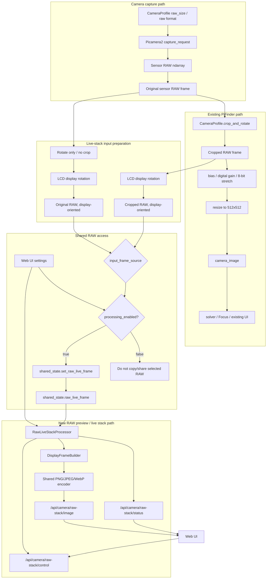
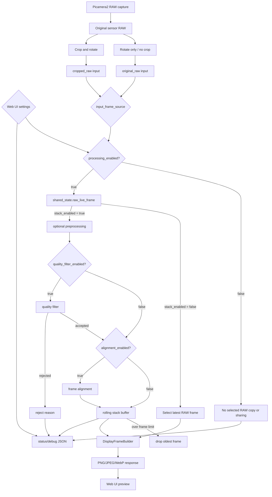

# MF PiFinder RAW Live Stack Plan

작성일: 2026-07-08

이 문서는 PiFinder가 촬영하는 RAW 카메라 이미지를 별도 처리 모듈에서 받아,
Web UI에서 더 자세한 별사진을 볼 수 있게 하는 Live Stack 기능의 설계와 단계별
작업 계획을 정리한다.

목표는 기존 plate solving, Focus, Preview, SQM 동작을 흔들지 않고 RAW 처리
기능을 독립적으로 추가하는 것이다. 처음부터 완성형 stacking을 구현하지 않고,
각 단계가 독립적으로 확인될 수 있도록 작은 단위로 나눈다.

## 목표

- 카메라 종류와 관계없이 Pi camera backend의 RAW capture 결과를 사용한다.
- 처리 모듈의 직접 입력은 Web UI 설정에 따라 선택한다.
  - `original_raw`: crop 전 원본 RAW를 사용하되, 기존 화면과 같은 방향이 되도록
    rotate만 적용한다.
  - `cropped_raw`: 기존 profile crop/rotate 결과를 사용해 처리 부하와 메모리 사용을
    줄인다.
- 새 모듈에는 선택된 RAW frame을 공유하는 지점이 필요하다. 이 문서에서는 임시 이름으로
  `shared_state.raw_live_frame()` / `shared_state.set_raw_live_frame()`을 사용한다.
- 기존 PiFinder solver가 쓰는 512x512 processed image 흐름은 그대로 둔다.
- 기본 Web UI 출력은 최신 단일 선택 RAW 프레임에서 서버가 생성한 표시용 preview로 둔다.
- Web UI 설정에 따라 stretch, Bayer 평균, live stack, alignment, reject filter를
  단계적으로 적용한다.
- 단계별 처리 옵션을 켜고 끌 수 있어야 한다.
- Pi 4와 Pi 5 모두에서 과도한 CPU/메모리 부하 없이 동작해야 한다.
- 디버깅을 위해 입력 RAW, 처리 preview, stack 상태, reject 사유를 확인할 수 있어야 한다.

## 현재 PiFinder RAW 흐름

현재 Pi camera backend는 다음 순서로 RAW를 다룬다.

```text
Picamera2 raw capture request
  -> camera profile의 raw_size / raw format으로 sensor RAW 획득
  -> raw ndarray 생성, dtype은 uint16 view
  -> 현재 코드는 여기서 원본 RAW를 공유 상태로 저장하지 않음
  -> CameraProfile.crop_and_rotate()
  -> bias/digital gain/8-bit stretch
  -> PIL image resize(512, 512)
  -> camera_image shared PIL frame
  -> solver/UI 기존 흐름
```

관련 파일:

- `python/PiFinder/camera_pi.py`
  - `CameraPI.capture()`
  - RAW capture, profile crop/rotate
  - 새 모듈을 위해 crop 전 원본 RAW와 crop/rotate RAW 중 선택한 프레임을
    공유하는 지점 추가 필요
  - 기존 processed image를 512x512로 resize
- `python/PiFinder/sqm/camera_profiles.py`
  - sensor별 raw format, raw size, crop, rotation, bit depth, bias offset
- `python/PiFinder/state.py`
  - 새 모듈용 선택 RAW frame getter/setter 추가 필요
- `python/PiFinder/api_extensions.py`
  - `/api/camera/raw`
- `python/PiFinder/ui/preview.py`
  - LCD Preview에서 RAW display helper 사용

센서별 RAW capture 설정, 새 모듈 입력 후보, 기존 처리 경로의 crop 결과:

| Camera | `original_raw` 입력 | `cropped_raw` 입력 | 기존 processed output |
| --- | ---: | ---: | ---: |
| IMX296 | 1456x1088 | 1088x1088 | 512x512 |
| IMX462 / IMX290 | 1920x1080 | 980x980 | 512x512 |
| HQ / IMX477 | 2028x1520 | 약 1516x1520 | 512x512 |

중요한 점:

- 새 처리 모듈은 기존 512x512 processed image가 아니라 RAW capture 경로를 사용한다.
- `original_raw`는 crop하지 않지만, `CameraProfile.rotation_90`과 같은 방향 보정을
  적용해 기존 화면과 같은 방향으로 맞춘다.
- `cropped_raw`는 기존 profile crop/rotate 결과를 사용하므로 처리 픽셀 수가 줄어든다.
- 선택 RAW는 LCD Focus/Preview와 같은 `camera_rotation` 또는 `screen_direction`
  display rotation을 추가 적용해 Web LiveCam과 LCD 화면 방향을 맞춘다.
- 예를 들어 IMX462는 `original_raw`일 때 1920x1080, `cropped_raw`일 때 980x980이다.
- RAW 공유 지점은 source, shape, rotation, exposure, gain, timestamp, frame id 같은
  metadata를 함께 다룰 수 있어야 한다.
- 현재 Web API에는 원본 RAW를 관측용으로 보기 좋게 stretch하는 전용 API가 아직 없다.

## 기본 아키텍처

새 모듈은 기존 camera capture 흐름에서 얻은 crop 전 원본 RAW를 별도 소비자로
읽는다. 기존 solver, Focus, Preview가 사용하는 crop/rotate 및 512x512 processed
image 생성 흐름은 그대로 유지한다.

중요한 구조 원칙:

- CameraPI는 계속 Picamera2 RAW capture를 수행한다.
- Picamera2에서 받은 sensor RAW ndarray가 새 모듈의 공통 기준 frame이다.
- sensor RAW에서 두 갈래가 생긴다.
  - 기존 PiFinder 경로: crop/rotate 후 bias/digital gain/stretch/resize로
    512x512 image 생성
  - 새 RAW 처리 경로: `processing_enabled=true`일 때만 Web UI의 `input_frame_source`
    설정에 따라 `original_raw` 또는 `cropped_raw`를 선택해 `shared_state.raw_live_frame()`
    같은 별도 공유 지점으로 복사하고 서버 내부에서 Web UI용 display frame으로 변환
- `original_raw`를 선택해도 기존 화면과 같은 방향이 되도록 crop 없이 rotate만 적용한다.
- 선택된 RAW 배열은 서버 내부 처리와 디버그 통계에만 사용하고, Web UI로 직접 전송하지
  않는다.
- `processing_enabled=false`이면 `shared_state.set_raw_live_frame()` 단계부터
  차단해 RAW copy, shared-state 저장, 후속 image processing, encoding을 모두
  수행하지 않는다.
- 카메라 capture loop도 `processing_enabled=false`이면 LiveCam publish helper를
  호출하지 않아, crop 전 원본 RAW 참조를 새 기능 때문에 추가로 오래 유지하지 않는다.
- 새 모듈은 1차 구현에서 camera capture timing과 solver 입력을 변경하지 않는다.



이 구조에서 새 모듈의 입력 지점은 Web UI에서 선택한 RAW frame이다.
`original_raw`는 crop하지 않은 full-frame RAW이지만 기존 화면과 같은 방향으로 rotate된
상태이고, `cropped_raw`는 기존 crop/rotate 결과이다.

권장 파일 구성:

```text
python/PiFinder/livecam_config.py
  lightweight settings helpers
  no numpy/Pillow import

python/PiFinder/raw_live_stack.py
  RawLiveStackProcessor
  RawFrameInfo
  StackState
  stretch helpers
  frame quality helpers
  DisplayFrameBuilder
  display frame encoder helpers

python/PiFinder/server.py 또는 api_extensions.py
  /api/camera/raw-stack/status
  /api/camera/raw-stack/image
  /api/camera/raw-stack/control

python/views/livecam.html
  LiveCam Web UI
```

초기에는 별도 process를 만들지 않고 Web 요청 또는 짧은 background update에서
동작시킨다. CPU 부하와 프레임 지연이 확인되면 나중에 독립 process로 분리한다.

## 출력 정책과 Web UI 옵션

기본 동작은 live stack이 아니다. Web UI 설정의 `processing_enabled`가 켜져 있을
때만 camera capture loop가 `input_frame_source`에 따라 선택된 RAW frame을
`shared_state.raw_live_frame()`에 복사한다. 그 이후에만 선택된 RAW 프레임을 서버
내부에서 처리하고, 브라우저에 표시 가능한 압축 이미지로 변환해 보여준다.
`processing_enabled`가 꺼져 있으면 `shared_state.set_raw_live_frame()` 호출 단계부터
차단한다. 따라서 새 모듈을 위한 RAW copy, shared-state 저장, stretch, stack update,
image encoding을 수행하지 않고 상태값만 반환한다.

원본 RAW 배열 자체를 Web UI로 전달하지 않는다. 이때 브라우저 표시를 위한 최소한의
tone mapping, resize, 8-bit 변환, 압축 encoding은 필요하지만, stack accumulator는
`stack_enabled`가 켜진 경우에만 사용한다.

전달 정책:

- 서버 내부 처리 입력: `processing_enabled=true`일 때만 공유되는 선택 RAW ndarray
  (`original_raw` 또는 `cropped_raw`)
- 서버 내부 처리 결과: 최신 선택 RAW preview 또는 stack accumulator
- Web API 응답: 표시용 PNG/JPEG/WebP 이미지와 JSON 상태값
- 원본 RAW 다운로드 또는 raw/float stack 다운로드는 1차 구현 범위에서 제외한다.
- `processing_enabled=false`이면 image API는 새 이미지를 만들지 않는다. 이때는
  `204 No Content` 또는 작고 어두운 placeholder를 반환하는 방식 중 하나로 통일한다.
- `processing_enabled=false`이면 `shared_state.raw_live_frame()`의 이전 frame을
  재사용하지 않는다. 상태에는 disabled/no-frame으로 표시한다.

기본 출력:

```text
latest raw_live_frame()
  -> selected display source = latest selected RAW
  -> DisplayFrameBuilder
  -> Web UI selected RAW preview
```

Web UI에서 stack 관련 옵션을 켜면 같은 RAW 입력에 선택된 처리 단계가 추가된다.

```text
latest raw_live_frame()
  -> optional preprocessing
  -> optional quality filter
  -> optional alignment
  -> stack accumulator
  -> selected display source = stack accumulator
  -> DisplayFrameBuilder
  -> Web UI stacked preview
```

`DisplayFrameBuilder`는 latest selected RAW preview와 stacked preview가 공통으로 사용하는
후단 변환 계층이다.

```text
selected display source
  -> tone mapping / percentile stretch
  -> optional Bayer 2x2 average or mono conversion
  -> optional resize when display_size > 0
  -> uint8 conversion
  -> PNG/JPEG/WebP encoding
  -> /api/camera/raw-stack/image response
```

설정에 따른 전체 출력 선택 흐름:



초기 기본값:

| Option | 기본값 | 의미 |
| --- | --- | --- |
| `processing_enabled` | `false` | 선택 RAW 공유 단계부터 RAW preview/stack 처리를 완전히 끔 |
| `input_frame_source` | `original_raw` | Processor 입력을 full-frame RAW 또는 cropped RAW 중 선택 |
| `output_source` | `latest_selected_raw` | 최신 단일 선택 RAW preview 또는 live stack 출력 선택 |
| `stack_enabled` | `false` | `output_source=stack`이면 true로 정규화되는 파생 상태 |
| `stack_mode` | `mean` | stack을 켰을 때 사용할 기본 누적 방식 |
| `stack_frame_limit` | `10` | 최근 N장만 유지하는 rolling stack 장수 제한 |
| `preview_mode` | `raw_display` | 카메라별 RAW를 표시 가능한 단일 preview로 변환 |
| `color_mode` | `theme` | `theme`은 최종 밝기 이미지를 현재 Web theme 색으로 틴트하고, `color`는 Bayer RAW 카메라의 경우 최종 단계에서 RGB로 복원해 표시 |
| `web_image_format` | `jpeg` | Web으로 전송할 표시용 이미지 포맷 |
| `display_size` | `0` | `0`이면 원본 크기 전송, 양수이면 Web 전송 전 서버에서 축소할 최대 표시 크기 |

`alignment_enabled`와 `quality_filter_enabled`는 Stage 3/4에서 추가할 후보 옵션이다.
1차 구현에서는 설정값으로 저장하지 않고, 문서상 후속 작업 항목으로만 둔다.

따라서 Stage 1은 `original_raw`와 `cropped_raw` 각각의 preview가 안정적으로 보이는지
확인하는 단계이고, Stage 2부터 Web UI 옵션을 통해 stack 출력으로 전환할 수 있게 한다.

초기 Web UI에서는 `processing_enabled`를 명시적으로 켜야 선택 RAW가 공유되고 preview가
생성된다. 이 설정은 관측 중 Web UI를 열어두더라도 필요하지 않을 때 RAW copy,
shared-state 메모리 사용, CPU 사용을 막기 위한 최상위 스위치이다.
처리 부하가 크면 `input_frame_source=cropped_raw`를 선택해 픽셀 수를 줄인다.

Stack은 무한히 누적하지 않는다. 새 RAW frame이 들어오면 stack에 추가하고,
`stack_frame_limit`을 넘으면 가장 오래된 프레임을 제거한다. 밤에는 노출 시간이 길어지는
경우가 많으므로 별도의 sampling interval보다 최근 N장 제한을 기본 안정장치로 사용한다.
따라서 망원경을 움직이거나 초점 조작 중일 때 오래된 프레임이 계속 남아 화면이 하얗게 뜨는
문제를 줄일 수 있다. 추후 정렬/추적 기반 stack이 추가되더라도 1차 동작은 이 rolling
window를 기본으로 사용한다.

Theme/Color 처리는 stack 누적 뒤의 최종 display conversion에서만 적용한다. Stack buffer와
mean/sum/max accumulator에는 theme tint가 들어가지 않아야 하며, 항상 선택된 RAW 입력의
기본 RAW/Bayer 데이터를 기준으로 누적한다. Bayer RAW 카메라는 최종 display/download
변환 단계에서 2x2 RGGB 기반 RGB preview로 변환한다.

## 라이브러리 조사

현재 `python/requirements.txt`에는 이미 `numpy`, `pillow`, `scipy`가 포함되어
있다. 1차 구현은 추가 의존성 없이 이 세 가지를 사용한다.

| Library | 현재 설치 여부 | 용도 | 판단 |
| --- | --- | --- | --- |
| NumPy | 있음 | RAW ndarray, float accumulator, mean/max/sigma 계산 | 1차 필수 |
| Pillow | 있음 | 서버 측 display frame resize, PNG/JPEG/WebP encoding | 1차 필수 |
| SciPy | 있음 | `ndimage.shift`, blur/quality helper | 2차 정렬 후보 |
| OpenCV | 없음 | `accumulate`, `phaseCorrelate`, 빠른 영상 정렬 | 성능 필요시 후보 |
| scikit-image | 없음 | `phase_cross_correlation` subpixel registration | 정렬 정확도 필요시 후보 |
| ccdproc / astropy | 없음 | astronomy image combine, sigma clipping | 실시간보다는 offline/후기능 후보 |

공식 문서 기준 확인 사항:

- NumPy `ndarray.astype()`는 dtype 변환 시 새 배열을 만들 수 있다. RAW stack은
  불필요한 복사를 줄이기 위해 `astype(np.float32, copy=False)` 또는 명시적인
  accumulator dtype을 사용해야 한다.
- SciPy `ndimage.shift()`는 배열을 subpixel 단위로 이동할 수 있으나 보간 차수와
  boundary mode에 따라 CPU 비용과 edge artifact가 달라진다.
- OpenCV `phaseCorrelate()`는 두 이미지 사이의 translation shift를 찾는 용도이며,
  OpenCV `accumulate*` 계열은 누적 영상 처리에 적합하다. 단 OpenCV는 새 의존성이다.
- scikit-image `phase_cross_correlation()`은 registration용 shift 추정 함수이다.
  정확도 검토용으로 좋지만 새 의존성이다.
- ccdproc `Combiner`는 astronomy image combine에 적합하지만 Pi 실시간 Web preview
  1차 목표에는 무겁다.

참고 자료:

- NumPy ndarray astype: https://numpy.org/doc/stable/reference/generated/numpy.ndarray.astype.html
- SciPy ndimage shift: https://docs.scipy.org/doc/scipy/reference/generated/scipy.ndimage.shift.html
- SciPy gaussian_filter: https://docs.scipy.org/doc/scipy/reference/generated/scipy.ndimage.gaussian_filter.html
- OpenCV motion analysis / phaseCorrelate / accumulate: https://docs.opencv.org/4.x/d7/df3/group__imgproc__motion.html
- scikit-image registration: https://scikit-image.org/docs/stable/api/skimage.registration.html
- ccdproc Combiner: https://ccdproc.readthedocs.io/en/latest/api/ccdproc.Combiner.html

## 단계별 구현 계획

### Stage 0. RAW 입력과 상태 확인

목표:

- 현재 RAW 입력 크기, dtype, min/max, percentile, frame age를 Web에서 확인한다.
- stack 기능은 아직 만들지 않는다.

작업:

- `RawFrameInfo` 구조 정의
- `processing_enabled=true`일 때만 camera loop가 `input_frame_source`에 따라 선택한
  RAW frame을 `shared_state.raw_live_frame()`에 공유한다.
- `shared_state.raw_live_frame()`에서 source/shape/dtype/rotation/statistics 산출
- `/api/camera/raw-stack/status` 초안 추가
- Web UI에 read-only status panel 추가

테스트:

- IMX462에서 `input_frame_source=original_raw` shape가 1920x1080으로 표시되는지 확인
- IMX462에서 `input_frame_source=cropped_raw` shape가 980x980으로 표시되는지 확인
- IMX296에서 `original_raw` shape가 1456x1088, `cropped_raw` shape가 1088x1088로 표시되는지 확인
- `original_raw`도 기존 crop/rotate 화면과 같은 방향으로 표시되는지 확인
- `processing_enabled=false`일 때 RAW shape는 disabled/no-frame으로 표시되는지 확인
- 카메라 미연결 또는 RAW 없음 상태에서 503/empty status가 안전하게 표시되는지 확인
- 기존 `/api/camera/raw`, solver, Focus 화면이 변하지 않는지 확인

### Stage 1. RAW stretch preview

목표:

- `processing_enabled`가 켜진 경우에만 선택된 RAW frame 하나를 Web UI의 기본 출력으로 표시한다.
- 기본 source는 stack이 아닌 최신 단일 선택 RAW frame이다.
- Live Stack 전 단계로 stretch와 Bayer/mono 처리 문제를 먼저 확인한다.

처리 순서:

```text
selected raw uint16
  -> selected display source = latest selected RAW
  -> DisplayFrameBuilder
  -> uint8 PNG/JPEG/WebP response
```

설정 후보:

- `input_frame_source`: original_raw, cropped_raw
- `output_source`: latest_selected_raw, stack
- `preview_mode`: raw_display, stretched, bayer_2x2_average
- `low_percentile`: 기본 1.0
- `high_percentile`: 기본 99.5
- `display_size`: 기본 0, 원본 크기 전송
- `color_mode`: 기본 theme, 필요하면 color로 Bayer 카메라의 RGB preview 유지
- `web_image_format`: 기본 JPEG, 무손실 디버그가 필요하면 PNG

테스트:

- 별이 없어도 background가 검은색으로 무너지지 않는지 확인
- 밝은 낮/실내 frame에서 saturated/flat 처리 확인
- `input_frame_source` 변경 시 preview shape/FOV가 바뀌고 stack accumulator가 reset되는지 확인
- `cropped_raw` 선택 시 Pi4 CPU/메모리 부하가 줄어드는지 확인
- `color_mode=theme`에서 Red Night theme이면 preview가 적색 계열로 표시되는지 확인
- `color_mode=color`에서 Bayer 카메라는 RGB preview로 표시되고 mono 카메라는 기존 밝기 표시를 유지하는지 확인

### Stage 2. 정렬 없는 Live Stack

목표:

- 움직임이 작거나 고정된 상황에서 여러 RAW frame을 누적해 별을 더 잘 보이게 한다.
- alignment 없이 mean/sum/max stack을 먼저 제공한다.
- Web UI에서 `processing_enabled=true`이고 `output_source=stack`일 때만 stack을 누적하고
  stack 결과를 출력한다.

상태:

```text
stack_enabled
processing_enabled
input_frame_source
output_source
frame_count
accepted_count
rejected_count
stack_mode
frame_limit
raw_shape
last_error
```

stack mode:

- `mean`: stack을 켰을 때의 기본값. 노이즈 감소 확인에 적합.
- `sum`: 어두운 별 강조. overflow 방지를 위해 float32 accumulator 사용.
- `max`: 별 흔적 확인에 유용하지만 hot pixel에 취약.

제어:

- Output source를 `Live Stack`으로 선택하면 Stack On
- Output source를 `Latest RAW Preview`로 선택하면 Stack Off
- Reset
- Download current preview/stack display image
- Save current stack raw/float data는 후순위이며 Web preview 응답과 분리한다.
- Processing Off 또는 Stack Off로 전환할 때는 stack accumulator를 reset해 더 이상
  필요 없는 float buffer를 유지하지 않는다.

테스트:

- frame count가 증가하는지 확인
- Stop 후 frame count가 멈추는지 확인
- Reset 후 accumulator가 비워지는지 확인
- CPU 사용률이 Pi4에서 과도하게 올라가지 않는지 확인

현재 구현:

- [x] `mean`, `sum`, `max` stack mode 구현
- [x] `stack_frame_limit` 기준 rolling stack 구현
- [x] 새 프레임이 들어올 때마다 stack에 추가하고 제한 장수를 넘으면 가장 오래된 frame 제거
- [x] `processing_enabled=false` 또는 `stack_enabled=false` 전환 시 stack reset
- [x] stack 누적은 RAW/기본 frame 데이터로만 수행하고 theme tint는 최종 출력에서만 적용
- [x] rolling frame limit 동작 unit test 추가
- [ ] frame alignment 적용
- [ ] exposure/gain 변경 감지에 따른 자동 reset/reject 정책
- [ ] Pi4 장시간 부하 측정

### Stage 3. 간단한 frame alignment

목표:

- mount/hand movement 또는 drift가 있을 때 별이 번지는 문제를 줄인다.
- 처음에는 translation만 처리한다. rotation/scale은 처리하지 않는다.

후보 방법:

1. Star centroid 기반 integer shift
   - 가장 밝은 N개 별 후보를 찾고 reference frame과 displacement를 계산한다.
   - 의존성 추가가 없다.
   - 별이 적거나 hot pixel이 강하면 실패할 수 있다.

2. SciPy shift 기반 subpixel apply
   - shift 값은 자체 계산 또는 phase correlation 결과를 사용한다.
   - `scipy.ndimage.shift()`로 frame을 이동해 누적한다.

3. OpenCV/scikit-image phase correlation
   - 정확도가 필요하면 optional dependency로 검토한다.
   - Pi4 성능, 설치 크기, wheel availability를 먼저 확인해야 한다.

1차 권장:

- Stage 3A: alignment confidence를 계산만 하고 누적에는 반영하지 않는다.
- Stage 3B: confidence가 충분할 때만 integer shift를 적용한다.
- Stage 3C: subpixel shift는 나중에 추가한다.

테스트:

- 고정 별 field에서 shift가 0 근처인지 확인
- 손으로 조금 움직였을 때 shift 방향이 맞는지 확인
- confidence가 낮을 때 frame이 reject되는지 확인

### Stage 4. Quality filter

목표:

- stack을 망치는 frame을 걸러낸다.

reject 후보:

- RAW 없음
- dtype/shape 변경
- exposure/gain 변경 직후 flush frame
- saturated 비율이 너무 높음
- background percentile span이 너무 낮음
- star count 부족
- alignment confidence 낮음
- motion blur 또는 trail 의심

테스트:

- 카메라를 손으로 움직였을 때 reject count가 증가하는지 확인
- 밝은 실내 frame에서 saturated reject가 작동하는지 확인
- 노출 변경 후 stack reset 또는 reject가 되는지 확인

### Stage 5. Web UI 통합

초기 위치:

- 상단 Web UI 메뉴에서 `Tools`와 `Logs` 사이에 `LiveCam` 메뉴를 추가한다.
- route는 `/livecam`을 사용하고, API는 `/api/camera/raw-stack/*` 아래에 둔다.
- 추후 관측 workflow가 안정되면 `Observations` 또는 별도 `Camera` 탭으로 옮길 수 있다.

UI 구성:

- Preview image
- Processing On / Off
- Input frame source: original RAW / cropped RAW
- Output source: latest selected RAW preview / stacked preview
- Stack On / Off follows Output source, Reset
- Reset Defaults
- Stack mode select
- Stack Frames (Max 500)
- Preview header controls: Color mode, Image format, Download
- Preview zoom controls: Zoom out / 100% / Zoom in / Actual size
- Frame count / accepted / rejected
- Raw shape / display shape / dtype / exposure / gain
- Stretch low/high controls
- Download image
- Last reject reason

Web 전달 형식:

- `/api/camera/raw-stack/status`: JSON 상태와 통계만 반환한다.
- `/api/camera/raw-stack/image`: 원본 RAW가 아니라 서버에서 변환된 표시용
  PNG/JPEG/WebP 이미지를 반환한다.
- `/api/camera/raw-stack/download`: 현재 stack/latest 선택 결과를 다운로드한다. 다운로드는
  Web preview가 `color_mode=theme`이어도 항상 `color_mode=color`로 변환한다. WebP 미리보기
  상태에서는 호환성과 보존성을 위해 PNG로 변환해서 내려준다.
- `/api/camera/raw-stack/control`: 설정 저장, stack reset, 기본값 복원을 처리한다.
- `display_size=0`이면 표시용 이미지를 원본 크기로 전송한다. 양수이면 서버에서
  `display_size`로 축소한 뒤 전송한다.
- 브라우저의 수동 확대/축소는 서버의 `display_size`와 별개로 동작한다. 기본은 100%
  실제 이미지 크기이며, 25%~400% 범위에서 조절한다.
- `processing_enabled=false`이면 image endpoint는 heavy processing을 하지 않고
  no-content/placeholder 정책을 따른다.
- 향후 원본 RAW 저장/다운로드가 필요하면 preview API와 분리된 별도 다운로드 API로
  추가한다.

Red Night 고려:

- 버튼/텍스트는 theme color를 따른다.
- `color_mode=theme`이면 preview image도 theme color로 틴트한다.
- `color_mode=color`이면 Bayer 카메라는 RGB preview를 표시하고, mono RAW 카메라는 기존 grayscale/밝기 표시를 유지한다.
- 다운로드 이미지는 야간 테마와 무관하게 `color_mode=color` 출력으로 저장한다.
- preview 주변 배경은 red night palette를 유지한다.

### Stage 6. 저장과 디버깅

저장 위치 후보:

```text
PiFinder_data/captures/live_stack/
  stack_YYYYmmdd_HHMMSS.png
  stack_YYYYmmdd_HHMMSS.json
```

debug JSON 포함 후보:

- camera type
- raw shape
- bit depth
- exposure/gain
- frame count
- accepted/rejected count
- stack mode
- stretch percentiles
- alignment method
- alignment confidence summary

## 1차 구현에서 하지 않을 것

- 기존 solver 입력 이미지를 RAW live stack 이미지로 바꾸지 않는다.
- plate solve 결과에 stack 이미지를 사용하지 않는다.
- 원본 RAW ndarray를 Web UI에 직접 전송하지 않는다.
- debayer color image를 목표로 하지 않는다.
- dark/bias library를 복잡하게 만들지 않는다.
- OpenCV/scikit-image/ccdproc를 바로 필수 dependency로 추가하지 않는다.
- 긴 exposure control 또는 auto exposure 정책을 바꾸지 않는다.

## 데이터 모델 초안

```python
@dataclass
class RawFrameInfo:
    source: str
    shape: tuple[int, int]
    dtype: str
    rotation_90: int
    min_value: float
    max_value: float
    p01: float
    p50: float
    p995: float
    camera_type: str | None = None
    exposure_us: float | None = None
    gain: float | None = None
    timestamp: float | None = None
    frame_id: int | None = None


@dataclass
class StackState:
    processing_enabled: bool
    input_frame_source: str
    stack_enabled: bool
    output_source: str
    mode: str
    frame_limit: int
    frame_count: int
    accepted_count: int
    rejected_count: int
    raw_shape: tuple[int, int] | None
    display_shape: tuple[int, int] | None
    web_image_format: str
    last_error: str | None
    last_reject_reason: str | None
```

## 위험 요소

- `shared_state.raw_live_frame()`는 multiprocessing manager를 통해 전달되므로 큰 ndarray copy
  비용이 생길 수 있다.
- 매 Web refresh마다 전체 RAW를 그대로 처리하거나 전송하면 Pi4에서 CPU spike와
  네트워크 병목이 생길 수 있다.
- Web UI에는 원본 RAW 대신 서버에서 축소/압축된 display frame만 보낸다.
- `processing_enabled=false` 상태에서는 `set_raw_live_frame()`부터 실행하지 않아
  선택 RAW 복사, shared-state 저장, 변환, encoding을 하지 않아야 한다.
- `processing_enabled=false` 상태의 status/control API는 `RawLiveStackProcessor`를
  새로 만들지 않고 lightweight disabled status를 반환한다.
- LiveCam 처리 모듈은 필요할 때만 import해 Off 상태의 기본 메모리 사용량을 낮춘다.
- `original_raw`는 full-frame이라 Pi4에서 비용이 클 수 있다. 관측 중 부하가 크면
  `cropped_raw`를 우선 사용한다.
- `input_frame_source`가 바뀌면 shape와 FOV가 달라지므로 stack accumulator를 반드시
  reset해야 한다.
- full-frame RAW에 rotate만 적용할 때 Bayer pattern 해석이 달라질 수 있으므로 source와
  rotation metadata를 함께 유지한다.
- IMX462/IMX290은 Bayer format으로 보고되지만 실제 사용 환경에서는 mono처럼 보일 수
  있어 2x2 평균이 preview 품질에 유리할 수 있다.
- stacking 중 exposure/gain이 바뀌면 frame brightness가 달라져 stack이 망가질 수 있다.
- mount가 움직이는 중에는 alignment 없이는 별이 길게 늘어진다.
- browser refresh와 camera capture loop가 서로 다른 속도로 동작한다.

## 성능 기준 초안

- Stage 1 RAW preview 생성은 Pi4에서 1초 이내.
- Stage 2 mean stack update는 frame당 300ms 이내를 1차 목표로 한다.
- Web UI refresh 기본값은 1초 이상으로 시작한다.
- Web UI image response는 기본 원본 크기로 전송한다. 성능이 필요하면
  `display_size`를 양수로 설정해 제한한다.
- LiveCam page는 기본 Materialize container의 최대 폭 제한을 우회해 넓은 브라우저에서
  preview panel과 설정 영역을 화면 폭에 맞게 확장한다. 실제 image element는 원본
  크기 기준으로 표시하고 preview shell에서 scroll/pan한다.
- stack accumulator는 float32 1장, count/metadata 정도만 유지한다.
- full raw history는 기본 저장하지 않는다.
- Pi4에서 `original_raw`가 느리면 `cropped_raw` 입력을 기본 성능 회피 옵션으로 사용한다.

## 테스트 체크리스트

자동 테스트/소스 검증 완료:

- [x] `processing_enabled=false` 상태에서 LiveCam publish helper가 shared frame을 갱신하지 않는다.
- [x] `input_frame_source=original_raw`는 crop 없이 원본 RAW와 camera profile rotation을 사용한다.
- [x] `input_frame_source=cropped_raw`는 기존 crop/rotate 결과를 사용한다.
- [x] `display_rotation_degrees`가 적용되어 Web LiveCam 방향을 LCD 표시 방향과 맞출 수 있다.
- [x] 기본 출력은 stack이 아닌 최신 선택 RAW 기반 표시용 preview다.
- [x] Web image render는 원본 RAW 배열이 아니라 서버에서 변환한 PNG/JPEG/WebP 표시용 이미지를 반환한다.
- [x] rolling stack은 최근 `stack_frame_limit`장만 유지한다.
- [x] `mean` stack은 전체 누적 평균이 아니라 현재 rolling window 평균을 사용한다.
- [x] theme tint는 stack 누적 뒤 최종 display conversion에서만 적용된다.
- [x] 다운로드는 Web preview가 `color_mode=theme`이어도 `color_mode=color`로 출력된다.
- [x] WebP 미리보기 상태의 다운로드 포맷은 PNG로 변환된다.
- [x] `Reset Defaults`는 LiveCam 설정을 기본값으로 저장하고 stack/shared RAW frame을 비운다.
- [x] `display_size=0`은 서버 display frame을 축소하지 않고 원본 generated display size를 유지한다.
- [x] `Output=Live Stack`이면 Stack On, `Output=Latest RAW Preview`이면 Stack Off로 정규화된다.
- [x] Preview image는 natural image size 기준으로 표시되고, 브라우저에서 25%~400% zoom과 actual-size reset을 지원한다.
- [x] LiveCam page는 wide container를 사용해 큰 브라우저 폭에서도 설정/preview 영역이 확장된다.
- [x] Status panel은 RAW shape와 별도로 서버에서 생성된 display shape를 표시한다.
- [x] `python -m py_compile python/PiFinder/livecam_config.py python/PiFinder/raw_live_stack.py python/PiFinder/api_extensions.py` 통과.
- [x] `pytest python/tests/test_raw_live_stack.py python/tests/test_api_extensions.py -q` 통과. 최신 확인 결과: 20 passed.
- [x] `git diff --check` 통과.
- [x] `pifinder` service restart 후 `active` 상태 확인.

구현은 되었지만 실사용 확인이 남은 항목:

- [x] LiveCam Web UI에서 `Color Mode`, `Image Format`, `Download`가 Preview 오른쪽 상단에 정상 배치되는지 브라우저로 확인.
- [x] LiveCam Web UI에서 `Stack Frames (Max 500)` 입력과 저장이 정상 동작하는지 확인.
- [x] `Output` 선택에 따른 `Stack On/Off`와 `Reset Stack`이 실제 Web UI 상태와 preview에 기대대로 반영되는지 확인.
- [x] `input_frame_source=original_raw`에서 IMX462 raw shape가 1920x1080으로 Web UI에 표시되는지 확인.
- [x] `input_frame_source=cropped_raw`에서 IMX462 raw shape가 cropped frame으로 표시되는지 확인.
- [x] `color_mode=theme`에서 Red Night preview가 적색 계열로 표시되는지 실제 브라우저에서 확인.
- [x] `color_mode=color`에서 Bayer 카메라 다운로드 이미지가 RGB로 저장되고 테마 틴트가 없는지 실제 파일로 확인.
- [x] Pi4에서 장시간 LiveCam 사용 중 CPU/메모리 사용량과 service 안정성 확인.

아직 미구현/후속 작업:

- [ ] PiFinder 기본 solver와 `/api/camera/raw` 전체 regression 확인.
- [ ] exposure/gain 변경 시 stack reset 또는 reject 정책.
- [ ] frame alignment.
- [ ] quality filter와 reject count 증가 정책.
- [ ] 원본 RAW 또는 raw/float stack 다운로드/저장.

## 추천 개발 순서

1. `RawLiveStackProcessor` skeleton과 status-only API를 만든다.
2. Web UI에 read-only RAW status panel만 추가한다.
3. `processing_enabled` 제어를 camera RAW 공유 단계 앞에 추가하고 status-only 상태를 먼저 구현한다.
4. `input_frame_source` 설정과 `shared_state.raw_live_frame()` 공유 지점을 추가한다.
5. `original_raw` rotate-only 방향과 `cropped_raw` shape/FOV를 각각 검증한다.
6. 기본 출력용 단일 RAW preview API를 추가하되, 응답은 서버에서 변환한 표시용 이미지로 한다.
7. Web UI에 output source와 stack option 상태를 표시한다.
8. mean stack accumulator를 추가한다.
9. Output 기반 Stack On/Off 동기화, Reset Stack, 현재 preview/download 제어를 추가한다.
10. reject reason과 debug metadata를 추가한다.
11. alignment 후보를 실험하되, 먼저 confidence 표시만 한다.
12. alignment 적용은 confidence와 성능이 확인된 뒤 켠다.
