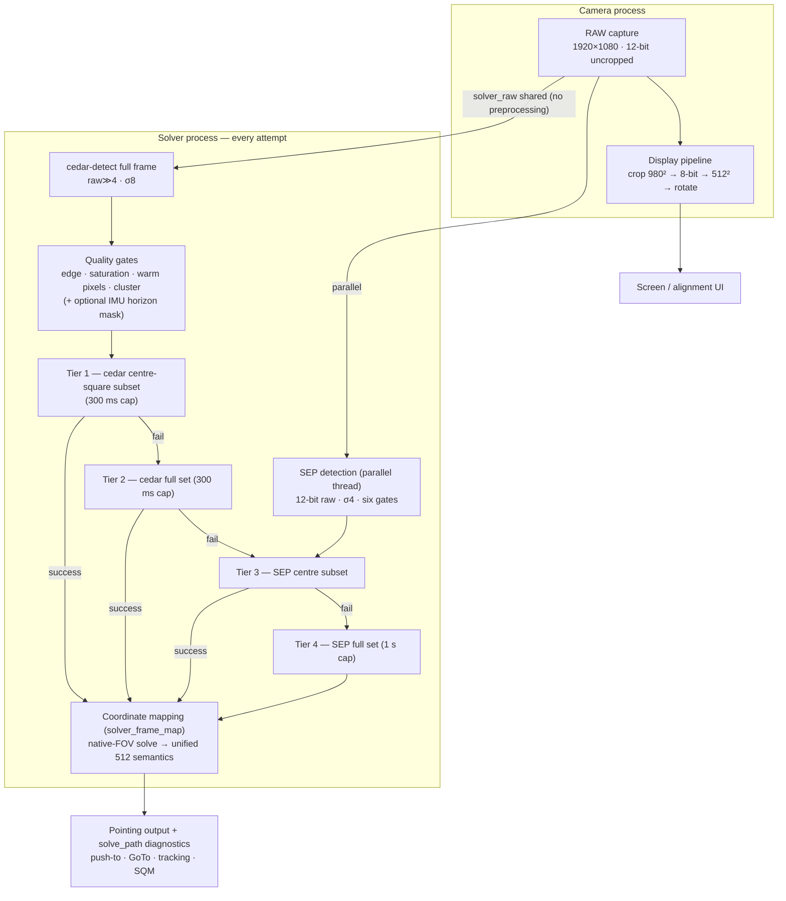

# MF_PiFinder Test Report — Full-Frame Solving Pipeline, Field Measurements (2026-08-04)

## Background and test configuration

PiFinder is a plate-solving device that tells you where your telescope is
pointing. The goal of this fork (MF_PiFinder) is **a finder that solves
accurately under heavy urban light pollution**.

- Hardware: PiFinder (RPi) + imx462 (1920×1080, 12-bit), central Seoul
- Solver configuration under test: `solver_cedar_fullframe`=on,
  `solver_cedar_ff_gates`=on, `solver_center_first`=on (the horizon mask
  stays off — a per-site option)

## How solving works (current source)

One capture per attempt; two detectors (cedar and SEP) process the same
12-bit uncropped original concurrently, and solving proceeds as a
coordinate-level four-tier cascade:

Key points:

1. **Detection runs on the full frame**: the uncropped original instead of
   the 512² crop — 2.16× the field of view means that many more real
   stars for matching, with no 8-bit conversion loss.
2. **Quality gates**: dense ground point-light clusters (apartment
   windows), blown-out lights and sensor warm pixels are removed at the
   detection stage — in the field this cut 28–33 spurious detections from
   a building-lit framing down to 0–5.
3. **Centre-first cascade**: solve first from the coordinates inside the
   centred square (lowest optical distortion), then the full set, then
   SEP. Failing tiers give up fast under timeout caps (300 ms / 1 s).
4. **Downstream unchanged**: whichever tier solves, coordinates are mapped
   back to the production 512-frame semantics — alignment, GoTo and
   tracking cannot tell the paths apart. The path is visible only through
   the `solve_path` diagnostics field.

## Measurement method

1. **Same-frame offline re-measurement** (the core comparison of this
   report): stage dumps saved under real skies are fed to both the current
   pipeline and the legacy cedar-512 path — identical exposures, so sky
   drift cannot confound the comparison.
   - Dark-sky corpus: 6 frames, night of 2026-07-29
   - Bright light-pollution corpus: 50 frames, night of 2026-08-01
     (background p50 = 87% of full scale)
2. **Live supplementary data**: the 2026-08-03 light-pollution ascent
   curve (per-attempt CSV, 1,552 attempts) — taken before the quality
   gates were introduced, included for reference.

## Results

### Same-frame comparison — legacy 512 path vs current pipeline

| Corpus | Legacy cedar-512 | **Current pipeline** |
| --- | --- | --- |
| Dark sky (6 frames) | 4/6 solved, 7 matches, RMSE 14″ | **6/6 solved**, 17 matches, RMSE 17″ |
| Bright LP (50 frames) | **0/50** | **44/50 (88%)**, 10 matches, RMSE 81″ |

Winning-tier distribution (current): dark sky = cedar-centre 3 +
SEP-centre 3; bright LP = SEP-full 44. Median per-attempt processing
time: 284 ms (LP), 807 ms (dark sky — includes frames where failed cedar
tiers handed over to SEP).

### Live LP ascent curve (2026-08-03, reference — pre-gate configuration)

| Background (12-bit p50) | Solve rate | cedar direct | Matches (med) |
| --- | --- | --- | --- |
| 70% (building lights in frame) | 10–17% | 0% | 8–12 |
| 62% | 98% | 95% | 12 |
| 55% | 100% | 99% | 14 |
| 43% | 97% | 95% | 13 |
| Star-field sample | 100% (10/10) | 100% | 25–27 (RMSE 20–29″) |

### Observations

1. **Where the legacy path solves 0%, the current pipeline reaches 88%**,
   and the intermittent dark-sky failures (4/6) are gone (6/6).
2. **The solvability cliff sits near 65–70% background** (building lights
   shining directly into the frame) — a physical star-SNR limit
   independent of the detector.
3. Accuracy is ample for a finder: RMSE 14–29″ in dark skies, 81″ under
   heavy LP (against a 0.5–1° eyepiece field).
4. The winning tier shifts automatically with conditions — cedar tiers
   carry dark skies, SEP tiers carry light pollution, and failing tiers
   are cost-bounded by the timeout caps.

## Conclusion

With full-frame detection, quality gates and the centre-first cascade,
the same frames that the legacy path solved at 4/6 (dark) and 0/50
(bright LP) now solve at **6/6 and 44/50 (88%)**. The remaining failure
regime is the extreme case of building lights dominating the frame — a
star-SNR limit, not a detector limit.

Raw data (per-attempt CSVs, corpus locations) and reproduction steps are
in the repository's
[field-test report](mf_solver_fullframe_field_test_20260803_ko.md) and
[design document](../mf_dev/mf_cedar_sep_hybrid_design_en.md).
